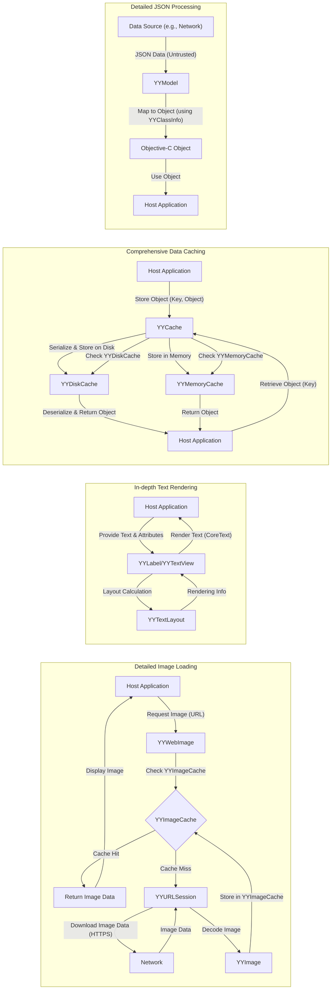

# Project Design Document: YYKit (Improved)

**Version:** 1.1
**Date:** October 26, 2023
**Author:** AI Software Architect

## 1. Introduction

This document provides an enhanced and more detailed design overview of the YYKit iOS library (as found at [https://github.com/ibireme/yykit](https://github.com/ibireme/yykit)). Building upon the previous version, this document aims to provide a more robust foundation for subsequent threat modeling activities. It offers a deeper understanding of the key components, their interactions, and the data flow within the library, with a strong emphasis on aspects relevant to security considerations and potential vulnerabilities.

## 2. Project Overview

YYKit is a mature and widely-used collection of Objective-C libraries for iOS development. It offers a rich set of high-performance utilities and components designed to streamline common development tasks and optimize application performance. Its modular design allows developers to integrate only the necessary components. Key functional areas within YYKit include:

*   **Advanced Image Handling:**  Comprehensive capabilities for image decoding, encoding, processing, animation, and efficient display, including network-based loading and caching.
*   **Rich Text Rendering and Layout:**  Provides powerful tools for rendering complex text with features like attributed text, inline images, and custom layouts, going beyond the capabilities of standard UIKit components.
*   **Robust Networking Utilities:** Offers abstractions and enhancements over standard iOS networking APIs, including features for reachability monitoring and simplified network request management.
*   **Efficient Data Persistence and Caching:**  Provides flexible and performant mechanisms for caching data in memory and on disk, crucial for optimizing application responsiveness and reducing network load.
*   **Asynchronous Task Management:**  Offers tools for managing concurrent operations and background tasks, improving application responsiveness and handling long-running processes.
*   **Foundation and UIKit Extensions:**  Provides a collection of helpful extensions and utility classes that enhance the functionality of standard iOS framework classes.

This design document will delve deeper into the internal workings of these major functional areas and their interactions to facilitate a more granular and effective threat analysis.

## 3. System Architecture

YYKit's architecture is characterized by its modularity and the clear separation of concerns between its components. This design allows for focused development and easier integration into existing projects.

```mermaid
graph LR
    subgraph "YYKit Core Services"
        direction LR
        A["YYCache"] -- "Abstracts Caching Logic" --> B["YYDiskCache"]
        A -- "Abstracts Caching Logic" --> C["YYMemoryCache"]
        D["YYDispatchQueuePool"] -- "Manages Concurrent Tasks" --> E["YYOperationQueue"]
        F["YYTimer"] -- "Provides High-Performance Timers"
    end

    subgraph "Image Processing Subsystem"
        direction LR
        G["YYImage"] -- "Decodes/Encodes Image Data" --> H["YYAnimatedImage"]
        G -- "Handles Image Downloads" --> I["YYWebImage"]
        I -- "Integrates with Caching" --> A
        J["YYImageCache"] -- "Dedicated Image Cache" --> A
    end

    subgraph "Text and Rendering Subsystem"
        direction LR
        K["YYTextLayout"] -- "Calculates Text Layout" --> L["YYLabel"]
        M["YYTextView"] -- "Handles Text Input/Display" --> K
        N["YYTextAttribute"] -- "Manages Text Attributes"
    end

    subgraph "Networking Subsystem"
        direction LR
        O["YYReachability"] -- "Monitors Network Status"
        P["YYURLSession"] -- "Performs Network Requests" --> Q["YYCache"]
        R["YYNetworkReachability"] -- "Legacy Reachability"
    end

    subgraph "Data Modeling and Utilities"
        direction LR
        S["YYModel"] -- "Maps JSON to Objects" --> T["YYClassInfo"]
        U["YYCategories (Foundation/UIKit)"] -- "Extends Core Classes"
        V["YYKVStorage"] -- "Key-Value Storage"
    end

    W["Host iOS Application"] -- "Integrates" --> "YYKit Core Services"
    W -- "Integrates" --> "Image Processing Subsystem"
    W -- "Integrates" --> "Text and Rendering Subsystem"
    W -- "Integrates" --> "Networking Subsystem"
    W -- "Integrates" --> "Data Modeling and Utilities"
```

**Detailed Component Descriptions:**

*   **YYCache:** A central component providing a unified interface for both in-memory (`YYMemoryCache`) and disk-based (`YYDiskCache`) caching. It manages the lifecycle of cached objects and provides mechanisms for eviction based on memory pressure or storage limits.
    *   **YYMemoryCache:**  Implements an in-memory cache, typically using an LRU (Least Recently Used) eviction policy. Potential security concerns include the sensitivity of data stored in memory and the risk of information leakage if memory is not properly managed.
    *   **YYDiskCache:** Implements an on-disk cache, storing data in files. Security considerations include file permissions, data encryption at rest (not provided by default), and the potential for unauthorized access if the device is compromised.
*   **YYImage:**  The core image handling component, responsible for decoding various image formats (JPEG, PNG, GIF, etc.) and encoding images. It also provides functionalities for image manipulation. Vulnerabilities could arise from parsing malformed image data, potentially leading to crashes or arbitrary code execution.
    *   **YYAnimatedImage:**  Specifically designed for handling animated image formats like GIF and APNG. Parsing complex animated images can be resource-intensive and potentially vulnerable to denial-of-service attacks if not handled carefully.
    *   **YYWebImage:**  Simplifies asynchronous image downloading from URLs and integrates seamlessly with `YYCache`. Security risks include fetching content over insecure connections (HTTP), potential for server-side vulnerabilities if the image source is compromised, and the risk of displaying malicious content.
    *   **YYImageCache:** A dedicated cache specifically for images, often used in conjunction with `YYWebImage`. It shares the underlying mechanisms of `YYCache`.
*   **YYTextLayout:**  A powerful component responsible for calculating the layout and rendering information for complex text, including handling attributed text, inline images, and custom drawing. Vulnerabilities could arise from rendering untrusted or maliciously crafted text, potentially leading to unexpected UI behavior or even exploitation if rendering logic has flaws.
    *   **YYLabel:** A `UILabel` subclass that leverages `YYTextLayout` for advanced text rendering. It inherits the potential vulnerabilities associated with `YYTextLayout`.
    *   **YYTextView:** A `UITextView` subclass with enhanced text handling capabilities powered by `YYTextLayout`. It introduces additional attack vectors related to user input and the handling of potentially malicious text content.
    *   **YYTextAttribute:** Manages attributes applied to text, such as font, color, and links. Improper handling of certain attributes could lead to unexpected behavior or security issues.
*   **YYDispatchQueuePool:**  Manages a pool of GCD (Grand Central Dispatch) queues to efficiently execute tasks concurrently. While generally safe, improper use could lead to race conditions or other concurrency-related issues.
*   **YYOperationQueue:**  Provides an `NSOperationQueue` subclass for managing asynchronous operations with more control than raw GCD queues. Similar concurrency concerns apply as with `YYDispatchQueuePool`.
*   **YYTimer:**  A high-performance timer implementation that offers more precise timing than standard `NSTimer`. Security implications are generally low, but improper use could lead to unexpected timing behavior.
*   **YYReachability / YYNetworkReachability:** Monitors the network connectivity status of the device. While not directly vulnerable, the information provided by these components can influence application behavior, and manipulating network status could potentially be used in attacks.
*   **YYURLSession:**  A wrapper around `NSURLSession` that simplifies making network requests. Security considerations are similar to using `NSURLSession` directly, including the importance of using HTTPS, validating server certificates, and handling network errors securely.
*   **YYModel:**  Facilitates the mapping of JSON data to Objective-C objects and vice versa. Vulnerabilities can arise from parsing untrusted JSON data, potentially leading to crashes or unexpected object states.
    *   **YYClassInfo:** Provides runtime information about Objective-C classes, used by `YYModel` for object mapping. Exploiting vulnerabilities here could have significant consequences.
*   **YYCategories (Foundation/UIKit):**  Provides convenience methods and extensions to standard Foundation and UIKit classes. Security implications depend on the specific functionality of each category.
*   **YYKVStorage:** Provides a simple key-value storage mechanism, potentially using SQLite or other storage options. Security considerations include the sensitivity of stored data and the need for appropriate encryption and access controls.

## 4. Data Flow

Understanding the flow of data through YYKit's components is crucial for identifying potential points of vulnerability.

*   **Detailed Image Loading from Network:**
    *   The **Host Application** initiates an image load request, providing a URL to **YYWebImage**.
    *   **YYWebImage** first queries the **YYImageCache** (backed by **YYCache**, potentially using **YYMemoryCache** and **YYDiskCache**) for the requested image.
    *   If a cache hit occurs, the image data is retrieved and returned to the **Host Application**.
    *   If a cache miss occurs, **YYWebImage** utilizes **YYURLSession** to initiate an asynchronous download from the specified URL.
    *   The **Network** responds with image data. This is a critical point for potential Man-in-the-Middle attacks if the connection is not secure (HTTPS).
    *   **YYURLSession** receives the image data and passes it to **YYImage** for decoding. Vulnerabilities in the decoding process could be exploited here.
    *   The decoded image is then stored in **YYImageCache** (and potentially **YYCache**) for future use.
    *   Finally, the decoded image is returned to the **Host Application** for display.
*   **In-depth Text Rendering Process:**
    *   The **Host Application** provides text content (potentially with attributes managed by **YYTextAttribute**) to either **YYLabel** or **YYTextView**. This text could originate from user input or an external source.
    *   **YYTextLayout** receives the text content and calculates the necessary layout information, considering factors like font, size, and line breaks. Maliciously crafted text could potentially exploit vulnerabilities in the layout calculation logic.
    *   The layout information is used by **YYLabel** or **YYTextView** to render the text on the screen using CoreText or other rendering mechanisms. Flaws in the rendering process itself could be exploited.
*   **Comprehensive Data Caching Mechanism:**
    *   The **Host Application** can store arbitrary objects in **YYCache** using a unique key.
    *   **YYCache** determines whether to store the object in **YYMemoryCache** (for fast access) or **YYDiskCache** (for persistence), based on factors like object size and available memory.
    *   When retrieving an object, **YYCache** first checks **YYMemoryCache**. If not found, it then checks **YYDiskCache**.
    *   Data stored in **YYDiskCache** is typically serialized. Vulnerabilities could arise if the serialization format is insecure or if the stored data is sensitive and not encrypted.
*   **Detailed JSON Processing with YYModel:**
    *   The **Host Application** receives JSON data, often from a **Network** source. This is a key point where untrusted data enters the system.
    *   The JSON data is passed to **YYModel** for mapping to Objective-C objects.
    *   **YYModel** uses **YYClassInfo** to introspect the properties of the target Objective-C class and populate them with data from the JSON. Vulnerabilities could arise if the JSON structure is unexpected or contains malicious data that exploits flaws in the mapping logic.
    *   The resulting Objective-C object is then used by the **Host Application**.



## 5. Security Considerations (Expanded)

This section expands on the previously identified security considerations, providing more specific examples and potential attack vectors:

*   **Data Injection Vulnerabilities:**
    *   **Malicious Image URLs:** If the application allows users to provide image URLs that are then processed by `YYWebImage`, an attacker could provide URLs pointing to malicious files or servers, potentially leading to server-side exploits or the download of harmful content.
    *   **Cross-Site Scripting (XSS) via Text Rendering:** If the application renders user-provided or external HTML-like text using `YYLabel` or `YYTextView` without proper sanitization, an attacker could inject malicious scripts that execute in the context of the application's UI.
    *   **SQL Injection (Indirect):** While YYKit doesn't directly interact with databases, if data fetched and processed by YYKit is used in subsequent database queries, vulnerabilities in the data processing could indirectly lead to SQL injection if not handled carefully by the application.
*   **Cache Poisoning Attacks:**
    *   An attacker who can intercept network traffic could potentially replace legitimate image data with malicious content before it's cached by `YYWebImage`, leading to the application displaying harmful images.
    *   If the application logic for validating cached data is weak, an attacker might be able to inject malicious data directly into the `YYDiskCache` if they gain access to the device's file system (e.g., on a jailbroken device).
*   **Denial of Service (DoS) Scenarios:**
    *   Providing extremely large or complex images to `YYImage` for decoding could exhaust device resources (CPU, memory), leading to application crashes or unresponsiveness.
    *   Supplying deeply nested or excessively large JSON payloads to `YYModel` could similarly consume excessive resources during the mapping process.
    *   Rendering very long or complex text with `YYTextLayout` could also lead to performance issues or crashes.
*   **Man-in-the-Middle (MitM) Attack Vectors:**
    *   If `YYWebImage` or `YYURLSession` are used to fetch resources over HTTP instead of HTTPS, attackers on the network can intercept and modify the downloaded content, potentially injecting malicious code or replacing legitimate resources.
    *   Failing to properly validate server certificates when using HTTPS can also leave the application vulnerable to MitM attacks.
*   **Local Data Storage Security Risks:**
    *   Data stored in `YYDiskCache` is not encrypted by default. If the device is lost or stolen, or if an attacker gains unauthorized access to the device's file system, this cached data could be compromised. Sensitive information should be encrypted before being stored in the cache.
*   **Dependency Vulnerabilities (Supply Chain Risks):**
    *   Vulnerabilities in the underlying system frameworks (e.g., libjpeg, libpng) used by YYKit for image processing could indirectly affect applications using YYKit.
    *   If YYKit itself has dependencies on other third-party libraries, vulnerabilities in those dependencies could also pose a risk. Regularly updating dependencies is crucial.
*   **Information Disclosure Issues:**
    *   Verbose logging or error messages within YYKit (especially in debug builds) might inadvertently expose sensitive information about the application's internal workings or user data. Ensure proper logging configurations for production environments.
    *   Temporary files created by YYKit (e.g., during image processing) might contain sensitive data if not handled securely.

## 6. Deployment

YYKit is typically integrated into an iOS application project using popular dependency management tools:

*   **CocoaPods:** Add `pod 'YYKit'` to your `Podfile` and run `pod install`.
*   **Carthage:** Add `github "ibireme/yykit"` to your `Cartfile` and run `carthage update`.
*   **Swift Package Manager:** Add the YYKit repository URL as a package dependency in Xcode.

Once integrated, the YYKit framework is linked with the application during the build process. Developers can then import the necessary headers and use the library's classes and methods within their application code. Proper management of dependencies and regular updates are crucial for maintaining security.

## 7. Dependencies

YYKit has direct dependencies on several core iOS system frameworks:

*   Foundation
*   UIKit
*   CoreGraphics
*   CoreText
*   ImageIO
*   MobileCoreServices
*   QuartzCore

It's important to be aware of potential vulnerabilities within these system frameworks as they can indirectly impact applications using YYKit. Checking for updates to the iOS SDK is part of maintaining a secure application.

## 8. Future Considerations

The landscape of mobile development and security is constantly evolving. Future considerations for this design document and subsequent threat modeling activities include:

*   **Regularly reviewing YYKit's release notes and changelogs** for any new features, bug fixes, or security updates.
*   **Analyzing any new components or APIs** introduced in future versions of YYKit for potential security implications.
*   **Keeping abreast of emerging threats and vulnerabilities** related to image processing, text rendering, networking, and caching on iOS.
*   **Considering the impact of changes in iOS system frameworks** on YYKit's functionality and security.
*   **Evaluating the use of static analysis tools** to identify potential vulnerabilities within code that utilizes YYKit.

This improved design document provides a more comprehensive and detailed understanding of the YYKit library, enhancing its value for threat modeling and security analysis. By focusing on the components, data flow, and potential vulnerabilities, security professionals can better assess and mitigate risks associated with using YYKit in iOS applications.