# BUSINESS POSTURE

This project, represented by the GitHub repository [https://github.com/ibireme/yykit](https://github.com/ibireme/yykit), is an open-source collection of high-performance iOS components.  The primary business goal of such a project is to provide reusable, efficient, and reliable modules that accelerate iOS application development and improve application performance. For businesses adopting this library, the goals are likely to reduce development time, leverage pre-built and optimized components, and potentially enhance the quality and performance of their iOS applications.

Key business priorities for projects utilizing YYKit would include:

- Rapid application development and deployment.
- High performance and responsiveness of iOS applications.
- Stable and reliable application functionality.
- Cost-effective development by leveraging open-source components.
- Maintaining a positive user experience through performant applications.

The most important business risks associated with using YYKit, and similar open-source libraries, are:

- Security vulnerabilities within the library that could be exploited in applications using it, leading to data breaches, application crashes, or other security incidents.
- Performance bottlenecks or bugs in the library that could negatively impact application performance and user experience.
- Lack of ongoing maintenance or updates to the library, potentially leading to compatibility issues with newer iOS versions or security vulnerabilities remaining unpatched.
- Dependency on an external open-source project, which introduces a supply chain risk if the project is compromised or abandoned.
- Potential licensing issues if the library's license is not compatible with the business's usage model.

# SECURITY POSTURE

This section outlines the existing and recommended security posture for projects utilizing the YYKit library. It's important to note that as an open-source library, YYKit's security posture is primarily reliant on community review and standard open-source development practices.  The security controls listed here are inferred based on common practices and the nature of open-source projects.

Existing Security Controls:

- security control: Source code hosted on GitHub, providing transparency and version control. (Implemented: GitHub Repository)
- security control: Open-source license (MIT License), allowing for community review and scrutiny. (Implemented: LICENSE file in repository)
- security control: Issue tracking system on GitHub for reporting and discussing bugs and potential vulnerabilities. (Implemented: GitHub Issues)
- security control: Pull Request review process for code contributions. (Inferred: Standard GitHub workflow)
- accepted risk: Reliance on community for security audits and vulnerability discovery.
- accepted risk: Potential for vulnerabilities to exist in the code due to the complexity of the library and the nature of software development.
- accepted risk: No explicit security development lifecycle (SDL) documented for the YYKit project itself. Security is implicitly handled through code review and issue reporting.

Recommended Security Controls:

- recommended security control: Implement automated Static Application Security Testing (SAST) tools in CI/CD pipelines for projects using YYKit to scan for potential vulnerabilities introduced by the library or in application code.
- recommended security control: Implement Dependency Scanning tools to monitor for known vulnerabilities in YYKit and its dependencies, if any.
- recommended security control: Establish a process for regularly updating YYKit to the latest version to benefit from bug fixes and potential security patches.
- recommended security control: Conduct periodic security code reviews of application code that heavily utilizes YYKit, focusing on proper usage of library components and potential misuse that could introduce vulnerabilities.
- recommended security control: If the application handles sensitive data, consider performing dynamic application security testing (DAST) and penetration testing to identify runtime vulnerabilities that might involve YYKit components.
- recommended security control: Implement a vulnerability disclosure policy for applications using YYKit, so that security researchers can responsibly report any discovered vulnerabilities.

Security Requirements:

- Authentication: Not directly applicable to YYKit library itself. Authentication is a concern for applications that *use* YYKit, and they must implement appropriate authentication mechanisms independently.
- Authorization: Similar to authentication, authorization is the responsibility of applications using YYKit. The library itself does not handle authorization. Applications should ensure proper authorization checks when using YYKit components, especially when dealing with user data or sensitive operations.
- Input Validation: YYKit components, especially those handling user-provided data (e.g., text processing, image manipulation), must implement robust input validation to prevent vulnerabilities like injection attacks, buffer overflows, and format string bugs. Applications using YYKit should also validate data before passing it to YYKit functions.
- Cryptography: If YYKit includes cryptographic functionalities (review of the repository is needed to confirm), it must use secure and well-vetted cryptographic libraries and algorithms. Applications using YYKit's cryptographic features must ensure they are used correctly and securely, following best practices for key management and secure cryptographic operations. If YYKit does not include cryptography, and the application requires it, the application must implement its own secure cryptographic solutions, independent of YYKit.

# DESIGN

This section provides a design overview of how YYKit is used within the context of iOS application development and deployment. As YYKit is a library, the design focuses on its integration into iOS applications rather than being a standalone system.

## C4 CONTEXT

```mermaid
graph LR
    subgraph "iOS Ecosystem"
    A("iOS Developer")
    B("iOS Application")
    C("App Store")
    D("iOS Device")
    end
    E("YYKit Library")

    A --> B
    B --> E: Uses
    B --> C: Distributes via
    C --> D: Installs on
    D --> B: Runs

    style E fill:#f9f,stroke:#333,stroke-width:2px
```

Context Diagram Elements:

- Element:
    - Name: iOS Developer
    - Type: Person
    - Description: Software developers who build iOS applications. They use tools and libraries to create applications for the iOS platform.
    - Responsibilities: Develops, tests, and maintains iOS applications. Integrates libraries like YYKit into their projects.
    - Security controls: Secure development practices on their local machines, code review processes, and secure credential management for development and deployment.

- Element:
    - Name: iOS Application
    - Type: Software System
    - Description: An application built for the iOS operating system. It utilizes various components and libraries, including potentially YYKit, to provide functionality to end-users.
    - Responsibilities: Provides specific functionalities to end-users, interacts with the iOS operating system and device hardware, and manages user data.
    - Security controls: Implements application-level security controls such as authentication, authorization, input validation, secure data storage, and secure communication. Integrates and utilizes security features provided by the iOS platform and libraries like YYKit (if applicable).

- Element:
    - Name: YYKit Library
    - Type: Software System (External Library)
    - Description: A collection of high-performance iOS components for common tasks like image processing, text handling, networking, and UI utilities. It is integrated into iOS applications to enhance their functionality and performance.
    - Responsibilities: Provides reusable and efficient components for iOS development.  Its security is maintained by the open-source community and contributors.
    - Security controls: Relies on open-source community review, GitHub's security features, and issue reporting mechanisms. Security vulnerabilities are addressed through updates and patches contributed by the community.

- Element:
    - Name: App Store
    - Type: Software System (External Platform)
    - Description: Apple's official platform for distributing iOS applications to end-users. It provides a channel for developers to publish their applications and for users to discover and install them.
    - Responsibilities: Hosts and distributes iOS applications, performs application vetting processes (including security checks), and manages application updates.
    - Security controls: Apple's App Store review process includes security checks. Apple also provides platform-level security features in iOS that applications can leverage.

- Element:
    - Name: iOS Device
    - Type: Technology (Physical Device)
    - Description: Physical devices such as iPhones and iPads running the iOS operating system. End-users interact with iOS applications on these devices.
    - Responsibilities: Executes iOS applications, provides user interface, stores user data, and connects to networks.
    - Security controls: iOS operating system provides device-level security controls, including sandboxing, permissions management, data encryption, and secure boot processes.

## C4 CONTAINER

For YYKit, as a library, the container diagram is essentially an expansion of the context diagram, focusing on the iOS Application as the primary container and YYKit as a component within it.

```mermaid
graph LR
    subgraph "iOS Application Container"
    A("iOS Application Process")
    B("YYKit Framework")
    C("iOS SDK Frameworks")
    D("Application Code")
    end

    subgraph "iOS Device"
    E("Operating System")
    F("Hardware")
    end

    A --> B: Uses
    A --> C: Uses
    A --> D: Contains
    A --> E: Runs on
    E --> F: Runs on

    style B fill:#f9f,stroke:#333,stroke-width:2px
    style A fill:#ccf,stroke:#333,stroke-width:2px
    style C fill:#ccf,stroke:#333,stroke-width:2px
    style D fill:#ccf,stroke:#333,stroke-width:2px
    style E fill:#eee,stroke:#333,stroke-width:2px
    style F fill:#eee,stroke:#333,stroke-width:2px
```

Container Diagram Elements:

- Element:
    - Name: iOS Application Process
    - Type: Container (Process)
    - Description: The running instance of the iOS application on an iOS device. It encompasses all the code and resources required for the application to function.
    - Responsibilities: Executes application logic, manages user interface, interacts with device resources, and utilizes libraries and frameworks.
    - Security controls: Process isolation provided by the iOS operating system, application sandbox, and runtime security checks.

- Element:
    - Name: YYKit Framework
    - Type: Container (Library/Framework)
    - Description: The compiled YYKit library integrated into the iOS application. It provides pre-built components and functionalities.
    - Responsibilities: Offers reusable modules for common iOS development tasks, enhancing application features and performance.
    - Security controls: Security relies on the quality of the YYKit codebase, community review, and updates provided by the open-source project. Applications using YYKit inherit any vulnerabilities present in the library.

- Element:
    - Name: iOS SDK Frameworks
    - Type: Container (Frameworks)
    - Description: Apple-provided frameworks (e.g., UIKit, Foundation, CoreGraphics) that are essential for iOS application development.
    - Responsibilities: Provide core functionalities and APIs for iOS applications, including UI elements, system services, and hardware access.
    - Security controls: Apple is responsible for the security of iOS SDK frameworks. They undergo rigorous testing and security reviews. Applications rely on the security of these frameworks.

- Element:
    - Name: Application Code
    - Type: Container (Code)
    - Description: The custom code written by the iOS developers for the specific application. This code utilizes YYKit and iOS SDK frameworks to implement the application's unique features.
    - Responsibilities: Implements the specific business logic and functionalities of the application. Integrates and utilizes YYKit and iOS SDK frameworks.
    - Security controls: Developers are responsible for writing secure application code, including proper input validation, secure data handling, and secure integration with libraries and frameworks. Code reviews, SAST/DAST, and secure development practices are crucial.

- Element:
    - Name: Operating System (iOS)
    - Type: Container (Operating System)
    - Description: Apple's iOS operating system, which provides the runtime environment for iOS applications.
    - Responsibilities: Manages system resources, provides security features (sandboxing, permissions), and executes applications.
    - Security controls: iOS provides a robust security architecture, including kernel-level security, sandboxing, code signing, and regular security updates.

- Element:
    - Name: Hardware (iOS Device)
    - Type: Container (Hardware)
    - Description: The physical hardware of the iOS device (iPhone, iPad).
    - Responsibilities: Provides the physical platform for running iOS and applications.
    - Security controls: Hardware-level security features such as Secure Enclave, hardware encryption, and secure boot processes.

## DEPLOYMENT

Deployment for an iOS application utilizing YYKit involves several stages, culminating in distribution through the App Store and installation on user devices.

Deployment Diagram:

```mermaid
graph LR
    subgraph "Developer Environment"
    A("Developer Machine")
    end
    subgraph "Build & Distribution"
    B("Build System (Xcode)")
    C("Apple App Store Connect")
    D("Apple App Store")
    end
    subgraph "End User Environment"
    E("iOS Device")
    end

    A --> B: Builds Application Package
    B --> C: Uploads Application
    C --> D: Distributes Application
    D --> E: Installs Application

    style A fill:#eee,stroke:#333,stroke-width:2px
    style B fill:#eee,stroke:#333,stroke-width:2px
    style C fill:#eee,stroke:#333,stroke-width:2px
    style D fill:#eee,stroke:#333,stroke-width:2px
    style E fill:#eee,stroke:#333,stroke-width:2px
```

Deployment Diagram Elements:

- Element:
    - Name: Developer Machine
    - Type: Infrastructure (Physical/Virtual Machine)
    - Description: The computer used by the iOS developer to write code, build, and test the iOS application.
    - Responsibilities: Development environment for writing and testing application code.
    - Security controls: Developer machine security practices (OS hardening, antivirus, firewall), secure code storage (version control), and access control.

- Element:
    - Name: Build System (Xcode)
    - Type: Software (IDE & Build Tools)
    - Description: Apple's Xcode IDE and build tools used to compile the iOS application, including YYKit and application code, into an application package (.ipa file).
    - Responsibilities: Compiles source code, links libraries (including YYKit), creates application package, and signs the application for distribution.
    - Security controls: Code signing process using Apple Developer certificates, secure build environment, and potentially integrated security analysis tools within Xcode.

- Element:
    - Name: Apple App Store Connect
    - Type: Platform (Web Service)
    - Description: Apple's web platform used by developers to upload and manage their iOS applications for distribution through the App Store.
    - Responsibilities: Application management, metadata submission, build uploading, and application review process.
    - Security controls: Authentication and authorization for developer accounts, secure upload channels, and Apple's application review process which includes security checks.

- Element:
    - Name: Apple App Store
    - Type: Platform (Application Marketplace)
    - Description: Apple's digital distribution platform where end-users can browse, purchase, and download iOS applications.
    - Responsibilities: Application distribution, user authentication and authorization for downloads, and application updates.
    - Security controls: Apple's platform security, application vetting process, and secure download mechanisms.

- Element:
    - Name: iOS Device
    - Type: Infrastructure (Physical Device)
    - Description: End-user's iPhone or iPad where the application is installed and run.
    - Responsibilities: Executes the installed application, provides user interface, and manages application data.
    - Security controls: iOS device security features (OS security, sandboxing, data encryption), and user-managed security settings.

## BUILD

The build process for an iOS application incorporating YYKit typically involves the following steps, focusing on security considerations:

Build Process Diagram:

```mermaid
graph LR
    A("Developer") --> B("Code Repository (Git)")
    B --> C("Build System (Xcode)")
    C --> D("Static Analysis (SAST)")
    D --> E("Dependency Check")
    E --> F("Compilation & Linking")
    F --> G("Code Signing")
    G --> H("Build Artifact (.ipa)")

    style A fill:#eee,stroke:#333,stroke-width:2px
    style B fill:#eee,stroke:#333,stroke-width:2px
    style C fill:#eee,stroke:#333,stroke-width:2px
    style D fill:#eee,stroke:#333,stroke-width:2px
    style E fill:#eee,stroke:#333,stroke-width:2px
    style F fill:#eee,stroke:#333,stroke-width:2px
    style G fill:#eee,stroke:#333,stroke-width:2px
    style H fill:#eee,stroke:#333,stroke-width:2px
```



Build Process Steps and Security Controls:

- Step: Code Repository (Git)
    - Description: Developers commit and push code changes to a version control system (e.g., GitHub). This includes application code and project configurations that define dependencies like YYKit.
    - Security controls: Access control to the repository, branch protection, commit signing, and audit logs. Ensures code integrity and traceability.

- Step: Build System (Xcode)
    - Description: Xcode is used to build the iOS application. It retrieves source code, including YYKit (typically managed through dependency managers like CocoaPods, Carthage, or Swift Package Manager), and compiles it.
    - Security controls: Secure build environment, access control to build system, and configuration management of build tools and dependencies.

- Step: Static Analysis (SAST)
    - Description: Automated SAST tools are integrated into the build pipeline to scan the application code and potentially YYKit (if source code is available) for potential security vulnerabilities.
    - Security controls: SAST tools identify potential code-level vulnerabilities early in the development cycle. Results should be reviewed and addressed.

- Step: Dependency Check
    - Description: Tools are used to check for known vulnerabilities in dependencies, including YYKit and any other third-party libraries. This helps identify and mitigate supply chain risks.
    - Security controls: Dependency scanning tools provide alerts for vulnerable dependencies, allowing for updates or mitigations.

- Step: Compilation & Linking
    - Description: The build system compiles the application code and links it with YYKit and other necessary libraries and frameworks to create executable code.
    - Security controls: Secure compilation process, compiler hardening options (if available and applicable), and integrity checks of build tools.

- Step: Code Signing
    - Description: The compiled application is signed with an Apple Developer certificate. This is a crucial security step for iOS applications, ensuring code integrity and verifying the developer's identity.
    - Security controls: Secure management of Apple Developer certificates and private keys. Code signing ensures that the application has not been tampered with and is from a trusted source.

- Step: Build Artifact (.ipa)
    - Description: The final output of the build process is an application package (.ipa file) ready for distribution.
    - Security controls: Secure storage and transfer of build artifacts. The .ipa file is the deliverable that is uploaded to App Store Connect.

# RISK ASSESSMENT

Critical Business Processes to Protect:

- Secure and reliable operation of iOS applications that utilize YYKit.
- Maintaining user trust and positive user experience for applications using YYKit.
- Protecting the reputation of the organization developing and deploying applications with YYKit.
- Ensuring the confidentiality, integrity, and availability of data processed by applications using YYKit.

Data to Protect and Sensitivity:

- Application Data: The sensitivity of data depends on the specific application using YYKit. It could range from publicly available data to highly sensitive personal or financial information. YYKit itself might process various types of data depending on the components used (e.g., image data, text data). The sensitivity is determined by the application's context.
- Source Code: While YYKit is open-source, the source code of applications using YYKit is often proprietary and confidential. Protecting the confidentiality and integrity of application source code is crucial.
- User Data on Devices: iOS devices may store application data, including data processed or managed by YYKit components. Protecting user data stored on devices is paramount.
- Build Artifacts and Signing Keys: Protecting the integrity and confidentiality of build artifacts (.ipa files) and code signing certificates is essential to maintain the security of the application distribution process.

# QUESTIONS & ASSUMPTIONS

Questions:

- What specific components of YYKit are being used in the target application? Understanding the specific components will help focus security efforts on relevant areas (e.g., image processing, text handling, networking).
- What type of data will the application process using YYKit? Knowing the data sensitivity will inform the required security controls.
- What are the specific security requirements and compliance standards that the application needs to adhere to (e.g., GDPR, HIPAA, PCI DSS)?
- Is there an existing Security Development Lifecycle (SDLC) in place for the application development process?
- What security tools are currently used in the development and build pipeline (SAST, DAST, dependency scanning)?
- What is the process for handling and patching vulnerabilities discovered in YYKit or the application itself?

Assumptions:

- BUSINESS POSTURE:
    - The primary goal of using YYKit is to enhance application performance and reduce development time.
    - Security and reliability are important considerations for applications using YYKit.
    - The target application is intended for distribution to end-users via the Apple App Store.

- SECURITY POSTURE:
    - Standard open-source security practices are followed for YYKit development.
    - Applications using YYKit are responsible for implementing application-level security controls.
    - Regular updates to YYKit are expected to address bugs and potential security vulnerabilities.

- DESIGN:
    - YYKit is integrated as a framework into iOS applications.
    - The deployment model is standard iOS application deployment through the Apple App Store.
    - The build process involves Xcode and standard iOS build and signing procedures.