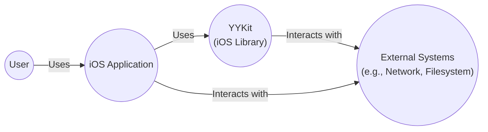
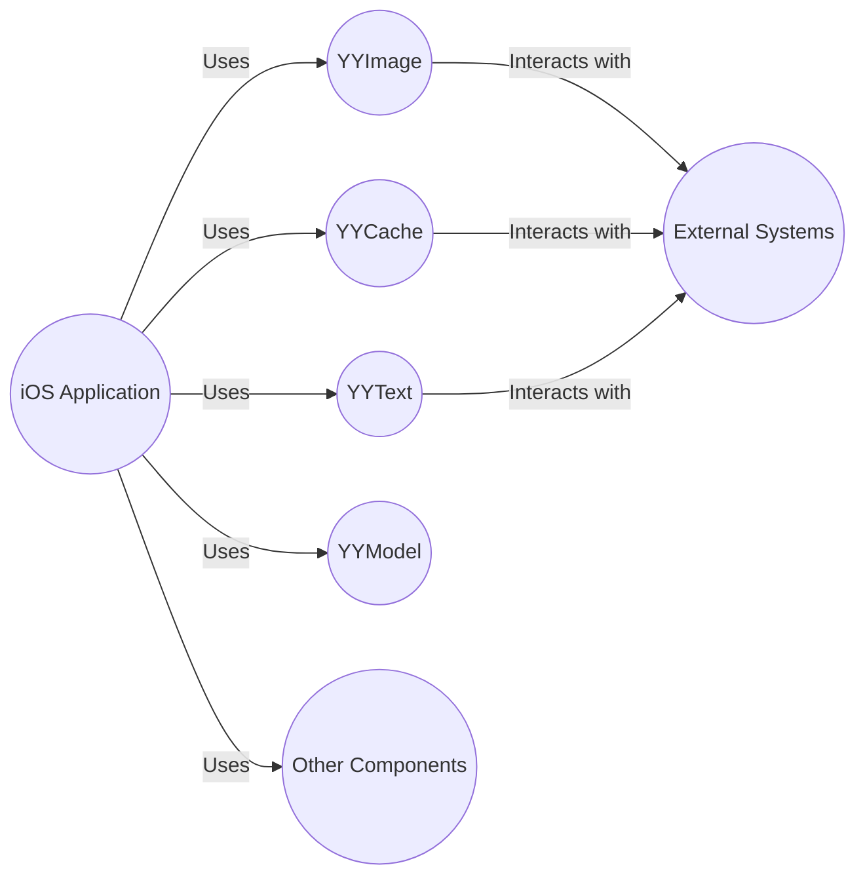
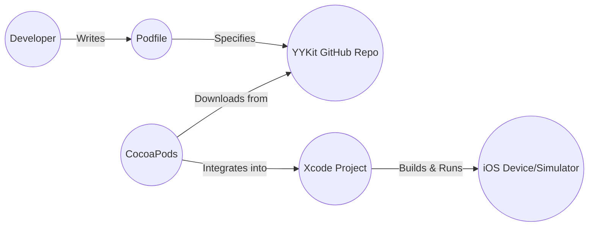
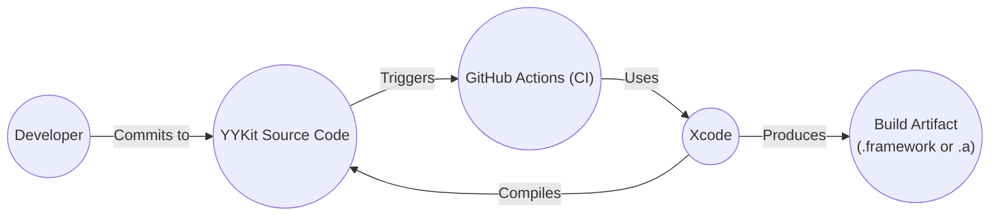

Okay, let's create a design document for the YYKit project.

# BUSINESS POSTURE

YYKit is a collection of iOS components. It appears to be a mature, well-established library, given its star count and age. The primary business goal is likely to provide a robust, efficient, and well-tested set of utilities and UI components to speed up iOS development and improve code quality. It aims to reduce boilerplate and common tasks for developers.

Business Priorities:

*   Maintainability: The library should be easy to maintain and update.
*   Performance: Components should be highly performant and not introduce overhead.
*   Reliability: Components should be stable and bug-free.
*   Compatibility: Maintain compatibility with a reasonable range of iOS versions.
*   Adoption: Encourage widespread use within the iOS development community.

Business Risks:

*   Security vulnerabilities in the library could be exploited in applications that use it, potentially affecting a large number of users.
*   Performance issues or bugs could negatively impact the performance or stability of applications using the library.
*   Lack of maintenance or updates could lead to the library becoming obsolete or incompatible with newer iOS versions.
*   Lack of adoption would mean the effort put into creating and maintaining the library is wasted.

# SECURITY POSTURE

Existing Security Controls:

*   security control: Code Reviews: Based on GitHub activity, pull requests and code reviews are likely part of the development process. (Inferred from GitHub repository)
*   security control: Static Analysis: It's common practice for Objective-C/Swift projects to utilize static analysis tools, although this isn't explicitly mentioned in the repository. (Common practice, not explicitly stated)
*   security control: Community Scrutiny: Being a popular open-source project, the code is subject to scrutiny by a large community of developers, increasing the chances of identifying and fixing vulnerabilities. (Inferred from GitHub popularity)

Accepted Risks:

*   accepted risk: Third-party dependencies: The project may have dependencies on other libraries, which could introduce their own security risks. (Standard risk for most projects)
*   accepted risk: Objective-C Runtime: The dynamic nature of Objective-C runtime can introduce certain security challenges that are harder to mitigate compared to statically-typed languages. (Inherent to Objective-C)

Recommended Security Controls:

*   security control: Implement or clearly document the use of static analysis tools (e.g., Clang Static Analyzer, Infer).
*   security control: Integrate a Software Composition Analysis (SCA) tool to identify and track vulnerabilities in third-party dependencies.
*   security control: Consider fuzz testing to identify potential crashes or unexpected behavior.
*   security control: Establish a clear security policy and vulnerability reporting process.

Security Requirements:

*   Authentication: Not directly applicable, as this is a library of components, not an application with user accounts.
*   Authorization: Not directly applicable, as the library itself doesn't manage access control. However, components within the library should be designed to be used securely within an application's authorization scheme.
*   Input Validation: Components that handle user input (e.g., text fields, image processing) must perform appropriate input validation to prevent vulnerabilities like injection attacks or buffer overflows.  Specifically, any component that accepts data from external sources (network, user input, files) should validate that data before processing it.
*   Cryptography: If any components perform cryptographic operations (e.g., hashing, encryption), they must use strong, well-vetted cryptographic algorithms and libraries (e.g., CommonCrypto on iOS). Key management should follow best practices. Avoid custom cryptographic implementations.

# DESIGN

## C4 CONTEXT

Context Diagram Element List:

*   User:
    *   Name: User
    *   Type: Person
    *   Description: The end-user of an iOS application that utilizes YYKit.
    *   Responsibilities: Interacts with the iOS application.
    *   Security controls: N/A - External to the system.

*   iOS Application:
    *   Name: iOS Application
    *   Type: Software System
    *   Description: An iOS application that incorporates the YYKit library.
    *   Responsibilities: Provides application-specific functionality to the user.
    *   Security controls: Implements application-level security controls (authentication, authorization, etc.).

*   YYKit:
    *   Name: YYKit
    *   Type: Software System (Library)
    *   Description: A collection of iOS components and utilities.
    *   Responsibilities: Provides reusable components and utilities to simplify iOS development.
    *   Security controls: Input validation, secure use of cryptographic functions (if applicable), safe handling of system resources.

*   External Systems:
    *   Name: External Systems
    *   Type: Software System
    *   Description: External systems that YYKit or the iOS Application interacts with, such as the network, filesystem, or other system services.
    *   Responsibilities: Provide system-level services.
    *   Security controls: Relies on the security of the underlying iOS operating system and network protocols.

## C4 CONTAINER

Since YYKit is a library, the "containers" are essentially logical groupings of code modules. There isn't a traditional client-server or database relationship.

Container Diagram Element List:

* iOS Application
    * Name: iOS Application
    * Type: Software System
    * Description: An iOS application that incorporates the YYKit library.
    * Responsibilities: Provides application-specific functionality to the user.
    * Security controls: Implements application-level security controls (authentication, authorization, etc.).

*   YYImage:
    *   Name: YYImage
    *   Type: Component (Module)
    *   Description: A module for image processing and handling.
    *   Responsibilities: Provides image-related functionalities.
    *   Security controls: Input validation for image data, secure handling of image buffers.

*   YYCache:
    *   Name: YYCache
    *   Type: Component (Module)
    *   Description: A module for caching data.
    *   Responsibilities: Provides caching mechanisms.
    *   Security controls: Secure storage of cached data (if sensitive), proper cache invalidation.

*   YYText:
    *   Name: YYText
    *   Type: Component (Module)
    *   Description: A module for advanced text rendering and handling.
    *   Responsibilities: Provides text-related functionalities.
    *   Security controls: Input validation for text input, prevention of XSS vulnerabilities if rendering HTML or attributed strings.

*   YYModel:
    *   Name: YYModel
    *   Type: Component (Module)
    *   Description: A module for model object serialization and deserialization.
    *   Responsibilities: Provides model object handling.
    *   Security controls: Secure parsing of data, prevention of injection vulnerabilities during deserialization.

*   Other Components:
    *   Name: Other Components
    *   Type: Component (Module)
    *   Description: Other utility components within YYKit.
    *   Responsibilities: Provide various utility functions.
    *   Security controls: Dependent on the specific functionality of each component.

* External Systems
    * Name: External Systems
    * Type: Software System
    * Description: External systems that YYKit or the iOS Application interacts with, such as the network, filesystem, or other system services.
    * Responsibilities: Provide system-level services.
    * Security controls: Relies on the security of the underlying iOS operating system and network protocols.

## DEPLOYMENT

YYKit is a library, so "deployment" refers to how it's integrated into an iOS application. There are several common methods:

1.  **CocoaPods:** A dependency manager for Swift and Objective-C projects.
2.  **Carthage:** A decentralized dependency manager for Cocoa.
3.  **Swift Package Manager:**  Apple's built-in package manager.
4.  **Manual Integration:**  Copying the source files directly into the project.

We'll describe CocoaPods deployment, as it's a very common approach.

Deployment Diagram Element List:

*   Developer:
    *   Name: Developer
    *   Type: Person
    *   Description: The developer integrating YYKit into their iOS application.
    *   Responsibilities: Writes the Podfile, builds and runs the application.
    *   Security controls: N/A

*   Podfile:
    *   Name: Podfile
    *   Type: Configuration File
    *   Description: A file that specifies the dependencies of the iOS project.
    *   Responsibilities: Lists the required libraries, including YYKit.
    *   Security controls: Version pinning to prevent unexpected updates.

*   CocoaPods:
    *   Name: CocoaPods
    *   Type: Dependency Manager
    *   Description: A dependency manager for Cocoa projects.
    *   Responsibilities: Downloads and integrates libraries into the Xcode project.
    *   Security controls: Relies on the security of the CocoaPods infrastructure and the integrity of the downloaded packages.

*   YYKit GitHub Repo:
    *   Name: YYKit GitHub Repo
    *   Type: Source Code Repository
    *   Description: The Git repository hosting the YYKit source code.
    *   Responsibilities: Stores the source code and version history.
    *   Security controls: GitHub's security features, access controls, code signing (if implemented).

*   Xcode Project:
    *   Name: Xcode Project
    *   Type: Development Environment
    *   Description: The developer's Xcode project.
    *   Responsibilities: Contains the application code and integrated libraries.
    *   Security controls: Xcode's built-in security features, code signing.

*   iOS Device/Simulator:
    *   Name: iOS Device/Simulator
    *   Type: Runtime Environment
    *   Description: The device or simulator where the application runs.
    *   Responsibilities: Executes the compiled application code.
    *   Security controls: iOS operating system security features.

## BUILD

The build process for YYKit, as a library, involves compiling the source code into a framework or static library that can be linked into an iOS application.

Build Process Description:

1.  **Developer Action:** A developer commits changes to the YYKit source code repository (e.g., on GitHub).
2.  **CI Trigger:** This commit triggers a Continuous Integration (CI) workflow, likely using GitHub Actions (although this isn't explicitly stated in the repo, it's a common practice).
3.  **Build Environment:** The CI environment (e.g., GitHub Actions runner) sets up a build environment, including the necessary tools (Xcode, command-line tools).
4.  **Compilation:** Xcode is used to compile the YYKit source code. This may involve building for different architectures (arm64, x86_64) and for both devices and simulators.
5.  **Static Analysis:** Static analysis tools (like the Clang Static Analyzer) are likely run as part of the build process to identify potential code quality issues and vulnerabilities.
6.  **Testing:** Unit tests and UI tests (if present) are executed to ensure the code functions correctly and doesn't introduce regressions.
7.  **Artifact Creation:** The build process produces a build artifact, which could be a .framework (dynamic library) or a .a (static library) file.
8.  **Artifact Storage/Distribution:** The build artifact may be stored (e.g., on GitHub Releases) or distributed through a package manager (CocoaPods, Carthage, SPM).

Security Controls in Build Process:

*   security control: **CI/CD Pipeline:** Using a CI/CD pipeline (like GitHub Actions) automates the build process, ensuring consistency and reducing the risk of manual errors.
*   security control: **Static Analysis:** Integrating static analysis tools helps identify potential vulnerabilities early in the development lifecycle.
*   security control: **Automated Testing:** Running automated tests (unit, UI) helps catch bugs and regressions that could lead to security issues.
*   security control: **Dependency Management:** Using a dependency manager (CocoaPods, Carthage, SPM) helps manage third-party dependencies and their versions, reducing the risk of using outdated or vulnerable libraries.
*   security control: **Code Signing:** The build artifact (framework) should be code-signed to ensure its integrity and authenticity.

# RISK ASSESSMENT

Critical Business Processes:

*   Providing reliable and performant iOS components.
*   Maintaining a positive reputation within the iOS development community.
*   Ensuring the long-term maintainability of the library.

Data Protection:

*   YYKit itself doesn't directly handle sensitive user data in most cases, as it's a library of components. However, the *applications* using YYKit might.
*   Data Sensitivity:
    *   **Image Data (YYImage):** Could include user-generated images, potentially containing personal information or metadata (location, time). Sensitivity: Potentially High.
    *   **Cached Data (YYCache):** Could store any type of data cached by the application, potentially including sensitive information. Sensitivity: Variable, depends on the application.
    *   **Text Data (YYText):** Could include user-entered text, potentially containing personal information or sensitive content. Sensitivity: Variable, depends on the application.
    *   **Model Data (YYModel):** Represents the application's data model, which could contain sensitive information. Sensitivity: Variable, depends on the application.

# QUESTIONS & ASSUMPTIONS

Questions:

*   Are there any specific security audits or penetration tests performed on YYKit?
*   What is the specific process for handling reported security vulnerabilities?
*   Are there any plans to integrate more advanced security testing tools (e.g., fuzzing)?
*   What are the specific versioning and compatibility policies for YYKit?
*   What are exact static analysis tools used?
*   Is there a Software Bill of Materials (SBOM) available?

Assumptions:

*   BUSINESS POSTURE: Assumed that the primary goal is to provide a high-quality, widely-used library.
*   SECURITY POSTURE: Assumed that basic security practices (code reviews, static analysis) are followed, even if not explicitly documented. Assumed that developers using YYKit are responsible for the overall security of their applications.
*   DESIGN: Assumed that the library is well-structured and modular. Assumed that CocoaPods is a primary distribution method. Assumed GitHub Actions is used for CI/CD.