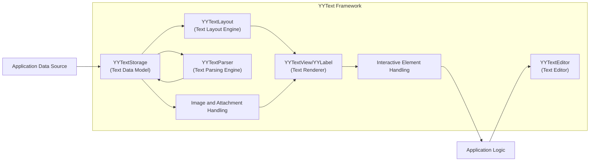
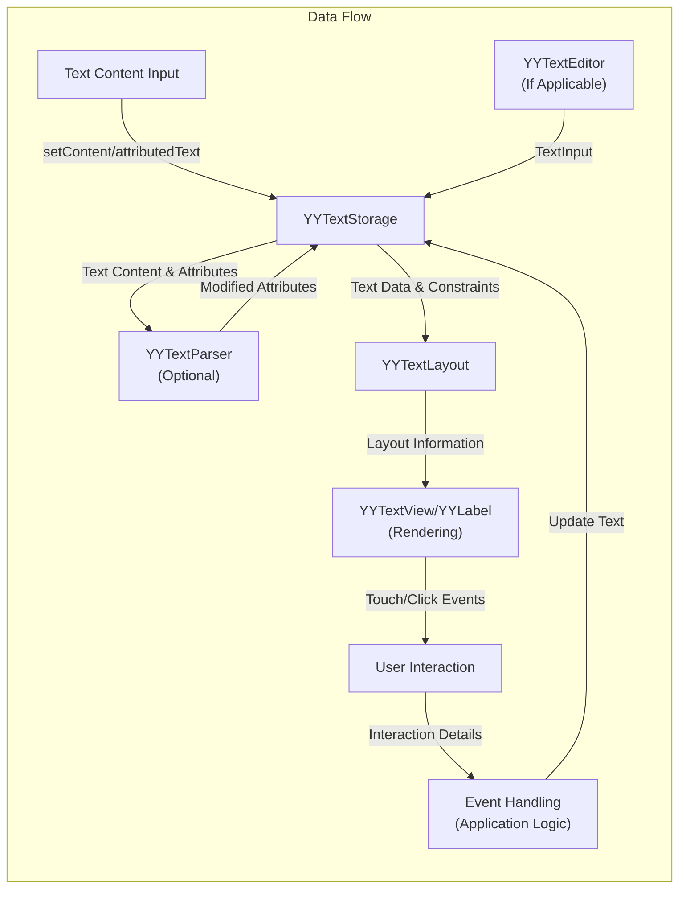

# Project Design Document: YYText

**Version:** 1.1
**Date:** October 26, 2023
**Author:** Gemini (AI Language Model)

## 1. Introduction

This document provides a detailed architectural design of the open-source project [YYText](https://github.com/ibireme/yytext), a powerful text framework for iOS and macOS. This document is specifically crafted to serve as a foundation for subsequent threat modeling activities, offering a comprehensive understanding of the system's components, data flow, interactions, and potential security considerations.

## 2. Project Overview

YYText is an advanced, high-performance text rendering and editing framework designed for Apple platforms. It extends the capabilities of standard UIKit/AppKit text components by offering features such as:

*   Asynchronous text layout and rendering for improved responsiveness.
*   Comprehensive support for rich text features including attributed strings, inline images, custom views, and vertical text layout.
*   Interactive text elements with customizable tap and long-press handling for links, mentions, and other interactive content.
*   Advanced text editing functionalities, including sophisticated text input and cursor management.
*   Extensibility through custom text attributes and rendering.

This design document focuses on the core architectural elements and functionalities that are most relevant from a security perspective.

## 3. Architectural Design

The YYText framework is structured around several interconnected components, each with specific responsibilities:

*   **`YYTextStorage` (Text Data Model):**
    *   The central repository for text content and associated attributes.
    *   Manages an `NSMutableAttributedString` internally, allowing for rich text formatting.
    *   Provides methods for modifying the text and its attributes, including adding, removing, and replacing substrings and attributes.
    *   Notifies observers (like `YYTextLayout` and renderers) of changes to the text content.
*   **`YYTextLayout` (Text Layout Engine):**
    *   Responsible for calculating the visual layout of the text based on the content in `YYTextStorage` and specified constraints (e.g., container size, line limits).
    *   Performs complex operations such as line breaking, glyph generation, and positioning of text elements, inline images, and custom views.
    *   Caches layout results for performance optimization, potentially storing sensitive data in memory.
    *   Supports asynchronous layout calculations to prevent blocking the main thread.
*   **`YYTextView` / `YYLabel` (Text Renderer):**
    *   `UIView` (iOS) / `NSView` (macOS) subclasses responsible for displaying the laid-out text on the screen.
    *   Utilizes Core Graphics or Metal (depending on configuration and system capabilities) for the actual drawing of text, images, and custom content.
    *   Handles hit testing to determine if a touch or click falls within the bounds of interactive elements.
    *   Manages the display of text selections and cursors.
*   **`YYTextParser` (Text Parsing Engine):**
    *   An optional component that allows for the interpretation of specific patterns or markup within the text content.
    *   Enables the automatic creation of attributed string attributes based on parsed patterns (e.g., converting URLs to tappable links).
    *   Can be customized with regular expressions or other parsing logic, introducing potential vulnerabilities if not carefully implemented.
*   **Interactive Element Handling (within `YYTextView` / `YYLabel`):**
    *   Manages user interactions with specific regions of the rendered text, such as links, mentions, or custom interactive elements.
    *   Uses `UITapGestureRecognizer` and `UILongPressGestureRecognizer` (iOS) or their AppKit equivalents (macOS) to detect user input.
    *   Provides mechanisms (delegates or blocks) for notifying the application when an interactive element is activated.
*   **`YYTextEditor` (Text Editing Component):**
    *   A higher-level component built on top of `YYTextView` that provides advanced text editing capabilities.
    *   Handles text input from the keyboard, including insertion, deletion, and replacement of text.
    *   Manages the text input cursor and text selection.
    *   May integrate with system input methods and keyboard accessory views.
*   **Image and Attachment Handling (within `YYTextLayout` and Renderers):**
    *   Manages the integration and display of inline images and other attachments within the text.
    *   Handles fetching, decoding, and caching of image data.
    *   Determines the size and position of attachments within the text layout.

## 4. Data Flow

Understanding how data flows through YYText is crucial for identifying potential security vulnerabilities. The typical data flow involves these key stages:

1. **Text Content Ingestion:** Text data enters the YYText framework through various means:
    *   Programmatically setting the `attributedText` property of a `YYTextView` or `YYLabel`.
    *   User input via the keyboard when using `YYTextEditor`.
    *   Loading text from external sources (files, network).
2. **Storage in `YYTextStorage`:** The ingested text content, along with any associated attributes, is stored and managed by the `YYTextStorage` instance.
3. **Optional Parsing with `YYTextParser`:** If a `YYTextParser` is configured, it analyzes the text within `YYTextStorage`. The parser identifies patterns and modifies the attributed string by adding or modifying attributes (e.g., creating `YYTextHighlight` attributes for URLs).
4. **Layout Calculation by `YYTextLayout`:** When the text needs to be displayed or its layout needs to be determined, `YYTextLayout` performs calculations based on the content of `YYTextStorage` and constraints like the view's bounds. This process involves:
    *   Line breaking: Determining where lines of text should wrap.
    *   Glyph generation: Converting characters into visual glyphs.
    *   Positioning: Calculating the exact position of each glyph, image, and other element.
5. **Rendering by `YYTextView` / `YYLabel`:** The renderer uses the layout information provided by `YYTextLayout` to draw the text and associated elements on the screen. This involves:
    *   Drawing glyphs using Core Graphics or Metal.
    *   Drawing inline images and custom views at their calculated positions.
    *   Handling text selection highlighting and cursor rendering.
6. **User Interaction and Event Handling:** When the user interacts with the rendered text (e.g., tapping on a link):
    *   The renderer performs hit testing to determine which element was touched.
    *   If an interactive element is hit, the framework triggers the associated action or notifies the application through delegates or blocks.
7. **Text Editing Data Flow (using `YYTextEditor`):**
    *   User input is captured by the `YYTextEditor`.
    *   The `YYTextStorage` is updated with the new text.
    *   This update triggers a re-layout by `YYTextLayout` and a re-render by `YYTextView`.

## 5. Security Considerations

This section details potential security considerations relevant to YYText, categorized for clarity. These points are crucial for informing the subsequent threat modeling process.

*   **Input Validation and Sanitization:**
    *   **Malicious Attributed Strings:**  Improperly formed or maliciously crafted attributed strings could potentially cause crashes or unexpected behavior during layout or rendering. Consider attributes with extremely large values or unusual combinations.
    *   **Cross-Site Scripting (XSS) via Custom Parsers:** If `YYTextParser` is used to interpret HTML-like markup or other potentially unsafe formats, vulnerabilities to XSS attacks may exist if input is not properly sanitized before rendering.
    *   **Integer Overflows in Length/Range Calculations:**  Careless handling of text lengths and ranges during parsing or attribute manipulation could lead to integer overflows, potentially causing crashes or unexpected behavior.
*   **Memory Safety:**
    *   **Buffer Overflows in Layout/Rendering:** Bugs in the layout calculations or rendering code (especially when dealing with complex layouts or custom drawing) could lead to buffer overflows, potentially allowing for arbitrary code execution.
    *   **Memory Leaks with Image/Attachment Handling:** Improper management of image data and other attachments could lead to memory leaks, potentially causing denial of service.
    *   **Double Free/Use-After-Free in Core Graphics/Metal Interactions:** Errors in managing resources when interacting with Core Graphics or Metal could lead to double-free or use-after-free vulnerabilities.
*   **Denial of Service (DoS):**
    *   **Resource Exhaustion via Complex Layouts:**  Processing extremely large amounts of text or text with very complex layout requirements (e.g., deeply nested attributes, excessive inline images) could consume excessive CPU and memory resources, leading to DoS.
    *   **Regular Expression Denial of Service (ReDoS) in `YYTextParser`:** If `YYTextParser` uses regular expressions for pattern matching, poorly written regexes could be exploited to cause excessive backtracking and CPU consumption.
*   **Data Security and Privacy:**
    *   **Exposure of Sensitive Data in Cached Layout Information:**  If sensitive information is rendered using YYText, ensure that cached layout information does not inadvertently expose this data (e.g., in memory dumps or through insecure caching mechanisms).
    *   **Leaking Sensitive Data through Custom Drawing:**  If custom drawing blocks are used, ensure they do not inadvertently log or expose sensitive data.
*   **Interaction Handling Vulnerabilities:**
    *   **Clickjacking/Tapjacking:**  Malicious actors could potentially overlay invisible elements on top of interactive elements rendered by YYText, tricking users into performing unintended actions.
    *   **Insecure Handling of URL Schemes:** If handling URLs within the text, ensure that custom URL schemes are handled securely to prevent malicious applications from being launched or sensitive data from being passed in URLs.
*   **Third-Party Dependencies (Indirect):**
    *   While YYText itself has limited direct dependencies, the application using it will have its own set of dependencies. Vulnerabilities in these dependencies could indirectly impact the security of the application using YYText.

## 6. Dependencies

YYText relies on fundamental Apple frameworks for its operation:

*   **Foundation:** Provides basic data types, collections, and operating system services. Potential vulnerabilities here are generally system-wide.
*   **CoreGraphics:** The primary 2D rendering engine on Apple platforms. Bugs in CoreGraphics could lead to rendering issues or security vulnerabilities.
*   **UIKit (iOS) / AppKit (macOS):** Provides the fundamental building blocks for user interfaces. Security vulnerabilities in these frameworks could affect YYText's rendering and interaction handling.
*   **CoreText:** A lower-level text layout and rendering framework upon which YYText builds. While YYText aims to improve upon CoreText, underlying CoreText vulnerabilities could still be relevant.
*   **Metal (Optional):** A low-level hardware acceleration framework for graphics. If used for rendering, vulnerabilities in Metal could impact YYText.

The security of these dependencies is managed by Apple through system updates. It's crucial to keep the operating system up-to-date to mitigate known vulnerabilities in these frameworks.

## 7. Deployment Considerations

Secure deployment of applications using YYText involves several considerations:

*   **Code Signing:** Ensure the application and any embedded frameworks (including YYText) are properly code-signed to prevent unauthorized modification.
*   **Sandbox Environment:** Leverage the iOS and macOS sandbox environment to restrict the application's access to system resources, limiting the potential impact of any vulnerabilities within YYText or the application itself.
*   **Secure Development Practices:** Employ secure coding practices when integrating and using YYText, including proper input validation, error handling, and avoiding hardcoding sensitive information.
*   **Regular Security Audits:** Conduct regular security audits and penetration testing of the application to identify and address potential vulnerabilities, including those related to text rendering and handling.
*   **Keeping Dependencies Updated:** While YYText's direct dependencies are system frameworks, ensure that any other third-party libraries used in the application are kept up-to-date to patch known security vulnerabilities.

## 8. Future Considerations

As YYText evolves, new features and functionalities may introduce additional security considerations:

*   **Advanced Text Effects and Animations:** More complex rendering logic could introduce new opportunities for memory safety issues or unexpected behavior.
*   **Integration with Web Technologies:** Closer integration with web rendering technologies (e.g., rendering web content within text views) would necessitate addressing web-specific security concerns like XSS and content security policies.
*   **Collaborative Editing Features:** Implementing real-time collaborative editing would introduce challenges related to data synchronization, access control, and preventing malicious content injection from other collaborators.

This document serves as a comprehensive design overview for threat modeling YYText. A thorough threat model should utilize this information to identify potential threats, vulnerabilities, and mitigation strategies.