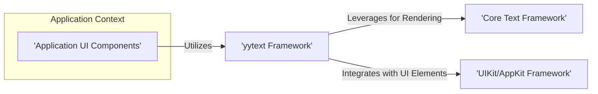
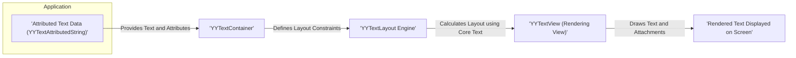
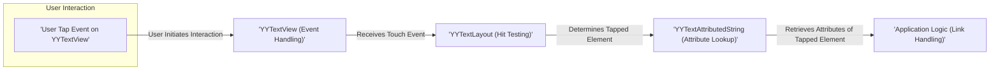

## Project Design Document: yytext - iOS/macOS Text Framework

**Version:** 1.1
**Date:** October 26, 2023
**Author:** Gemini (AI Language Model)

### 1. Introduction

This document provides an enhanced and more detailed design overview of the `yytext` project, an iOS/macOS text framework developed by ibireme. This document aims to capture the key architectural components, data flow, and interactions within the framework with greater precision. It will serve as a robust foundation for future threat modeling activities.

`yytext` is a sophisticated text rendering and editing framework that extends the capabilities of standard UIKit/AppKit text components. It offers advanced features such as fine-grained attributed text rendering, highly customizable text layout, support for interactive text elements (like links and mentions), and efficient handling of large text documents. A thorough understanding of its internal structure is paramount for identifying potential security vulnerabilities and attack vectors.

### 2. Goals and Non-Goals

**Goals:**

* Provide a comprehensive and detailed overview of the `yytext` architecture, elaborating on component responsibilities and interactions.
* Clearly identify the major components and their specific functions within the framework.
* Precisely describe the data flow within the framework for both rendering and user interaction scenarios.
* Highlight potential areas of interest for security analysis with more specific examples.
* Serve as a robust and well-defined basis for subsequent threat modeling sessions, enabling more targeted analysis.

**Non-Goals:**

* Provide a line-by-line code analysis or delve into the implementation details of individual methods.
* Detail every single class or property within the framework's codebase.
* Perform a live security audit or conduct penetration testing on the framework.
* Suggest specific code changes, security patches, or implementation strategies.

### 3. Architectural Overview

`yytext` employs a modular design, building upon the robust foundation of Apple's Core Text framework and leveraging the object-oriented features of Objective-C. It provides a higher-level, more developer-friendly abstraction for managing complex text rendering and interaction scenarios.

**High-Level Architecture Diagram:**

**Explanation:**

* **Application UI Components:** Represents the parts of an iOS or macOS application that utilize the `yytext` framework to display and interact with textual content.
* **yytext Framework:** The central component, responsible for orchestrating text rendering, managing layout, and handling user interactions related to text.
* **Core Text Framework:** Apple's low-level text rendering engine, providing the fundamental building blocks for glyph rendering, text shaping, and layout calculations, which `yytext` heavily relies upon.
* **UIKit/AppKit Framework:** The foundational UI frameworks for iOS and macOS, providing essential view classes, event handling mechanisms, and drawing contexts that `yytext` integrates with to display and manage text views.

### 4. Component Design

The `yytext` framework is composed of several interconnected components, each with specific responsibilities:

* **YYTextContainer:**
    * Defines the geometric boundaries and layout constraints for the text content.
    * Manages properties such as the container's size, margins (insets), and exclusion paths (areas where text should flow around).
    * Provides the necessary context and parameters for the text layout calculations performed by other components.
* **YYTextLayout:**
    * The core engine responsible for performing the complex task of text layout.
    * Takes an attributed string (`YYTextAttributedString`) and a text container (`YYTextContainer`) as input.
    * Utilizes Core Text to generate detailed information about line breaks, glyph positions, character bounding boxes, and overall text extents.
* **YYTextAttributedString:**
    * Extends the standard `NSAttributedString` to offer additional features and optimizations specific to `yytext`.
    * Supports a wide range of custom attributes for styling (e.g., colors, fonts), embedding attachments (images, custom views), and defining interactive elements (links, mentions).
    * Designed for efficient storage and manipulation of rich text content with complex formatting and interactive elements.
* **YYTextRun:**
    * Represents a contiguous sequence of text within an attributed string that shares the same set of attributes.
    * Used internally by the text layout engine to process and manage text segments with consistent styling.
    * Can represent plain text, embedded images, or custom views that are rendered inline with the text.
* **YYTextView:**
    * A subclass of `UIView` (on iOS) or `NSView` (on macOS) responsible for the visual presentation of the laid-out text.
    * Draws the glyphs, attachments, and applies visual effects based on the information provided by the `YYTextLayout` object.
    * Handles user interactions such as taps, long presses, and gestures on interactive text elements, delegating actions as needed.
* **YYTextEditor:**
    * Provides editing functionalities for `YYTextView` instances.
    * Manages text input, cursor positioning and rendering, text selection, and undo/redo operations.
    * Integrates with the operating system's input methods and text input system.
* **YYTextParser:**
    * Responsible for interpreting and converting various text formats or custom markup into a `YYTextAttributedString`.
    * Can handle parsing tasks for formats like Markdown, HTML (to a limited extent), or custom defined syntax for styling and embedding content.
* **YYTextAttachment:**
    * Represents non-textual elements that are embedded within the text flow, such as images, animated GIFs, or custom `UIView`/`NSView` instances.
    * Manages the display, sizing, and interaction behavior of these embedded elements.
* **YYTextEffect:**
    * Allows for applying visual effects to the rendered text, such as shadows, gradients, or background highlights.
    * Enhances the visual presentation and styling capabilities of the text.
* **YYTextHighlightRange:**
    * Used to visually emphasize specific ranges of text within a `YYTextView`.
    * Commonly used for highlighting selected text, search results, or indicating active links or mentions.

### 5. Data Flow

The data flow within `yytext` can be categorized into two primary scenarios: rendering text and handling user interactions.

**Data Flow for Text Rendering:**

**Detailed Data Flow for Rendering:**

1. **Attributed Text Data (YYTextAttributedString):** The application provides the text content, including formatting and interactive attributes, as a `YYTextAttributedString` object.
2. **YYTextContainer:** The application creates or configures a `YYTextContainer` to specify the area where the text should be laid out, including size and any exclusion paths.
3. **YYTextLayout Engine:** A `YYTextLayout` object is instantiated, taking the attributed text and the text container as input. This involves:
    * **Parsing and Processing:** The `YYTextLayout` engine analyzes the attributed string, identifying text runs and their associated attributes.
    * **Core Text Invocation:** The engine leverages Core Text functions to perform the actual layout calculations, determining line breaks, glyph positions, and bounding boxes for each character and attachment.
4. **YYTextView (Rendering View):** A `YYTextView` (or a similar rendering component) is associated with the `YYTextLayout` object.
5. **Rendered Text Displayed on Screen:** The `YYTextView` iterates through the layout information provided by `YYTextLayout` and uses Core Graphics to draw the glyphs, images, and other attachments onto the screen within its drawing context.

**Data Flow for User Interaction (e.g., Tapping a Link):**

**Detailed Data Flow for Interaction:**

1. **User Tap Event on YYTextView:** The user interacts with the `YYTextView` by tapping on a specific location.
2. **YYTextView (Event Handling):** The `YYTextView` receives the touch event and needs to determine what element was tapped.
3. **YYTextLayout (Hit Testing):** The `YYTextView` uses the `YYTextLayout` object to perform hit testing. This involves checking the touch coordinates against the bounding boxes of characters and attachments within the layout.
4. **YYTextAttributedString (Attribute Lookup):** Once the tapped element is identified (e.g., a specific character range), the `YYTextLayout` or `YYTextView` can access the underlying `YYTextAttributedString` to retrieve the attributes associated with that element. This might reveal a `URL` attribute indicating a link.
5. **Application Logic (Link Handling):** If the tapped element has an associated action (e.g., a URL), the `YYTextView`'s delegate or a custom handler within the application will be notified, and the appropriate action (e.g., opening the URL in a browser) will be executed.

### 6. Security Considerations (Detailed)

Based on the architecture and data flow, several potential areas of security concern warrant careful consideration during threat modeling:

* **Malicious Attributed Text Input:**
    * **Excessive Attribute Nesting:**  Crafted attributed strings with deeply nested or excessively complex attributes could potentially lead to performance degradation or even denial-of-service due to increased processing overhead during layout and rendering.
    * **Resource Exhaustion via Attachments:**  Malicious actors could embed a large number of high-resolution images or other large attachments, potentially exhausting memory resources and causing application crashes.
    * **Format String Vulnerabilities (Potential):** While less likely in modern Objective-C, if string formatting is used improperly when handling attribute values, format string vulnerabilities could theoretically be introduced.
* **Memory Safety in Objective-C:**
    * **Memory Leaks:** Improper memory management of `yytext` objects, especially attachments or custom views, could lead to memory leaks, potentially impacting application stability and performance over time.
    * **Dangling Pointers:** Incorrect handling of object lifecycles could result in dangling pointers, which could be exploited to cause crashes or potentially execute arbitrary code.
    * **Buffer Overflows/Underflows:** While `yytext` relies heavily on Core Text, any custom memory manipulation within `yytext`'s code could introduce buffer overflow or underflow vulnerabilities if not handled carefully.
* **Core Text Vulnerabilities:**
    * **Exploiting Underlying Engine:**  Vulnerabilities within the Core Text framework itself could indirectly affect `yytext`. Staying updated with system security patches is crucial.
    * **Unexpected Core Text Behavior:**  `yytext` needs to robustly handle errors or unexpected behavior returned by Core Text to prevent crashes or unexpected rendering issues.
* **Handling of External Resources in Attachments:**
    * **Insecure URL Loading:** If `yytext` loads external resources for attachments based on URLs provided in the attributed text, it's crucial to validate and sanitize these URLs to prevent loading from malicious or untrusted sources.
    * **Man-in-the-Middle Attacks:**  If resources are loaded over insecure HTTP connections, they could be intercepted and replaced by malicious content.
* **Security of Custom Attributes and Actions:**
    * **Arbitrary Code Execution:** If applications define custom attributes that trigger actions (e.g., via URL schemes or custom handlers), vulnerabilities could arise if a malicious actor can craft an attributed string that triggers unintended or harmful actions. Proper input validation and sandboxing are essential.
    * **Injection Attacks:** If custom attribute values are used in constructing system commands or web requests without proper sanitization, they could be susceptible to injection attacks.
* **Regular Expression Denial of Service (ReDoS):**
    * **Inefficient Regex:** If `yytext` uses regular expressions for parsing or processing text (e.g., in the `YYTextParser`), poorly written or complex regular expressions could be vulnerable to ReDoS attacks, where specially crafted input strings cause excessive processing time and potentially lead to denial of service.
* **Integer Overflow/Underflow in Layout Calculations:**
    * **Incorrect Size Calculations:**  While less likely with modern frameworks, vulnerabilities could theoretically arise if integer overflows or underflows occur during calculations related to text layout, potentially leading to buffer overflows or incorrect rendering.

### 7. Dependencies

`yytext` relies on the following core Apple frameworks:

* **Foundation Framework:** Provides fundamental data types, collections, and operating system services.
* **Core Graphics Framework:** The underlying 2D graphics rendering engine used for drawing text and other visual elements.
* **Core Text Framework:** Apple's advanced text layout and rendering engine, providing the low-level text processing capabilities.
* **UIKit (for iOS) / AppKit (for macOS):** The user interface frameworks providing essential view classes, event handling, and drawing contexts.

### 8. Deployment

`yytext` is typically integrated into iOS and macOS applications as a dynamic framework. The integration process involves:

* **Adding the `yytext` framework:** Including the compiled `yytext.framework` bundle within the application's project structure.
* **Linking the framework:** Configuring the application's build settings to link against the `yytext` framework.
* **Importing Headers:**  Importing the necessary header files (e.g., `#import <YYText/YYText.h>`) in the application's source code to access the framework's classes and methods.

### 9. Future Considerations

* **In-depth Analysis of Attribute Handling:** A more granular examination of how `yytext` processes and renders different types of attributes, particularly custom ones, is warranted for security assessment.
* **Detailed Review of Parsing Mechanisms:** A thorough review of the `YYTextParser` component and its handling of various input formats is crucial to identify potential vulnerabilities related to parsing malicious or malformed data.
* **Security Implications of Custom Attachments:** Further investigation into the security implications of embedding custom `UIView`/`NSView` instances as text attachments, including their potential access to application resources or sensitive data.

This enhanced design document provides a more detailed and comprehensive understanding of the `yytext` project's architecture, data flow, and potential security considerations. It serves as a more robust foundation for subsequent threat modeling activities, enabling a more targeted and effective security analysis of the framework.