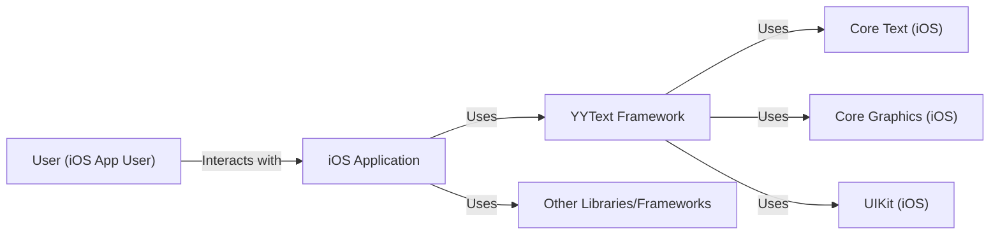
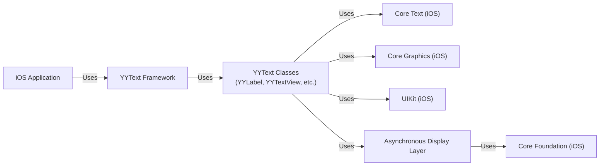
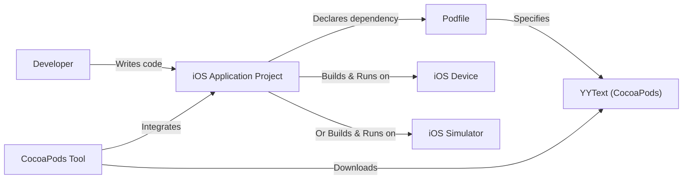
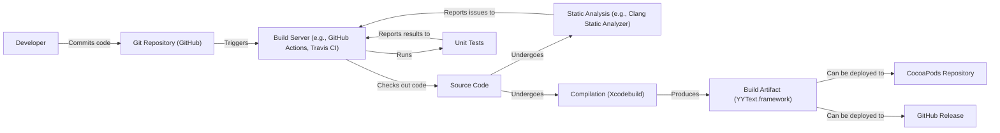

Okay, let's create a design document for the YYText project.

# BUSINESS POSTURE

Business Priorities and Goals:

*   Provide a high-performance, feature-rich text framework for iOS.
*   Offer a robust alternative to the built-in UIKit text components.
*   Enable advanced text rendering and layout capabilities for iOS developers.
*   Maintain a well-documented and easy-to-use API.
*   Ensure compatibility with a wide range of iOS versions.
*   Foster an active open-source community around the project.

Most Important Business Risks:

*   Security vulnerabilities in the text rendering engine could lead to application crashes, data corruption, or potential code execution exploits.
*   Performance issues or excessive memory consumption could negatively impact the user experience of applications using the framework.
*   Lack of compatibility with newer iOS versions or devices could limit the project's adoption.
*   Inadequate documentation or a complex API could hinder developer adoption.
*   Failure to address reported bugs or security vulnerabilities in a timely manner could damage the project's reputation.

# SECURITY POSTURE

Existing Security Controls:

*   security control: The project is written in Objective-C, which offers some memory safety features compared to C, but still requires careful memory management. (Source code)
*   security control: The project appears to use standard iOS APIs for text rendering and layout. (Source code)
*   security control: The project has a set of unit tests. (Source code, Tests directory)
*   security control: The project is open-source, allowing for community review and contributions. (GitHub repository)

Accepted Risks:

*   accepted risk: The project relies on manual memory management (MRC) in some parts, increasing the risk of memory leaks or crashes if not handled correctly.
*   accepted risk: The project's extensive use of Core Graphics and Core Text APIs introduces a dependency on the security of these underlying frameworks.
*   accepted risk: The project does not appear to have explicit security-focused documentation or guidelines.

Recommended Security Controls:

*   security control: Conduct a thorough security review of the codebase, focusing on areas that handle user input, external data, or perform complex text manipulation.
*   security control: Implement fuzz testing to identify potential vulnerabilities related to unexpected or malformed input.
*   security control: Consider migrating to Automatic Reference Counting (ARC) to reduce the risk of memory management errors.
*   security control: Add security-focused documentation, including guidelines for safe usage and reporting vulnerabilities.
*   security control: Establish a process for handling security vulnerabilities, including a security contact and a disclosure policy.
*   security control: Integrate static analysis tools into the build process to identify potential security issues early in the development lifecycle.

Security Requirements:

*   Authentication: Not directly applicable, as YYText is a framework, not a service. Authentication would be handled by the application using YYText.
*   Authorization: Not directly applicable. Authorization would be handled by the application using YYText.
*   Input Validation:
    *   The framework should handle potentially malformed or excessively large text inputs gracefully, without crashing or causing unexpected behavior.
    *   The framework should be resistant to common text-based attacks, such as cross-site scripting (XSS) or buffer overflows, if applicable (depending on how the rendered text is used).
*   Cryptography:
    *   If the framework handles sensitive data (which is unlikely for a text rendering framework), it should use appropriate cryptographic algorithms and protocols to protect that data.
*   General:
    *   The framework should follow secure coding practices to minimize the risk of vulnerabilities.
    *   The framework should be regularly reviewed and updated to address any identified security issues.

# DESIGN

## C4 CONTEXT

C4 Context Element List:

*   User (iOS App User):
    *   Name: User (iOS App User)
    *   Type: Person
    *   Description: The end-user of an iOS application that utilizes the YYText framework.
    *   Responsibilities: Interacts with the iOS application's UI, including text rendered by YYText.
    *   Security controls: None directly implemented by YYText. Security is the responsibility of the iOS application.

*   iOS Application:
    *   Name: iOS Application
    *   Type: Software System
    *   Description: An iOS application that integrates the YYText framework for advanced text rendering and layout.
    *   Responsibilities: Provides the overall application functionality, handles user input, and utilizes YYText for text display.
    *   Security controls: Responsible for overall application security, including input validation, data protection, and secure communication.

*   YYText Framework:
    *   Name: YYText Framework
    *   Type: Software System
    *   Description: The YYText framework itself, providing advanced text rendering and layout capabilities.
    *   Responsibilities: Handles text rendering, layout, and interaction, providing an API for iOS applications.
    *   Security controls: Implements input validation for text data, relies on the security of underlying iOS frameworks (Core Text, Core Graphics, UIKit).

*   Core Text (iOS):
    *   Name: Core Text (iOS)
    *   Type: Software System
    *   Description: The underlying iOS framework for low-level text rendering and layout.
    *   Responsibilities: Provides fundamental text rendering capabilities.
    *   Security controls: Managed and secured by Apple as part of the iOS operating system.

*   Core Graphics (iOS):
    *   Name: Core Graphics (iOS)
    *   Type: Software System
    *   Description: The underlying iOS framework for 2D drawing.
    *   Responsibilities: Provides drawing primitives used for text rendering.
    *   Security controls: Managed and secured by Apple as part of the iOS operating system.

*   UIKit (iOS):
    *   Name: UIKit (iOS)
    *   Type: Software System
    *   Description: The underlying iOS framework for user interface components.
    *   Responsibilities: Provides UI elements and event handling.
    *   Security controls: Managed and secured by Apple as part of the iOS operating system.

*   Other Libraries/Frameworks:
    *   Name: Other Libraries/Frameworks
    *   Type: Software System
    *   Description: Any other libraries or frameworks used by the iOS Application.
    *   Responsibilities: Varies depending on the specific library/framework.
    *   Security controls: Varies depending on the specific library/framework.

## C4 CONTAINER

C4 Container Element List:

*   iOS Application:
    *   Name: iOS Application
    *   Type: Software System
    *   Description: An iOS application that integrates the YYText framework.
    *   Responsibilities: Provides overall application functionality.
    *   Security controls: Responsible for overall application security.

*   YYText Framework:
    *   Name: YYText Framework
    *   Type: Library
    *   Description: The top-level container for the YYText functionality.
    *   Responsibilities: Provides the public API for developers.
    *   Security controls: Entry point for input validation.

*   YYText Classes (YYLabel, YYTextView, etc.):
    *   Name: YYText Classes (YYLabel, YYTextView, etc.)
    *   Type: Code Components
    *   Description: The core classes within YYText that provide text rendering and layout functionality (e.g., YYLabel, YYTextView, YYTextLayout, etc.).
    *   Responsibilities: Implement text rendering, layout, and interaction logic.
    *   Security controls: Perform input validation and sanitization of text data.

*   Asynchronous Display Layer:
    *   Name: Asynchronous Display Layer
    *   Type: Code Component
    *   Description: A component within YYText that handles asynchronous text rendering and layout.
    *   Responsibilities: Manages background rendering to improve performance.
    *   Security controls: Should handle text data securely in background threads.

*   Core Text (iOS):
    *   Name: Core Text (iOS)
    *   Type: Framework
    *   Description: iOS framework for low-level text rendering.
    *   Responsibilities: Provides text rendering primitives.
    *   Security controls: Managed by Apple.

*   Core Graphics (iOS):
    *   Name: Core Graphics (iOS)
    *   Type: Framework
    *   Description: iOS framework for 2D drawing.
    *   Responsibilities: Provides drawing primitives.
    *   Security controls: Managed by Apple.

*   UIKit (iOS):
    *   Name: UIKit (iOS)
    *   Type: Framework
    *   Description: iOS framework for UI components.
    *   Responsibilities: Provides UI elements.
    *   Security controls: Managed by Apple.

* Core Foundation (iOS):
    *   Name: Core Foundation (iOS)
    *   Type: Framework
    *   Description: iOS framework providing fundamental software services.
    *   Responsibilities: Provides basic data types and services.
    *   Security controls: Managed by Apple.

## DEPLOYMENT

Possible Deployment Solutions:

1.  CocoaPods: A dependency manager for Swift and Objective-C Cocoa projects.
2.  Carthage: A decentralized dependency manager for Cocoa.
3.  Swift Package Manager: A tool for managing the distribution of Swift code, integrated with the Swift build system.
4.  Manual Integration: Directly adding the YYText source files to the project.

Chosen Solution (CocoaPods):

Deployment Element List:

*   Developer:
    *   Name: Developer
    *   Type: Person
    *   Description: The developer building the iOS application.
    *   Responsibilities: Writes code, manages dependencies.
    *   Security controls: Follows secure coding practices.

*   iOS Application Project:
    *   Name: iOS Application Project
    *   Type: Project
    *   Description: The Xcode project for the iOS application.
    *   Responsibilities: Contains application code and configuration.
    *   Security controls: Application-level security configurations.

*   Podfile:
    *   Name: Podfile
    *   Type: File
    *   Description: A file that specifies the dependencies for a CocoaPods project.
    *   Responsibilities: Lists the required libraries, including YYText.
    *   Security controls: Specifies the version of YYText to use, potentially a specific, secure version.

*   YYText (CocoaPods):
    *   Name: YYText (CocoaPods)
    *   Type: Package
    *   Description: The YYText framework distributed via CocoaPods.
    *   Responsibilities: Provides the YYText functionality.
    *   Security controls: Relies on the security of the CocoaPods repository and the integrity of the downloaded package.

*   CocoaPods Tool:
    *   Name: CocoaPods Tool
    *   Type: Tool
    *   Description: The command-line tool for managing CocoaPods dependencies.
    *   Responsibilities: Downloads and integrates dependencies into the project.
    *   Security controls: Uses HTTPS to download dependencies (assuming the CocoaPods repository is configured correctly).

*   iOS Device:
    *   Name: iOS Device
    *   Type: Device
    *   Description: A physical iOS device (iPhone, iPad).
    *   Responsibilities: Runs the compiled iOS application.
    *   Security controls: iOS operating system security features.

*   iOS Simulator:
    *   Name: iOS Simulator
    *   Type: Simulator
    *   Description: A simulator for iOS devices provided by Xcode.
    *   Responsibilities: Runs the compiled iOS application in a simulated environment.
    *   Security controls: Limited by the security of the host operating system and the simulator itself.

## BUILD

Build Process Description:

1.  Developer commits code to the GitHub repository.
2.  A build server (e.g., GitHub Actions, Travis CI, or a similar CI/CD system) is triggered by the commit.
3.  The build server checks out the source code.
4.  Static analysis is performed on the code (e.g., using the Clang Static Analyzer or other tools) to identify potential bugs and security vulnerabilities.  Results are reported back to the build server.
5.  The code is compiled using Xcodebuild (or a similar build tool).
6.  Unit tests are executed to verify the functionality of the code. Test results are reported back to the build server.
7.  If the build and tests are successful, a build artifact (YYText.framework) is produced.
8.  The build artifact can be deployed to a CocoaPods repository for distribution or attached to a GitHub Release.

Security Controls in Build Process:

*   security control: Static analysis is used to identify potential security vulnerabilities in the code.
*   security control: Unit tests are used to verify the functionality of the code and help prevent regressions.
*   security control: The build process is automated, reducing the risk of manual errors.
*   security control: The build server can be configured to use secure communication channels (e.g., HTTPS) for fetching dependencies and deploying artifacts.
*   security control: Code signing can be used to ensure the integrity of the build artifact.

# RISK ASSESSMENT

Critical Business Processes to Protect:

*   The core text rendering and layout functionality of the YYText framework.
*   The stability and performance of applications using YYText.
*   The reputation and trustworthiness of the YYText project.

Data to Protect and Sensitivity:

*   Text content rendered by YYText: The sensitivity of this data depends entirely on the application using YYText. YYText itself does not store or transmit this data, but it processes it in memory.  If an application uses YYText to display highly sensitive information (e.g., passwords, financial data, personal health information), then that data would be considered highly sensitive.  If an application uses YYText to display public information, then the data would be considered low sensitivity.
*   YYText source code:  The source code itself is publicly available, so confidentiality is not a primary concern.  However, the integrity of the source code is important to prevent the introduction of malicious code.

# QUESTIONS & ASSUMPTIONS

Questions:

*   Are there any specific security certifications or compliance requirements that YYText needs to meet?
*   What is the expected threat model for applications using YYText? (e.g., are they expected to be exposed to malicious input?)
*   Are there any plans to add features that might handle sensitive data directly within YYText?
*   What is the process for reporting and addressing security vulnerabilities in YYText?
*   Is there a specific versioning scheme or release process that should be considered for security updates?

Assumptions:

*   BUSINESS POSTURE: The primary goal is to provide a robust and performant text framework, with security being a high priority but not necessarily the *highest* priority (e.g., performance might be prioritized over some security hardening measures if there is a significant trade-off).
*   SECURITY POSTURE: The project relies on the security of the underlying iOS frameworks (Core Text, Core Graphics, UIKit) and does not implement its own custom cryptography or network communication.
*   DESIGN: The design is primarily focused on functionality and performance, with security considerations taken into account but not necessarily driving every design decision. The framework is used within the context of a larger iOS application, which is responsible for overall application security.