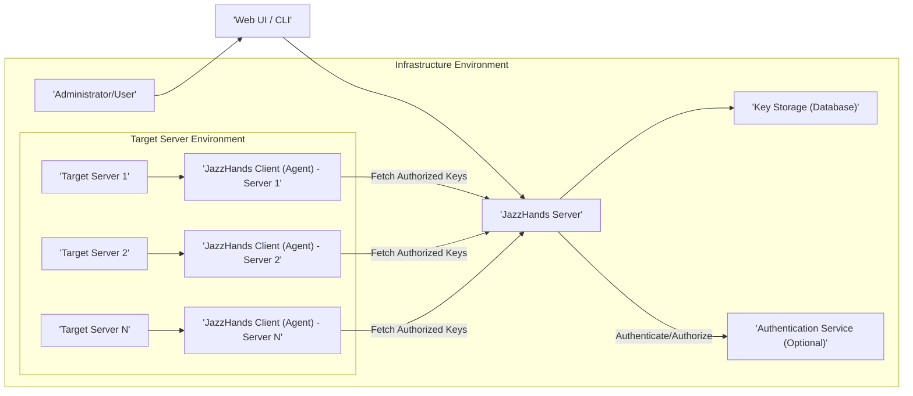

# Project Design Document: JazzHands - SSH Key Management System

**Version:** 1.1
**Date:** October 26, 2023
**Author:** AI Architecture Expert

## 1. Introduction

This document details the design of JazzHands, an open-source system for centralized SSH key management. JazzHands aims to replace the manual management of `authorized_keys` files across a server fleet with a secure, auditable, and automated approach. This design document will be used as the foundation for subsequent threat modeling activities.

## 2. Goals and Objectives

The primary goals of JazzHands are:

*   **Centralized SSH Key Authority:** Establish a single, authoritative source for managing SSH public keys, eliminating inconsistencies and the need for manual updates on individual servers.
*   **Simplified and Consistent Key Provisioning/Revocation:**  Streamline the process of granting and revoking SSH access for users and automated systems, ensuring consistency across the infrastructure.
*   **Enhanced Security Posture:** Improve security by enforcing uniform key management policies, reducing the risk of orphaned, unauthorized, or weak keys.
*   **Comprehensive Auditability and Traceability:** Maintain a detailed audit trail of all key modifications, access grants, and system activities for compliance and security investigations.
*   **Automation and Infrastructure-as-Code Integration:** Enable programmatic management of SSH keys through a well-defined API, facilitating integration with automation tools and infrastructure-as-code practices.
*   **Scalability and Performance:** Design the system to efficiently handle a large and growing number of servers, users, and key operations.

## 3. System Architecture

JazzHands employs a client-server architecture. The core components are the JazzHands Server and the JazzHands Client (Agent), deployed on target servers.

### 3.1. High-Level Architecture Diagram

### 3.2. Component Descriptions

*   **JazzHands Server:**
    *   **API Endpoint (RESTful):** Provides a secure RESTful API for managing users, SSH keys, and server associations. This includes endpoints for creating, reading, updating, and deleting (CRUD) operations on these resources.
    *   **Authentication and Authorization Module:** Responsible for verifying the identity of users and services interacting with the API. It enforces authorization policies to control access to specific resources and actions. This may integrate with external identity providers (e.g., LDAP, OAuth 2.0).
    *   **Key Management Module:** Stores and manages SSH public keys, associating them with individual users, groups of users, and specific target servers or logical groups of servers. It handles the logic for determining which keys should be authorized on which servers.
    *   **Audit Logging Service:**  Records all significant actions performed within the system, including API requests, authentication attempts, key modifications, and access requests. Logs should include timestamps, user/service identifiers, and details of the action performed.
    *   **Configuration Management:** Stores system-wide configuration settings, such as database connection details, authentication provider configurations, and client synchronization intervals.
    *   **Key Generation (Optional Feature):**  May include functionality to generate SSH key pairs for users, potentially enforcing key strength and type policies.

*   **Key Storage (Database):**
    *   Persistently stores user information (usernames, associated metadata), SSH public keys, server identifiers and groupings, and the audit log.
    *   Requires robust security measures, including encryption at rest and in transit, and strict access controls.
    *   Examples of suitable databases include PostgreSQL, MySQL, or other relational databases.

*   **Authentication Service (Optional, External):**
    *   An external service used for authenticating administrators and potentially users interacting with the JazzHands Server API or UI.
    *   Supports standard authentication protocols like LDAP, Active Directory, or OAuth 2.0.
    *   Allows for centralized user management and enforcement of organizational security policies.

*   **JazzHands Client (Agent):**
    *   Runs as a background process (daemon or service) on each target server.
    *   Periodically (or triggered by an event) connects to the JazzHands Server to fetch the current set of authorized SSH keys for that specific server.
    *   Authenticates to the JazzHands Server using pre-configured credentials (e.g., API key, client certificate, or a server-specific token).
    *   Updates the `authorized_keys` file for relevant users on the target server, ensuring that only the centrally managed keys are present.
    *   Requires appropriate permissions (typically root) to modify the `authorized_keys` file.
    *   Should implement secure storage of its own configuration and credentials.

*   **Web UI / CLI:**
    *   Provides a user-friendly interface for administrators and authorized users to interact with the JazzHands Server.
    *   The Web UI allows for managing users, adding and removing SSH keys, configuring server associations, and viewing audit logs.
    *   The CLI provides a command-line interface for similar operations, facilitating automation and scripting.

## 4. Data Flow

The primary data flow involves the JazzHands Client retrieving authorized keys and the administrative management of keys.

### 4.1. Client-Driven Authorized Key Retrieval

1. **Client Initialization and Authentication:** The JazzHands Client on a target server starts or wakes up according to its configured schedule. It authenticates to the JazzHands Server using its pre-configured credentials over a secure channel (HTTPS/TLS).
2. **Server Identification and Key Request:** The client sends a request to the JazzHands Server, identifying the server it is running on (e.g., using its hostname or a unique identifier).
3. **Server-Side Authorization and Key Lookup:** The JazzHands Server verifies the client's identity and authorization to request keys for the specified server. It then queries the Key Storage to retrieve the authorized public keys associated with that server, considering user and group associations.
4. **Secure Key Delivery:** The JazzHands Server sends the list of authorized public keys back to the client over the secure channel.
5. **`authorized_keys` Update and Backup:** The JazzHands Client updates the `authorized_keys` file for the relevant users on the target server. It should ideally create a backup of the existing `authorized_keys` file before making changes.
6. **Logging:** Both the JazzHands Client and Server log the key retrieval process, including timestamps, server identifiers, and the outcome of the operation.

### 4.2. Administrative Key Management

1. **Administrator Action via UI/CLI:** An administrator uses the Web UI or CLI to add, modify, or revoke a public key for a user or group, or to associate keys with specific servers or groups of servers.
2. **API Request to Server:** The Web UI/CLI sends a secure API request to the JazzHands Server, specifying the desired action and relevant data (e.g., public key, username, server identifier).
3. **Server-Side Authentication and Authorization:** The JazzHands Server authenticates and authorizes the administrator's request based on their credentials and configured permissions.
4. **Key Storage Update:** The JazzHands Server updates the Key Storage with the new or modified key information.
5. **Audit Logging:** The server logs the administrative action, including the administrator's identity, the timestamp, and the details of the change.
6. **Client Synchronization (Eventual Consistency):** Target servers will retrieve the updated key information during their next scheduled synchronization cycle. Mechanisms for triggering immediate updates (e.g., via a push notification or a client-initiated request) could be considered for near real-time updates.

## 5. Security Considerations

Security is a critical aspect of JazzHands. Key considerations for threat modeling include:

*   **Secure Communication Channels:**
    *   All communication between the JazzHands Client and Server MUST be encrypted using HTTPS/TLS with strong cipher suites.
    *   Consider certificate pinning on the client-side to prevent man-in-the-middle attacks.
*   **Authentication and Authorization:**
    *   **JazzHands Server Authentication:** Clients must authenticate securely to the JazzHands Server. Options include API keys, client certificates, or short-lived tokens.
    *   **Administrator Authentication:** Strong authentication mechanisms for administrators accessing the server (e.g., multi-factor authentication, integration with corporate identity providers).
    *   **Granular Authorization Policies:** Implement role-based access control (RBAC) to manage who can perform specific actions (e.g., add keys, delete users, manage server configurations).
*   **Key Storage Security:**
    *   The database storing SSH keys MUST be encrypted at rest and in transit.
    *   Access to the database should be restricted to the JazzHands Server with minimal necessary privileges.
    *   Regular backups of the key database should be performed and stored securely.
*   **JazzHands Client Security:**
    *   Secure storage of client credentials on target servers is crucial. Avoid storing credentials in plain text. Consider using operating system-specific secure storage mechanisms.
    *   Protect the JazzHands Client binary and configuration files from unauthorized modification.
    *   Ensure the client operates with the least necessary privileges.
*   **Secret Management:**
    *   Securely manage sensitive information such as database credentials, API keys, and signing keys used by the JazzHands Server and Client. Consider using a dedicated secret management service (e.g., HashiCorp Vault, AWS Secrets Manager).
*   **Input Validation and Sanitization:**
    *   Thoroughly validate and sanitize all input to the JazzHands Server API to prevent injection attacks (e.g., SQL injection, command injection).
*   **Audit Logging and Monitoring:**
    *   Implement comprehensive and tamper-proof audit logs that record all critical events.
    *   Regularly monitor audit logs for suspicious activity.
    *   Consider integrating with a Security Information and Event Management (SIEM) system.
*   **Rate Limiting and Abuse Prevention:**
    *   Implement rate limiting on API endpoints to prevent denial-of-service attacks and abuse.
*   **Regular Security Assessments:**
    *   Conduct regular security audits and penetration testing to identify and address potential vulnerabilities.
*   **Secure Software Development Practices:**
    *   Follow secure coding practices throughout the development lifecycle.
    *   Perform regular vulnerability scanning of dependencies.

## 6. Deployment

JazzHands can be deployed in various environments, with considerations for scalability and high availability.

*   **Cloud Environment (e.g., AWS, Azure, GCP):**
    *   **Server Deployment:** The JazzHands Server can be deployed on virtual machines, containerized using Docker and orchestrated with Kubernetes, or as a serverless application depending on scalability requirements.
    *   **Database:** Utilize managed database services (e.g., AWS RDS, Azure SQL Database, Google Cloud SQL) for ease of management, scalability, and high availability.
    *   **Client Deployment:** Clients are deployed on target servers, often automated using configuration management tools or infrastructure-as-code scripts.
*   **On-Premise Environment:**
    *   **Server Deployment:** The JazzHands Server can be deployed on physical or virtual servers within the organization's data center.
    *   **Database:**  The database can be self-managed on dedicated servers or virtual machines. Ensure proper backups and high availability configurations.
    *   **Client Deployment:** Client deployment can be managed through existing system management tools.

Key deployment considerations:

*   **Scalability and High Availability:** Design the server infrastructure to handle the expected load and implement redundancy for the JazzHands Server and database to ensure continuous operation. Consider load balancing and failover mechanisms.
*   **Network Configuration:** Ensure proper network connectivity between the JazzHands Server and Clients. Configure firewalls to allow necessary traffic on specific ports.
*   **Client Deployment Automation:** Automate the deployment and configuration of the JazzHands Client on target servers using tools like Ansible, Chef, Puppet, or cloud-specific deployment mechanisms.
*   **Monitoring and Alerting:** Implement monitoring for the JazzHands Server and Client to track performance and identify potential issues. Set up alerts for critical events.

## 7. Future Considerations

*   **Integration with Identity Providers (Enhanced):**  Deeper integration with various identity providers for more granular user and group synchronization and management.
*   **Automated Key Rotation Policies:**  Implement policies for automatic rotation of SSH keys based on time or usage.
*   **Support for Ephemeral/Temporary Access Grants:**  Enable the creation of time-limited SSH access grants for specific users or services.
*   **Webhooks and Real-time Notifications:**  Implement webhooks or other notification mechanisms to inform administrators of key changes, access grants, or potential security events in real-time.
*   **Enhanced Client Features and Diagnostics:**  Add features to the client for local key management tasks or improved diagnostics and logging.
*   **Compliance Reporting:** Generate reports for compliance purposes, detailing key usage and access history.

This document provides a detailed design of the JazzHands SSH key management system, outlining its architecture, data flows, and critical security considerations. This information will be instrumental in conducting thorough threat modeling activities.
