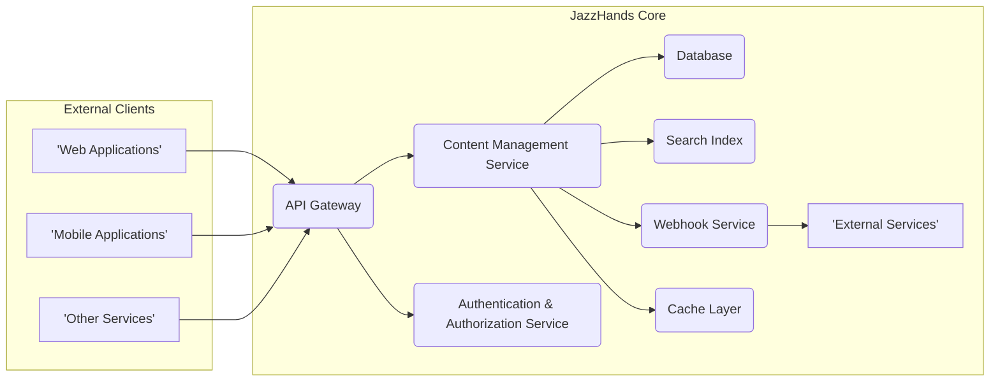
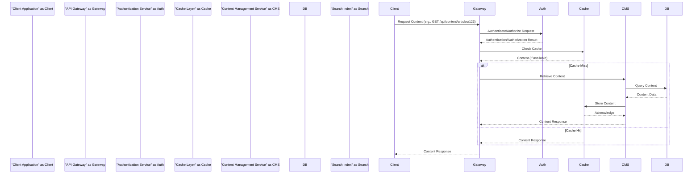
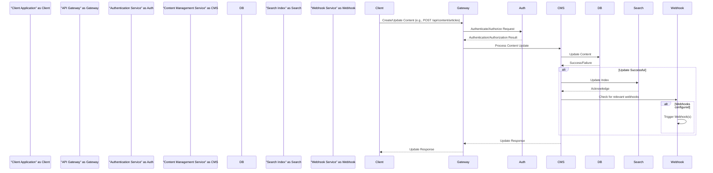
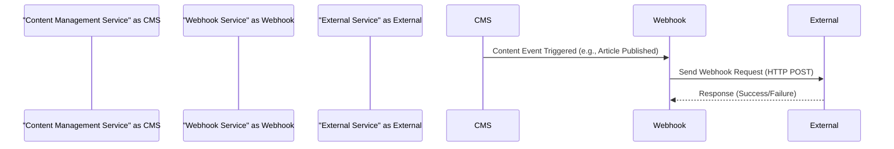

# Project Design Document: JazzHands - Headless CMS

**Version:** 1.1
**Date:** October 26, 2023
**Author:** AI Software Architect

## 1. Introduction

This document provides an enhanced and detailed design overview of the JazzHands project, a headless Content Management System (CMS) developed by IFTTT. This document aims to provide a comprehensive and clear understanding of the system's architecture, components, and data flow, which will serve as a robust foundation for subsequent threat modeling activities. This revision includes more specific details and clarifies certain aspects of the initial design.

## 2. Goals and Objectives

The primary goals of JazzHands are to:

* Provide a flexible and scalable platform for managing structured content, enabling diverse content models.
* Offer a robust and well-documented API (likely RESTful) for accessing and delivering content to various front-end applications and services.
* Enable content creators to manage content independently of the presentation layer, fostering a decoupled architecture.
* Support a wide range of content types with customizable fields and validation rules, and manage complex relationships between them.
* Facilitate efficient content workflows, including draft states, review processes, and scheduled publishing.

## 3. High-Level Architecture

JazzHands employs a decoupled, headless CMS architecture, clearly separating the content repository and management from the content presentation. The core components interact via well-defined interfaces to manage and deliver content.

* **External Clients:** These are the diverse applications and services that consume content managed by JazzHands through its API.
    * Web Applications (e.g., websites, single-page applications)
    * Mobile Applications (iOS, Android)
    * Other Services (e.g., integrations with marketing automation platforms, internal systems)
* **JazzHands Core:** This encompasses the backend services and infrastructure responsible for the core content management and delivery functionalities.
    * **API Gateway:** The single entry point for all external API requests. It handles request routing, rate limiting, TLS termination, and potentially cross-origin resource sharing (CORS).
    * **Authentication & Authorization Service:** Responsible for verifying the identity of users and applications attempting to access the API and ensuring they have the necessary permissions based on their roles and the requested resource. This likely involves token-based authentication (e.g., JWT).
    * **Content Management Service:** The central component of JazzHands, responsible for:
        * Defining and managing content types (schemas) with various field types and validation rules.
        * Providing CRUD operations for content entries.
        * Managing relationships between content entries (e.g., one-to-one, one-to-many, many-to-many).
        * Handling content versioning and audit trails.
        * Managing content workflows and publishing states (e.g., draft, pending review, published, archived).
    * **Database:**  Persistently stores all structured content, user accounts, roles, permissions, system configurations, and potentially webhook configurations.
    * **Search Index:** Provides efficient and scalable full-text search capabilities across the managed content. This allows clients to perform complex queries and filtering.
    * **Webhook Service:** Enables the configuration and triggering of HTTP callbacks to external services or applications when specific content lifecycle events occur (e.g., content created, updated, published, deleted).
    * **External Services:** These are the third-party systems or applications that JazzHands integrates with, often triggered by webhook events.
    * **Cache Layer:** An optional but highly recommended layer to improve API performance and reduce database load by caching frequently accessed content. This could be a distributed cache like Redis or Memcached.

## 4. Component Details

This section provides a more detailed description of each component within the JazzHands architecture, including potential technologies and security considerations.

* **API Gateway:**
    * **Functionality:**
        * Receives and routes all incoming API requests to the appropriate backend service based on the request path and method.
        * Enforces rate limiting policies to prevent abuse and ensure service availability.
        * Handles TLS termination, ensuring secure communication over HTTPS.
        * May implement CORS policies to control which origins can access the API.
        * Could perform basic authentication checks before routing to the Authentication Service.
    * **Technology:**  Likely a cloud-managed API Gateway service (e.g., AWS API Gateway, Google Cloud API Gateway, Azure API Management) or a reverse proxy like Nginx or HAProxy.
    * **Key Considerations for Threat Modeling:**
        * Vulnerabilities in the gateway software itself.
        * Misconfiguration of routing rules leading to unintended access or denial of service.
        * Inadequate rate limiting allowing for brute-force attacks or resource exhaustion.
        * Improperly configured CORS policies potentially exposing the API to unauthorized origins.

* **Authentication & Authorization Service:**
    * **Functionality:**
        * Authenticates users and applications attempting to access the API, likely using token-based authentication (e.g., JWT).
        * Manages user accounts, roles, and permissions.
        * Authorizes access to specific API endpoints and content based on the authenticated user or application's roles and permissions.
        * May integrate with identity providers for single sign-on (SSO).
    * **Technology:**  Could be a custom-built service, a dedicated authentication and authorization platform (e.g., Auth0, Okta), or an open-source solution like Keycloak.
    * **Key Considerations for Threat Modeling:**
        * Weak or predictable authentication credentials.
        * Authorization bypass vulnerabilities allowing unauthorized access to resources.
        * Insecure storage or transmission of authentication tokens.
        * Privilege escalation vulnerabilities allowing users to gain unauthorized access.

* **Content Management Service:**
    * **Functionality:**
        * Provides a comprehensive API for managing content types (schemas), including defining fields, data types, and validation rules.
        * Exposes CRUD endpoints for managing content entries.
        * Handles complex relationships between content entries, ensuring data integrity.
        * Manages content versioning, allowing for rollback and tracking of changes.
        * Implements content workflows, controlling the lifecycle of content from creation to publication and archival.
    * **Technology:**  Likely a custom-built application, potentially using a framework like Node.js (given IFTTT's background), Python (Django/Flask), or Ruby on Rails.
    * **Key Considerations for Threat Modeling:**
        * Injection vulnerabilities (e.g., SQL injection if directly interacting with the database, NoSQL injection if using a NoSQL database).
        * Business logic flaws in content management workflows leading to unintended state changes or data corruption.
        * Insecure deserialization if handling serialized data from external sources.
        * Access control issues related to content creation, editing, and publishing, potentially allowing unauthorized modifications.

* **Database:**
    * **Functionality:**
        * Persistently stores all application data, including content entries, content type definitions, user accounts, roles, permissions, and system configurations.
    * **Technology:**  Could be a relational database (e.g., PostgreSQL, MySQL) chosen for its transactional integrity and structured data capabilities, or a NoSQL database (e.g., MongoDB, Cassandra) if flexibility and scalability are paramount.
    * **Key Considerations for Threat Modeling:**
        * SQL injection vulnerabilities (if using a relational database) through poorly sanitized queries.
        * NoSQL injection vulnerabilities (if using a NoSQL database) through insecure query construction.
        * Data breaches due to unauthorized access to the database server or backups.
        * Data integrity issues caused by application flaws or malicious activity.

* **Search Index:**
    * **Functionality:**
        * Indexes content data to enable efficient full-text searching and filtering.
        * Provides an API for the Content Management Service to update the index when content changes.
        * Allows clients to query content based on keywords, metadata, and other criteria.
    * **Technology:**  Likely a dedicated search engine like Elasticsearch or Solr, known for their scalability and powerful search capabilities.
    * **Key Considerations for Threat Modeling:**
        * Injection vulnerabilities in search queries allowing for unauthorized data access or manipulation.
        * Information disclosure through search results, potentially revealing sensitive data.
        * Denial-of-service through resource-intensive or malformed search queries.

* **Webhook Service:**
    * **Functionality:**
        * Allows administrators to configure webhook subscriptions for specific content events (e.g., content published, updated, deleted).
        * Triggers HTTP POST requests to configured external URLs when these events occur, sending relevant event data.
        * Should include mechanisms for verifying the authenticity of webhook requests sent to external services (e.g., using shared secrets or digital signatures).
    * **Technology:**  Likely a custom-built service or a message queue system (e.g., Kafka, RabbitMQ) combined with a worker process to handle webhook delivery.
    * **Key Considerations for Threat Modeling:**
        * Server-Side Request Forgery (SSRF) vulnerabilities if the service doesn't properly validate and sanitize webhook URLs.
        * Insecure webhook delivery if the communication is not encrypted or if the authenticity of the request cannot be verified by the receiving service.
        * Potential for denial-of-service attacks by flooding the webhook service with malicious event triggers.

* **Cache Layer:**
    * **Functionality:**
        * Stores frequently accessed content in memory or on disk to reduce latency and database load.
        * Improves API response times and overall system performance.
        * Can be implemented using various caching strategies (e.g., content-based caching, time-based expiration).
    * **Technology:**  Could be an in-memory data store like Redis or Memcached, or a Content Delivery Network (CDN) for caching at the edge.
    * **Key Considerations for Threat Modeling:**
        * Cache poisoning vulnerabilities where malicious data is injected into the cache, affecting subsequent requests.
        * Stale data being served if the cache invalidation strategy is not properly implemented.
        * Security of the cache infrastructure itself, ensuring unauthorized access is prevented.

## 5. Data Flow

The following outlines the typical data flow scenarios for JazzHands, providing a clearer picture of how data moves through the system.

* **Retrieving Content:**

* **Creating or Updating Content:**

* **Webhook Event Trigger:**

## 6. Security Considerations (Detailed)

This section expands on the initial security considerations, providing more specific examples and potential attack vectors.

* **Authentication and Authorization:**
    * **Threats:** Brute-force attacks on login endpoints, credential stuffing, session hijacking, authorization bypass due to flawed role-based access control.
    * **Mitigations:** Strong password policies, multi-factor authentication (MFA), secure storage of credentials (hashing and salting), proper implementation of OAuth 2.0 or other secure authentication protocols, regular security audits of authorization rules.
* **Input Validation:**
    * **Threats:** SQL injection, NoSQL injection, cross-site scripting (XSS), command injection, path traversal.
    * **Mitigations:**  Strict input validation on all user-provided data, using parameterized queries or prepared statements, encoding output data, employing input sanitization libraries, and implementing a robust Content Security Policy (CSP).
* **Data Protection:**
    * **Threats:** Data breaches due to unauthorized access to the database or backups, man-in-the-middle attacks intercepting sensitive data in transit.
    * **Mitigations:** Encryption of sensitive data at rest (database encryption) and in transit (HTTPS), secure key management practices, regular security assessments of data storage and transmission mechanisms.
* **Rate Limiting:**
    * **Threats:** Denial-of-service (DoS) attacks, brute-force attacks.
    * **Mitigations:** Implementing rate limiting on API endpoints based on IP address or API key, using techniques like token bucket or leaky bucket algorithms, and monitoring API traffic for suspicious patterns.
* **Webhook Security:**
    * **Threats:** Server-Side Request Forgery (SSRF), insecure webhook delivery leading to information leakage, replay attacks.
    * **Mitigations:**  Strict validation of webhook URLs, using HTTPS for webhook delivery, implementing signature verification mechanisms (e.g., HMAC with a shared secret), and providing mechanisms for retrying failed webhook deliveries.
* **Dependency Management:**
    * **Threats:** Exploitation of known vulnerabilities in third-party libraries and frameworks.
    * **Mitigations:** Regularly updating dependencies to the latest secure versions, using dependency scanning tools to identify vulnerabilities, and having a process for patching vulnerabilities promptly.
* **Infrastructure Security:**
    * **Threats:** Unauthorized access to servers, misconfigured cloud resources, network vulnerabilities.
    * **Mitigations:** Following the principle of least privilege for access control, regularly patching operating systems and infrastructure components, using firewalls and network segmentation, and implementing robust security monitoring and logging.
* **Access Control:**
    * **Threats:** Unauthorized access to content or administrative functions due to overly permissive roles or misconfigured permissions.
    * **Mitigations:** Implementing role-based access control (RBAC) with granular permissions, regularly reviewing and auditing user roles and permissions, and adhering to the principle of least privilege.
* **Cache Security:**
    * **Threats:** Cache poisoning, serving stale data.
    * **Mitigations:** Implementing secure cache invalidation strategies, protecting the cache infrastructure from unauthorized access, and using appropriate cache headers to prevent unintended caching by clients.

## 7. Deployment

JazzHands is anticipated to be deployed in a cloud-native environment, leveraging containerization and orchestration for scalability and resilience.

* **Likely Deployment Environment:**
    * A major cloud provider (e.g., AWS, Google Cloud, Azure) utilizing managed services.
    * Containerization using Docker for packaging and deploying application components.
    * Orchestration with Kubernetes for managing and scaling containerized applications.
    * Infrastructure as Code (IaC) using tools like Terraform or CloudFormation for automated infrastructure provisioning.
* **Key Considerations for Threat Modeling:**
    * Security configurations of cloud services (e.g., IAM roles, security groups, network policies).
    * Container image security and vulnerability scanning.
    * Kubernetes security best practices (e.g., network policies, RBAC).
    * Secure secrets management for storing sensitive credentials.

## 8. Future Considerations

Potential future enhancements to JazzHands that could introduce new design considerations and security implications include:

* **GraphQL API:** Offering a GraphQL API alongside or instead of REST, requiring careful consideration of GraphQL-specific security risks like query complexity attacks.
* **Content Localization:** Supporting multiple languages and regional variations of content, potentially introducing complexities in access control and data management.
* **Asset Management:** Integrating a dedicated Digital Asset Management (DAM) system for managing images, videos, and other media, requiring secure integration and access control between JazzHands and the DAM.
* **Advanced Workflow Capabilities:** Implementing more complex and customizable content approval and publishing workflows, requiring careful design to prevent business logic flaws and unauthorized actions.

This revised document provides a more detailed and comprehensive design overview of the JazzHands project. It serves as an enhanced foundation for understanding the system's architecture, data flow, and potential security threats, facilitating a more thorough and effective threat modeling process.