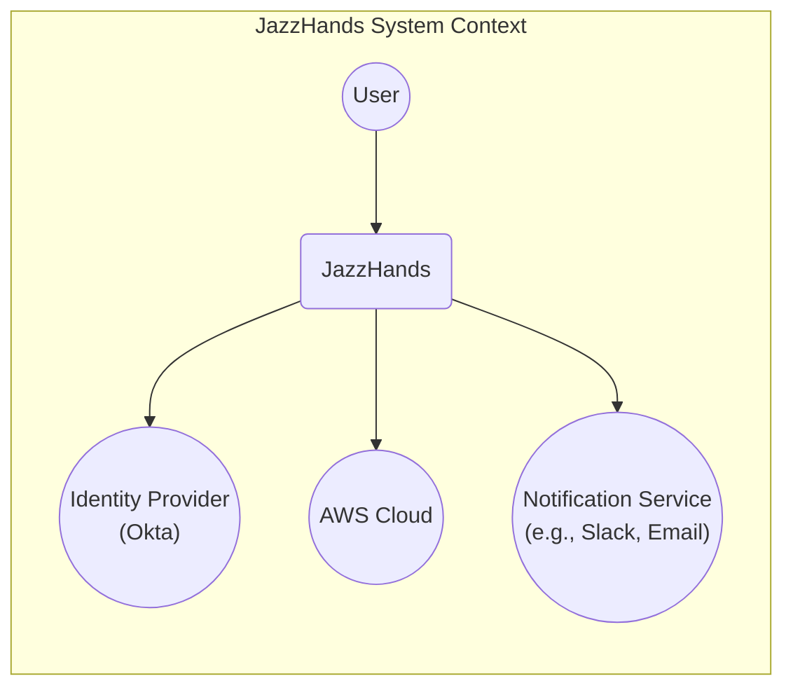
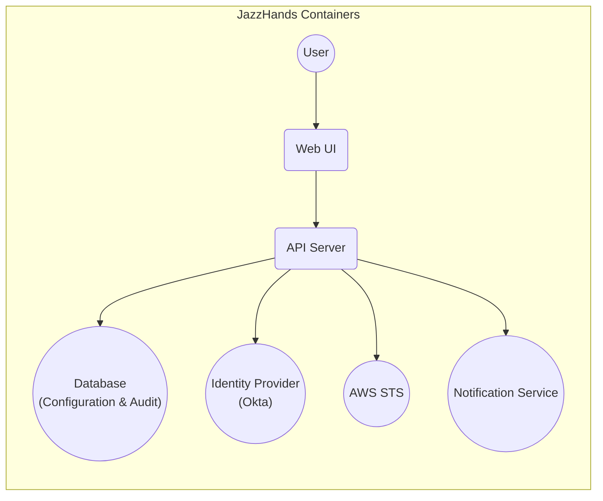
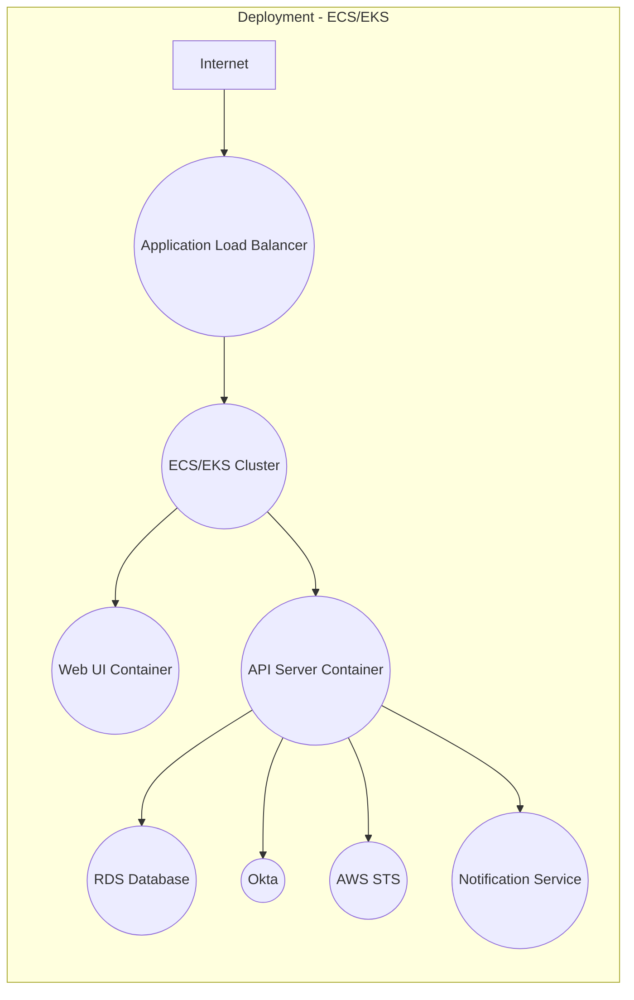
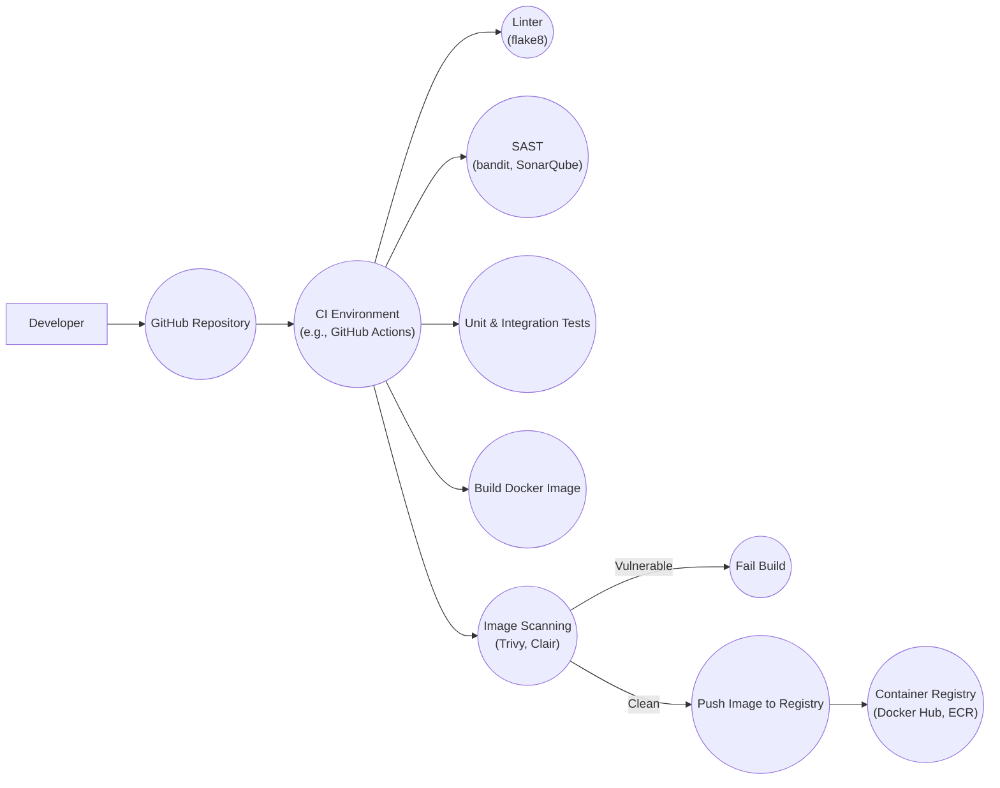

Okay, let's create a design document for the JazzHands project, focusing on aspects relevant to threat modeling.

# BUSINESS POSTURE

JazzHands is a tool developed by IFTTT, a company that focuses on connecting different services and devices.  This suggests a business model built around interoperability, automation, and user convenience.  Given IFTTT's position, the project likely aims to solve the following business priorities and goals:

*   **Priorities:**
    *   Streamline access management to AWS resources, reducing operational overhead.
    *   Improve security posture by enforcing least privilege and providing audit trails.
    *   Enhance developer productivity by simplifying access requests and approvals.
    *   Maintain compliance with relevant security standards and regulations.
    *   Reduce the risk of unauthorized access and data breaches.

*   **Goals:**
    *   Provide a centralized, user-friendly interface for managing AWS IAM access.
    *   Automate the process of granting and revoking temporary AWS credentials.
    *   Integrate with existing identity providers (like Okta) for authentication.
    *   Offer robust logging and auditing capabilities for all access-related activities.
    *   Support a flexible and customizable workflow for access requests and approvals.

*   **Business Risks:**
    *   Compromise of JazzHands could lead to widespread unauthorized access to IFTTT's AWS infrastructure.
    *   Failure of JazzHands could disrupt developer workflows and impact service availability.
    *   Inadequate auditing or logging could hinder incident response and compliance efforts.
    *   Usability issues could lead to user errors and accidental misconfigurations.
    *   Vulnerabilities in dependencies (e.g., Python libraries, AWS SDK) could be exploited.

# SECURITY POSTURE

Based on the GitHub repository and general best practices, here's an assessment of the security posture:

*   **Existing Security Controls:**
    *   security control: Authentication via Okta (SAML). This is described in the `README.md` and configuration files.
    *   security control: Authorization based on group membership and defined roles within JazzHands.  This is evident in the code and configuration examples.
    *   security control: Use of temporary AWS credentials (STS) to minimize the impact of credential compromise.  This is a core feature of the project.
    *   security control: Logging of access requests, approvals, and credential issuance.  Mentioned in the documentation and visible in the code.
    *   security control: Input validation (though the extent needs further review).  Present in parts of the code dealing with user input.
    *   security control: Use of HTTPS for communication between components. Implied by the use of AWS services and best practices.
    *   security control: Configuration via YAML files, allowing for version control and auditing of changes.

*   **Accepted Risks:**
    *   accepted risk: Reliance on the security of Okta as the primary identity provider. If Okta is compromised, JazzHands is also compromised.
    *   accepted risk: Potential for misconfiguration of JazzHands roles and permissions, leading to overly permissive access.
    *   accepted risk: Dependence on the availability and security of AWS services (IAM, STS, etc.).
    *   accepted risk: Vulnerabilities in third-party Python libraries used by JazzHands.

*   **Recommended Security Controls:**
    *   Implement regular security audits and penetration testing of the JazzHands application and infrastructure.
    *   Enforce strong password policies and multi-factor authentication (MFA) for all users, especially administrators.
    *   Implement robust input validation and output encoding to prevent injection attacks (e.g., XSS, SQL injection).
    *   Regularly update dependencies to patch known vulnerabilities.
    *   Implement a Web Application Firewall (WAF) to protect against common web attacks.
    *   Implement anomaly detection to identify unusual access patterns or suspicious activity.
    *   Implement static code analysis (SAST) and dynamic application security testing (DAST) in the build pipeline.
    *   Implement software composition analysis (SCA) to identify vulnerabilities in third-party libraries.

*   **Security Requirements:**

    *   **Authentication:**
        *   All users must be authenticated via a trusted identity provider (Okta).
        *   Support for multi-factor authentication (MFA) should be strongly encouraged or enforced.
        *   Session management should be secure, with appropriate timeouts and protection against session hijacking.

    *   **Authorization:**
        *   Access to resources should be granted based on the principle of least privilege.
        *   Roles and permissions should be clearly defined and regularly reviewed.
        *   A robust audit trail of all authorization decisions should be maintained.

    *   **Input Validation:**
        *   All user input should be validated against a strict whitelist of allowed characters and formats.
        *   Input validation should occur on the server-side, not just the client-side.
        *   Output encoding should be used to prevent cross-site scripting (XSS) vulnerabilities.

    *   **Cryptography:**
        *   All sensitive data (e.g., passwords, API keys) should be encrypted at rest and in transit.
        *   Strong, industry-standard cryptographic algorithms and key lengths should be used.
        *   Cryptographic keys should be managed securely, with appropriate rotation and access controls.
        *   HTTPS should be enforced for all communication.

# DESIGN

## C4 CONTEXT

*   **Elements Description:**
    *   User:
        *   Name: User
        *   Type: Person
        *   Description: A person who needs access to AWS resources.
        *   Responsibilities: Requesting access, using granted credentials, adhering to security policies.
        *   Security controls: Authentication via IdP, MFA (recommended).
    *   JazzHands:
        *   Name: JazzHands
        *   Type: Software System
        *   Description: The central system for managing temporary AWS credentials.
        *   Responsibilities: Authenticating users, authorizing access requests, issuing credentials, logging activity.
        *   Security controls: Authentication, authorization, logging, temporary credential issuance.
    *   Identity Provider (Okta):
        *   Name: Identity Provider (Okta)
        *   Type: External System
        *   Description: The system used for user authentication (Okta in this case).
        *   Responsibilities: Authenticating users, providing user attributes (e.g., group membership).
        *   Security controls: Okta's internal security controls, MFA.
    *   AWS Cloud:
        *   Name: AWS Cloud
        *   Type: External System
        *   Description: The Amazon Web Services cloud environment.
        *   Responsibilities: Providing cloud resources, enforcing IAM policies.
        *   Security controls: AWS IAM, security groups, VPCs, etc.
    *   Notification Service:
        *   Name: Notification Service (e.g., Slack, Email)
        *   Type: External System
        *   Description: A service used to send notifications about access requests and approvals.
        *   Responsibilities: Delivering notifications to users.
        *   Security controls: Secure communication channels (e.g., HTTPS).

## C4 CONTAINER

*   **Elements Description:**
    *   Web UI:
        *   Name: Web UI
        *   Type: Web Application
        *   Description: The user interface for interacting with JazzHands.
        *   Responsibilities: Displaying information, handling user input, communicating with the API.
        *   Security controls: Input validation, output encoding, session management.
    *   API Server:
        *   Name: API Server
        *   Type: API Application
        *   Description: The backend API for JazzHands.
        *   Responsibilities: Handling requests from the Web UI, interacting with other components, enforcing business logic.
        *   Security controls: Authentication, authorization, input validation, rate limiting.
    *   Database:
        *   Name: Database (Configuration & Audit)
        *   Type: Database
        *   Description: Stores JazzHands configuration and audit logs.
        *   Responsibilities: Storing data persistently, providing data access to the API.
        *   Security controls: Access controls, encryption at rest, auditing.
    *   Identity Provider (Okta):
        *   Name: Identity Provider (Okta)
        *   Type: External System
        *   Description: The system used for user authentication (Okta).
        *   Responsibilities: Authenticating users, providing user attributes.
        *   Security controls: Okta's internal security controls, MFA.
    *   AWS STS:
        *   Name: AWS STS
        *   Type: External Service
        *   Description: The AWS Security Token Service, used for generating temporary credentials.
        *   Responsibilities: Issuing temporary credentials based on IAM policies.
        *   Security controls: AWS IAM policies.
    *   Notification Service:
        *   Name: Notification Service
        *   Type: External System
        *   Description: A service used to send notifications.
        *   Responsibilities: Delivering notifications to users.
        *   Security controls: Secure communication channels.

## DEPLOYMENT

JazzHands can be deployed in several ways, including:

1.  **EC2 Instances:** Deploying the Web UI and API Server on separate EC2 instances within a VPC. The database could be an RDS instance.
2.  **Containers (ECS/EKS):** Deploying the Web UI and API Server as containers within an ECS or EKS cluster. The database could be an RDS instance or a containerized database.
3.  **Serverless (Lambda/API Gateway):** Deploying the API Server as Lambda functions fronted by API Gateway. The Web UI could be hosted on S3 and served via CloudFront. The database could be DynamoDB.

We'll describe the **Containers (ECS/EKS)** deployment model in detail:

*   **Elements Description:**
    *   Internet:
        *   Name: Internet
        *   Type: External
        *   Description: The public internet.
        *   Responsibilities: Source of user traffic.
        *   Security controls: Firewall, DDoS protection.
    *   Application Load Balancer (ALB):
        *   Name: Application Load Balancer
        *   Type: Load Balancer
        *   Description: Distributes traffic to the ECS/EKS cluster.
        *   Responsibilities: Load balancing, SSL termination.
        *   Security controls: SSL/TLS encryption, access logs.
    *   ECS/EKS Cluster:
        *   Name: ECS/EKS Cluster
        *   Type: Container Orchestration
        *   Description: Manages the deployment and scaling of the containers.
        *   Responsibilities: Running containers, managing resources.
        *   Security controls: IAM roles, security groups, network policies.
    *   Web UI Container:
        *   Name: Web UI Container
        *   Type: Container
        *   Description: Instance of the Web UI application.
        *   Responsibilities: Serving the user interface.
        *   Security controls: Container image security, limited privileges.
    *   API Server Container:
        *   Name: API Server Container
        *   Type: Container
        *   Description: Instance of the API Server application.
        *   Responsibilities: Handling API requests.
        *   Security controls: Container image security, limited privileges.
    *   RDS Database:
        *   Name: RDS Database
        *   Type: Database
        *   Description: Managed database service (e.g., PostgreSQL, MySQL).
        *   Responsibilities: Storing data persistently.
        *   Security controls: Encryption at rest, access controls, backups.
    *   Okta:
        *   Name: Okta
        *   Type: External System
        *   Description: Identity provider.
        *   Responsibilities: User authentication.
        *   Security controls: Okta's security measures.
    *   AWS STS:
        *   Name: AWS STS
        *   Type: External Service
        *   Description: AWS Security Token Service.
        *   Responsibilities: Issuing temporary credentials.
        *   Security controls: AWS IAM.
    *   Notification Service:
        *   Name: Notification Service
        *   Type: External System
        *   Description: Service for sending notifications.
        *   Responsibilities: Delivering notifications.
        *   Security controls: Secure communication.

## BUILD

The build process for JazzHands likely involves the following steps:

1.  **Developer:** A developer writes code and commits it to the GitHub repository.
2.  **CI Trigger:** A commit triggers a build in a CI environment (e.g., GitHub Actions, Jenkins).
3.  **Code Checkout:** The CI environment checks out the code from the repository.
4.  **Dependency Installation:** Python dependencies are installed (e.g., using `pip`).
5.  **Linting:** Code is checked for style and potential errors using a linter (e.g., `flake8`).
6.  **Static Analysis:** Static analysis tools (e.g., `bandit`, `SonarQube`) are run to identify potential security vulnerabilities.
7.  **Testing:** Unit tests and integration tests are executed.
8.  **Container Build:** A Docker image is built for the application.
9.  **Image Scanning:** The Docker image is scanned for vulnerabilities using a container image scanner (e.g., `Trivy`, `Clair`).
10. **Image Push:** The Docker image is pushed to a container registry (e.g., Docker Hub, ECR).

* Security controls in build process:
    *   security control: Linting to enforce coding standards and prevent common errors.
    *   security control: Static analysis (SAST) to identify potential security vulnerabilities in the code.
    *   security control: Software Composition Analysis (SCA) to identify vulnerabilities in third-party libraries.
    *   security control: Container image scanning to detect vulnerabilities in the Docker image.
    *   security control: Automated build process to ensure consistency and repeatability.
    *   security control: Use of a secure container registry to store Docker images.

# RISK ASSESSMENT

*   **Critical Business Processes:**
    *   Granting and revoking access to AWS resources.
    *   Maintaining an audit trail of all access-related activities.
    *   Ensuring the availability and integrity of the JazzHands service.

*   **Data Sensitivity:**
    *   **JazzHands Configuration Data:** Contains sensitive information about AWS accounts, roles, and permissions.  Sensitivity: **High**.
    *   **Audit Logs:** Contain details of access requests, approvals, and credential usage.  Sensitivity: **High**.
    *   **User Data (from Okta):**  Usernames, group memberships, and potentially other attributes. Sensitivity: **Medium**.
    *   **Temporary AWS Credentials:**  Short-lived credentials that grant access to AWS resources. Sensitivity: **High** (but mitigated by short lifespan).

# QUESTIONS & ASSUMPTIONS

*   **Questions:**
    *   What is the specific threat model used by IFTTT?
    *   What are the compliance requirements for JazzHands (e.g., SOC 2, ISO 27001)?
    *   What is the expected load and scalability requirements for JazzHands?
    *   Are there any specific security concerns related to the integration with Okta?
    *   What is the process for handling security incidents related to JazzHands?
    *   What level of detail is required in the audit logs?
    *   Are there any existing intrusion detection or prevention systems in place?
    *   How are secrets (e.g., database credentials, API keys) managed?
    *   What is the process for rotating cryptographic keys?
    *   Is there a disaster recovery plan for JazzHands?

*   **Assumptions:**
    *   **Business Posture:** IFTTT prioritizes security and has a mature security program.
    *   **Security Posture:** Existing security controls are properly configured and maintained.  The development team follows secure coding practices.
    *   **Design:** The diagrams and descriptions accurately reflect the current architecture of JazzHands. The deployment environment is well-managed and secure. The build process is automated and includes security checks.