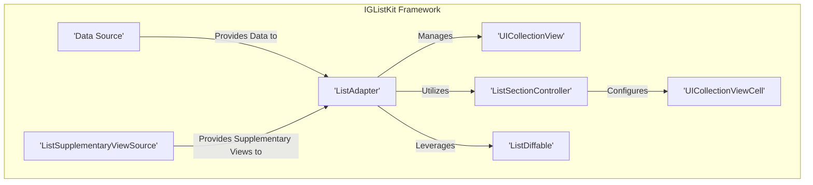
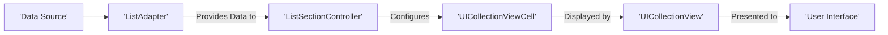

# Project Design Document: IGListKit (Improved)

**1. Introduction**

This document provides an enhanced design overview of IGListKit, an open-source framework by Instagram for constructing high-performance and adaptable list and collection views on iOS. The purpose of this document is to offer a thorough understanding of the framework's architecture, individual components, and the flow of data within it. This detailed information is essential for conducting effective threat modeling.

**2. Goals and Objectives**

IGListKit is designed with the following primary objectives:

* **Optimized Performance:** To enable the creation of fluid and responsive scrolling experiences, even when dealing with substantial and intricate datasets.
* **Enhanced Flexibility:** To offer a modular and extensible architecture, empowering developers to readily customize and adapt list layouts and behaviors to specific needs.
* **Simplified Development Process:** To provide a declarative approach to managing lists, thereby minimizing boilerplate code and enhancing the maintainability of the codebase.
* **Promotion of Code Reusability:** To encourage the development of reusable components for displaying diverse data types within lists, fostering efficiency.
* **Decoupling of Data and Presentation:** To separate the underlying data model from the logic governing its presentation, resulting in cleaner, more testable, and maintainable code.

**3. High-Level Architecture**

The architecture of IGListKit is centered around several core components that collaborate to manage the presentation of data within a `UICollectionView`.

* **ListAdapter:** The central orchestrator, responsible for managing the `UICollectionView`. It serves as both the data source and delegate for the collection view.
* **UICollectionView:** The fundamental UIKit component used for displaying the list of items. IGListKit leverages its robust layout capabilities.
* **ListSectionController:** A crucial abstraction that encapsulates the logic for displaying a specific section of data. It defines how to instantiate, configure, and update cells within its designated section.
* **UICollectionViewCell:** The standard UIKit view employed to display individual items within the collection view.
* **ListDiffable:** A protocol that data model objects must conform to. It provides methods for determining the unique identity and equality of objects, enabling efficient and precise updates to the collection view.
* **Data Source:** The external origin of the data to be displayed in the list. This can be an array, data retrieved from a network, or any other suitable data structure.
* **ListSupplementaryViewSource:** An optional component used by the `ListAdapter` to manage supplementary views like headers and footers for sections.

**4. Detailed Design**

This section provides a more in-depth look at the key components and their interactions.

* **ListAdapter:**
    * **Responsibilities:**
        * Implements the `UICollectionViewDataSource` and `UICollectionViewDelegate` protocols.
        * Maintains an ordered collection of `ListSectionController` instances.
        * Executes the diffing process to calculate the minimal set of updates required when the underlying data changes.
        * Applies these calculated updates to the `UICollectionView` using batch updates for optimal performance.
        * Offers methods for inserting, deleting, and moving individual items and entire sections within the collection view.
        * Manages supplementary views (headers and footers) through the `ListSupplementaryViewSource` protocol.
    * **Key Methods:**
        * `initWithUpdater:viewController:`: Initializes the `ListAdapter` with an updater instance and a view controller.
        * `reloadData(completion:)`: Forces a full reload of the data displayed in the collection view.
        * `performUpdatesAnimated:completion:`: Executes animated updates to the collection view based on detected data changes.
        * `sectionControllerForSection:`: Retrieves the appropriate `ListSectionController` instance for a given section index.
    * **Security Considerations:**
        * **Denial of Service:**  Potential vulnerability if the diffing algorithm is targeted with maliciously crafted data that leads to excessive computational load, potentially freezing the UI. Mitigation: Implement timeouts or resource limits on the diffing process.
        * **UI Inconsistency:** Improper handling of data source updates or errors during the update process could result in an inconsistent UI state, potentially displaying incorrect or stale information. Mitigation: Implement robust error handling and state management within the data update logic.

* **ListSectionController:**
    * **Responsibilities:**
        * Manages the presentation of a specific segment of data within the collection view.
        * Provides the count of items within its designated section.
        * Creates and configures instances of `UICollectionViewCell` to represent the items in its section.
        * Handles user interaction events such as item selection and deselection within its section.
        * Can optionally provide the size for each individual item within its section, allowing for dynamic layouts.
        * Can optionally provide supplementary views (e.g., section headers or footers) for its section.
    * **Key Methods:**
        * `numberOfItems`: Returns the total number of items managed by the section controller.
        * `sizeForItemAtIndex:`: Determines and returns the size of the item at a specific index within the section.
        * `cellForItemAtIndex:`: Creates and configures the `UICollectionViewCell` instance for the item at a given index.
        * `didUpdateToObject:`: Called when the data object associated with the section controller is updated, allowing for UI adjustments.
        * `didSelectItemAtIndex:`: Called when a user selects an item at a specific index within the section.
    * **Security Considerations:**
        * **Malicious Content Display:** Vulnerabilities in the cell configuration logic could be exploited to display incorrect, misleading, or even malicious content to the user. Mitigation: Implement strict input validation and sanitization when configuring cell content. Avoid directly displaying untrusted data without proper encoding.
        * **Unexpected Behavior on Interaction:** Improper handling of user interaction events (e.g., `didSelectItemAtIndex:`) could lead to unexpected application behavior or even security breaches if actions are performed based on manipulated data. Mitigation: Validate user input and the state of the application before performing any sensitive actions based on user interactions.

* **UICollectionViewCell:**
    * **Responsibilities:**
        * Responsible for visually presenting the content of a single item within the list or collection.
        * Can contain a hierarchy of subviews to display various types of data (text, images, etc.).
        * Should be designed to efficiently update its content when the underlying data changes to ensure smooth transitions.
    * **Key Methods:**
        * `prepareForReuse()`: Called by the `UICollectionView` when the cell is about to be reused, providing an opportunity to reset its state and avoid displaying stale data.
        * Custom methods for configuring the cell's subviews with the appropriate data.
    * **Security Considerations:**
        * **Cross-Site Scripting (XSS) Potential:** If displaying web content within the cell (e.g., using a `UIWebView` or `WKWebView`) and proper input sanitization is not performed on the data being displayed, it could be vulnerable to XSS attacks. Mitigation: Sanitize all untrusted data before displaying it in web views. Consider using `WKWebView` and its security features.
        * **Memory Leaks:** Failure to properly release resources (e.g., timers, observers) within the cell when it is reused can lead to memory leaks, potentially impacting application performance and stability. Mitigation: Ensure proper resource management within the `prepareForReuse()` method and when the cell is deallocated.

* **ListDiffable:**
    * **Responsibilities:**
        * Provides the mechanism for IGListKit to efficiently identify and compare data objects to determine the minimal updates required for the `UICollectionView`.
        * Requires conforming objects to implement two key methods: `diffIdentifier` (to return a unique identifier for the object) and `isEqualToDiffableObject:` (to determine if two objects represent the same data).
    * **Key Methods:**
        * `diffIdentifier`: Returns a stable and unique identifier for the data object.
        * `isEqualToDiffableObject:`: Compares the object to another `ListDiffable` object and returns `true` if they represent the same data, `false` otherwise.
    * **Security Considerations:**
        * **Incorrect Diffing and UI Inconsistencies:** An incorrect or flawed implementation of `diffIdentifier` or `isEqualToDiffableObject:` can lead to incorrect diffing results, causing the `UICollectionView` to display outdated, duplicated, or missing data. Mitigation: Thoroughly test the implementation of these methods to ensure they accurately reflect the identity and equality of the data objects.

**5. Data Flow**

The typical flow of data within an IGListKit implementation can be visualized as follows:

1. **Data Provision:** The external `Data Source` provides the raw data to the `ListAdapter`.
2. **Section Mapping:** The `ListAdapter` analyzes the provided data and determines which `ListSectionController` is responsible for managing each section of the collection view.
3. **Cell Configuration:** Each `ListSectionController` instantiates and configures `UICollectionViewCell` instances based on the data within its assigned section.
4. **Display in Collection View:** The configured `UICollectionViewCell` instances are then managed and displayed by the `UICollectionView`.
5. **User Interface Presentation:** Finally, the `UICollectionView` renders the list of cells, presenting the data to the user through the application's `User Interface`.
6. **Updates:** When the underlying data changes, the `ListAdapter` utilizes the `ListDiffable` protocol to perform a diffing operation, calculating the necessary updates. These updates are then efficiently applied to the `UICollectionView`.

**6. Security Considerations (Comprehensive)**

This section expands on the security considerations when using IGListKit:

* **Data Integrity:**  It's crucial to ensure that the data displayed to the user has not been tampered with during its journey from the data source. Implement mechanisms for verifying data integrity, such as checksums or digital signatures, especially when dealing with data from untrusted sources.
* **Data Privacy:** When displaying sensitive user information, adhere to privacy best practices. Ensure data is encrypted in transit and at rest, and that only authorized users can access it. Avoid displaying sensitive data unnecessarily and consider using techniques like data masking or redaction when appropriate.
* **Input Validation and Sanitization:** Even though IGListKit primarily focuses on displaying data, if the cells contain interactive elements that accept user input (e.g., text fields within a cell), rigorous input validation and sanitization are essential to prevent injection attacks (like SQL injection or cross-site scripting if displaying web content).
* **Dependency Management:** Regularly update the IGListKit dependency to benefit from the latest security patches and bug fixes. Outdated dependencies can introduce known vulnerabilities into your application. Utilize dependency management tools to track and update dependencies efficiently.
* **Third-Party Integrations:** Exercise caution when integrating IGListKit with other third-party libraries or frameworks. Thoroughly vet these integrations for potential security vulnerabilities and ensure they follow secure coding practices. Be aware of the transitive dependencies introduced by these integrations.
* **Error Handling and Logging:** Implement robust error handling throughout the IGListKit implementation. Avoid displaying sensitive error information to the user. Log errors securely for debugging and monitoring purposes.
* **Rate Limiting:** If the data displayed by IGListKit is fetched from an external API, consider implementing rate limiting to prevent abuse and denial-of-service attacks against your application or the external service.
* **Secure Data Storage:** If data displayed by IGListKit is cached or stored locally, ensure it is stored securely using appropriate encryption methods. Avoid storing sensitive data in plain text.

**7. Assumptions and Constraints**

* We assume that the underlying data source is generally reliable and provides accurate data. However, security measures should still be in place to handle potentially malicious or corrupted data.
* It is assumed that developers utilizing IGListKit possess a foundational understanding of iOS development principles and the `UICollectionView` framework.
* The performance characteristics of IGListKit are influenced by the efficiency of the `ListDiffable` implementation for the data models and the complexity of the layouts defined for the `UICollectionViewCell` instances.
* This design document focuses on the core IGListKit framework. Security considerations for the application as a whole, including network communication and backend services, are outside the scope of this document.

**8. Future Considerations**

* Potential optimizations to the diffing algorithm to further enhance performance, especially for very large datasets or complex data structures.
* Exploration of new layout strategies and features to provide even greater flexibility in designing list and collection view interfaces.
* Improvements to the API to simplify common use cases and reduce the amount of boilerplate code required for certain implementations.
* Investigation into integrating accessibility features more deeply into the framework to ensure applications built with IGListKit are accessible to all users.

This improved design document provides a more detailed and security-focused overview of IGListKit. This enhanced understanding is crucial for identifying and mitigating potential security risks during the threat modeling process.
