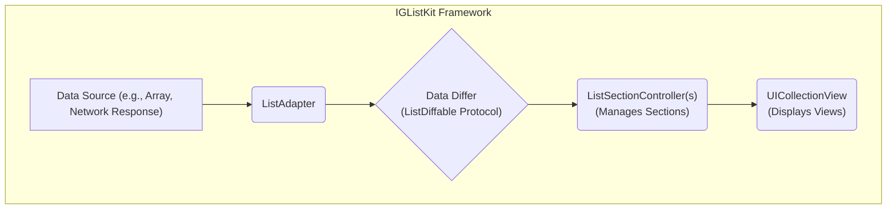
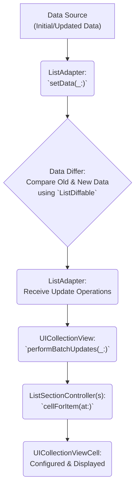

# Project Design Document: IGListKit

**Version:** 1.1
**Date:** October 26, 2023
**Author:** AI Software Architect

## 1. Introduction

This document provides an enhanced and more detailed design overview of IGListKit, an open-source iOS framework developed by Instagram for building performant and flexible lists and collections. This revised document aims to provide a clearer and more comprehensive articulation of the architecture, components, and data flow within IGListKit, specifically tailored for serving as a robust foundation for subsequent threat modeling activities.

## 2. Project Overview

IGListKit is a sophisticated data-driven UICollectionView framework designed for crafting highly performant and adaptable lists. Its core strength lies in enforcing a strong separation of concerns through key abstractions like `ListAdapter`, `ListSectionController`, and the `ListDiffable` protocol. This architecture empowers developers to manage data updates and cell rendering with exceptional efficiency, leading to smoother user experiences and more maintainable code. The framework effectively abstracts away much of the inherent complexity of directly working with `UICollectionView`, offering a more declarative and streamlined approach to constructing list-based user interfaces.

## 3. Goals

* **Enhanced Performance:** Facilitate the creation of fluid and responsive lists, even when dealing with substantial and frequently changing datasets. This is achieved through efficient diffing and targeted UI updates.
* **Superior Flexibility:**  Enable the seamless integration of diverse cell layouts, view types, and content structures within a single list, catering to a wide range of UI requirements.
* **Improved Maintainability:** Foster a cleaner, more organized, and modular codebase through its component-based architecture, making it easier to understand, debug, and extend.
* **Increased Testability:**  Simplify the process of writing unit tests for individual components responsible for data presentation logic and update mechanisms, leading to more robust applications.
* **Declarative Data Management:** Emphasize a data-centric approach where changes to the underlying data are automatically and efficiently reflected in the user interface, reducing manual UI manipulation.

## 4. Target Audience

This document is specifically intended for:

* Security engineers tasked with performing threat modeling on applications that leverage IGListKit.
* Software developers involved in the integration, customization, or extension of IGListKit.
* Software architects seeking a deep understanding of the framework's internal mechanisms and design principles.

## 5. High-Level Architecture

IGListKit's architecture is built around a set of interconnected components that orchestrate the display of data within a `UICollectionView`. The core principle is to decouple data management from view presentation.

* **Data Source:** Represents the origin of the data to be presented in the list. This can be a local array of model objects, data retrieved from a network API, or results from a database query. The data should ideally conform to the principles of immutability for optimal diffing.
* **ListAdapter:**  The central coordinator and orchestrator of the IGListKit system. It acts as both the data source and delegate for the underlying `UICollectionView`. Crucially, it manages the mapping between the provided data and the specific `ListSectionController` instances responsible for rendering different parts of the list.
* **Data Differ (ListDiffable Protocol):**  IGListKit employs an efficient diffing algorithm to calculate the precise differences between two versions of the data. This is achieved through the `ListDiffable` protocol, which requires data model objects to provide a unique identifier and a mechanism for content comparison.
* **ListSectionController(s):**  Each `ListSectionController` is responsible for managing a distinct section within the `UICollectionView`. It defines the data items within its section, handles the creation and configuration of the corresponding cells (and supplementary views like headers/footers), and can manage user interactions specific to its section.
* **UICollectionView:** The fundamental UIKit view component that provides the underlying infrastructure for displaying the ordered collection of items on the screen. IGListKit leverages its capabilities for layout, scrolling, and cell reuse.

## 6. Component Details

This section provides a more granular examination of the key components within IGListKit, highlighting their responsibilities and interactions.

* **ListAdapter:**
    * **Responsibilities:**
        * Serves as the intermediary between the data source and the `UICollectionView`, implementing the `UICollectionViewDataSource` and `UICollectionViewDelegate` protocols.
        * Maintains an ordered collection of `ListSectionController` instances, each responsible for a portion of the displayed data.
        * Receives updates to the underlying data and initiates the diffing process to determine the changes.
        * Applies the calculated updates to the `UICollectionView` in an efficient batch operation, minimizing UI redraws.
        * Manages the lifecycle of cells, including dequeueing, configuring, and recycling them.
    * **Key Interactions:**
        * Accepts data updates from the Data Source.
        * Delegates the calculation of data differences to the Data Differ.
        * Queries `ListSectionController` instances for the number of items and the corresponding cells for specific indices.
        * Instructs the `UICollectionView` to perform updates (insertions, deletions, moves, reloads).

* **ListSectionController:**
    * **Responsibilities:**
        * Encapsulates the logic for managing a specific visual section within the `UICollectionView`.
        * Determines the number of items to display within its section based on the provided data.
        * Creates and configures the appropriate `UICollectionViewCell` instances for each item in its section. This often involves mapping data model properties to cell content.
        * Optionally handles user interactions occurring within its section, such as cell taps or button presses.
        * Can provide supplementary views like headers and footers for its section.
    * **Key Interactions:**
        * Receives a subset of the overall data relevant to its section from the `ListAdapter`.
        * Creates instances of specific `UICollectionViewCell` subclasses.
        * Binds data to the properties of the cells it manages.
        * May communicate user interaction events back to other parts of the application (often through delegation or closures).

* **Data Differ (Utilizing the `ListDiffable` Protocol):**
    * **Responsibilities:**
        * Implements an efficient algorithm (typically based on the Myers diff algorithm) to compare two collections of objects conforming to the `ListDiffable` protocol.
        * Computes the minimal set of changes (insertions, deletions, moves, and updates) required to transform the old data collection into the new one.
        * Provides these calculated update operations to the `ListAdapter` for application to the `UICollectionView`.
    * **Key Interactions:**
        * Receives the previous and current data collections from the `ListAdapter`.
        * Iterates through the collections, utilizing the `diffIdentifier()` and `isEqualTo(object:)` methods of `ListDiffable` conforming objects for comparison.
        * Returns a structured representation of the detected changes to the `ListAdapter`.

* **`ListDiffable` Protocol:**
    * **Responsibilities:**
        * Defines the contract that data model objects must adhere to in order to be efficiently diffed by IGListKit.
        * Mandates the implementation of the `diffIdentifier()` method, which must return a stable and unique identifier for each object. This is crucial for tracking objects across data updates.
        * Optionally requires the implementation of the `isEqualTo(object:)` method, allowing for a more granular comparison of the content of two objects with the same identifier, enabling efficient updates of individual cell content.
    * **Key Interactions:**
        * The Data Differ invokes `diffIdentifier()` and `isEqualTo(object:)` on objects conforming to this protocol during the comparison process.

* **`UICollectionView`:**
    * **Responsibilities:**
        * The foundational UIKit view responsible for the visual presentation and layout of the ordered collection of items.
        * Manages scrolling behavior, cell layout, and the efficient reuse of cell views to optimize performance.
    * **Key Interactions:**
        * Receives instructions from the `ListAdapter` regarding data updates (insertions, deletions, moves, reloads).
        * Requests cell instances from the `ListAdapter` (which in turn delegates to `ListSectionController` instances).
        * Displays the configured cells on the screen according to its layout.

## 7. Data Flow

The typical flow of data within an IGListKit implementation can be visualized as follows:

1. **Data Source Provides Data:** The data source, holding either the initial data or updated data, provides this information to the `ListAdapter`.
2. **ListAdapter Receives Data:** The `ListAdapter`'s `setData(_:)` method is invoked, receiving the new data.
3. **Data Differ Calculates Differences:** The `ListAdapter` utilizes the Data Differ to compare the previously held data with the newly provided data, leveraging the `ListDiffable` protocol for object comparison.
4. **ListAdapter Receives Update Operations:** The Data Differ returns a set of update operations (insertions, deletions, moves, updates) to the `ListAdapter`.
5. **UICollectionView Performs Batch Updates:** The `ListAdapter` calls the `performBatchUpdates(_:)` method on the `UICollectionView`, providing the calculated update operations for efficient UI modification.
6. **ListSectionControllers Configure Cells:**  The `UICollectionView`, in response to the batch updates, requests cells for specific indices. The `ListAdapter` delegates these requests to the appropriate `ListSectionController` instances, which then configure and return the corresponding `UICollectionViewCell` instances.
7. **UI Displays Configured Cells:** The `UICollectionView` renders the updated list on the screen, displaying the configured cells.

## 8. Security Considerations (For Subsequent Threat Modeling)

While IGListKit primarily manages the presentation layer, it interacts closely with application data, making certain security considerations relevant for future threat modeling:

* **Data Source Integrity:**  The trustworthiness of the data source is paramount. If the data source is compromised and provides malicious or incorrect data, IGListKit will faithfully display it. This highlights the importance of securing the data origin and any intermediaries.
* **Input Validation and Sanitization:** Even though IGListKit doesn't directly handle user input events in the traditional sense of form submissions, the data it displays often originates from external sources (e.g., APIs, databases). Thorough validation and sanitization of this data *before* it's presented to IGListKit is crucial to prevent issues like cross-site scripting (if the displayed data includes web content), injection attacks (if the data is used in subsequent queries), or unexpected UI behavior leading to potential exploits.
* **Denial of Service Vulnerabilities:**  Carefully consider the potential for maliciously crafted data updates to overwhelm the diffing algorithm or cell rendering logic, potentially leading to performance degradation or application crashes. Large or excessively complex data changes could be exploited for denial-of-service attacks.
* **Information Disclosure Risks:** Ensure that sensitive information is not unintentionally exposed through the displayed data, error messages generated during data processing, or through debugging information inadvertently left in production builds.
* **Dependency Chain Security:**  As with any software, IGListKit relies on its own dependencies (primarily Foundation and UIKit). Vulnerabilities in these underlying frameworks could indirectly impact applications using IGListKit. Regularly updating dependencies and being aware of reported vulnerabilities is essential.
* **Custom `ListSectionController` Logic:**  Developers often implement custom logic within their `ListSectionController` subclasses. Security vulnerabilities could be introduced within this custom code, particularly if it handles user input or interacts with sensitive data. Thorough review and testing of custom `ListSectionController` implementations are necessary.

## 9. Dependencies

IGListKit has direct dependencies on the following core iOS frameworks:

* **Foundation:** Provides fundamental utility classes, data structures, and operating system services.
* **UIKit:** The essential framework for building graphical, event-driven applications on iOS, including UI elements like `UICollectionView`.

## 10. Deployment

IGListKit is typically integrated into iOS development projects using popular dependency management tools:

* **CocoaPods:** A widely used dependency manager for Swift and Objective-C projects, simplifying the integration of third-party libraries.
* **Swift Package Manager (SPM):** Apple's native dependency management tool, increasingly adopted for managing project dependencies.

Alternatively, developers can opt for manual integration by directly incorporating the source files into their Xcode project.

## 11. Future Considerations

This design document reflects the current architecture and understanding of IGListKit. The framework is actively maintained, and future enhancements or modifications may necessitate updates to this document. Potential areas for future development or consideration include:

* Further refinements to the diffing algorithm to optimize performance for extremely large and complex datasets or scenarios with frequent updates.
* Enhanced mechanisms for handling asynchronous data loading and display, improving responsiveness when fetching data from network sources.
* More advanced and flexible layout options beyond the standard `UICollectionViewLayout`, potentially offering more declarative layout configurations.
* Improved tools and APIs for debugging and inspecting the state of IGListKit components during development.

This revised document offers a more in-depth and nuanced understanding of IGListKit's architecture and its constituent components. It serves as a valuable and more detailed resource for security engineers preparing for threat modeling and for developers seeking a comprehensive understanding of the framework.