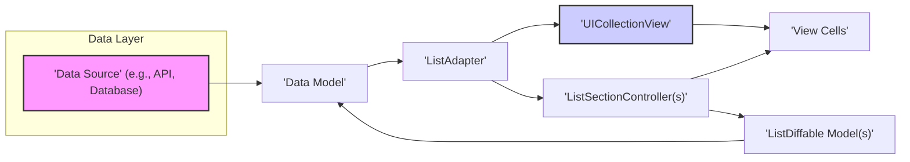

## Project Design Document: IGListKit Integration and Usage (Improved)

**1. Introduction**

This document provides an enhanced design specification for a system or component leveraging the IGListKit framework (available at [https://github.com/instagram/iglistkit](https://github.com/instagram/iglistkit)) to construct efficient and adaptable list-based user interfaces on iOS. This detailed design will serve as the foundation for subsequent threat modeling exercises.

**2. Project Overview**

This project centers on integrating IGListKit within an iOS application to effectively manage and present dynamic data lists. The primary advantage of employing IGListKit lies in its sophisticated diffing algorithm, which enables highly performant updates to `UICollectionView` layouts based on underlying data modifications. This minimizes unnecessary UI redraws, leading to a smoother user experience. This design document emphasizes the architectural aspects of IGListKit's integration, including detailed data flow, component interactions, and a strengthened focus on security considerations.

**3. Goals and Objectives**

*   **High-Performance List Rendering:**  Maximize the efficiency of list updates by utilizing IGListKit's intelligent diffing capabilities, ensuring a responsive user interface.
*   **Modular and Maintainable List Logic:** Structure the list view implementation using IGListKit's core components (`ListAdapter`, `ListSectionController`, etc.) to enhance code organization, promote reusability, and simplify maintenance.
*   **Explicit Data Flow Definition:** Establish a clear and traceable path for data as it moves from its origin to the displayed list view, facilitating debugging and security analysis.
*   **Comprehensive Security Posture:** Proactively identify and address potential security vulnerabilities arising from the use of IGListKit and its interactions with other application components.

**4. Architecture and Design**

The following diagram illustrates the refined high-level architecture of a typical IGListKit integration, emphasizing data flow and component relationships:

**4.1. Component Descriptions (Detailed)**

*   **Data Source:** The origin of the data displayed in the list. This can be a remote API endpoint, a local database (e.g., SQLite, Realm), in-memory data structures, or any other data persistence or retrieval mechanism. Crucially, this is where external or potentially untrusted data enters the system.
*   **Data Model:**  Plain Swift objects representing the structured data retrieved from the **Data Source**. These models should strictly conform to the `ListDiffable` protocol, providing the necessary methods for IGListKit's diffing algorithm. These models act as an intermediary, potentially sanitizing or transforming raw data.
*   **ListAdapter:** The central orchestrator of IGListKit. It serves as both the data source and delegate for the `UICollectionView`. It manages the lifecycle of `ListSectionController` instances, receives data updates, performs the core diffing logic to determine changes, and instructs the `UICollectionView` on how to update its display. This component is critical for performance and data integrity within the list view.
*   **UICollectionView:** The standard and powerful iOS component responsible for displaying ordered collections of data. IGListKit builds upon `UICollectionView`, providing a more structured and efficient way to manage its data and updates.
*   **ListSectionController:**  A modular unit responsible for managing a distinct section within the `UICollectionView`. Each `ListSectionController` defines how the data within its section is presented, including the types of cells used and how they are configured. This promotes separation of concerns and allows for different visual representations within the same list.
*   **ListDiffable Model:**  Specifically, instances of the **Data Model** that conform to the `ListDiffable` protocol. This protocol mandates the implementation of `diffIdentifier()` (providing a unique identifier for each item) and `isEqualTo(object:)` (defining how to compare two items for equality). These methods are fundamental for IGListKit's efficient diffing process.
*   **View Cells:** Custom subclasses of `UICollectionViewCell` responsible for the visual rendering of individual data items. They receive data from the `ListSectionController` and display it to the user. Security vulnerabilities can arise if cell configuration doesn't properly handle potentially malicious data.

**4.2. Data Flow (Enhanced)**

1. **Data Retrieval & Initial Validation:** The application initiates a request to the **Data Source** to fetch data. Upon receiving the raw data, an initial validation step should occur to check for basic integrity and format correctness.
2. **Data Model Instantiation & Sanitization:** The retrieved data is then mapped into instances of the **Data Model**. This stage is crucial for sanitizing and transforming the raw data into a format suitable for display. Input validation and escaping should be performed here to prevent issues like cross-site scripting (XSS) if the data originates from a web source.
3. **ListAdapter Update Initiation:** The updated array of **Data Model** objects is passed to the **ListAdapter**. This triggers the update process.
4. **Diffing Algorithm Execution:** The **ListAdapter** utilizes the `diffIdentifier()` and `isEqualTo(object:)` methods of the **ListDiffable Model** objects to calculate the precise differences (insertions, deletions, moves, updates) between the previous and current data sets.
5. **Section Controller Assignment:** The **ListAdapter** determines which **ListSectionController** instances are responsible for managing the display of each data item based on the updated data.
6. **View Cell Preparation & Configuration:** Each relevant **ListSectionController** dequeues appropriate **View Cells** from the `UICollectionView` and configures them with the data from the corresponding **ListDiffable Model**. Care must be taken here to ensure that cell configuration logic is secure and doesn't introduce vulnerabilities.
7. **Batched UI Update:** The **ListAdapter** instructs the **UICollectionView** to perform a batch update based on the calculated differences. This ensures efficient and animated updates to the user interface.

**4.3. Interactions (Detailed)**

*   The **Data Source** initiates a response by providing data to the application, potentially in response to a request.
*   The application creates and populates **Data Model** objects based on the data received from the **Data Source**.
*   The **ListAdapter** receives the updated array of **Data Model** objects, triggering the diffing process.
*   The **ListAdapter** dynamically creates, updates, or destroys **ListSectionController** instances as needed based on the data changes.
*   Each **ListSectionController** is responsible for a specific subset of the data and manages the presentation of that data.
*   Each **ListSectionController** requests **View Cells** from the `UICollectionView` for displaying its data.
*   Each **ListSectionController** configures the retrieved **View Cells** with the relevant data from the **ListDiffable Model**.
*   The **UICollectionView** renders the configured **View Cells** on the screen.
*   User interactions with the **UICollectionView** (e.g., scrolling, tapping, swiping) are handled by the application and may trigger actions that lead to new data being fetched or the existing data being modified, restarting the data flow.

**5. Security Considerations (Expanded)**

Integrating IGListKit introduces several security considerations that require careful attention:

*   **Data Integrity and Validation at the Source:**
    *   **Threat:** Malicious or corrupted data from the **Data Source** could lead to application crashes, incorrect data display, or even remote code execution if not properly handled.
    *   **Mitigation:** Implement robust input validation and sanitization on all data received from the **Data Source**. Use secure communication protocols (HTTPS) to prevent man-in-the-middle attacks that could alter data in transit. Verify data schemas and formats.
*   **Data Model Security:**
    *   **Threat:** If **Data Model** objects are not immutable or if their properties can be modified unexpectedly, it could lead to inconsistent state and potential vulnerabilities.
    *   **Mitigation:** Design **Data Model** objects to be immutable where possible. Implement proper access control and encapsulation to prevent unauthorized modification of data.
*   **ListAdapter Vulnerabilities:**
    *   **Threat:** While IGListKit handles diffing efficiently, vulnerabilities could arise if the `diffIdentifier()` or `isEqualTo(object:)` methods in **ListDiffable Model** are implemented incorrectly, potentially leading to incorrect UI updates or crashes.
    *   **Mitigation:** Thoroughly test the implementation of `diffIdentifier()` and `isEqualTo(object:)` to ensure they accurately reflect the identity and equality of data items.
*   **ListSectionController Security:**
    *   **Threat:** If **ListSectionController** logic is flawed, it could lead to incorrect cell configuration, potentially displaying sensitive information in unintended ways or creating opportunities for UI spoofing.
    *   **Mitigation:** Carefully review the logic within **ListSectionController** instances, especially the cell configuration code. Ensure that data is correctly mapped to cell properties and that no sensitive information is inadvertently exposed.
*   **View Cell Security:**
    *   **Threat:** **View Cells** are responsible for rendering data. If they don't properly handle potentially malicious data (e.g., unescaped HTML, long strings), it could lead to UI injection attacks or denial-of-service conditions.
    *   **Mitigation:** Implement secure coding practices within **View Cells**. Sanitize and escape any user-provided data before displaying it. Set appropriate limits on the size and complexity of data displayed in cells. Be cautious when using web views within cells and ensure proper sandboxing.
*   **Denial of Service (DoS) through Data Manipulation:**
    *   **Threat:** An attacker could potentially provide a large or maliciously crafted data set to the **Data Source** that, when processed by IGListKit, consumes excessive resources (CPU, memory), leading to a denial of service.
    *   **Mitigation:** Implement rate limiting and request throttling on the **Data Source**. Set reasonable limits on the amount of data fetched and displayed. Monitor application performance and resource usage.
*   **Memory Management and Resource Leaks:**
    *   **Threat:** Improper memory management within **ListSectionController** or **View Cells** can lead to memory leaks, potentially causing application instability or crashes, which could be exploited.
    *   **Mitigation:** Utilize strong ownership semantics (e.g., `weak`, `unowned`) to prevent retain cycles. Employ memory profiling tools to identify and fix memory leaks.
*   **Side-Channel Information Leakage:**
    *   **Threat:**  The timing of UI updates or the specific cells being rendered could potentially leak information about the underlying data.
    *   **Mitigation:** While difficult to completely eliminate, be aware of this potential and avoid exposing highly sensitive information in ways that could be inferred from UI behavior.

**6. Deployment Considerations**

*   IGListKit is typically integrated into an iOS application using dependency management tools such as CocoaPods or Swift Package Manager. Ensure that the chosen method is secure and that dependencies are managed responsibly.
*   Thorough performance testing is crucial, especially with large and complex data sets, to ensure that IGListKit's diffing and rendering processes perform efficiently on target devices.
*   Consider the impact of the IGListKit framework size on the overall application binary size.

**7. Future Considerations**

*   Explore advanced IGListKit features like working range support to further optimize data loading and display performance, especially for very long lists.
*   Investigate the use of supplementary views and decorations within the `UICollectionView` managed by IGListKit to enhance the visual presentation of lists.
*   Consider integrating IGListKit with modern architectural patterns like MVVM, VIPER, or TCA to improve code organization, testability, and maintainability. This can also help in isolating and securing different parts of the application.

This enhanced design document provides a more detailed and security-focused overview of the IGListKit integration. This information is essential for conducting a comprehensive threat model to identify and mitigate potential security risks associated with this implementation.