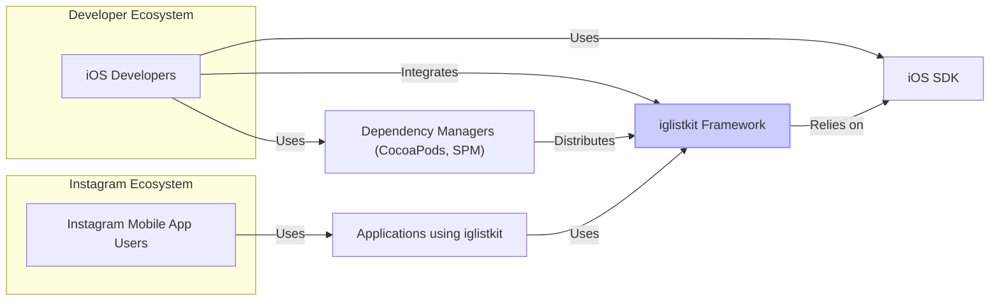
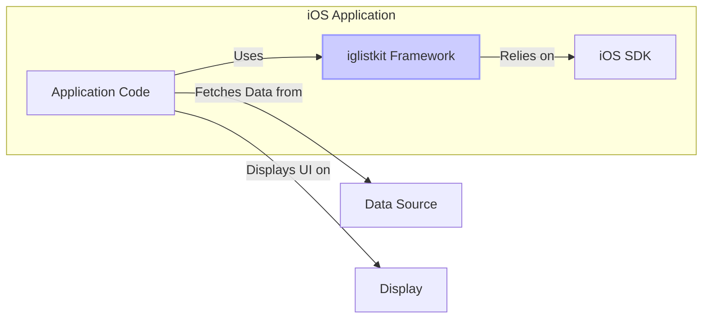
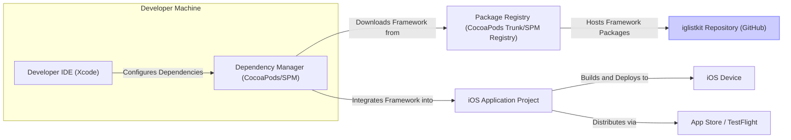
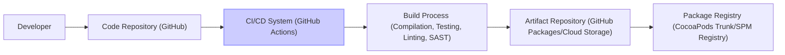

# BUSINESS POSTURE

- Business Priorities and Goals:
  - Goal: Provide a reusable, efficient, and flexible framework for building lists and collections in iOS applications.
  - Priority: Performance and developer productivity. The framework aims to simplify the development of complex lists while maintaining high performance, especially for applications with large datasets and frequent updates. This leads to improved user experience in applications that adopt the framework.

- Business Risks:
  - Business Risk: Adoption risk. If the framework is difficult to use, poorly documented, or has significant bugs, developers may not adopt it, reducing its impact and value.
  - Business Risk: Performance regressions. If updates to the framework introduce performance issues, applications using it could suffer, negatively impacting user experience.
  - Business Risk: Security vulnerabilities in the framework could be inherited by applications using it, potentially leading to data breaches or other security incidents in those applications.
  - Business Risk: Dependency risk. Applications become dependent on this framework, and any issues with its maintenance or future availability could impact those applications.

# SECURITY POSTURE

- Existing Security Controls:
  - security control: Code Reviews. The project is open source and hosted on GitHub, suggesting that code reviews are likely part of the development process, although not explicitly stated. Location: GitHub repository history and pull request discussions (inferred).
  - security control: Static Analysis. It's common practice in software development to use static analysis tools, although there is no explicit mention in the repository. Location: Potentially integrated into CI/CD pipelines (inferred).
  - security control: Unit and Integration Testing. The repository likely includes unit and integration tests to ensure code quality and functionality. Location: Test directories within the GitHub repository (inferred).
  - security control: Open Source. Being open source allows for community scrutiny and identification of potential vulnerabilities. Location: GitHub repository.
  - accepted risk: Reliance on community contributions for security vulnerability identification and patching. The project's security posture is partly dependent on the active open-source community to identify and report vulnerabilities.
  - accepted risk: Dependency on underlying iOS platform security. The framework relies on the security features and robustness of the iOS operating system and SDK.

- Recommended Security Controls:
  - security control: Automated Security Scanning. Implement automated security scanning tools (SAST, DAST, dependency scanning) in the CI/CD pipeline to proactively identify vulnerabilities in the framework code and its dependencies.
  - security control: Security focused code reviews. Emphasize security considerations during code reviews, specifically looking for common vulnerabilities (e.g., input validation issues, memory safety problems).
  - security control: Vulnerability Disclosure Policy. Establish a clear vulnerability disclosure policy to provide a channel for security researchers to report vulnerabilities responsibly.
  - security control: Security testing as part of CI/CD. Integrate security testing (e.g., fuzzing, penetration testing) into the CI/CD pipeline to ensure ongoing security assessment.

- Security Requirements:
  - Authentication: Not directly applicable to a framework. Authentication is handled by the applications that use this framework.
  - Authorization: Not directly applicable to a framework. Authorization is handled by the applications that use this framework.
  - Input Validation: The framework should perform input validation to prevent unexpected behavior or crashes due to invalid or malformed data passed to its APIs. This is crucial for robustness and can indirectly contribute to security by preventing denial-of-service or other unexpected issues. Location: Within the framework's code, specifically in methods that accept external input.
  - Cryptography:  The framework itself is unlikely to require cryptography directly. However, if it handles or processes any sensitive data (even indirectly), appropriate cryptographic measures should be considered.  It's more likely that applications using the framework will handle cryptography.

# DESIGN

## C4 CONTEXT

- Context Diagram Elements:
  - - Name: Instagram Mobile App Users
    - Type: Person
    - Description: End users of the Instagram mobile application who interact with lists and collections powered by `iglistkit`.
    - Responsibilities: Use the Instagram application to view content presented in lists and collections.
    - Security controls: Application level security controls within the Instagram mobile application (authentication, authorization, data protection).
  - - Name: iOS Developers
    - Type: Person
    - Description: Software developers who use the `iglistkit` framework to build iOS applications, including Instagram developers and potentially external developers.
    - Responsibilities: Integrate `iglistkit` into their iOS projects, develop and maintain applications using the framework.
    - Security controls: Secure development practices, code reviews, dependency management.
  - - Name: iglistkit Framework
    - Type: Software System
    - Description: An open-source iOS framework for building performant and flexible lists and collections. It provides abstractions and utilities to simplify the development of complex list-based user interfaces.
    - Responsibilities: Provide reusable components and utilities for efficient list rendering and data management in iOS applications.
    - Security controls: Input validation within the framework, secure coding practices during development, static analysis, vulnerability scanning (recommended).
  - - Name: iOS SDK
    - Type: Software System
    - Description: Apple's Software Development Kit for iOS, providing APIs and tools necessary to build iOS applications. `iglistkit` is built on top of the iOS SDK.
    - Responsibilities: Provide core functionalities and APIs for iOS application development, including UI components, networking, and system services.
    - Security controls: Security controls implemented by Apple within the iOS SDK and operating system.
  - - Name: Dependency Managers (CocoaPods, SPM)
    - Type: Software System
    - Description: Tools like CocoaPods and Swift Package Manager used to manage dependencies in iOS projects. `iglistkit` can be distributed and integrated into projects using these tools.
    - Responsibilities: Package and distribute libraries and frameworks, manage project dependencies.
    - Security controls: Package integrity checks by dependency managers, security of package repositories (e.g., CocoaPods trunk, Swift Package Registry).
  - - Name: Applications using iglistkit
    - Type: Software System
    - Description: iOS applications (including Instagram and potentially third-party apps) that integrate and utilize the `iglistkit` framework to build their list-based UI components.
    - Responsibilities: Deliver application functionality to end-users, manage application-specific data and security.
    - Security controls: Application-level security controls (authentication, authorization, data protection, input validation, secure communication), and responsible use of the `iglistkit` framework.

## C4 CONTAINER

- Container Diagram Elements:
  - - Name: Application Code
    - Type: Software Container
    - Description: The custom application code written by iOS developers that integrates and uses the `iglistkit` framework. This includes view controllers, data models, and application logic.
    - Responsibilities: Implement application-specific features, manage data flow, and orchestrate the use of `iglistkit` components to display lists and collections.
    - Security controls: Application-level security controls, secure coding practices within the application code, input validation at the application level.
  - - Name: iglistkit Framework
    - Type: Software Container
    - Description: The `iglistkit` framework itself, consisting of Swift/Objective-C code that provides classes, protocols, and utilities for building lists. This is the core library that developers integrate.
    - Responsibilities: Provide reusable components for list rendering, data diffing, and efficient updates. Handle the complexities of managing collection views and data sources.
    - Security controls: Input validation within the framework, secure coding practices in the framework code, static analysis, vulnerability scanning (recommended).
  - - Name: iOS SDK
    - Type: Software Container
    - Description: The iOS Software Development Kit, providing the underlying platform APIs and libraries that `iglistkit` and the application code rely on. This includes UIKit, Foundation, and other iOS frameworks.
    - Responsibilities: Provide fundamental UI components, system services, and APIs for iOS applications.
    - Security controls: Security controls implemented by Apple within the iOS SDK and operating system.
  - - Name: Data Source
    - Type: External System
    - Description: Represents the source of data for the lists and collections displayed by the application. This could be local storage, a remote API, a database, or any other data provider.
    - Responsibilities: Provide data to be displayed in lists and collections.
    - Security controls: Security controls at the data source level (authentication, authorization, data encryption, access control). Security of communication between the application and the data source (HTTPS).
  - - Name: Display
    - Type: External System
    - Description: The iOS device screen where the user interface, including lists and collections rendered by `iglistkit`, is displayed to the user.
    - Responsibilities: Present the user interface to the user.
    - Security controls: Device-level security controls (device encryption, passcode/biometrics), user permissions.

## DEPLOYMENT

- Deployment Architecture Options:
  - Option 1: Direct Integration. Developers directly integrate the `iglistkit` framework into their iOS application projects using dependency managers.
  - Option 2: Pre-built Binary Distribution.  `iglistkit` could be distributed as a pre-compiled binary framework, simplifying integration for developers.
  - Option 3: Source Code Integration. Developers could directly include the source code of `iglistkit` into their projects (less common for frameworks).

- Detailed Deployment Architecture (Option 1: Direct Integration):

- Deployment Diagram Elements:
  - - Name: Developer IDE (Xcode)
    - Type: Infrastructure
    - Description: The Integrated Development Environment (Xcode) used by iOS developers to write, build, and debug iOS applications.
    - Responsibilities: Provide tools for code editing, compilation, debugging, and application packaging.
    - Security controls: Developer machine security (OS hardening, antivirus), Xcode security features (code signing).
  - - Name: Dependency Manager (CocoaPods/SPM)
    - Type: Infrastructure
    - Description: Tools like CocoaPods or Swift Package Manager used by developers to manage project dependencies, including downloading and integrating `iglistkit`.
    - Responsibilities: Resolve and download dependencies, integrate frameworks into Xcode projects.
    - Security controls: Secure download protocols (HTTPS), package integrity verification (checksums), security of the dependency manager tool itself.
  - - Name: iglistkit Repository (GitHub)
    - Type: Infrastructure
    - Description: The GitHub repository hosting the source code of the `iglistkit` framework.
    - Responsibilities: Store and version control the framework's source code, facilitate collaboration and contributions.
    - Security controls: GitHub's security controls (access control, authentication, audit logs), branch protection, code scanning (GitHub Advanced Security).
  - - Name: Package Registry (CocoaPods Trunk/SPM Registry)
    - Type: Infrastructure
    - Description: Central repositories where framework packages are published and made available for download by dependency managers.
    - Responsibilities: Host and distribute framework packages, ensure package availability.
    - Security controls: Package signing, security of the registry infrastructure, access control for publishing packages.
  - - Name: iOS Application Project
    - Type: Infrastructure
    - Description: The developer's Xcode project for the iOS application that is being built, which integrates the `iglistkit` framework.
    - Responsibilities: Contain application code, integrate dependencies, define build settings, and package the application.
    - Security controls: Project-level security settings in Xcode, secure configuration of build processes.
  - - Name: iOS Device
    - Type: Infrastructure
    - Description: The physical or virtual iOS device where the application is deployed and run for testing or end-user use.
    - Responsibilities: Execute the iOS application, provide the runtime environment.
    - Security controls: Device-level security controls (OS security, app sandboxing, data protection).
  - - Name: App Store / TestFlight
    - Type: Infrastructure
    - Description: Apple's App Store for public distribution of applications and TestFlight for beta testing.
    - Responsibilities: Distribute applications to end-users, manage application updates.
    - Security controls: Apple's App Store security review process, code signing requirements, platform security features.

## BUILD

- Build Process Description:
  - Developer: Developers write code, commit changes, and push them to the code repository.
  - Code Repository (GitHub): GitHub hosts the source code of `iglistkit` and triggers the CI/CD pipeline on code changes.
  - CI/CD System (GitHub Actions): A CI/CD system like GitHub Actions automates the build, test, and release process.
  - Build Process (Compilation, Testing, Linting, SAST): This stage includes:
    - Compilation: Compiling Swift/Objective-C code into binary frameworks.
    - Testing: Running unit and integration tests to ensure code quality.
    - Linting: Performing code style and quality checks using linters.
    - SAST (Static Application Security Testing): Running static analysis security scanners to identify potential vulnerabilities in the code.
  - Artifact Repository (GitHub Packages/Cloud Storage): Build artifacts (framework binaries, documentation, etc.) are stored in an artifact repository.
  - Package Registry (CocoaPods Trunk/SPM Registry):  The final step is publishing the built framework packages to package registries like CocoaPods Trunk or Swift Package Registry, making them available for developers to integrate into their projects.

- Build Security Controls:
  - security control: Secure Code Repository (GitHub). Access control, branch protection, audit logs on the code repository.
  - security control: CI/CD Pipeline Security. Secure configuration of CI/CD workflows, secrets management, access control to CI/CD system.
  - security control: Automated Testing. Unit and integration tests to catch functional defects early in the development cycle.
  - security control: Static Analysis Security Testing (SAST). Automated SAST tools integrated into the CI/CD pipeline to identify potential security vulnerabilities in the code.
  - security control: Dependency Scanning. Automated scanning of dependencies for known vulnerabilities.
  - security control: Code Signing. Signing build artifacts to ensure integrity and authenticity.
  - security control: Build Artifact Integrity. Checksums or other mechanisms to verify the integrity of build artifacts.
  - security control: Access Control to Artifact Repository and Package Registry. Restricting access to publishing and managing build artifacts and packages to authorized personnel.

# RISK ASSESSMENT

- Critical Business Processes:
  - Ensuring the performance and stability of iOS applications that use `iglistkit`, especially for Instagram's own application.
  - Maintaining developer trust and adoption of the framework by providing a reliable and secure solution.
  - Protecting the reputation of the project and the organizations using it from potential security vulnerabilities in the framework.

- Data Sensitivity:
  - The `iglistkit` framework itself does not directly handle sensitive user data. However, applications using the framework will handle various types of data, some of which may be sensitive (user profiles, personal information, etc.).
  - The framework's security is important to ensure that it does not introduce vulnerabilities that could compromise the data handled by applications using it.
  - The framework's code itself is publicly available and open source, so there is no confidentiality concern for the code itself.

# QUESTIONS & ASSUMPTIONS

- BUSINESS POSTURE:
  - Question: What is the primary target audience for `iglistkit`? Is it primarily for internal Instagram development or is it intended for broader external community adoption?
  - Assumption: While initially developed for Instagram, `iglistkit` is intended to be a general-purpose framework for iOS developers, both internal and external.
  - Question: What are the key performance metrics that `iglistkit` aims to improve?
  - Assumption: The primary performance goals are to improve list rendering speed, reduce memory usage, and enhance the responsiveness of list-based UIs in iOS applications.

- SECURITY POSTURE:
  - Question: Are there any known security vulnerabilities in `iglistkit`?
  - Assumption: Based on the public nature of the repository and lack of prominent security advisories, it is assumed there are no known critical security vulnerabilities at this time, but ongoing security assessment is necessary.
  - Question: What security testing practices are currently in place for `iglistkit`?
  - Assumption: Code reviews and basic testing are likely in place, but more proactive security measures like automated SAST, DAST, and dependency scanning are recommended for enhanced security posture.
  - Question: Is there a vulnerability disclosure policy for `iglistkit`?
  - Assumption:  There is no explicitly stated vulnerability disclosure policy. It is recommended to establish one to facilitate responsible vulnerability reporting.

- DESIGN:
  - Question: What are the key architectural components within `iglistkit`?
  - Assumption: `iglistkit` likely uses components for data diffing, view management, and efficient updates to collection views, but detailed internal architecture is not fully explored in this document.
  - Question: What are the external dependencies of `iglistkit` beyond the iOS SDK?
  - Assumption: `iglistkit` primarily relies on the iOS SDK and standard Swift/Objective-C libraries. External dependencies are assumed to be minimal, but dependency scanning should be performed to confirm.
  - Question: What is the process for updating and maintaining `iglistkit`?
  - Assumption: Updates are likely driven by feature requests, bug fixes, and performance improvements, with contributions potentially coming from both internal Instagram developers and the external open-source community. Maintenance and updates are assumed to follow standard open-source project practices.