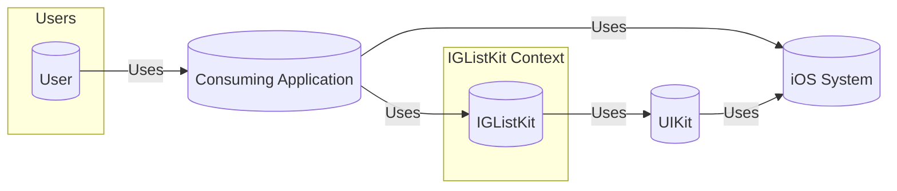
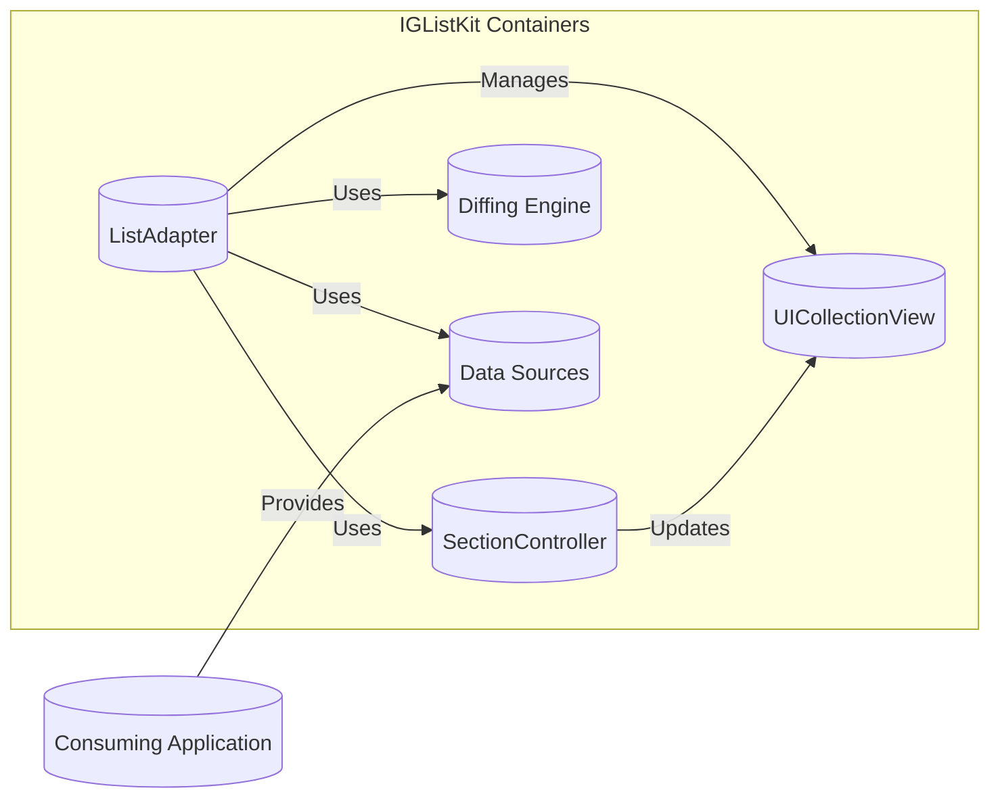
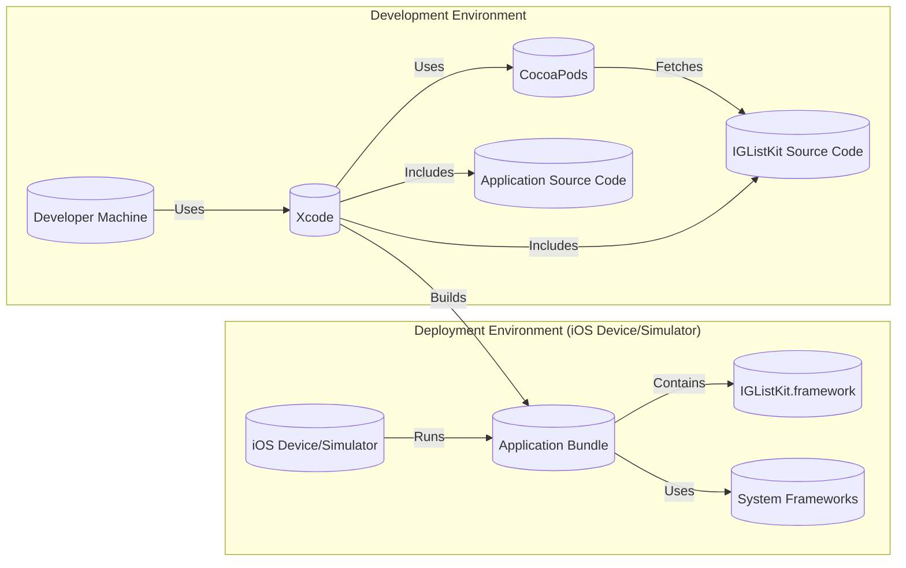
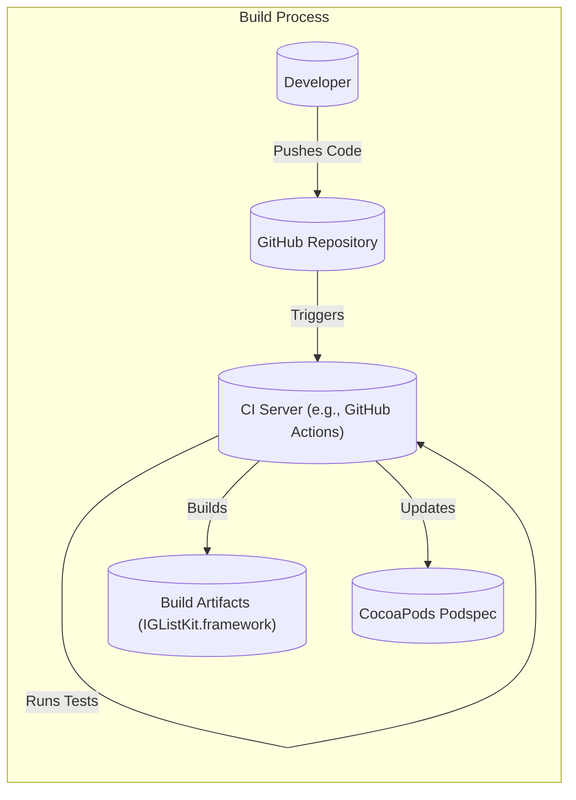

Okay, let's create a design document for IGListKit, focusing on aspects relevant for threat modeling.

# BUSINESS POSTURE

IGListKit is a data-driven UICollectionView framework built by Instagram (Meta).  It's designed to make building complex, performant list-based user interfaces easier.  Given its origin and purpose, the following business priorities and goals can be inferred:

*   Priorities:
    *   Maintainability and Developer Efficiency:  Enable rapid development and iteration of UI features within Instagram and potentially other Meta products. Reduce code complexity and boilerplate associated with UICollectionView.
    *   Performance and Scalability:  Handle large, dynamic datasets efficiently to ensure a smooth user experience, even on lower-end devices.  This is critical for an application like Instagram with potentially infinite scrolling feeds.
    *   User Experience: Provide a consistent and responsive user interface.  The framework should facilitate the creation of visually appealing and engaging lists.
    *   Open Source Community: Foster a vibrant open-source community around the project, encouraging contributions and adoption. This helps with external validation, bug finding, and feature development.
    *   Cross-Platform Potential (Future): While currently iOS-focused, the architecture might be designed with future cross-platform (e.g., Android) adaptation in mind.

*   Goals:
    *   Simplify UICollectionView development.
    *   Improve performance of list-based views.
    *   Reduce UI-related bugs.
    *   Increase code reusability.
    *   Provide a well-documented and easy-to-use framework.

*   Business Risks:
    *   Performance Degradation:  Bugs or inefficiencies in IGListKit could lead to performance issues within Instagram or other apps using it, impacting user experience and potentially user retention.
    *   UI Inconsistencies:  Issues with the framework could cause visual glitches or inconsistent behavior across different devices or iOS versions, damaging the user experience.
    *   Security Vulnerabilities:  While primarily a UI framework, vulnerabilities in data handling or interaction with other system components could potentially be exploited. This is a lower risk than, say, a networking library, but still needs consideration.
    *   Community Abandonment:  If the project is not actively maintained or the community loses interest, it could become obsolete, forcing dependent projects to migrate to alternatives.
    *   Integration Issues:  Difficulties integrating IGListKit with existing codebases or other libraries could hinder adoption and limit its usefulness.
    *   Breaking Changes: Significant updates to the framework could introduce breaking changes, requiring substantial refactoring in dependent projects.

# SECURITY POSTURE

*   Existing Security Controls:
    *   security control: Code Reviews:  As an open-source project on GitHub, IGListKit likely benefits from community code reviews and scrutiny, in addition to internal reviews by Instagram/Meta engineers. (Described in contribution guidelines and pull request process on GitHub).
    *   security control: Static Analysis:  The project likely uses static analysis tools (e.g., linters, SwiftLint) to identify potential code quality and security issues. (Inferred from project structure and common practice).
    *   security control: Issue Tracking:  GitHub's issue tracker is used to report and manage bugs, including potential security vulnerabilities. (Visible on the GitHub repository).
    *   security control: Open Source Scrutiny: The open-source nature of the project allows for public security audits and vulnerability identification.

*   Accepted Risks:
    *   accepted risk: Third-Party Dependencies:  The project may have dependencies on other open-source libraries, introducing a potential risk of supply chain vulnerabilities. This is a common risk for most software projects.
    *   accepted risk: Limited Direct Security Focus: As a UI framework, IGListKit's primary focus is not on security-sensitive operations (like authentication or cryptography). This means that dedicated security mechanisms might be less comprehensive than in other types of libraries.
    *   accepted risk: User-Controlled Data: The framework handles data provided by the application, which could potentially contain malicious content if the application itself is not properly validating input.

*   Recommended Security Controls:
    *   security control: Fuzz Testing: Implement fuzz testing to identify potential crashes or unexpected behavior when handling malformed or unexpected data.
    *   security control: Dependency Scanning: Regularly scan dependencies for known vulnerabilities using tools like Dependabot or Snyk.
    *   security control: Security-Focused Documentation: Add a section to the documentation specifically addressing security considerations for developers using the framework.

*   Security Requirements:
    *   Authentication:  Not directly applicable to IGListKit, as it's a UI framework. Authentication should be handled by the application using the framework.
    *   Authorization:  Not directly applicable. Authorization logic should reside within the application using IGListKit.
    *   Input Validation:  IGListKit itself should handle data safely, but the *primary responsibility for input validation lies with the application* using the framework. The application should ensure that data passed to IGListKit is sanitized and does not contain malicious content (e.g., preventing XSS in text displayed in a list). IGListKit should, however, be robust against unexpected input and not crash or exhibit undefined behavior.
    *   Cryptography:  Not directly applicable, as IGListKit does not handle sensitive data requiring encryption. Any encryption needs should be handled by the application.

# DESIGN

## C4 CONTEXT

*   Elements:
    *   Element:
        *   Name: User
        *   Type: Person
        *   Description: A person interacting with an application that uses IGListKit.
        *   Responsibilities: Interacts with the application's UI.
        *   Security Controls: N/A (External to the system)

    *   Element:
        *   Name: Consuming Application
        *   Type: Software System
        *   Description: An iOS application that utilizes IGListKit to manage its list-based UI.
        *   Responsibilities: Provides data to IGListKit, handles user interactions, implements business logic.
        *   Security Controls: Input validation, authentication, authorization, data protection (as appropriate for the application).

    *   Element:
        *   Name: IGListKit
        *   Type: Software System (Framework)
        *   Description: The data-driven UICollectionView framework.
        *   Responsibilities: Manages the display and updates of list data, handles UICollectionView complexities.
        *   Security Controls: Robust data handling, internal consistency checks.

    *   Element:
        *   Name: UIKit
        *   Type: Software System (Framework)
        *   Description: Apple's framework for building iOS user interfaces.
        *   Responsibilities: Provides fundamental UI components and event handling.
        *   Security Controls: Built-in iOS security features.

    *   Element:
        *   Name: iOS System
        *   Type: Software System (Operating System)
        *   Description: The underlying iOS operating system.
        *   Responsibilities: Manages hardware resources, provides system services.
        *   Security Controls: iOS security model (sandboxing, code signing, etc.).

## C4 CONTAINER

Since IGListKit is a framework, the "container" level is less about separate deployable units and more about the major internal components of the framework itself.

*   Elements:
    *   Element:
        *   Name: ListAdapter
        *   Type: Component
        *   Description: The main entry point for using IGListKit.  It connects the data source to the UICollectionView.
        *   Responsibilities: Manages the lifecycle of section controllers, handles updates to the data, and interacts with the UICollectionView.
        *   Security Controls:  Input validation (of configuration data), error handling.

    *   Element:
        *   Name: SectionController
        *   Type: Component
        *   Description:  Responsible for managing a single section within the list.  There can be multiple section controllers for different types of data.
        *   Responsibilities:  Creates and configures cells for its section, handles user interactions within its section.
        *   Security Controls:  Data validation (within its scope), handling of user interactions.

    *   Element:
        *   Name: Diffing Engine
        *   Type: Component
        *   Description:  Calculates the differences between old and new data sets to efficiently update the UICollectionView.
        *   Responsibilities:  Performs diffing algorithms (e.g., ListDiff) to determine the minimal set of changes needed to update the UI.
        *   Security Controls:  Robustness against invalid or inconsistent data.

    *   Element:
        *   Name: Data Sources
        *   Type: Data
        *   Description:  The data provided by the consuming application to be displayed in the list.
        *   Responsibilities:  Provides the data to be displayed, conforms to IGListKit protocols.
        *   Security Controls:  *Provided by the consuming application*: Input validation, sanitization.

    *   Element:
        *   Name: UICollectionView
        *   Type: Component (UIKit)
        *   Description:  The underlying UIKit component that displays the list.
        *   Responsibilities:  Renders the UI, handles scrolling and layout.
        *   Security Controls:  UIKit's built-in security features.

    *   Element:
        *   Name: Consuming Application
        *   Type: Software System
        *   Description:  The application that is using IGListKit.
        *   Responsibilities: Providing data and implementing business logic.
        *   Security Controls: Input validation, authentication, authorization, data protection (as appropriate for the application).

## DEPLOYMENT

IGListKit is a framework, so "deployment" refers to how it's integrated into a consuming application and how that application is deployed.

*   Possible Solutions:
    1.  CocoaPods: A dependency manager for Swift and Objective-C Cocoa projects.
    2.  Carthage: A decentralized dependency manager for Cocoa.
    3.  Swift Package Manager:  Apple's built-in package manager.
    4.  Manual Integration:  Copying the source code directly into the project.

*   Chosen Solution (CocoaPods - most common):

*   Elements:
    *   Element:
        *   Name: Developer Machine
        *   Type: Node (Hardware)
        *   Description: The developer's computer.
        *   Responsibilities: Hosts the development environment.
        *   Security Controls: Standard developer machine security (antivirus, firewall, etc.).

    *   Element:
        *   Name: Xcode
        *   Type: Software (IDE)
        *   Description: Apple's integrated development environment.
        *   Responsibilities: Provides tools for coding, building, and debugging.
        *   Security Controls: Xcode's built-in security features.

    *   Element:
        *   Name: CocoaPods
        *   Type: Software (Dependency Manager)
        *   Description:  Manages dependencies for the project.
        *   Responsibilities:  Downloads and integrates IGListKit and its dependencies.
        *   Security Controls:  Relies on the security of the CocoaPods repository and the integrity of the downloaded packages.

    *   Element:
        *   Name: Application Source Code
        *   Type: Data
        *   Description:  The source code of the consuming application.
        *   Responsibilities:  Implements the application's functionality.
        *   Security Controls:  Secure coding practices within the application.

    *   Element:
        *   Name: IGListKit Source Code
        *   Type: Data
        *   Description:  The source code of the IGListKit framework.
        *   Responsibilities:  Provides the functionality of IGListKit.
        *   Security Controls:  Code reviews, static analysis, etc. (as described in the Security Posture section).

    *   Element:
        *   Name: iOS Device/Simulator
        *   Type: Node (Hardware/Software)
        *   Description:  The device or simulator where the application runs.
        *   Responsibilities:  Executes the application.
        *   Security Controls:  iOS security model.

    *   Element:
        *   Name: Application Bundle
        *   Type: Data (Package)
        *   Description:  The compiled application package.
        *   Responsibilities:  Contains the application's executable code and resources.
        *   Security Controls:  Code signing, app sandboxing.

    *   Element:
        *   Name: IGListKit.framework
        *   Type: Data (Framework)
        *   Description:  The compiled IGListKit framework.
        *   Responsibilities:  Provides the functionality of IGListKit.
        *   Security Controls:  Code signing (if applicable).

    *   Element:
        *   Name: System Frameworks
        *   Type: Data (Frameworks)
        *   Description:  Apple's system frameworks (e.g., UIKit).
        *   Responsibilities:  Provide core system functionality.
        *   Security Controls:  iOS security model.

## BUILD

*   Build Process Description:
    1.  Developers write code and push changes to the IGListKit repository on GitHub.
    2.  A Continuous Integration (CI) system (e.g., GitHub Actions, Travis CI) is triggered by the push.
    3.  The CI server runs automated tests (unit tests, UI tests) to ensure code quality and prevent regressions.
    4.  If the tests pass, the CI server builds the IGListKit framework, creating the necessary build artifacts (e.g., IGListKit.framework).
    5.  The CI server may also update the CocoaPods podspec file, which contains metadata about the framework and its dependencies.
    6.  The build artifacts are made available for distribution (e.g., through CocoaPods).

*   Security Controls:
    *   security control: CI/CD Pipeline:  Automated build and testing pipeline ensures consistent builds and reduces the risk of manual errors.
    *   security control: Automated Testing:  Unit and UI tests help identify bugs and regressions early in the development process.
    *   security control: Static Analysis:  Linters and static analysis tools are likely used within the CI pipeline to enforce code style and identify potential vulnerabilities.
    *   security control: Dependency Management:  Tools like CocoaPods, Carthage, or Swift Package Manager manage dependencies, but require careful monitoring for vulnerabilities in those dependencies.
    *   security control: Code Signing: The built framework may be code-signed to ensure its authenticity and integrity (though this is more relevant for the consuming application).

# RISK ASSESSMENT

*   Critical Business Processes:
    *   Displaying dynamic, potentially infinite lists of content to users within the Instagram app (and other apps using IGListKit).
    *   Enabling rapid development and iteration of UI features.

*   Data:
    *   Data Sensitivity: The data handled by IGListKit itself is generally *not* highly sensitive (e.g., it's not handling passwords or financial data directly).  However, the *content* displayed in the lists (provided by the consuming application) *can* be sensitive, depending on the application.  Examples:
        *   User-generated content (text, images, videos) - Potentially sensitive due to privacy concerns, copyright issues, or inappropriate content.
        *   User profile information - Potentially sensitive PII (Personally Identifiable Information).
        *   Application-specific data - Could be anything from shopping cart items to medical records, depending on the application.

    *   Data IGListKit is trying to protect: IGListKit itself is not directly protecting data. It's a framework for displaying data provided by the consuming application. The consuming application is responsible for protecting the data. IGListKit should be robust in handling any data it receives, and should not introduce vulnerabilities that could compromise the data handled by the consuming application.

# QUESTIONS & ASSUMPTIONS

*   Questions:
    *   What specific static analysis tools are used in the IGListKit build process?
    *   Are there any specific security audits or penetration tests performed on IGListKit?
    *   What is the process for handling reported security vulnerabilities?
    *   Are there any plans to support other platforms (e.g., Android) in the future?
    *   What are the specific performance targets for IGListKit (e.g., frame rate, memory usage)?

*   Assumptions:
    *   BUSINESS POSTURE:  Assumed that Instagram/Meta prioritizes performance, user experience, and developer efficiency. Assumed that maintaining a positive open-source community reputation is important.
    *   SECURITY POSTURE:  Assumed that standard secure coding practices are followed. Assumed that the project uses static analysis tools. Assumed that there is a process for handling reported security vulnerabilities, even if it's not explicitly documented.
    *   DESIGN:  Assumed that the major components of IGListKit are accurately represented in the C4 diagrams. Assumed that CocoaPods is the primary distribution method. Assumed that a CI system is used for building and testing.