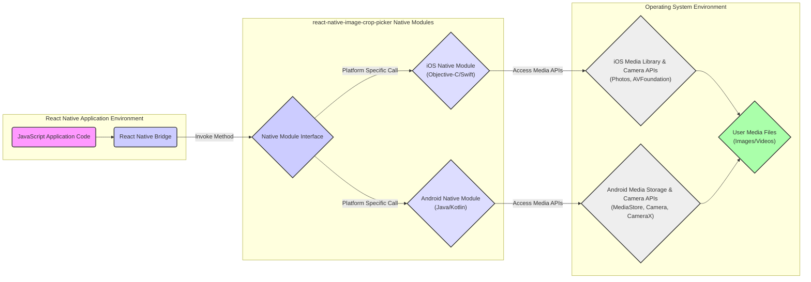
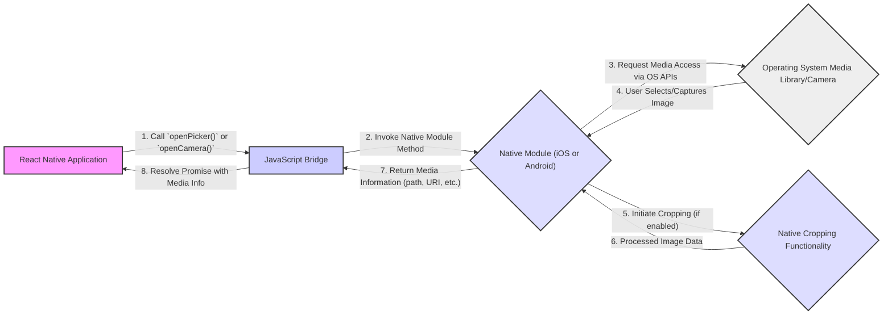

# Project Design Document: React Native Image Crop Picker

**Version:** 1.1
**Date:** October 26, 2023
**Author:** AI Software Architect

## 1. Introduction

This document provides an enhanced design overview of the `react-native-image-crop-picker` library (referenced from [https://github.com/ivpusic/react-native-image-crop-picker](https://github.com/ivpusic/react-native-image-crop-picker)). It details the library's architecture, data flow, and key components to facilitate comprehensive threat modeling, focusing on interactions with the operating system and user data.

## 2. Goals and Objectives

The primary goal of the `react-native-image-crop-picker` library is to enable React Native applications to:

* Allow users to select images and videos from the device's media library.
* Enable users to capture new images and videos using the device's camera interface.
* Provide built-in image and video cropping functionality with customizable aspect ratios and dimensions.
* Return metadata about the selected or captured media file (e.g., file path, size, MIME type) to the React Native application.
* Offer configuration options for media processing, such as image quality and compression levels.

This design document aims to:

* Clearly define the library's architecture and its constituent parts.
* Illustrate the flow of data within the library's operations.
* Identify critical interaction points with the underlying operating system and user-sensitive data.
* Serve as a robust foundation for conducting thorough threat modeling exercises.

## 3. System Architecture

The `react-native-image-crop-picker` library acts as a bridge, connecting the React Native JavaScript environment with platform-specific native APIs on iOS and Android. Invoking JavaScript methods within the library triggers corresponding native code execution.

Here's a detailed architectural diagram:

Key components and their security relevance:

* **JavaScript Application Code:** The React Native code utilizing the library. Potential vulnerabilities here involve improper handling of the returned media path or data.
* **React Native Bridge:** The communication layer. Security concerns include potential serialization/deserialization vulnerabilities if untrusted data is involved (though less likely in this library's core function).
* **Native Module Interface:** Defines the API boundary. Secure design of this interface is crucial to prevent unexpected behavior or access.
* **iOS Native Module (Objective-C/Swift):**  Handles interactions with iOS system APIs. Security depends on proper use of Apple's frameworks and secure coding practices to prevent memory leaks, buffer overflows, and unauthorized access.
* **Android Native Module (Java/Kotlin):** Handles interactions with Android system APIs. Similar security considerations as the iOS module, focusing on secure use of Android's media and camera APIs and preventing vulnerabilities like path traversal.
* **iOS Media Library & Camera APIs (Photos, AVFoundation):** Apple's frameworks for media access. Security relies on the correct implementation of permission requests and data handling as per Apple's guidelines.
* **Android Media Storage & Camera APIs (MediaStore, Camera, CameraX):** Google's APIs for media access. Security depends on proper permission management and secure handling of Intents and file URIs.
* **User Media Files (Images/Videos):** The sensitive data being accessed. The library's security directly impacts the confidentiality and integrity of this data.

## 4. Data Flow

The typical data flow for selecting and potentially cropping an image involves these steps:

Detailed steps and potential security implications:

1. **Initiation:** The React Native application initiates the process. Improperly sanitized parameters passed at this stage could potentially be exploited.
2. **Bridging:** Data is passed across the bridge. While generally secure, vulnerabilities in the React Native bridge itself could be a concern (though less specific to this library).
3. **Native Interaction:** The native module requests access to media. A key security point is ensuring proper permission checks are in place *before* accessing any media.
4. **User Interaction:** The user interacts with the OS media selection interface. Security here is largely managed by the OS, but the library needs to handle the results securely.
5. **Cropping (Optional):** Native cropping functionality is invoked. Potential vulnerabilities include buffer overflows or other memory safety issues in the cropping implementation. Temporary files created during cropping are also a concern.
6. **Media Processing:**  The native module processes the image. Security considerations include the secure handling of image data in memory and on disk (temporary files).
7. **Result Handling:** The native module returns the path or URI to the media. **Crucially, the application needs to treat this path as potentially untrusted and avoid directly executing it or passing it to vulnerable system calls without validation.**  On Android, `file://` URIs can have security implications.
8. **Callback to JavaScript:** The media information is passed back. Ensure the data being passed back is what is expected and hasn't been tampered with (though this is less likely within the device's own processes).

## 5. Security Considerations

This section details potential security considerations for threat modeling:

* **Permissions Management:**
    * **iOS:** Ensure `NSPhotoLibraryUsageDescription` and `NSCameraUsageDescription` are appropriately set in `Info.plist` to inform the user why permissions are needed. Failure to do so can lead to app rejection or user distrust.
    * **Android:** Verify `READ_EXTERNAL_STORAGE`, `WRITE_EXTERNAL_STORAGE` (if needed), and `CAMERA` permissions are declared in `AndroidManifest.xml`. Requesting unnecessary permissions is a security risk.
    * **Threat:**  Insufficient permissions will prevent the library from functioning. Overly broad permissions could allow unintended access to user data. Users may also deny permissions if the request seems unwarranted.
* **Temporary File Handling:**
    * The library might create temporary files for caching or during the cropping process.
    * **Threat:** These temporary files could contain sensitive image data. If not securely stored (e.g., using secure temporary directories) or promptly deleted, they could be accessed by malicious applications or persist after the intended use, leading to data leakage.
* **Path/URI Handling:**
    * The library returns the file path or URI of the selected/captured image.
    * **Threat:** If the application doesn't properly validate or sanitize this path, it could be vulnerable to path traversal attacks, potentially allowing access to other files on the device. On Android, be cautious with `file://` URIs.
* **Input Validation of Configuration Options:**
    * The library accepts configuration options like `width`, `height`, `cropping` aspect ratios, and image quality.
    * **Threat:** Insufficient validation of these inputs could lead to unexpected behavior, crashes (denial of service), or potentially even exploitation if malicious values are provided that cause buffer overflows or other issues in the native code.
* **Third-Party Dependencies (Native):**
    * The native modules might depend on other native libraries for image processing or other functionalities.
    * **Threat:** Vulnerabilities in these third-party dependencies could be indirectly exploitable through `react-native-image-crop-picker`. Regular updates and security audits of these dependencies are crucial.
* **Platform-Specific Security Differences:**
    * iOS and Android have different security models and API implementations.
    * **Threat:** Security vulnerabilities might exist on one platform but not the other due to these differences. Thorough testing and security analysis on both platforms are necessary.
* **Intent Handling (Android):**
    * On Android, the library might use Intents to interact with other applications for image picking or cropping.
    * **Threat:**  Improperly configured Intents could potentially leak sensitive information to other applications or allow malicious applications to intercept the intent and return malicious data. Ensure Intents are explicit and target specific components.
* **EXIF Data Privacy:**
    * Images often contain EXIF metadata, which can include sensitive information like GPS coordinates.
    * **Threat:** The library should provide options to strip or handle EXIF data according to the application's privacy requirements. Exposing this data unintentionally can be a privacy violation.
* **Secure Coding Practices in Native Modules:**
    * The native code (Objective-C/Swift for iOS, Java/Kotlin for Android) should adhere to secure coding practices.
    * **Threat:** Common vulnerabilities like buffer overflows, memory leaks, and improper error handling in the native code can be exploited. Regular code reviews and static analysis are recommended.
* **Data Transmission (Less Relevant for this Library's Core Functionality):**
    * While this library primarily deals with local media, if the application subsequently transmits the media, secure transmission protocols (HTTPS) should be used.
    * **Threat:**  Man-in-the-middle attacks could intercept unencrypted media data during transmission.

## 6. Dependencies

The `react-native-image-crop-picker` library depends on the following:

* **React Native:** The foundational framework. Security vulnerabilities in React Native itself could indirectly affect this library.
* **iOS SDK Frameworks:**
    * `Photos` and `PhotosUI`: For accessing the photo library. Security depends on the correct usage of these frameworks as per Apple's guidelines.
    * `AVFoundation`: For camera access and media capture. Secure implementation is crucial to prevent unauthorized access or manipulation.
    * Potentially other Apple frameworks for image processing.
* **Android SDK Libraries:**
    * `MediaStore`: For accessing images and videos. Security relies on proper permission handling and secure URI management.
    * `Camera` or `CameraX`: For accessing the camera. Secure implementation is vital to prevent unauthorized access and ensure data privacy.
    * Android Support Libraries or Jetpack libraries for compatibility and features.
    * Potentially other third-party native libraries for image manipulation or cropping. The security of these dependencies needs to be considered.

## 7. Deployment

Deploying an application using `react-native-image-crop-picker` involves:

* **Installation:** Adding the library as a dependency using npm or yarn.
* **Native Linking:** Linking the native modules to the iOS and Android projects. This often involves using autolinking or manual linking steps as described in the library's documentation.
* **Permission Configuration:** Ensuring the necessary permissions are correctly declared in `Info.plist` (iOS) and `AndroidManifest.xml` (Android). Incorrectly configured permissions can lead to runtime errors or security issues.
* **Building and Distribution:** Building the React Native application for the target platforms and distributing it through app stores or other channels. The security of the distribution process itself is also a consideration (e.g., code signing).

## 8. Future Considerations

Potential future improvements with security implications include:

* **Enhanced Temporary File Security:** Implementing more robust mechanisms for secure temporary file creation and deletion, potentially using OS-level secure storage options.
* **Improved Input Sanitization:**  Strengthening input validation and sanitization for all configuration options to prevent unexpected behavior or potential exploits.
* **Regular Security Audits:** Conducting periodic security audits of the native code and dependencies to identify and address potential vulnerabilities.
* **EXIF Data Handling Options:** Providing more granular control over EXIF data handling, allowing developers to easily strip or sanitize this information.
* **Adoption of Modern APIs:** Migrating to newer, more secure platform APIs (e.g., `CameraX` on Android) where applicable.
* **Static Analysis Integration:** Incorporating static analysis tools into the development process to automatically detect potential security flaws in the native code.
* **Secure Defaults:**  Ensuring that default configurations are secure and minimize potential risks.

This enhanced design document provides a more detailed and security-focused overview of the `react-native-image-crop-picker` library, offering a stronger foundation for comprehensive threat modeling activities. The identified security considerations should be thoroughly analyzed and addressed to ensure the secure and reliable operation of applications utilizing this library.
