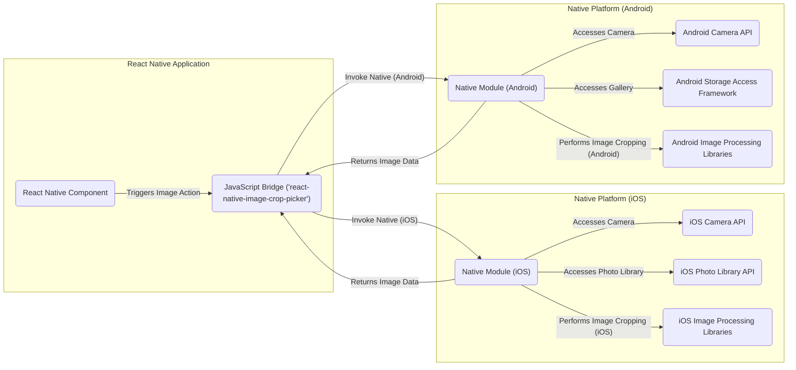

## Project Design Document: React Native Image Crop Picker (Improved)

**Project Name:** React Native Image Crop Picker Integration

**Project Repository:** [https://github.com/ivpusic/react-native-image-crop-picker](https://github.com/ivpusic/react-native-image-crop-picker)

**Version:** 1.1

**Date:** October 26, 2023

**Author:** Gemini (AI Language Model)

### 1. Project Overview

This document details the design for integrating the `react-native-image-crop-picker` library into a hypothetical React Native application. This library facilitates user selection of images from the device's gallery or camera, along with image cropping capabilities. This design document is specifically crafted to serve as a foundational resource for subsequent threat modeling activities, emphasizing security considerations throughout the system.

### 2. Goals and Objectives

* **Core Functionality:**
    * Enable users within the React Native application to select existing images from their device's gallery or capture new images using the device's camera.
    * Provide a user-friendly interface for cropping selected or captured images.
* **Configuration and Customization:**
    * Offer options to customize the cropping aspect ratio, image quality, and other relevant parameters.
* **Data Handling:**
    * Return the processed image data (e.g., file URI, base64 encoded string, or raw bytes) back to the initiating React Native application component.
* **Security and Privacy:**
    * Adhere strictly to platform-specific permission requirements for accessing sensitive resources like the camera and photo library, ensuring user privacy is maintained.
    * Design the integration to minimize potential security vulnerabilities associated with image handling and data transfer.
* **Threat Modeling Support:**
    * Provide a clear and detailed architectural overview to facilitate comprehensive threat identification and risk assessment.

### 3. Target System Architecture

The `react-native-image-crop-picker` library acts as a crucial intermediary, bridging the gap between the React Native JavaScript environment and the native platform functionalities of iOS and Android for accessing the device's camera and photo library.

### 4. Component Details

* **React Native Component:** The user-facing part of the application where users initiate image selection, capture, or cropping actions. This component utilizes the `react-native-image-crop-picker` JavaScript API.
    * **Responsibilities:**
        * Initiating the image selection/capture and cropping workflow based on user interaction.
        * Configuring options for the image picker, such as cropping aspect ratio, image quality, and media type (image or video).
        * Receiving the processed image data or error information from the library's JavaScript bridge.
        * Handling the returned image data, which might involve displaying the image, uploading it to a server, or further processing.
        * Implementing appropriate error handling and user feedback mechanisms.

* **JavaScript Bridge (`react-native-image-crop-picker`):** This JavaScript module serves as the primary interface for communication between the React Native component and the underlying native modules.
    * **Responsibilities:**
        * Exposing JavaScript functions that allow the React Native component to trigger image selection, capture, and cropping functionalities.
        * Marshalling parameters and options from the JavaScript environment to the native code in a platform-specific format.
        * Handling responses and data returned from the native modules and relaying them back to the React Native component.
        * Potentially performing basic data transformations or error handling before passing data between layers.

* **Native Module (iOS):** Platform-specific native code (primarily Objective-C or Swift) responsible for interacting with iOS system APIs related to camera access, photo library access, and image manipulation.
    * **Responsibilities:**
        * Presenting the native iOS image picker user interface (either the camera interface or the photo library interface).
        * Managing user interaction within the native image picker, including handling cancellations and selections.
        * Accessing the device's camera using the **iOS Camera API** when capturing new images.
        * Accessing the user's photo library using the **iOS Photo Library API** when selecting existing images.
        * Performing image cropping operations using **iOS Image Processing Libraries**.
        * Managing temporary file storage for captured or cropped images, ensuring secure storage and timely cleanup.
        * Requesting necessary user permissions for accessing the camera and photo library and handling permission denials gracefully.
        * Returning the processed image data (e.g., file URI, base64 encoded string) to the JavaScript bridge.

* **Native Module (Android):** Platform-specific native code (primarily Java or Kotlin) responsible for interacting with Android system APIs for camera access, gallery access, and image manipulation.
    * **Responsibilities:**
        * Launching Android Intents to access the device's camera (**Android Camera API**) for capturing new images.
        * Utilizing the **Android Storage Access Framework** to access images from the device's gallery.
        * Handling the results returned by the launched Intents, including image data and potential errors.
        * Performing image cropping operations using **Android Image Processing Libraries**.
        * Managing temporary file storage for captured or cropped images, ensuring secure storage and timely cleanup.
        * Requesting necessary runtime permissions for accessing the camera and storage and handling permission denials gracefully.
        * Returning the processed image data (e.g., content URI, file path, base64 encoded string) to the JavaScript bridge.

* **iOS Camera API:** The iOS framework that provides access to and control over the device's camera hardware and related functionalities.
    * **Responsibilities:**
        * Capturing still images and videos.
        * Providing camera settings and controls, such as flash mode and focus.

* **iOS Photo Library API:** The iOS framework that allows access to the user's photo library and related metadata.
    * **Responsibilities:**
        * Retrieving images and videos from the photo library.
        * Managing user permissions for accessing the photo library.

* **Android Camera API:** The Android framework that provides access to the device's camera hardware.
    * **Responsibilities:**
        * Capturing still images and videos.
        * Allowing control over camera parameters.

* **Android Storage Access Framework:** An Android framework that allows applications to interact with documents and other files, including images in the gallery, in a consistent way.
    * **Responsibilities:**
        * Providing a user interface for selecting files from various storage providers.
        * Managing permissions for accessing files.

* **iOS Image Processing Libraries:**  Built-in iOS frameworks (e.g., Core Image, UIKit image manipulation methods) used for tasks like image cropping, resizing, and applying filters.
    * **Responsibilities:**
        * Performing image manipulation operations as requested by the native module.

* **Android Image Processing Libraries:** Built-in Android libraries (e.g., BitmapFactory, MediaMetadataRetriever) used for image manipulation tasks.
    * **Responsibilities:**
        * Performing image manipulation operations as requested by the native module.

### 5. Data Flow

The typical data flow for selecting and cropping an image involves the following steps:

1. The user interacts with a **React Native Component**, initiating a request to select or capture an image.
2. The **React Native Component** calls a corresponding function in the **JavaScript Bridge**, passing configuration options such as cropping aspect ratio and image quality.
3. The **JavaScript Bridge** invokes the appropriate native function within either the **Native Module (iOS)** or the **Native Module (Android)**, depending on the current operating system.
4. **For Camera Capture:**
    * The **Native Module** utilizes the **iOS Camera API** (on iOS) or launches an Intent using the **Android Camera API** (on Android) to initiate the camera application.
    * The user captures an image, and the resulting image data is returned to the **Native Module**.
5. **For Gallery Selection:**
    * The **Native Module** utilizes the **iOS Photo Library API** (on iOS) or the **Android Storage Access Framework** (on Android) to present the device's image gallery to the user.
    * The user selects an image, and the selected image's data (e.g., file URI) is returned to the **Native Module**.
6. The **Native Module** performs the image cropping operation on the captured or selected image, leveraging **iOS Image Processing Libraries** or **Android Image Processing Libraries**. This may involve:
    * Loading the image data.
    * Applying the specified cropping parameters.
    * Potentially storing a temporary cropped image file in a secure, application-specific directory on the device's file system.
7. The **Native Module** prepares the result data, which typically includes the URI or path to the cropped image file, or potentially the image data as a base64 encoded string or raw bytes.
8. The **Native Module** sends the processed image data back to the **JavaScript Bridge**.
9. The **JavaScript Bridge** receives the data and passes it back to the originating **React Native Component**.
10. The **React Native Component** receives the processed image data and handles it according to the application's logic (e.g., displaying the image, uploading it to a server).

### 6. Security Considerations

This section details security considerations relevant to the `react-native-image-crop-picker` library and its integration, serving as a foundation for threat modeling.

* **Permissions Management:**
    * **iOS:** The library relies on proper declaration and handling of `NSCameraUsageDescription` and `NSPhotoLibraryUsageDescription` in the `Info.plist` file. Improper configuration or bypassing these checks could lead to unauthorized access.
    * **Android:** The library requires runtime permissions (`CAMERA`, `READ_EXTERNAL_STORAGE`, `WRITE_EXTERNAL_STORAGE`). Vulnerabilities can arise from failing to request these permissions, not handling permission denials gracefully, or exploiting vulnerabilities in the Android permission model.
* **Data Storage and Handling:**
    * Temporary storage of unencrypted cropped images on the device's file system poses a risk. The library should utilize secure, application-specific directories with restricted access permissions. Temporary files should be deleted immediately after use.
    * The transmission of image data between native modules and the JavaScript bridge should be carefully considered. While direct memory access is often involved, understanding the underlying mechanisms is crucial for identifying potential data leaks or manipulation.
    * If base64 encoding is used for transferring image data, the potential for large memory consumption and the security implications of handling these strings should be assessed.
* **Input Validation and Sanitization:**
    * The library must rigorously validate input parameters received from the React Native component (e.g., cropping aspect ratio, image quality, maximum size). Failure to do so could lead to unexpected behavior, denial-of-service attacks, or other vulnerabilities.
    * Image data received from the camera or gallery should be treated as untrusted input and potentially sanitized to prevent vulnerabilities like path traversal if file paths are directly used.
* **Third-Party Dependencies:**
    * The native modules may depend on other libraries or frameworks. The security posture of these dependencies should be regularly assessed for known vulnerabilities.
* **Platform-Specific Vulnerabilities:**
    * Security vulnerabilities inherent in the underlying iOS and Android operating systems or their respective image processing libraries could affect the `react-native-image-crop-picker`. Staying updated with platform security advisories is crucial.
* **Code Injection Risks:**
    * While less likely in this specific context, any point where external data could influence the execution of native code should be carefully examined for potential code injection vulnerabilities.
* **Privacy Considerations:**
    * The library handles potentially sensitive user data (images). Ensuring compliance with privacy regulations (e.g., GDPR, CCPA) regarding data storage, processing, and deletion is essential.
    * Metadata associated with images (e.g., location data) should be handled according to user preferences and privacy policies.

### 7. Assumptions and Constraints

* **Assumptions:**
    * The underlying operating system provides a baseline level of security for file system access, inter-process communication, and memory management.
    * Users will be prompted for and will grant the necessary permissions for the library to access the camera and photo library for its intended functionality.
    * The React Native environment itself is assumed to be reasonably secure and up-to-date with security patches.
* **Constraints:**
    * The library's functionality is inherently limited by the capabilities and security restrictions imposed by the native platform APIs (iOS and Android).
    * Performance considerations, especially regarding image processing and data transfer, may influence design choices.
    * Maintaining compatibility across a wide range of iOS and Android versions and device configurations introduces complexity and potential constraints.

### 8. Future Considerations

* **Advanced Image Editing Features:**  Future enhancements could include more advanced image editing capabilities beyond basic cropping, such as rotation, filters, or drawing tools.
* **Improved Image Compression Options:** Providing more granular control over image compression algorithms and parameters could be beneficial for optimizing storage and bandwidth usage.
* **Enhanced Error Handling and Reporting:** Implementing more robust error handling mechanisms and providing detailed error information to the application developer can aid in debugging and issue resolution.
* **Support for Video Cropping:** Extending the library's functionality to support video selection and cropping would broaden its applicability.
* **Security Audits and Penetration Testing:** Regularly conducting security audits and penetration testing can help identify and address potential vulnerabilities proactively.

This improved design document provides a more detailed and security-focused overview of the `react-native-image-crop-picker` library integration. It is intended to be a valuable resource for conducting thorough threat modeling and ensuring the secure use of this library within React Native applications.
