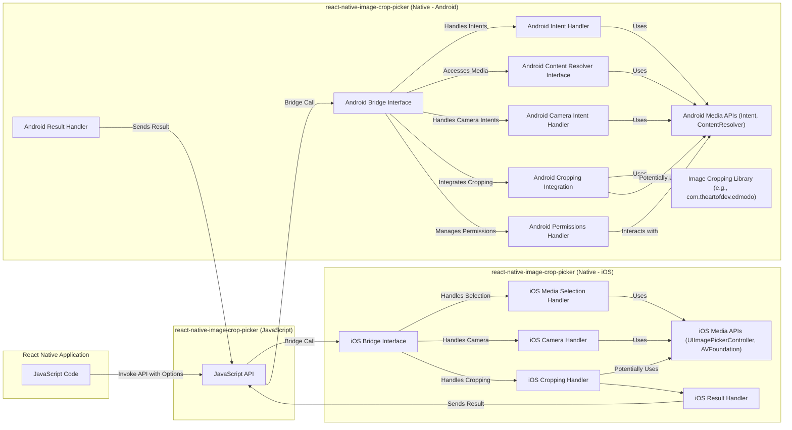
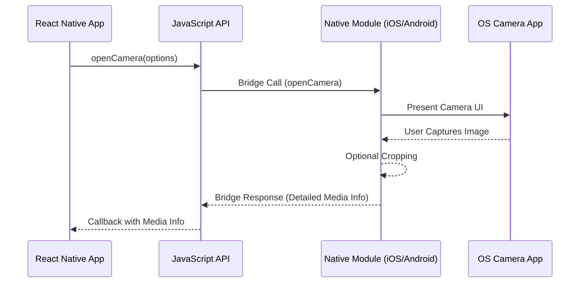

# Project Design Document: React Native Image Crop Picker

**Version:** 1.1
**Date:** October 26, 2023
**Author:** Gemini (AI Language Model)
**Project Repository:** https://github.com/ivpusic/react-native-image-crop-picker

## 1. Introduction

This document provides a detailed design overview of the `react-native-image-crop-picker` library. This library empowers React Native applications with the ability to access the device's camera and photo library, enabling users to select and crop images and videos. This document aims to provide a comprehensive understanding of the library's architecture, data flow, and key components, serving as a robust foundation for subsequent threat modeling activities. This revision includes more detailed descriptions of components and potential security considerations.

## 2. Goals and Objectives

The primary goals of the `react-native-image-crop-picker` library are:

* **Provide a simple and consistent API:** Offer a straightforward and intuitive interface for React Native developers to seamlessly integrate image and video selection and cropping functionalities into their applications.
* **Support both image and video selection:** Allow users to choose either images or videos from their device's media library or capture new media directly using the device's camera.
* **Offer flexible cropping options:** Enable users to crop selected media with a high degree of customization, including specifying aspect ratios, dimensions, and enabling/disabling the cropping feature.
* **Handle platform differences:** Abstract away the inherent complexities of interacting with native media APIs on both iOS and Android platforms, providing a unified experience for developers.
* **Return comprehensive media information:** Provide relevant and detailed metadata about the selected or captured media, such as the file path, dimensions (width and height), file size, MIME type, and potentially EXIF data.

## 3. System Architecture

The `react-native-image-crop-picker` library functions as a bridge, facilitating communication between the React Native JavaScript environment and the underlying native platform APIs (iOS and Android). It exposes a set of JavaScript methods that, when invoked from the React Native side, trigger the execution of corresponding native code.

Here's a more granular overview of the architecture:

* **React Native JavaScript Interface:** This constitutes the public-facing API that React Native developers directly interact with. It comprises JavaScript functions designed to initiate various media selection and cropping operations, along with configuration options.
* **Native Module (iOS):**  Implemented using Objective-C or Swift, this module serves as the intermediary between the JavaScript API and the iOS system. It interacts with core iOS frameworks such as `UIImagePickerController` for accessing the photo library, `AVFoundation` for camera access, and potentially custom UI elements or frameworks for image cropping.
* **Native Module (Android):** Developed using Java or Kotlin, this module handles the interaction with the Android operating system. It leverages Android APIs like `Intent` for accessing the gallery and camera applications, `ContentResolver` for accessing media files, and often integrates with external libraries like `com.theartofdev.edmodo:android-image-cropper` for robust image cropping capabilities.
* **Operating System Media APIs:** These represent the fundamental platform-specific APIs provided by iOS and Android. They offer the low-level functionalities required to access media resources, control the camera, and manage user permissions.

## 4. Component Design

The library is composed of the following key components, providing a more detailed breakdown of the native modules:

* **JavaScript API:**
    * `openPicker(options)`: Opens the device's photo library or gallery, allowing the user to select an image or video. The `options` parameter allows customization of the selection process (e.g., allowed media types, maximum number of selections).
    * `openCamera(options)`: Opens the device's camera interface, enabling the user to capture a new image or video. The `options` parameter allows customization of the capture process (e.g., quality, video duration).
    * `openCropper(options)`: Opens a dedicated image cropping interface for a specified image path. The `options` parameter allows customization of the cropping behavior (e.g., aspect ratio, cropping dimensions).
    * `clean()`:  Provides a mechanism to clean up all temporary files created by the library during previous operations.
    * `cleanSingle(path)`: Allows for the removal of a specific temporary file identified by its file path.
* **Native Module (iOS):**
    * **iOS Bridge Interface:**  The entry point for calls from the React Native JavaScript bridge. It routes calls to the appropriate handlers.
    * **iOS Media Selection Handler:** Manages the presentation and interaction with `UIImagePickerController` to facilitate the selection of media from the device's photo library.
    * **iOS Camera Handler:**  Manages the presentation and control of the camera interface, potentially using `AVCaptureSession`, allowing users to capture new images or videos.
    * **iOS Cropping Handler:** Implements the image cropping functionality. This might involve using built-in iOS cropping features or custom view controllers for more advanced cropping options.
    * **iOS Result Handler:**  Processes the results received from the media selection, camera, or cropping operations, extracts relevant metadata, and formats the response to be sent back to the JavaScript side.
* **Native Module (Android):**
    * **Android Bridge Interface:** The entry point for calls from the React Native JavaScript bridge, directing calls to the appropriate Android components.
    * **Android Intent Handler:**  Utilizes `Intent` actions such as `ACTION_PICK` to launch the gallery application for media selection.
    * **Android Content Resolver Interface:**  Provides access to media files through the Android content provider framework, allowing the library to retrieve the selected media.
    * **Android Camera Intent Handler:** Uses `Intent` actions like `ACTION_IMAGE_CAPTURE` or `ACTION_VIDEO_CAPTURE` to launch the device's camera application for capturing new media.
    * **Android Cropping Integration:**  Handles the integration with an external image cropping library (e.g., `com.theartofdev.edmodo:android-image-cropper`) or potentially implements custom cropping logic using Android APIs.
    * **Android Permissions Handler:** Manages runtime permissions required for accessing the camera and storage, ensuring the application has the necessary permissions before attempting to access these resources.
    * **Android Result Handler:** Processes the results received from the launched activities (gallery, camera, cropper), extracts relevant information, and formats the response for the JavaScript side.

## 5. Data Flow

The typical data flow for capturing a new image using the camera is as follows:

1. **JavaScript Initiation:** The React Native application invokes the `openCamera(options)` method from the JavaScript API, potentially providing configuration options like image quality.
2. **Bridge Communication:** The JavaScript call is serialized and transmitted to the appropriate native module (iOS or Android) via the React Native bridge.
3. **Native Camera Intent/Presentation:**
    * **iOS:** The Objective-C/Swift module's `iOS Camera Handler` presents the camera interface to the user, potentially configuring camera settings based on the provided options.
    * **Android:** The Java/Kotlin module's `Android Camera Intent Handler` launches an `Intent` to open the device's camera application.
4. **User Interaction:** The user interacts with the camera interface and captures an image.
5. **Result Handling (Native):**
    * **iOS:** The captured image data and metadata are returned to the `iOS Result Handler`.
    * **Android:** The camera application returns the URI of the captured image to the `Android Result Handler`.
6. **Cropping (Optional):** If cropping is enabled in the options, the native module's cropping handler (iOS or Android) presents a cropping interface to the user, allowing them to adjust the captured image.
7. **Cropped Image Data (Native):** The native module obtains the final cropped image data (if applicable).
8. **Data Processing and Response:** The native module's result handler processes the image data (e.g., resizing, format conversion based on options) and constructs the response payload, including the file path, dimensions, file size, and MIME type.
9. **Bridge Communication (Back):** The native module sends the structured response back to the JavaScript side via the React Native bridge.
10. **JavaScript Callback:** The JavaScript promise or callback associated with the initial `openCamera` call is resolved with the comprehensive media information.

## 6. Security Considerations

Several security aspects are crucial for the `react-native-image-crop-picker` library:

* **Permissions Management:**
    * **iOS:** The application's `Info.plist` file must declare the necessary privacy-sensitive usage descriptions (e.g., `NSCameraUsageDescription`, `NSPhotoLibraryUsageDescription`). The system handles permission prompts.
    * **Android:** The application's `AndroidManifest.xml` file must declare the required permissions (`android.permission.CAMERA`, `android.permission.READ_MEDIA_IMAGES`, `android.permission.READ_MEDIA_VIDEO`, and potentially `android.permission.WRITE_EXTERNAL_STORAGE` for older Android versions). Runtime permission requests are necessary for Android 6.0 (API level 23) and higher. Improperly requesting or handling these permissions can lead to security vulnerabilities or unexpected behavior. For instance, failing to check for granted permissions before accessing the camera or storage could lead to crashes or security exceptions.
* **Data Storage of Temporary Files:**
    * The library might create temporary files to store captured or cropped images before returning the final result. These files should be stored in secure, application-specific temporary directories provided by the operating system (e.g., using `NSTemporaryDirectory()` on iOS and `context.getCacheDir()` or `context.getExternalCacheDir()` on Android). It's critical to ensure these directories have appropriate access restrictions and that the library diligently cleans up these temporary files using the provided `clean()` methods to prevent information leakage, especially if the device is compromised. Failure to do so could leave sensitive image data accessible to other applications or malicious actors.
* **Input Validation of Options:**
    * The library should rigorously validate all options passed from the JavaScript side (e.g., `width`, `height`, `cropping`, `mediaType`). This prevents unexpected behavior, potential crashes, and security vulnerabilities arising from malformed or malicious input. For example, validating that provided dimensions are positive integers and that file types are expected can mitigate potential issues.
* **Path Traversal Prevention:**
    * The library must ensure that file paths returned to the JavaScript side cannot be manipulated by malicious actors to access files outside the intended directories. This is particularly relevant when dealing with file URIs or paths obtained from the operating system. Sanitizing or canonicalizing file paths before returning them is crucial.
* **Information Disclosure Risks:**
    * The metadata returned by the library (e.g., EXIF data) might contain sensitive information (location data, camera settings). Developers should be aware of this and consider options to filter or sanitize this metadata before further processing or transmission if privacy is a concern.
* **Security of Third-Party Libraries (Android):**
    * If the Android version relies on a third-party cropping library, the security of that library becomes a dependency. It's essential to use reputable and actively maintained libraries, keep them updated to patch any known vulnerabilities, and be aware of any potential security implications they might introduce.
* **Secure Coding Practices in Native Modules:**
    * The native modules (both iOS and Android) should be implemented using secure coding practices to prevent common vulnerabilities such as buffer overflows, memory leaks, and improper error handling. Regular code reviews and static analysis can help identify and mitigate these risks.
* **Data Handling in Memory:**
    * The library should handle image and video data in memory securely. Avoid storing sensitive data in memory longer than necessary and consider using secure memory management techniques to prevent unauthorized access or accidental exposure.

## 7. Dependencies

The library depends on the following core components and potentially external libraries:

* **React Native:** The fundamental framework for building cross-platform mobile applications.
* **Native Platform SDKs:**
    * **iOS:** UIKit, AVFoundation, CoreGraphics, Photos (for accessing the photo library).
    * **Android:** Android SDK, AndroidX libraries, potentially third-party libraries like `com.theartofdev.edmodo:android-image-cropper`.

## 8. Deployment

The `react-native-image-crop-picker` library is distributed as an npm package. Developers integrate it into their React Native projects using package managers like npm or yarn. After installation, the native modules need to be linked to the respective iOS and Android projects, typically involving modifications to native build files (e.g., `Podfile` for iOS, `build.gradle` for Android).

## 9. Potential Risks and Vulnerabilities (For Threat Modeling)

This section outlines potential risks and vulnerabilities that should be thoroughly investigated during threat modeling exercises:

* **Permissions-Related Risks:**
    * **Unauthorized Camera Access:**  If permissions are not correctly requested or checked, the application might attempt to access the camera without user consent, potentially violating privacy.
    * **Unauthorized Media Library Access:** Similar to camera access, improper permission handling could lead to unauthorized access to the user's photo and video library.
    * **Data Exfiltration via Unintended Permissions:** While less direct, vulnerabilities in how permissions are managed could be chained with other exploits to exfiltrate data.
* **Temporary File Management Vulnerabilities:**
    * **Information Leakage through Unsecured Temporary Files:** Failure to store temporary files in secure locations or to clean them up promptly could expose sensitive image data.
    * **Denial of Service through Excessive Temporary File Creation:**  A malicious actor might try to trigger the creation of a large number of temporary files, potentially filling up storage space and causing a denial of service.
* **Input Validation Exploits:**
    * **Buffer Overflows due to Unvalidated Dimensions:** Providing extremely large or negative dimensions in the options could lead to buffer overflows in the native code.
    * **Path Injection through Malicious File Paths:**  If the library processes file paths without proper validation, attackers might be able to inject malicious paths to access unintended files.
* **Third-Party Library Vulnerabilities (Android):**
    * **Exploits in Cropping Library:** If the integrated third-party cropping library has known vulnerabilities, these could be exploited through the `react-native-image-crop-picker`.
    * **Supply Chain Attacks:**  Compromised dependencies of the third-party library could also pose a risk.
* **Information Disclosure:**
    * **Exposure of Sensitive Metadata:**  Returning unfiltered EXIF data or other metadata might inadvertently expose sensitive user information.
    * **Leaking Internal File Paths:**  Returning internal application file paths could provide attackers with information useful for further exploitation.
* **Code Injection (Less likely but worth considering):**
    * While less direct, if there are vulnerabilities in how the native modules handle data passed from JavaScript, there's a remote possibility of code injection.

This enhanced document provides a more detailed and comprehensive design overview of the `react-native-image-crop-picker` library, offering a stronger foundation for conducting thorough threat modeling to identify and mitigate potential security risks.