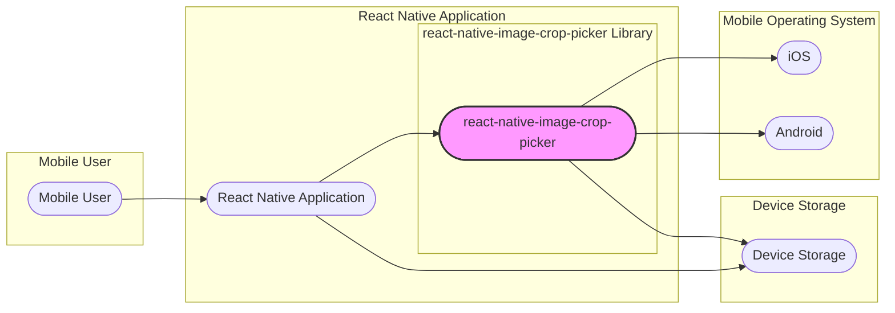
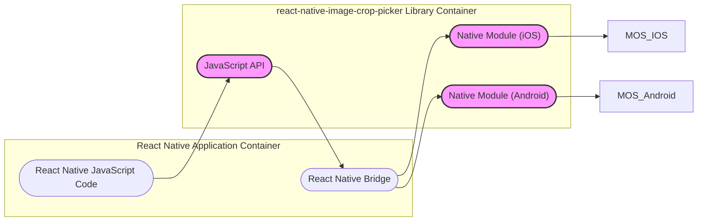
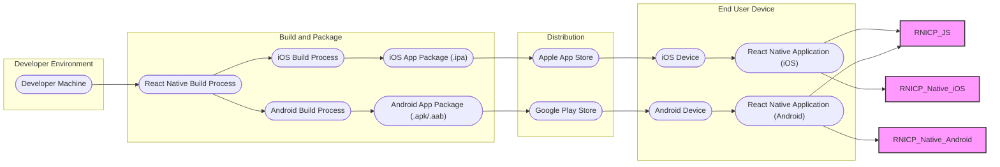
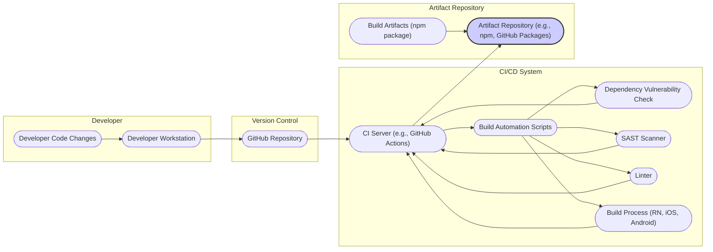

# BUSINESS POSTURE

- Business Priorities and Goals:
  - Provide a reusable and reliable React Native component for image selection and cropping.
  - Simplify the process of integrating image handling capabilities into React Native applications.
  - Offer a feature-rich and customizable solution to meet diverse developer needs.
  - Maintain a high level of quality and stability to ensure developer trust and adoption.
- Business Risks:
  - Security vulnerabilities in the library could be exploited by malicious actors in applications that depend on it, leading to data breaches or application instability.
  - Lack of timely security updates and bug fixes could erode developer trust and lead to decreased adoption.
  - Poor performance or compatibility issues could negatively impact the user experience of applications using the library.
  - Legal and compliance risks if the library mishandles user data or violates privacy regulations.

# SECURITY POSTURE

- Existing Security Controls:
  - security control: Open Source Code - The library is publicly available on GitHub, allowing for community review and scrutiny of the codebase. Implemented: GitHub Repository.
  - security control: Dependency Management - Relies on `npm` or `yarn` for dependency management, which includes mechanisms for vulnerability scanning and updates (though not explicitly enforced by the library itself). Implemented: `package.json`, `yarn.lock` or `package-lock.json`.
  - security control: Platform Security - Leverages the underlying security features of the mobile operating systems (iOS and Android) for image processing and storage. Implemented: Native modules relying on OS APIs.
- Accepted Risks:
  - accepted risk: Dependency Vulnerabilities - The library depends on third-party packages, which may contain security vulnerabilities. Mitigation relies on regular dependency updates.
  - accepted risk: Misuse by Developers - Developers integrating the library might misuse its features or not implement proper security practices in their applications, leading to vulnerabilities.
  - accepted risk: Platform Specific Vulnerabilities - Underlying mobile platforms (iOS/Android) may have undiscovered vulnerabilities that could affect the library's security.
- Recommended Security Controls:
  - security control: Automated Dependency Scanning - Implement automated tools to regularly scan dependencies for known vulnerabilities and trigger alerts for necessary updates.
  - security control: Static Application Security Testing (SAST) - Integrate SAST tools into the development pipeline to automatically analyze the codebase for potential security flaws.
  - security control: Code Review Process - Implement mandatory code reviews, including security-focused reviews, for all code changes before merging them into the main branch.
  - security control: Input Validation and Sanitization -  Ensure robust input validation and sanitization within the library to prevent common injection attacks, especially when handling image paths and cropping parameters.
  - security control: Security Audits - Conduct periodic security audits by external security experts to identify and address potential vulnerabilities.
- Security Requirements:
  - Authentication: Not directly applicable as this is a client-side library. Authentication is the responsibility of the application integrating this library.
  - Authorization: Not directly applicable as this is a client-side library. Authorization is the responsibility of the application integrating this library.
  - Input Validation:
    - Requirement: Validate all inputs received from the application using the library, including image paths, cropping dimensions, and options.
    - Requirement: Sanitize inputs to prevent injection attacks (e.g., path traversal).
    - Requirement: Implement checks to ensure that provided image paths are within expected boundaries and accessible.
  - Cryptography:
    - Requirement: If the library handles sensitive image data in memory or during temporary storage, consider using encryption to protect it. (Note: Based on the library's description, this might not be a primary requirement, but should be considered if sensitive data handling is introduced).
    - Requirement: Ensure secure handling of any cryptographic keys or sensitive data if encryption is implemented.

# DESIGN

## C4 CONTEXT

- Context Diagram Elements:
  - - Name: Mobile User
    - Type: Person
    - Description: End-user of the mobile application that utilizes the `react-native-image-crop-picker` library.
    - Responsibilities: Interacts with the mobile application, selects and crops images.
    - Security controls: Device level security controls (passcode, biometrics) to protect the mobile device and data.
  - - Name: React Native Application
    - Type: Software System
    - Description: The mobile application developed using React Native that integrates the `react-native-image-crop-picker` library to provide image picking and cropping functionality to the user.
    - Responsibilities: Provides user interface, utilizes the `react-native-image-crop-picker` library, handles user interactions, and manages image data within the application context.
    - Security controls: Application level security controls (authentication, authorization, data encryption, secure storage) implemented by the application developers.
  - - Name: react-native-image-crop-picker Library
    - Type: Software System
    - Description: The React Native library responsible for providing image picking and cropping functionalities. It acts as a bridge between the React Native application and the native mobile operating system's image handling capabilities.
    - Responsibilities: Provides API for image picking and cropping, interacts with native modules, returns image data to the React Native application.
    - Security controls: Input validation, secure handling of temporary files, adherence to secure coding practices within the library.
  - - Name: iOS
    - Type: Software System
    - Description: Apple's mobile operating system. Provides native APIs for image access, processing, and storage that are utilized by the `react-native-image-crop-picker` library on iOS devices.
    - Responsibilities: Manages image access permissions, provides image processing functionalities, handles file system operations.
    - Security controls: Operating system level security controls, permission management, sandboxing, secure storage.
  - - Name: Android
    - Type: Software System
    - Description: Google's mobile operating system. Provides native APIs for image access, processing, and storage that are utilized by the `react-native-image-crop-picker` library on Android devices.
    - Responsibilities: Manages image access permissions, provides image processing functionalities, handles file system operations.
    - Security controls: Operating system level security controls, permission management, sandboxing, secure storage.
  - - Name: Device Storage
    - Type: Data Store
    - Description: Local storage on the mobile device where images are stored. This includes the device's file system and potentially photo libraries.
    - Responsibilities: Stores image files, provides access to image data for applications.
    - Security controls: Operating system level file system permissions, application sandboxing, device encryption.

## C4 CONTAINER

- Container Diagram Elements:
  - - Name: React Native JavaScript Code
    - Type: Container
    - Description: The JavaScript codebase of the React Native application that utilizes the `react-native-image-crop-picker` library.
    - Responsibilities: Application logic, UI rendering, calling the `react-native-image-crop-picker` JavaScript API.
    - Security controls: Application level JavaScript security best practices, secure coding practices.
  - - Name: React Native Bridge
    - Type: Container
    - Description: The React Native bridge facilitates communication between JavaScript code and native modules.
    - Responsibilities: Serializing and deserializing data between JavaScript and native code, invoking native module functions.
    - Security controls: React Native bridge security mechanisms, minimizing data exposure during bridge communication.
  - - Name: react-native-image-crop-picker JavaScript API
    - Type: Container
    - Description: The JavaScript interface of the `react-native-image-crop-picker` library, providing functions for image picking and cropping that are called by the React Native application's JavaScript code.
    - Responsibilities: Exposing API functions, handling JavaScript side logic, passing requests to native modules via the React Native bridge.
    - Security controls: Input validation in JavaScript, secure API design, preventing injection vulnerabilities.
  - - Name: Native Module (iOS)
    - Type: Container
    - Description: Native iOS module of the `react-native-image-crop-picker` library, written in Objective-C or Swift. Interacts with iOS system APIs for image picking and cropping.
    - Responsibilities: Implementing iOS specific image picking and cropping logic, interacting with iOS frameworks (e.g., Photos framework, UIKit), handling image data on iOS.
    - Security controls: Secure coding practices in Objective-C/Swift, proper use of iOS security APIs, handling permissions correctly, preventing memory leaks and buffer overflows.
  - - Name: Native Module (Android)
    - Type: Container
    - Description: Native Android module of the `react-native-image-crop-picker` library, written in Java or Kotlin. Interacts with Android system APIs for image picking and cropping.
    - Responsibilities: Implementing Android specific image picking and cropping logic, interacting with Android frameworks (e.g., MediaStore API, Activity Result API), handling image data on Android.
    - Security controls: Secure coding practices in Java/Kotlin, proper use of Android security APIs, handling permissions correctly, preventing memory leaks and buffer overflows.

## DEPLOYMENT

- Deployment Architecture Options:
  - Option 1: Direct integration into React Native application - The library is directly integrated into the React Native application code and deployed as part of the application package to app stores (Apple App Store, Google Play Store).
  - Option 2: (Less likely for this type of library) Distributed as a standalone service -  This library is not typically deployed as a standalone service. It's designed to be embedded within mobile applications.

- Detailed Deployment Architecture (Option 1 - Direct Integration):

- Deployment Diagram Elements:
  - - Name: Developer Machine
    - Type: Infrastructure
    - Description: The computer used by developers to write code, build, and test the React Native application and the `react-native-image-crop-picker` library (during development).
    - Responsibilities: Code development, local testing, building application packages.
    - Security controls: Developer workstation security practices, access control, code repository security.
  - - Name: React Native Build Process
    - Type: Process
    - Description: The process of building the React Native JavaScript code and preparing it for platform-specific builds.
    - Responsibilities: Bundling JavaScript code, optimizing assets, preparing for native builds.
    - Security controls: Dependency management, build script security, secure handling of build artifacts.
  - - Name: iOS Build Process
    - Type: Process
    - Description: Apple's Xcode build process for compiling native iOS code and creating an iOS application package.
    - Responsibilities: Compiling Objective-C/Swift code, linking libraries, signing the application, creating `.ipa` package.
    - Security controls: Apple's code signing process, secure build environment, Xcode security features.
  - - Name: Android Build Process
    - Type: Process
    - Description: Google's Android Studio/Gradle build process for compiling native Android code and creating an Android application package.
    - Responsibilities: Compiling Java/Kotlin code, linking libraries, signing the application, creating `.apk` or `.aab` package.
    - Security controls: Android signing process, secure build environment, Android Studio/Gradle security features.
  - - Name: iOS App Package (.ipa)
    - Type: Artifact
    - Description: The iOS application package file that is uploaded to the Apple App Store.
    - Responsibilities: Contains the compiled iOS application, resources, and metadata for distribution.
    - Security controls: Code signing, integrity checks by the App Store.
  - - Name: Android App Package (.apk/.aab)
    - Type: Artifact
    - Description: The Android application package file (APK or Android App Bundle) that is uploaded to the Google Play Store.
    - Responsibilities: Contains the compiled Android application, resources, and metadata for distribution.
    - Security controls: Signing, integrity checks by the Play Store.
  - - Name: Apple App Store
    - Type: Infrastructure
    - Description: Apple's platform for distributing iOS applications to end-users.
    - Responsibilities: Application hosting, distribution, security scanning, code signing verification.
    - Security controls: App Store security policies, malware scanning, code signing enforcement.
  - - Name: Google Play Store
    - Type: Infrastructure
    - Description: Google's platform for distributing Android applications to end-users.
    - Responsibilities: Application hosting, distribution, security scanning, signing verification.
    - Security controls: Play Store security policies, malware scanning, signing enforcement, Play Protect.
  - - Name: iOS Device
    - Type: Infrastructure
    - Description: End-user's iOS mobile device where the application is installed and run.
    - Responsibilities: Running the application, providing user interface, executing application code.
    - Security controls: Device level security controls, operating system security, application sandboxing.
  - - Name: Android Device
    - Type: Infrastructure
    - Description: End-user's Android mobile device where the application is installed and run.
    - Responsibilities: Running the application, providing user interface, executing application code.
    - Security controls: Device level security controls, operating system security, application sandboxing.
  - - Name: React Native Application (iOS/Android)
    - Type: Software System
    - Description: The deployed React Native application on the end-user's device, including the integrated `react-native-image-crop-picker` library.
    - Responsibilities: Providing image picking and cropping functionality to the end-user, interacting with the mobile OS and device storage.
    - Security controls: Application level security controls, leveraging device and OS security features, library security controls.

## BUILD

- Build Process Description:
  - Developer makes code changes on their workstation.
  - Changes are committed and pushed to the GitHub repository.
  - CI/CD system (e.g., GitHub Actions) is triggered by code changes.
  - Build automation scripts are executed by the CI server.
  - Security checks are performed:
    - Dependency vulnerability check: Scans dependencies for known vulnerabilities.
    - SAST scanner: Static Application Security Testing to identify potential security flaws in the code.
    - Linter: Code linting to enforce code quality and style, which can indirectly improve security.
  - Build process is executed to compile and package the library (React Native, iOS, Android components).
  - Build artifacts (e.g., npm package) are created and published to an artifact repository (e.g., npm registry, GitHub Packages).
- Build Process Security Controls:
  - security control: Secure Code Repository - Using GitHub with access controls, branch protection, and audit logs. Implemented: GitHub Repository settings.
  - security control: CI/CD Pipeline Security - Secure configuration of CI/CD system, access control, secret management for API keys and credentials. Implemented: CI/CD platform configuration (e.g., GitHub Actions settings).
  - security control: Automated Dependency Scanning - Using tools like `npm audit`, `yarn audit`, or dedicated dependency scanning tools in the CI/CD pipeline. Implemented: CI/CD pipeline scripts.
  - security control: Static Application Security Testing (SAST) - Integrating SAST tools into the CI/CD pipeline to automatically analyze code for vulnerabilities. Implemented: CI/CD pipeline scripts, SAST tool integration.
  - security control: Code Linting - Enforcing code quality and style guidelines using linters in the CI/CD pipeline. Implemented: CI/CD pipeline scripts, linter configuration.
  - security control: Build Artifact Signing - Signing build artifacts (e.g., npm packages) to ensure integrity and authenticity. Implemented: Build scripts, artifact repository settings.
  - security control: Artifact Repository Security - Secure artifact repository with access controls and vulnerability scanning. Implemented: Artifact repository platform security features (e.g., npm registry, GitHub Packages security settings).

# RISK ASSESSMENT

- Critical Business Processes:
  - Providing a secure and reliable image picking and cropping library for React Native developers.
  - Maintaining developer trust and ensuring wide adoption of the library.
  - Protecting the reputation of the library and applications that use it.
- Data to Protect and Sensitivity:
  - User Images: Potentially sensitive personal photos or images depending on the application context. Sensitivity level varies greatly depending on the application using the library (e.g., healthcare app vs. social media app).
  - Cropping Parameters: Relatively low sensitivity, but could be exploited if not properly validated (e.g., path traversal).
  - Temporary Files: Temporary image files created during processing. Sensitivity depends on the content of the images. Should be securely handled and deleted after use.

# QUESTIONS & ASSUMPTIONS

- Questions:
  - What is the intended scope of security for this library? Is it primarily focused on preventing vulnerabilities within the library itself, or also providing guidance to developers on secure integration?
  - Are there any specific compliance requirements (e.g., GDPR, HIPAA) that applications using this library might need to adhere to, and how does the library support these?
  - What is the process for reporting and addressing security vulnerabilities in the library?
  - Are there any plans for formal security audits or penetration testing of the library?
- Assumptions:
  - The primary users of this library are React Native developers who may or may not have deep security expertise.
  - Security vulnerabilities in this library could have a wide impact due to its potential for broad adoption in the React Native ecosystem.
  - The library is intended to be used in a variety of mobile applications with different security and privacy requirements.
  - The maintainers of the library are committed to addressing security concerns and maintaining a secure codebase.