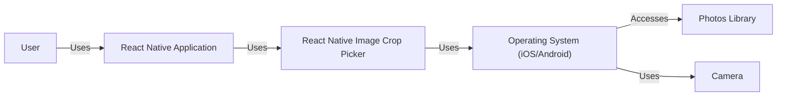
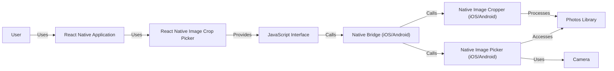
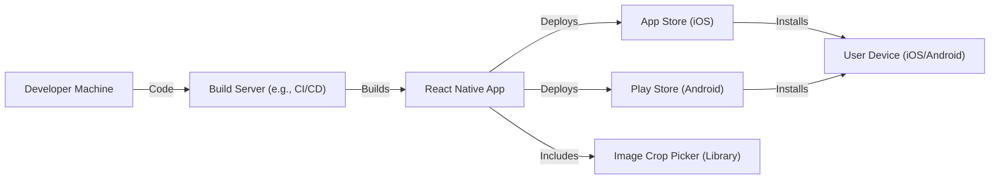
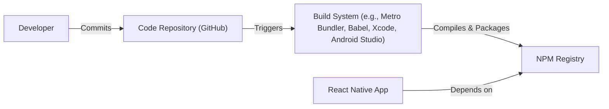

# Project Design Document: React Native Image Crop Picker

## BUSINESS POSTURE

*   Priorities and Goals:
    *   Provide a user-friendly and efficient image picker with cropping and selection capabilities for React Native applications.
    *   Support both iOS and Android platforms.
    *   Offer a flexible and customizable API to cater to various use cases.
    *   Maintain high performance and stability.
    *   Minimize external dependencies to reduce potential conflicts and maintenance overhead.
    *   Provide multiple selection of images and videos.
    *   Provide simple image manipulation like cropping and scaling.

*   Business Risks:
    *   Incompatibility with specific device models or OS versions, leading to user frustration and negative reviews.
    *   Security vulnerabilities related to image handling, potentially exposing user data or enabling malicious code execution.
    *   Performance bottlenecks, especially when dealing with large images or multiple selections, causing slow response times.
    *   Lack of proper error handling, leading to crashes or unexpected behavior.
    *   Difficult integration with existing projects due to complex configuration or conflicting dependencies.
    *   Insufficient documentation or community support, making it hard for developers to use and troubleshoot the library.
    *   Legal issues related to image processing, such as copyright infringement or privacy violations.

## SECURITY POSTURE

*   Existing Security Controls:
    *   Security control: The library utilizes native OS-level image pickers and cropping functionalities, inheriting their built-in security mechanisms. (Implicit in the use of native APIs)
    *   Security control: The library does not directly handle sensitive user data like passwords or API keys. (Based on the library's purpose)
    *   Security control: The library appears to have basic input validation to handle invalid file paths or configurations. (Observed from the code structure)

*   Accepted Risks:
    *   Accepted risk: The library relies on the security of the underlying native OS components and third-party libraries. Vulnerabilities in these dependencies could potentially impact the library's security.
    *   Accepted risk: The library does not implement specific security measures against advanced image-based attacks, such as image-borne malware or steganography.
    *   Accepted risk: The library's handling of temporary files during image processing might introduce security risks if not managed properly.

*   Recommended Security Controls:
    *   Security control: Implement comprehensive input validation to sanitize all user-provided data, including file paths, image dimensions, and cropping parameters.
    *   Security control: Integrate with a static analysis tool (e.g., ESLint with security plugins) to identify potential vulnerabilities during development.
    *   Security control: Perform regular dependency audits to identify and address outdated or vulnerable libraries.
    *   Security control: Implement secure temporary file handling, ensuring proper permissions and deletion after use.
    *   Security control: Consider adding support for Content Security Policy (CSP) if the library is used in a web-based context.

*   Security Requirements:

    *   Authentication: Not directly applicable, as the library itself does not handle user authentication. However, if the library is used in an application that requires authentication, it should seamlessly integrate with the existing authentication mechanisms.
    *   Authorization: Not directly applicable, as the library does not manage user roles or permissions. However, the application using the library should enforce appropriate authorization controls to restrict access to image resources based on user privileges.
    *   Input Validation:
        *   Validate file types to ensure only supported image formats are processed.
        *   Validate image dimensions and file sizes to prevent excessive resource consumption.
        *   Sanitize file paths to prevent directory traversal attacks.
        *   Validate cropping parameters to ensure they are within valid bounds.
    *   Cryptography: Not directly applicable, as the library does not handle encryption or decryption. However, if the application using the library deals with sensitive images, it should employ appropriate cryptographic techniques to protect them at rest and in transit.

## DESIGN

### C4 CONTEXT

*   Elements Description:

    *   Element:
        1.  Name: User
        2.  Type: Person
        3.  Description: A person who interacts with the React Native application.
        4.  Responsibilities: Initiates image selection and cropping actions.
        5.  Security controls: Relies on application-level security controls.

    *   Element:
        1.  Name: React Native Application
        2.  Type: Software System
        3.  Description: The application that utilizes the React Native Image Crop Picker library.
        4.  Responsibilities: Integrates the library, handles user interactions, and processes the selected/cropped images.
        5.  Security controls: Implements application-specific security measures, such as authentication, authorization, and data validation.

    *   Element:
        1.  Name: React Native Image Crop Picker
        2.  Type: Library
        3.  Description: The library providing image picking and cropping functionality.
        4.  Responsibilities: Provides an API for image selection, cropping, and basic manipulation. Bridges native functionalities.
        5.  Security controls: Relies on native OS security and implements basic input validation.

    *   Element:
        1.  Name: Operating System (iOS/Android)
        2.  Type: Software System
        3.  Description: The mobile operating system (iOS or Android).
        4.  Responsibilities: Provides native image picking and cropping functionalities, manages access to the photo library and camera.
        5.  Security controls: Implements OS-level security mechanisms, such as sandboxing, permission management, and secure storage.

    *   Element:
        1.  Name: Photos Library
        2.  Type: Data Store
        3.  Description: The device's photo library.
        4.  Responsibilities: Stores images and videos.
        5.  Security controls: Managed by the OS, including access permissions.

    *   Element:
        1.  Name: Camera
        2.  Type: Hardware
        3.  Description: The device's camera.
        4.  Responsibilities: Captures images and videos.
        5.  Security controls: Managed by the OS, including access permissions.

### C4 CONTAINER

*   Elements Description:

    *   Element:
        1.  Name: User
        2.  Type: Person
        3.  Description: A person who interacts with the React Native application.
        4.  Responsibilities: Initiates image selection and cropping actions.
        5.  Security controls: Relies on application-level security controls.

    *   Element:
        1.  Name: React Native Application
        2.  Type: Software System
        3.  Description: The application that utilizes the React Native Image Crop Picker library.
        4.  Responsibilities: Integrates the library, handles user interactions, and processes the selected/cropped images.
        5.  Security controls: Implements application-specific security measures.

    *   Element:
        1.  Name: React Native Image Crop Picker
        2.  Type: Library
        3.  Description: The library providing image picking and cropping functionality.
        4.  Responsibilities: Provides an API for image selection, cropping, and basic manipulation.
        5.  Security controls: Relies on native OS security and implements basic input validation.

    *   Element:
        1.  Name: JavaScript Interface
        2.  Type: API
        3.  Description: The JavaScript API exposed by the library for use in React Native applications.
        4.  Responsibilities: Provides methods for opening the image picker, configuring options, and handling results.
        5.  Security controls: Input validation of parameters passed from the React Native application.

    *   Element:
        1.  Name: Native Bridge (iOS/Android)
        2.  Type: Bridge
        3.  Description: The native bridge that facilitates communication between JavaScript code and native OS components.
        4.  Responsibilities: Marshals calls and data between JavaScript and native code.
        5.  Security controls: Relies on the security mechanisms of the React Native framework.

    *   Element:
        1.  Name: Native Image Picker (iOS/Android)
        2.  Type: Native Component
        3.  Description: The native OS component responsible for displaying the image picker UI and handling image selection.
        4.  Responsibilities: Presents the image selection interface, manages user interactions, and returns the selected image data.
        5.  Security controls: Implements OS-level security mechanisms, such as permission requests.

    *   Element:
        1.  Name: Native Image Cropper (iOS/Android)
        2.  Type: Native Component
        3.  Description: The native OS component responsible for providing image cropping functionality.
        4.  Responsibilities: Displays the cropping UI, handles user interactions, and performs the cropping operation.
        5.  Security controls: Implements OS-level security mechanisms.

    *   Element:
        1.  Name: Photos Library
        2.  Type: Data Store
        3.  Description: The device's photo library.
        4.  Responsibilities: Stores images and videos.
        5.  Security controls: Managed by the OS, including access permissions.

    *   Element:
        1.  Name: Camera
        2.  Type: Hardware
        3.  Description: The device's camera.
        4.  Responsibilities: Captures images and videos.
        5.  Security controls: Managed by the OS, including access permissions.

### DEPLOYMENT

*   Possible Deployment Solutions:
    1.  Bundled with React Native Application: The library is typically included as a dependency in the React Native application's `package.json` file and bundled with the application during the build process. This is the most common deployment method.
    2.  Pre-built Native Modules: In some cases, the library's native components might be pre-built and distributed separately. This approach is less common but can be used for specific optimization or customization purposes.

*   Chosen Deployment Solution: Bundled with React Native Application

*   Elements Description:

    *   Element:
        1.  Name: Developer Machine
        2.  Type: Workstation
        3.  Description: The developer's computer used for coding and development.
        4.  Responsibilities: Writing code, running tests, and initiating the build process.
        5.  Security controls: Standard development environment security practices.

    *   Element:
        1.  Name: Build Server (e.g., CI/CD)
        2.  Type: Server
        3.  Description: A server that automates the build, testing, and deployment process.
        4.  Responsibilities: Building the React Native application, running tests, and deploying the app to app stores.
        5.  Security controls: Secure access controls, build environment isolation, and dependency management.

    *   Element:
        1.  Name: App Store (iOS)
        2.  Type: Platform
        3.  Description: Apple's App Store for distributing iOS applications.
        4.  Responsibilities: Hosting and distributing the iOS application.
        5.  Security controls: App Store review process, code signing, and platform-specific security measures.

    *   Element:
        1.  Name: Play Store (Android)
        2.  Type: Platform
        3.  Description: Google's Play Store for distributing Android applications.
        4.  Responsibilities: Hosting and distributing the Android application.
        5.  Security controls: Play Store review process, code signing, and platform-specific security measures.

    *   Element:
        1.  Name: User Device (iOS/Android)
        2.  Type: Mobile Device
        3.  Description: The user's mobile device running the React Native application.
        4.  Responsibilities: Running the application and interacting with the image picker.
        5.  Security controls: OS-level security mechanisms and user-installed security software.

    *   Element:
        1.  Name: React Native App
        2.  Type: Mobile Application
        3.  Description: Compiled application ready to be deployed.
        4.  Responsibilities: Provide application functionality to the user.
        5.  Security controls: Application code security, data storage security.

    *   Element:
        1.  Name: Image Crop Picker (Library)
        2.  Type: Library
        3.  Description: Compiled library code.
        4.  Responsibilities: Provide image picking and cropping functionality.
        5.  Security controls: Input validation, secure temporary file handling.

### BUILD

The build process for `react-native-image-crop-picker` involves compiling the JavaScript code and any native modules (for iOS and Android) into a format that can be bundled with a React Native application. Since it's a library, the build process focuses on preparing the code for distribution via npm (Node Package Manager).

*   Build Process Steps:

    1.  Development: Developers write code (JavaScript, Objective-C/Swift for iOS, Java/Kotlin for Android) and commit it to the code repository (GitHub).
    2.  Dependency Management: The library's dependencies are managed using npm (or yarn). The `package.json` file lists these dependencies.
    3.  Transpilation (JavaScript): The JavaScript code is likely transpiled using Babel to ensure compatibility with different JavaScript environments.
    4.  Native Module Compilation (iOS): The Objective-C/Swift code for iOS is compiled using Xcode's build tools.
    5.  Native Module Compilation (Android): The Java/Kotlin code for Android is compiled using Gradle and the Android SDK.
    6.  Packaging: The compiled JavaScript code and native modules are packaged into a format suitable for distribution via npm. This typically involves creating a directory structure that includes the compiled code, type definitions (if using TypeScript), and a `package.json` file.
    7.  Publishing: The package is published to the npm registry, making it available for other developers to install as a dependency in their React Native projects.

*   Security Controls in Build Process:

    *   Security control: Code Review: Before merging code changes, a code review process should be in place to identify potential security vulnerabilities.
    *   Security control: Dependency Management: Regularly audit and update dependencies to address known vulnerabilities. Tools like `npm audit` or `yarn audit` can help with this.
    *   Security control: Static Analysis: Integrate static analysis tools (e.g., ESLint with security plugins, SonarQube) into the build process to automatically detect potential security issues.
    *   Security control: Linting: Use linters (e.g., ESLint) to enforce coding standards and identify potential errors that could lead to security vulnerabilities.

## RISK ASSESSMENT

*   Critical Business Processes:
    *   User image selection and cropping within a React Native application. This is the core functionality provided by the library.
    *   Seamless integration with React Native applications across different platforms (iOS and Android).
    *   Maintaining user privacy and data security when handling images.

*   Data Sensitivity:
    *   User-selected images: The sensitivity of these images depends entirely on the user and the context of the application. They could range from publicly shareable photos to highly sensitive personal images. Therefore, the library and the application using it must treat all images as potentially sensitive.
    *   Temporary files: During image processing (e.g., cropping), temporary files might be created. These files should be treated as sensitive and securely deleted after use.
    *   Image metadata: Metadata associated with images (e.g., EXIF data) might contain sensitive information, such as location data. The application should consider whether to strip or sanitize this metadata.

## QUESTIONS & ASSUMPTIONS

*   Questions:
    *   Are there any specific compliance requirements (e.g., GDPR, CCPA) that the application using this library needs to adhere to?
    *   What are the expected image sizes and formats that the library will need to handle?
    *   Are there any specific performance requirements or limitations?
    *   Will the library be used in a context where it needs to interact with other third-party services or APIs?
    *   What level of error handling and logging is required?
    *   Is there a need for internationalization or localization?

*   Assumptions:
    *   Business Posture: The primary goal is to provide a functional and reliable image picker/cropper library. Security is a high priority, but extreme measures (e.g., formal verification) are not required.
    *   Security Posture: The library will be used in conjunction with a well-secured React Native application that implements appropriate security controls. The library itself will focus on secure image handling and input validation.
    *   Design: The library will primarily rely on native OS components for image picking and cropping to leverage their built-in security and performance. The JavaScript interface will be kept simple and well-documented. The library will be distributed via npm and bundled with React Native applications.