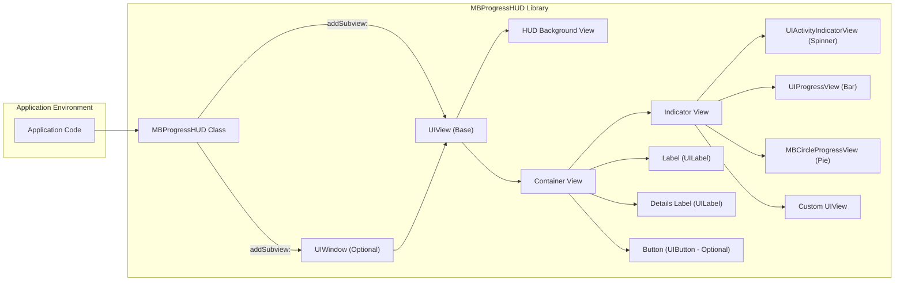

# Project Design Document: MBProgressHUD

**Project Name:** MBProgressHUD

**Project Repository:** https://github.com/jdg/mbprogresshud

**Document Version:** 1.1

**Date:** October 26, 2023

**Author:** AI Software Architect

## 1. Introduction

This document provides an enhanced architectural design of the MBProgressHUD library, building upon the previous version. This detailed design will serve as the foundation for subsequent threat modeling activities. MBProgressHUD is a widely used library for iOS, macOS, tvOS, and watchOS, offering a straightforward and visually appealing way to display progress indicators with optional labels and supplementary information. This document elaborates on the library's components, data flow, and key functionalities, providing a deeper understanding for security analysis.

## 2. Goals

*   Provide a comprehensive and refined overview of the MBProgressHUD architecture.
*   Clearly identify key components, their specific responsibilities, and interactions.
*   Detail the data flow within the library with greater precision.
*   Establish a robust and unambiguous understanding of the system architecture for thorough threat modeling.

## 3. Target Audience

*   Security engineers responsible for threat modeling and security assessments.
*   Software developers integrating or extending the MBProgressHUD library.
*   System architects evaluating the design for security, maintainability, and integration aspects.

## 4. System Overview

MBProgressHUD is a modal view designed to overlay the current application view or window, effectively communicating ongoing operations to the user. It offers various display modes, including indeterminate spinners, determinate progress bars (linear and circular), and the ability to present custom views. The library prioritizes ease of integration and offers extensive customization options to match the application's visual style.

## 5. Architectural Design

### 5.1. Component Diagram

### 5.2. Component Description

*   **Application Code:** The portion of the host application responsible for instantiating, configuring, showing, and hiding the `MBProgressHUD`. This code directly interacts with the `MBProgressHUD` class.
*   **MBProgressHUD Class:** The central class of the library, inheriting from `UIView`. It orchestrates the creation, management, and presentation of the HUD's visual elements.
    *   Responsibilities:
        *   Manages the lifecycle of the HUD instance.
        *   Creates and arranges subviews (background, container, indicator, labels, button).
        *   Applies configuration settings (mode, text, colors, animations).
        *   Handles the logic for displaying and dismissing the HUD, including animations and timers.
        *   Responds to user interaction with the optional button.
        *   Provides methods for updating progress values in determinate modes.
*   **UIWindow (Optional):** The window instance to which the `MBProgressHUD`'s view is added. If no specific window is provided, it typically defaults to the application's key window. This ensures the HUD overlays the entire screen.
*   **UIView (Base):** The fundamental building block for all views in UIKit. `MBProgressHUD` itself extends `UIView`, inheriting its basic view management capabilities.
*   **HUD Background View:** A semi-transparent `UIView` that sits behind the main content of the HUD. It provides visual separation from the underlying application content and can optionally block user interaction with the background.
    *   Responsibilities:
        *   Creating a visual backdrop for the HUD.
        *   Optionally intercepting touch events to prevent interaction with the underlying views.
*   **Container View:** A central `UIView` within the `MBProgressHUD` that acts as a container for the indicator, labels, and the optional button. This simplifies layout management and styling of the HUD's content.
    *   Responsibilities:
        *   Organizing and positioning the indicator, labels, and button.
        *   Applying styling and visual attributes to the content area.
*   **Indicator View:** The `UIView` responsible for visually representing the progress of an operation. The specific type of indicator view depends on the selected mode.
    *   **UIActivityIndicatorView (Spinner):** The standard spinning indicator for indeterminate progress.
    *   **UIProgressView (Bar):** A linear progress bar for displaying determinate progress.
    *   **MBCircleProgressView (Pie):** A circular pie chart style progress indicator for determinate progress.
    *   **Custom UIView:** Allows developers to provide their own `UIView` subclass for a completely custom progress visualization.
*   **Label (UILabel):** A standard UIKit label used to display the primary message or status text to the user.
*   **Details Label (UILabel):** An additional UIKit label for displaying more detailed information below the main label.
*   **Button (UIButton - Optional):** An optional interactive button that can be added to the HUD, allowing the user to perform an action (e.g., cancel an operation).

### 5.3. Data Flow

The lifecycle of an MBProgressHUD involves the following data flow steps:

1. **Instantiation and Configuration:** The application code instantiates an `MBProgressHUD` object, often using class methods like `showAddedTo:animated:`. Configuration properties are then set.
    *   Data Input: Target `UIView` or `UIWindow`, animation boolean, HUD mode (e.g., `MBProgressHUDModeIndeterminate`, `MBProgressHUDModeDeterminate`), label string, details label string, custom view (if applicable), colors, fonts, bezel style, grace time, minimum show time, button title and action.
    *   Data Output: An initialized `MBProgressHUD` instance with the specified configuration.
2. **Adding to View Hierarchy:** The `MBProgressHUD`'s view is added as a subview to the designated target view or window.
    *   Data Input: The `MBProgressHUD` instance itself.
    *   Data Flow: The `addSubview:` method of the target `UIView` or `UIWindow` is called, making the HUD a part of the view hierarchy.
3. **Display Animation:** The HUD is made visible, typically with a fade-in animation.
    *   Data Input: Animation duration and style (if customized).
    *   Data Flow: Changes to the `alpha` property of the `MBProgressHUD`'s view are animated.
4. **Progress Updates (Determinate Modes):** For determinate progress modes, the application code updates the `progress` property of the `MBProgressHUD` instance.
    *   Data Input: A floating-point value between 0.0 and 1.0 representing the progress.
    *   Data Flow: The `progress` value is passed to the `Indicator View` (e.g., `UIProgressView` or `MBCircleProgressView`) to update its visual representation.
5. **User Interaction (Optional Button):** If a button is present, user interaction (a tap) triggers an action defined by the application.
    *   Data Input: User touch event on the button.
    *   Data Flow: The button's target-action mechanism is used to notify the application code of the user interaction.
6. **Dismissal Initiation:** The HUD dismissal process is initiated either programmatically by the application code (e.g., calling `hideAnimated:`) or automatically after a set delay.
    *   Data Input: Animation boolean for dismissal.
7. **Dismissal Animation:** The HUD is animated out of view, typically with a fade-out effect.
    *   Data Input: Animation duration and style (if customized).
    *   Data Flow: Changes to the `alpha` property of the `MBProgressHUD`'s view are animated.
8. **Removal from View Hierarchy:** The `MBProgressHUD`'s view is removed from its superview.
    *   Data Flow: The `removeFromSuperview` method is called on the `MBProgressHUD`'s view.
9. **Deallocation:** The `MBProgressHUD` object is deallocated, releasing its resources.

### 5.4. Key Functionalities

*   **Displaying Modal Progress Indicators:** The primary function, providing a clear visual cue for ongoing tasks.
*   **Configurable Display Modes:** Supports indeterminate, determinate (bar and pie), and custom view modes.
*   **Textual Feedback:** Allows displaying a main label and a more detailed secondary label.
*   **Customizable Appearance:** Offers options to change colors, fonts, background styles, and more.
*   **Animated Presentation and Dismissal:** Provides smooth transitions for showing and hiding the HUD.
*   **Automatic Dismissal with Delay:** Can be configured to automatically hide after a specified time.
*   **Optional User Interaction:** Enables adding a button for user actions like cancellation.
*   **Grace Period:** Introduces a delay before showing the HUD, preventing brief flashes for quick operations.
*   **Minimum Display Time:** Ensures the HUD remains visible for a minimum duration, improving user experience for very fast operations.

## 6. Security Considerations (Pre-Threat Modeling)

Building upon the initial considerations, here are more specific security aspects relevant to MBProgressHUD:

*   **Input Sanitization for Labels:** While `UILabel` inherently provides some protection against direct code injection, applications should still sanitize strings displayed in the main and details labels to prevent unexpected rendering issues or the display of potentially harmful content if the input source is untrusted. Consider scenarios where label text originates from external sources or user input.
*   **Security of Custom Indicator Views:** If a developer utilizes the custom view mode, the security of that custom `UIView` is entirely the responsibility of the application developer. Potential vulnerabilities within the custom view (e.g., memory leaks, rendering issues, or even more severe flaws depending on its implementation) would not be attributable to the MBProgressHUD library itself but are important to consider in the context of its usage.
*   **Resource Management and Denial of Service:** Repeatedly showing and hiding the HUD or creating numerous instances without proper deallocation could potentially lead to resource exhaustion (memory leaks, excessive view creation), potentially causing performance issues or even a denial-of-service within the application.
*   **Thread Safety:** While the library likely performs UI updates on the main thread, if application code interacts with the `MBProgressHUD` instance from background threads (e.g., updating progress), proper synchronization mechanisms must be in place to prevent race conditions and unexpected behavior, especially when modifying properties related to UI updates.
*   **Information Disclosure:** Avoid displaying sensitive information within the HUD's labels or custom views, as the screen content could be captured through screenshots, screen recordings, or accessibility features. Consider the potential exposure of data displayed in the HUD.
*   **Accessibility Considerations (and potential abuse):** While intended to improve accessibility, improper configuration or malicious use of accessibility features in conjunction with the HUD could potentially be exploited. For example, excessively long or misleading label text could be used in a social engineering attack.
*   **Handling of Button Actions:** Ensure that the actions associated with the optional button are handled securely within the application code. Maliciously crafted button actions could lead to unintended consequences.

## 7. Assumptions

*   The library is integrated and used according to its intended purpose of displaying progress indicators.
*   The underlying operating system and UI frameworks (UIKit/AppKit) are functioning correctly and securely.
*   The application utilizing the library is responsible for providing valid, safe, and appropriately sanitized data for display within the HUD.
*   Developers are adhering to best practices for memory management and thread safety when interacting with the library.

## 8. Out of Scope

*   Detailed analysis of the internal implementation of the UIKit/AppKit frameworks.
*   Security vulnerabilities residing within the operating system or hardware.
*   In-depth performance benchmarking and optimization of the library's code.
*   Specific business logic or use cases implemented by applications using the library.
*   The security assessment of third-party libraries or dependencies not directly included within the MBProgressHUD library.
*   Vulnerabilities introduced by modifications to the library's source code by integrating applications.

## 9. Future Considerations

*   This document will be iteratively updated as threat modeling activities progress and new insights are gained. Specific threat scenarios, attack vectors, and mitigation strategies will be added.
*   Further static and dynamic analysis of the library's source code may reveal additional architectural details or security considerations that warrant inclusion.
*   Consideration of potential future features or modifications to the library and their potential security implications.

This improved design document provides a more detailed and nuanced understanding of the MBProgressHUD library's architecture, offering a stronger foundation for comprehensive threat modeling and security analysis.