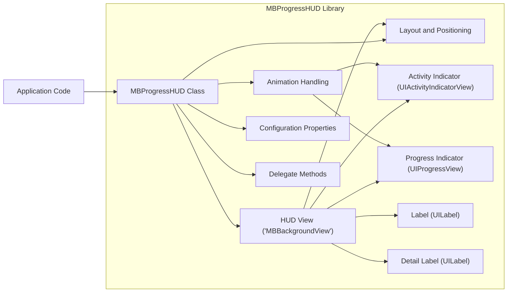
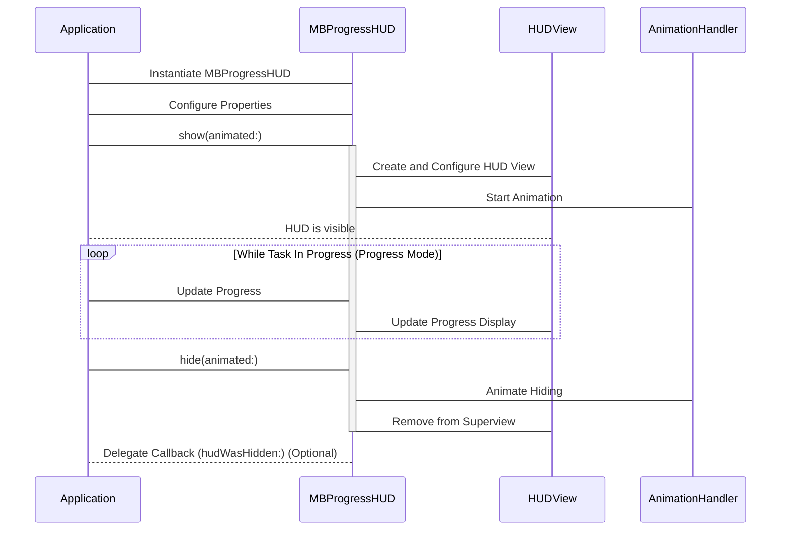

# Project Design Document: MBProgressHUD

**Version:** 1.1
**Date:** October 26, 2023
**Author:** Gemini (AI Language Model)
**Project:** MBProgressHUD - iOS and macOS Progress Indicator

## 1. Introduction

This document provides an enhanced and detailed design overview of the open-source library [MBProgressHUD](https://github.com/jdg/mbprogresshud). This revised document aims to provide an even clearer articulation of the library's architecture, components, and functionalities, specifically tailored for a more in-depth threat modeling exercise. A thorough understanding of the internal workings and external interactions of MBProgressHUD is paramount for identifying potential security vulnerabilities and designing robust mitigation strategies. This version expands on the previous document with more specific details and considerations relevant to security analysis.

## 2. Goals

*   Provide a comprehensive and refined architectural overview of the MBProgressHUD library, with enhanced detail on internal mechanisms.
*   Identify key components and their interactions within the library with greater specificity regarding data exchange and control flow.
*   Describe the data flow and control flow within the library with a focus on potential points of vulnerability.
*   Outline the library's dependencies and integration points with host applications, highlighting potential security implications of these integrations.
*   Serve as a robust and detailed foundation for subsequent threat modeling activities, enabling a more granular analysis of potential risks.

## 3. Overview

MBProgressHUD is a widely adopted library for iOS and macOS development, offering a straightforward and highly customizable method for displaying a heads-up display (HUD) to inform users about the progress of ongoing tasks. It supports a variety of visual modes, including animated spinners, progress bars with percentage indicators, and the ability to display custom views. The library is designed for seamless integration into applications, providing a user-friendly and visually consistent way to communicate background activity. Key features include customizable appearance, support for different progress modes, and optional interaction blocking.

## 4. Architectural Design

The MBProgressHUD library can be conceptually decomposed into the following key components, with a more granular breakdown than the previous version:

*   **`MBProgressHUD` Class:** The primary interface for developers. It manages the HUD's lifecycle (showing, updating, hiding), appearance settings, and interaction behavior. It acts as the central orchestrator for the HUD's functionality.
    *   Responsibilities include: managing the HUD's window or view, handling animation start/stop, and coordinating updates to the visual elements.
*   **HUD View (`MBBackgroundView` and subviews):** The visual container for the progress indicator and related elements. It's responsible for rendering the background, indicator, labels, and any custom views.
    *   Includes subviews for: the activity indicator (`UIActivityIndicatorView` or custom), the progress indicator (`UIProgressView` or custom), the label (`UILabel`), and the detail label (`UILabel`).
*   **Animation Handling:** Manages the animation of the progress indicator. This can involve standard animations for spinners or custom animations.
    *   Utilizes `CABasicAnimation` or similar Core Animation techniques for smooth transitions.
*   **Layout and Positioning:**  Determines the placement and sizing of elements within the HUD view, adapting to different screen sizes and orientations.
    *   Employs Auto Layout constraints or manual frame calculations.
*   **Configuration Properties (Publicly Accessible):** A rich set of properties exposed for developers to customize the HUD's visual style (colors, fonts, background styles, corner radius, etc.) and behavior (mode, animation speed, minimum display duration, etc.).
*   **Delegate Methods (Optional Protocol):** Provides optional delegate methods (`MBProgressHUDDelegate`) for the host application to receive notifications about the HUD's state changes (e.g., `hudWasHidden`).

### 4.1. Component Interactions



**Description of Interactions (Enhanced):**

*   **Application Code -> `MBProgressHUD` Class:** The application code instantiates and interacts with the `MBProgressHUD` class to control its lifecycle, appearance, and behavior through public methods like `show(animated:)`, `hide(animated:)`, and property setters.
*   **`MBProgressHUD` Class -> HUD View ('MBBackgroundView'):** The `MBProgressHUD` class creates, configures, and manages the `MBBackgroundView`, which serves as the container for all visual elements of the HUD.
*   **`MBProgressHUD` Class -> Animation Handling:** The `MBProgressHUD` class triggers and manages the animation of the progress indicator by interacting with the animation handling component.
*   **`MBProgressHUD` Class -> Layout and Positioning:** The `MBProgressHUD` class utilizes the layout and positioning component to dynamically arrange the subviews within the HUD view, ensuring proper display across different screen sizes and orientations.
*   **`MBProgressHUD` Class -> Configuration Properties:** The `MBProgressHUD` class internally uses and modifies configuration properties to determine the visual appearance and behavior of the HUD. These properties are often set by the application code.
*   **`MBProgressHUD` Class -> Delegate Methods:** The `MBProgressHUD` class invokes methods on its delegate (if set) to notify the application about significant state changes, such as when the HUD has been hidden.
*   **HUD View ('MBBackgroundView') -> Activity Indicator (UIActivityIndicatorView):** The HUD view contains and manages the `UIActivityIndicatorView` (or a custom equivalent) for indeterminate progress modes.
*   **HUD View ('MBBackgroundView') -> Progress Indicator (UIProgressView):** The HUD view contains and manages the `UIProgressView` (or a custom equivalent) for displaying determinate progress.
*   **HUD View ('MBBackgroundView') -> Label (UILabel):** The HUD view contains and manages the `UILabel` for displaying the primary status message.
*   **HUD View ('MBBackgroundView') -> Detail Label (UILabel):** The HUD view contains and manages the `UILabel` for displaying a secondary, more detailed status message.
*   **HUD View ('MBBackgroundView') -> Layout and Positioning:** The HUD view utilizes the layout and positioning component to arrange its subviews.
*   **Animation Handling -> Activity Indicator (UIActivityIndicatorView):** The animation handling component directly manipulates the `UIActivityIndicatorView` to start and stop its animation.
*   **Animation Handling -> Progress Indicator (UIProgressView):** The animation handling component might be involved in animating changes to the `UIProgressView`'s progress value.

### 4.2. Data Flow

The data flow within MBProgressHUD involves the transfer of information related to configuration, progress updates, and the internal state of the HUD.

*   **Configuration Data:** Settings such as HUD mode, text for labels, colors, font styles, background appearance, and animation styles are passed from the application code to the `MBProgressHUD` class, typically through property setters.
*   **Progress Data:** For progress bar modes, the current progress value (a floating-point number between 0 and 1) is passed to the `MBProgressHUD` class to update the visual representation of the progress bar.
*   **Custom View Data:** If a custom view is used as the HUD's content, the view object itself is passed to the `MBProgressHUD` class.
*   **State Data:** Internal variables within the `MBProgressHUD` class track the current visibility state of the HUD, animation status, and other relevant internal information.
*   **Display Data:** The processed configuration, progress, and custom view data are used to generate the visual elements displayed on the screen, including the state of the activity indicator, the progress bar's fill level, and the text content of the labels.

```mermaid
graph LR
    subgraph "MBProgressHUD Library"
        A["MBProgressHUD Class"]
        B["HUD View ('MBBackgroundView')"]
        C["Activity Indicator"]
        D["Progress Indicator"]
        E["Label"]
        F["Detail Label"]
    end
    G["Application Code"]

    G -- Configuration Data --> A
    G -- Progress Data --> A
    G -- Custom View --> A
    A -- State Data --> A
    A -- Display Instructions (Visual Properties) --> B
    B -- Visual Output (Rendering) --> User Interface
    A -- Progress Data --> D
    A -- Configuration Data (for Indicator) --> C
    A -- Configuration Data (for Labels) --> E
    A -- Configuration Data (for Labels) --> F
```

**Description of Data Flow (Enhanced):**

*   **Application Code -> `MBProgressHUD` Class:** The application provides configuration settings, progress updates, and potentially a custom view to the `MBProgressHUD` instance.
*   **`MBProgressHUD` Class -> `MBProgressHUD` Class:** The `MBProgressHUD` class manages and updates its internal state based on received data and user interactions.
*   **`MBProgressHUD` Class -> HUD View ('MBBackgroundView'):** Based on the configuration and progress data, the `MBProgressHUD` class instructs the HUD View on how to render its subviews (activity indicator, progress bar, labels, etc.). This involves setting properties like text, colors, and visibility.
*   **`MBProgressHUD` Class -> Activity Indicator:** Configuration data related to the activity indicator's appearance (e.g., style) is passed to it.
*   **`MBProgressHUD` Class -> Progress Indicator:** Progress data (the current progress value) is passed to the progress indicator to update its visual representation.
*   **`MBProgressHUD` Class -> Label:** The text content for the main label is passed to it.
*   **`MBProgressHUD` Class -> Detail Label:** The text content for the detail label is passed to it.
*   **HUD View ('MBBackgroundView') -> User Interface:** The HUD View renders the visual representation of the progress indicator and related elements on the device's screen.

### 4.3. Control Flow

The control flow describes the sequence of actions involved in using MBProgressHUD.

1. **Instantiation:** The application code creates an instance of the `MBProgressHUD` class, often associating it with a specific `UIView` or `UIWindow`.
2. **Configuration:** The application sets various properties on the `MBProgressHUD` instance to customize its appearance and behavior (e.g., `mode`, `label.text`, `bezelView.color`).
3. **Show:** The application calls a method to display the HUD, typically `show(animated:)`. This triggers the creation and animation of the HUD view.
4. **Update (Optional):** For determinate progress modes, the application updates the `progress` property of the `MBProgressHUD` instance as the background task progresses.
5. **Hide:** Once the background task is complete or cancelled, the application calls a method to hide the HUD, typically `hide(animated:)` or `hide(animated:afterDelay:)`. This initiates the fade-out animation and removal of the HUD view.
6. **Delegate Callback (Optional):** If the application has set a delegate conforming to the `MBProgressHUDDelegate` protocol, the delegate's `hudWasHidden(_:)` method is called after the HUD has been completely removed from the view hierarchy.



## 5. Security Considerations (Enhanced for Threat Modeling)

This section expands on potential security considerations, providing more specific examples relevant to threat modeling:

*   **Information Disclosure:**
    *   **Threat:** Sensitive data (e.g., user IDs, partial account numbers, error messages containing internal details) could be inadvertently displayed in the HUD's labels or detail labels if the application doesn't sanitize or redact this information properly.
    *   **Mitigation:** Ensure that any data displayed in the HUD is appropriate for public viewing and does not expose sensitive information. Implement proper data sanitization and error handling to prevent leakage of internal details.
*   **UI Redressing/Spoofing:**
    *   **Threat:** A malicious actor could potentially overlay a fake UI element on top of or around the MBProgressHUD, tricking the user into interacting with the malicious element while believing they are interacting with the legitimate progress indicator.
    *   **Mitigation:** While MBProgressHUD itself doesn't directly prevent this, applications should be designed to minimize the possibility of such overlays. Consider the context in which the HUD is displayed and ensure no untrusted views are present in the hierarchy that could be manipulated.
*   **Denial of Service (Local):**
    *   **Threat:** Rapidly showing and hiding the HUD, or continuously updating its content with computationally expensive operations, could potentially lead to UI freezes or performance degradation, effectively causing a local denial of service.
    *   **Mitigation:** Implement reasonable limits on how frequently the HUD is shown, hidden, or updated. Avoid performing heavy computations directly within the HUD's display or update logic.
*   **Input Validation (Indirect):**
    *   **Threat:** Although MBProgressHUD doesn't directly take user input, the text and images displayed within it originate from application logic. If this source data is derived from untrusted input without proper validation, it could lead to issues like cross-site scripting (XSS) if the HUD were used in a web context (less likely for this native UI component, but a principle to consider). More realistically, malformed or excessively long strings could cause layout issues or unexpected behavior.
    *   **Mitigation:** Validate and sanitize any data that will be displayed in the HUD, especially if it originates from external sources or user input. Limit the length of strings to prevent layout problems.
*   **Dependency Vulnerabilities:**
    *   **Threat:** While MBProgressHUD has minimal external dependencies, vulnerabilities in the underlying Apple frameworks (UIKit/AppKit, CoreGraphics, QuartzCore) could indirectly affect its security.
    *   **Mitigation:** Keep the development environment and target devices updated with the latest OS versions to benefit from security patches in the underlying frameworks. Regularly review security advisories for Apple platforms.
*   **Resource Exhaustion:**
    *   **Threat:**  While less likely, repeatedly creating and destroying `MBProgressHUD` instances without proper resource management could potentially lead to memory leaks or excessive object allocation over time.
    *   **Mitigation:** Follow best practices for object lifecycle management. Consider reusing `MBProgressHUD` instances where appropriate instead of creating new ones repeatedly.

## 6. Dependencies

MBProgressHUD relies primarily on the following standard Apple frameworks:

*   **UIKit (iOS):** Provides the fundamental UI building blocks, including views, controls, and animation mechanisms used by MBProgressHUD.
*   **AppKit (macOS):**  Provides the equivalent UI elements and functionalities for macOS applications.
*   **CoreGraphics:** Used for low-level 2D rendering and drawing operations within the HUD view.
*   **QuartzCore:** Provides advanced animation capabilities, including layer-based animations used for smooth transitions and effects.

The library is designed to be lightweight and generally avoids external third-party library dependencies to minimize potential dependency conflicts and security risks associated with external code.

## 7. Deployment

MBProgressHUD is commonly integrated into iOS and macOS projects using these methods:

*   **CocoaPods:** A widely used dependency manager for Swift and Objective-C projects, simplifying the process of adding and managing external libraries.
*   **Swift Package Manager (SPM):** Apple's official dependency management tool, integrated directly into Xcode.
*   **Carthage:** A decentralized dependency manager that builds dependencies as frameworks.
*   **Manual Integration:**  Involves directly copying the source files (typically `.h` and `.m` or `.swift` files) into the project.

The chosen deployment method can have implications for security, particularly regarding the integrity and authenticity of the source code. Using trusted dependency managers and verifying checksums can help mitigate supply chain risks.

## 8. Future Considerations

Potential future enhancements or modifications to MBProgressHUD that could impact its design and security include:

*   **Enhanced Accessibility Features:** Improvements to make the HUD more accessible to users with disabilities, which might involve changes to how information is presented.
*   **More Advanced Customization Options:**  Adding more granular control over the appearance and behavior of the HUD, potentially introducing new configuration properties or APIs.
*   **Support for New UI Paradigms:** Adapting the library to work seamlessly with newer UI frameworks or design patterns introduced by Apple.
*   **Performance Optimizations:**  Refinements to improve the library's performance, especially in scenarios with frequent updates or complex animations.

Any future changes should undergo thorough security review to identify and address any potential vulnerabilities introduced by the new features or modifications.

## 9. Conclusion

This enhanced design document provides a more detailed and nuanced overview of the MBProgressHUD library, focusing on aspects relevant to security analysis and threat modeling. By elaborating on the library's components, interactions, data flow, and control flow, and by providing more specific security considerations, this document aims to facilitate a more comprehensive assessment of potential risks. This deeper understanding is crucial for developers and security professionals to ensure the secure and reliable use of MBProgressHUD in their applications.