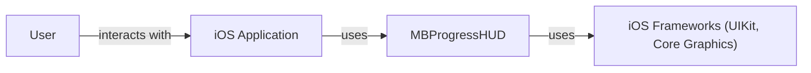
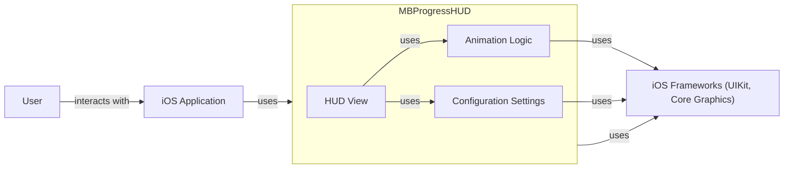
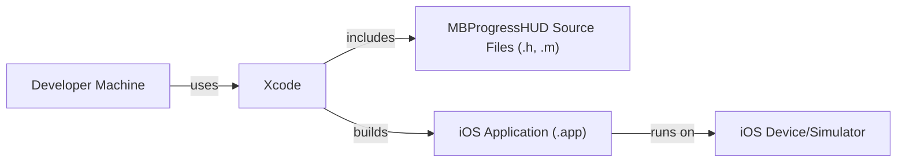
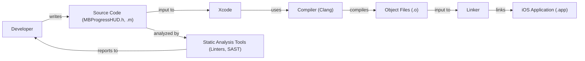

Okay, let's create a design document for the MBProgressHUD project.

# BUSINESS POSTURE

Business Priorities and Goals:

*   Provide a simple, easy-to-use, and visually appealing progress indicator for iOS applications.
*   Offer a drop-in solution that requires minimal configuration and integration effort.
*   Maintain backward compatibility with older iOS versions (as indicated by the project's history).
*   Ensure the library is lightweight and doesn't significantly impact application performance.
*   Provide customization options for appearance and behavior to match different application themes.
*   Maintain a clean and well-documented codebase for easy maintenance and contributions.

Most Important Business Risks:

*   Security: Introduction of vulnerabilities through the library that could be exploited in applications using it. This is particularly important as it's a UI component, and UI vulnerabilities can sometimes be leveraged for broader attacks.
*   Reliability: Bugs or crashes in the library that could negatively impact the user experience of applications using it.
*   Compatibility: Changes that break compatibility with existing applications or iOS versions, leading to integration issues for developers.
*   Performance: Inefficient code that causes performance degradation in applications using the library, especially on older devices.
*   Maintainability: Code that is difficult to understand, modify, or extend, hindering future development and bug fixes.
*   Licensing: Ensuring compliance with the MIT license and proper attribution.

# SECURITY POSTURE

Existing Security Controls:

*   security control: The project is open-source, allowing for community review and scrutiny of the code (described in the repository).
*   security control: The library uses established iOS APIs and frameworks, reducing the risk of introducing custom, potentially vulnerable code (implementation in source code).
*   security control: The project has a long history and has been widely used, suggesting that many potential issues have already been identified and addressed (inferred from project age and popularity).
*   security control: Simple functionality. Project is doing one thing and doing it well. It's not complex system that is prone to vulnerabilities.

Accepted Risks:

*   accepted risk: The library relies on the underlying security of the iOS platform and its APIs. Any vulnerabilities in these underlying components could potentially impact the library.
*   accepted risk: The library does not implement any specific input validation or sanitization, as it primarily deals with displaying progress information provided by the host application. It's assumed that the host application is responsible for validating any data passed to the library.
*   accepted risk: The library does not perform any explicit cryptographic operations.
*   accepted risk: The library does not implement any specific authorization mechanisms, as it is a UI component and does not handle sensitive data or operations directly.

Recommended Security Controls:

*   security control: Regularly update dependencies to address any known vulnerabilities in third-party libraries (if any are used).
*   security control: Integrate static analysis tools (e.g., linters, SAST) into the development workflow to identify potential code quality and security issues early on.
*   security control: Conduct regular security reviews of the codebase, especially for any new features or significant changes.
*   security control: Consider adding a security policy to the repository to provide guidance for reporting vulnerabilities.

Security Requirements:

*   Authentication: Not applicable, as the library does not handle user authentication.
*   Authorization: Not applicable, as the library does not implement any authorization mechanisms.
*   Input Validation: The library should gracefully handle unexpected input (e.g., invalid progress values) without crashing or exhibiting undefined behavior. While full validation is the responsibility of the host application, basic sanity checks within the library can improve robustness.
*   Cryptography: Not applicable, as the library does not handle sensitive data requiring encryption.

# DESIGN

## C4 CONTEXT

Element Descriptions:

*   Element:
    *   Name: User
    *   Type: Person
    *   Description: The end-user interacting with the iOS application.
    *   Responsibilities: Interacts with the iOS application's UI, including the progress indicator displayed by MBProgressHUD.
    *   Security Controls: None (relies on the security of the iOS device and application).

*   Element:
    *   Name: iOS Application
    *   Type: Software System
    *   Description: The application that integrates and uses the MBProgressHUD library.
    *   Responsibilities: Manages application logic, handles user input, and controls the display and updates of the progress indicator using MBProgressHUD.
    *   Security Controls: Implements application-specific security controls, including input validation, data protection, and secure communication.

*   Element:
    *   Name: MBProgressHUD
    *   Type: Software System (Library)
    *   Description: The MBProgressHUD library, providing a progress indicator for iOS applications.
    *   Responsibilities: Displays a progress indicator, handles animation, and provides customization options.
    *   Security Controls: Relies on the security of the iOS Frameworks; performs basic sanity checks on input.

*   Element:
    *   Name: iOS Frameworks (UIKit, Core Graphics)
    *   Type: Software System (Framework)
    *   Description: The underlying iOS frameworks used by MBProgressHUD for UI rendering and animation.
    *   Responsibilities: Provides the foundation for building user interfaces and handling graphics on iOS.
    *   Security Controls: Implements platform-level security controls provided by Apple.

## C4 CONTAINER

Since MBProgressHUD is a single library, the container diagram is essentially an extension of the context diagram.

Element Descriptions:

*   Element:
    *   Name: HUD View
    *   Type: Component
    *   Description: The main view component responsible for displaying the progress indicator.
    *   Responsibilities: Renders the visual elements of the progress indicator (e.g., spinner, progress bar, text labels).
    *   Security Controls: Relies on the security of UIKit and Core Graphics.

*   Element:
    *   Name: Animation Logic
    *   Type: Component
    *   Description: Handles the animation of the progress indicator.
    *   Responsibilities: Manages the animation sequences and timing for showing, hiding, and updating the progress indicator.
    *   Security Controls: Relies on the security of the iOS animation frameworks.

*   Element:
    *   Name: Configuration Settings
    *   Type: Component
    *   Description: Stores and manages the configuration options for the progress indicator.
    *   Responsibilities: Provides access to settings that control the appearance and behavior of the progress indicator (e.g., mode, color, text).
    *   Security Controls: None (stores configuration data only).

*   Elements User, iOS Application, iOS Frameworks are the same as in C4 CONTEXT.

## DEPLOYMENT

Possible Deployment Solutions:

1.  CocoaPods: A dependency manager for Swift and Objective-C Cocoa projects.
2.  Carthage: A decentralized dependency manager for Cocoa.
3.  Swift Package Manager: A tool for managing the distribution of Swift code, integrated with the Swift build system.
4.  Manual Integration: Directly adding the source files to the project.

Chosen Solution: Manual Integration (for simplicity of illustration, although CocoaPods/SPM are more common in modern development)

Element Descriptions:

*   Element:
    *   Name: Developer Machine
    *   Type: Infrastructure Node
    *   Description: The developer's computer used for development.
    *   Responsibilities: Hosts the development environment, source code, and build tools.
    *   Security Controls: Relies on the security of the developer's machine and operating system.

*   Element:
    *   Name: Xcode
    *   Type: Software System
    *   Description: The integrated development environment (IDE) for iOS development.
    *   Responsibilities: Provides tools for code editing, building, debugging, and deploying iOS applications.
    *   Security Controls: Relies on the security of Xcode and its underlying components.

*   Element:
    *   Name: iOS Device/Simulator
    *   Type: Infrastructure Node
    *   Description: The physical iOS device or simulator where the application is deployed and run.
    *   Responsibilities: Executes the iOS application.
    *   Security Controls: Relies on the security of the iOS operating system and device hardware.

*   Element:
    *   Name: MBProgressHUD Source Files (.h, .m)
    *   Type: Files
    *   Description: The source code files of the MBProgressHUD library.
    *   Responsibilities: Contains the implementation of the progress indicator.
    *   Security Controls: Code-level security controls (as discussed in the Security Posture section).

*   Element:
    *   Name: iOS Application (.app)
    *   Type: Application
    *   Description: Compiled application ready to be deployed.
    *   Responsibilities: Contains the implementation of the application logic.
    *   Security Controls: Code-level security controls.

## BUILD

Build Process Description:

1.  Developer writes or modifies the source code (MBProgressHUD.h, .m).
2.  The source code is added to an Xcode project.
3.  Xcode utilizes the Clang compiler to compile the source code into object files (.o).
4.  The linker combines the object files and any required libraries to create the final iOS application executable (.app).
5.  Static analysis tools (linters, SAST) analyze the source code for potential code quality and security issues.  These tools are ideally integrated into the build process (e.g., as Xcode build phases or pre-commit hooks) to provide early feedback to the developer.
6.  The build artifacts (the .app file) are then ready for deployment to a device or simulator.

Security Controls in Build Process:

*   security control: Static Analysis: Use of linters and SAST tools to identify potential vulnerabilities and code quality issues during the build process.
*   security control: Code Signing: Xcode automatically code-signs the application, ensuring its integrity and authenticity. (Implicit in the build process with Xcode).

# RISK ASSESSMENT

Critical Business Processes:

*   Displaying progress of ongoing operations to the user in a clear and visually appealing manner.
*   Providing a seamless and responsive user experience, even during long-running tasks.

Data:

*   Data Sensitivity: Low. MBProgressHUD itself does not handle sensitive data. It primarily displays progress information, which is typically not considered sensitive. The *content* displayed alongside the progress indicator (e.g., "Loading your bank account details...") is the responsibility of the integrating application, not the library itself.
*   Data Types:
    *   Progress values (numeric, typically 0.0 to 1.0).
    *   Text labels (strings).
    *   Configuration settings (colors, animation styles, etc. - all non-sensitive).

# QUESTIONS & ASSUMPTIONS

Questions:

*   Are there any specific compliance requirements (e.g., accessibility standards) that the library should adhere to?
*   Are there plans to add any features that might handle sensitive data or interact with external services?
*   What is the expected level of ongoing maintenance and support for the library?

Assumptions:

*   BUSINESS POSTURE: The primary goal is to provide a simple, reliable, and easy-to-use progress indicator.  Performance and maintainability are prioritized over extensive features.
*   SECURITY POSTURE: The library relies on the security of the underlying iOS platform and does not handle sensitive data directly. The host application is responsible for validating any data passed to the library.
*   DESIGN: The library is designed to be a drop-in solution with minimal configuration.  It is assumed that developers will primarily use the provided API methods and customization options.