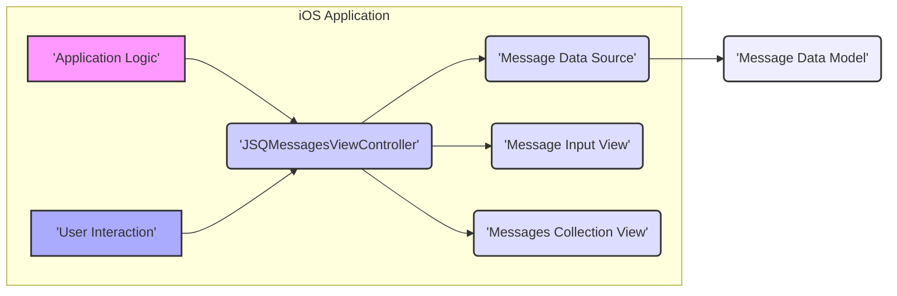
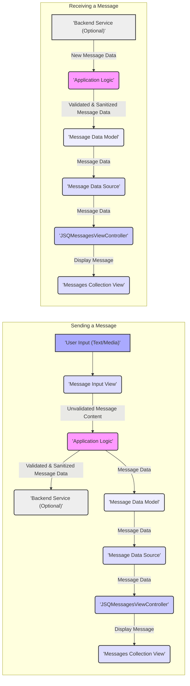

## Project Design Document: JSQMessagesViewController for Threat Modeling (Improved)

**Project Title:** JSQMessagesViewController

**Project Version:**  Based on the GitHub repository as of the current date.

**Document Version:** 2.0

**Date:** October 26, 2023

**Prepared By:** [Your Name/Team Name] - AI Software Architecture Expert

**1. Introduction**

This document provides an enhanced design overview of the open-source iOS library, JSQMessagesViewController (available at [https://github.com/jessesquires/JSQMessagesViewController](https://github.com/jessesquires/JSQMessagesViewController)). This revised document is specifically tailored to facilitate comprehensive threat modeling activities. It details the key components, data flow, and architectural nuances relevant to understanding the security landscape of applications integrating this UI library. The focus is on identifying potential vulnerabilities introduced or exacerbated by the use of this library.

**2. System Overview**

JSQMessagesViewController is a client-side iOS UI library designed to streamline the development of chat interfaces. Its core functionalities include:

*   Rendering and managing a conversation view for displaying messages.
*   Supporting diverse message types: text, images, videos, and location data.
*   Providing UI elements for composing and sending messages.
*   Customizing the appearance of message bubbles and other UI elements.
*   Displaying user avatars and associated display names.

It's crucial to understand that JSQMessagesViewController is solely a UI component. It does *not* handle networking, backend communication, data persistence, or user authentication. Applications utilizing this library must implement these critical functionalities independently, and their security is paramount to the overall system's security.

**3. System Architecture**

This section illustrates the high-level architecture of a typical iOS application leveraging JSQMessagesViewController.

**3.1. Component Description:**

*   **Application Logic:** This encompasses the core business logic of the iOS application integrating JSQMessagesViewController. Its security responsibilities include:
    *   Securely fetching and providing message data to the `Message Data Source`.
    *   Implementing robust input validation and sanitization before sending messages.
    *   Handling user authentication and authorization to prevent unauthorized access and actions.
    *   Managing secure communication with backend services (if any), including encryption (e.g., TLS/SSL).
    *   Implementing secure data persistence mechanisms if messages are stored locally.
*   **JSQMessagesViewController:** The central UI component provided by the library. Potential security concerns revolve around:
    *   Vulnerabilities within the library's code that could be exploited.
    *   Improper handling of data provided by the `Message Data Source`, leading to display issues or potential XSS.
    *   The security of any third-party libraries it depends on.
*   **Message Data Source:** The application's implementation of the `JSQMessageData` protocol. Security considerations here include:
    *   Ensuring the data provided is properly sanitized to prevent injection attacks when rendered.
    *   Protecting the integrity and confidentiality of the underlying message data.
    *   Avoiding exposing sensitive information through this interface.
*   **Message Input View:** The UI element for composing messages. Security concerns include:
    *   Lack of client-side input validation, allowing users to enter potentially malicious content.
    *   Vulnerabilities related to handling different input types (text, media).
*   **Messages Collection View:** The UI element responsible for displaying messages. Security considerations include:
    *   Vulnerabilities in rendering logic that could lead to XSS if message content is not properly handled.
    *   Potential for UI redressing or clickjacking if the display is not carefully managed.
    *   Secure handling of different message types (especially media).
*   **Message Data Model:** The data structures used to represent messages. Security considerations include:
    *   Ensuring sensitive information within the model is handled securely.
    *   Protecting the integrity of the message data.
*   **User Interaction:** Represents user actions within the chat interface. Security considerations include:
    *   Protecting against malicious input or actions that could compromise the application or other users.

**4. Data Flow**

This section details the flow of data within an application using JSQMessagesViewController, highlighting potential security checkpoints.

**4.1. Data Flow Description (with Security Focus):**

*   **Sending a Message:**
    *   The user inputs text or selects media in the **Message Input View**. *Potential vulnerability: Malicious input can be introduced here if not validated later.*
    *   The **Message Input View** passes the *unvalidated* message content to the **Application Logic**. *Critical security checkpoint: Input validation and sanitization must occur here.*
    *   The **Application Logic** performs validation and sanitization. It then sends the message data to the **Backend Service** (if applicable) using secure communication protocols.
    *   The **Application Logic** creates a **Message Data Model** object.
    *   The **Message Data Model** is provided to the **Message Data Source**.
    *   The **JSQMessagesViewController** retrieves the message data. *Potential vulnerability: If the data source provides unsanitized data, it could lead to display issues or XSS.*
    *   The **JSQMessagesViewController** updates the **Messages Collection View** to display the message. *Potential vulnerability: Improper rendering could lead to XSS or UI manipulation.*
*   **Receiving a Message:**
    *   The **Backend Service** sends new message data to the **Application Logic**. *Security consideration: Ensure the backend service is secure and the communication channel is encrypted.*
    *   The **Application Logic** *must* validate and sanitize the received message data before further processing.
    *   The **Application Logic** creates a **Message Data Model** object.
    *   The **Message Data Model** is provided to the **Message Data Source**.
    *   The **JSQMessagesViewController** retrieves the message data.
    *   The **JSQMessagesViewController** updates the **Messages Collection View**.

**5. Key Components for Threat Modeling**

These components are central to identifying potential security vulnerabilities:

*   **JSQMessagesViewController:**  Focus on potential vulnerabilities within the library itself, including:
    *   Input validation flaws in how it handles data from the `Message Data Source`.
    *   Rendering vulnerabilities that could lead to XSS.
    *   Memory safety issues.
    *   Dependencies on vulnerable third-party libraries.
*   **Message Data Source Implementation:**  Critical for ensuring data integrity and preventing injection attacks. Consider:
    *   How the application fetches and prepares data for display.
    *   Whether proper sanitization is performed before providing data to the view controller.
    *   The security of the underlying data storage or retrieval mechanisms.
*   **Message Input View:**  A primary entry point for user-provided data. Focus on:
    *   The absence or presence of client-side input validation.
    *   How different input types (text, media) are handled.
    *   Potential for bypassing client-side validation.
*   **Messages Collection View:**  Responsible for rendering potentially untrusted content. Focus on:
    *   How different message types (especially those containing URLs or media) are rendered.
    *   Potential for XSS vulnerabilities.
    *   The library's handling of potentially malicious HTML or JavaScript within messages.
*   **Application Logic (Integration Layer):**  The bridge between the UI library and the application's core functionality. Focus on:
    *   Input validation and sanitization of both outgoing and incoming messages.
    *   Secure communication with backend services.
    *   Secure handling of user authentication and authorization.
    *   Error handling and logging practices.
*   **Message Data Model:**  The structure and handling of message data. Consider:
    *   Whether sensitive information is stored within the model.
    *   How the model is used and accessed throughout the application.
*   **Backend Service (If Applicable):** While external to the library, its security is crucial for the overall system. Focus on:
    *   Authentication and authorization mechanisms.
    *   Input validation and sanitization on the server-side.
    *   Secure data storage and transmission.

**6. Security Considerations (Detailed)**

This section expands on potential security risks:

*   **Cross-Site Scripting (XSS) via Malicious Message Content:** If the application fails to sanitize message content provided to the `Message Data Source`, attackers can inject malicious scripts that will be executed in the context of other users viewing the messages. This is a high-risk vulnerability.
*   **Data Injection via Input Fields:** Lack of proper input validation in the `Message Input View` allows users to inject malicious data that could be processed by the application or backend, leading to various attacks (e.g., SQL injection if data is persisted without sanitization).
*   **Man-in-the-Middle (MITM) Attacks on Message Transmission:** If communication between the application and the backend is not encrypted using protocols like HTTPS, attackers can intercept and potentially modify messages in transit.
*   **Insecure Local Data Storage:** If the application persists messages locally (e.g., for offline access), failing to encrypt this data could expose sensitive information if the device is compromised.
*   **User Impersonation due to Weak Authentication:** If the application's authentication mechanisms are weak, attackers could impersonate legitimate users and send messages on their behalf. The application must securely manage user identities when populating sender information in the `JSQMessageData`.
*   **Denial of Service (DoS) Attacks:** Malicious users could send a large volume of messages or messages with excessively large media attachments to overwhelm the application or backend services.
*   **Vulnerabilities in Media Handling:** If the application allows users to send images or videos, vulnerabilities in the media processing or display logic could be exploited (e.g., buffer overflows, arbitrary code execution).
*   **Dependency Vulnerabilities:**  JSQMessagesViewController may rely on other third-party libraries. Vulnerabilities in these dependencies could introduce security risks to the application. Regularly updating dependencies is crucial.
*   **UI Redressing/Clickjacking:** While less common in native mobile apps, attackers might try to overlay malicious UI elements on top of the chat interface to trick users into performing unintended actions.
*   **Insecure Error Handling:**  Displaying overly detailed error messages could reveal sensitive information about the application's internal workings to attackers.
*   **Insufficient Logging and Monitoring:** Lack of adequate logging makes it difficult to detect and respond to security incidents.

**7. Assumptions and Constraints**

*   This design document primarily focuses on the security implications of using the JSQMessagesViewController library within an iOS application.
*   It assumes that the developers integrating this library are responsible for implementing robust security measures in other parts of the application, such as backend communication, data persistence, and user authentication.
*   The security of the overall system is heavily reliant on the secure coding practices employed by the application developers.
*   This analysis is based on the publicly available information about JSQMessagesViewController and general security best practices. A thorough security audit of the library's source code would provide a more in-depth assessment.

**8. Future Considerations**

*   Conducting a detailed static and dynamic analysis of the JSQMessagesViewController source code to identify potential vulnerabilities.
*   Performing threat modeling workshops with developers and security experts to identify specific attack vectors and mitigation strategies.
*   Implementing regular security testing, including penetration testing and code reviews, for applications utilizing this library.
*   Establishing a process for staying informed about security updates and vulnerabilities related to JSQMessagesViewController and its dependencies.
*   Considering alternative UI libraries or custom implementations if the security risks associated with JSQMessagesViewController are deemed too high.

This improved design document provides a more detailed and security-focused overview of the JSQMessagesViewController library and its integration within an iOS application. It emphasizes potential vulnerabilities and serves as a stronger foundation for subsequent threat modeling activities.