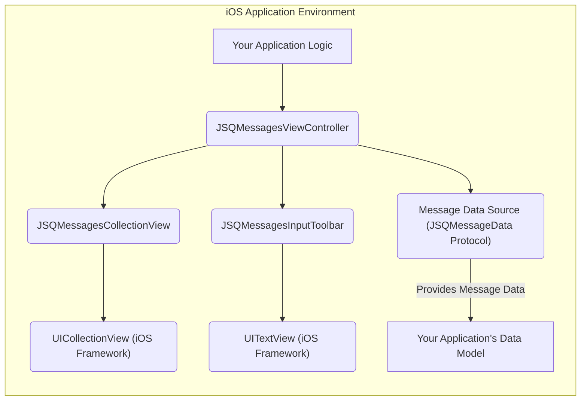
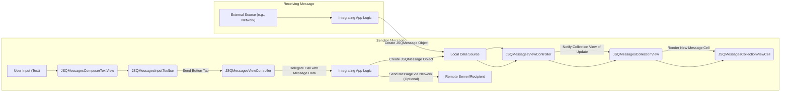

# Project Design Document: JSQMessagesViewController

**Version:** 1.1
**Date:** October 26, 2023
**Author:** AI Software Architect

## 1. Introduction

This document provides an enhanced and more detailed design overview of the `JSQMessagesViewController` project, an elegant and widely-used messages UI library for iOS. Building upon the previous version, this document further clarifies the architecture, responsibilities of key components, and the flow of data within the library. This comprehensive design serves as a robust foundation for subsequent threat modeling and security analysis.

## 2. Goals and Objectives

The fundamental goals of the `JSQMessagesViewController` library are:

* To offer a highly reusable and extensively customizable user interface specifically designed for displaying and managing message-based interactions within iOS applications.
* To deliver a fluid and responsive user experience for real-time or asynchronous chat functionalities.
* To abstract the intricate complexities associated with message layout management, user input handling, and efficient visual presentation of chat conversations.
* To facilitate seamless integration into existing and new iOS project architectures with minimal friction.

## 3. Architectural Overview

The `JSQMessagesViewController` library primarily adheres to the Model-View-Controller (MVC) architectural pattern. However, the interaction between the data source and the view controller exhibits characteristics akin to the Model-View-ViewModel (MVVM) pattern, particularly in how data is prepared and presented to the view.

**High-Level Architecture Diagram:**

**Explanation:**

* **Your Application Logic:** Represents the custom code within the integrating iOS application that orchestrates data fetching, network communication, and overall application flow. It is the primary consumer of the `JSQMessagesViewController` library.
* **JSQMessagesViewController:**  The core view controller provided by the library. It acts as the central orchestrator, managing the lifecycle of the chat interface, mediating between the view and the data source, and handling user interactions.
* **JSQMessagesCollectionView:** A specialized subclass of the standard `UICollectionView` optimized for the unique requirements of displaying chat messages. It efficiently manages cell reuse, custom layouts for message bubbles and timestamps, and handles dynamic content updates.
* **UICollectionView (iOS Framework):** The foundational iOS framework class responsible for managing and displaying ordered collections of data in a flexible and performant manner. `JSQMessagesCollectionView` extends its capabilities.
* **JSQMessagesInputToolbar:** A custom-built view designed to provide the user interface for composing new messages. It encapsulates the text input area, the send button, and potential accessory input controls.
* **UITextView (iOS Framework):** The standard iOS text input control utilized within the `JSQMessagesInputToolbar` for users to enter their message text.
* **Message Data Source (JSQMessageData Protocol):** An abstraction defined by the library, typically implemented by the integrating application. This component is responsible for providing the actual message data to the `JSQMessagesViewController`. It conforms to protocols like `JSQMessageData`, defining the structure of message objects.
* **Your Application's Data Model:** The specific data structures and classes defined within the integrating application to represent individual messages, senders, and other relevant chat-related information.

## 4. Component Design

This section provides a more detailed breakdown of the key components within the `JSQMessagesViewController` library and their specific responsibilities.

* **JSQMessagesViewController:**
    * **Lifecycle Management:** Oversees the creation, display, and destruction of the chat view.
    * **Data Source and Delegate:** Acts as the primary data source and delegate for the `JSQMessagesCollectionView`, coordinating the display of message data.
    * **Input Handling:** Manages user interactions within the `JSQMessagesInputToolbar`, such as text input and button presses.
    * **Message Sending and Receiving:** Provides methods and delegate callbacks for initiating the sending of new messages and handling the display of incoming messages.
    * **UI Coordination:**  Ensures the proper display of messages, including timestamps, sender information (names and avatars), and message bubbles.
    * **Customization:** Offers a wide range of customization options for the visual appearance of the chat interface, including colors, fonts, and bubble styles.

* **JSQMessagesCollectionView:**
    * **Optimized Display:**  Specifically designed for the efficient display of chat messages, handling potentially large numbers of messages with smooth scrolling.
    * **Custom Layout:** Implements a custom layout (`JSQMessagesCollectionViewFlowLayout`) to arrange messages, manage bubble sizing, and position avatars and timestamps correctly.
    * **Cell Management:** Handles the registration and reuse of different `JSQMessagesCollectionViewCell` subclasses based on message types (text, media, etc.).
    * **Scrolling and Updates:** Manages scrolling behavior, including features like scrolling to the latest message, and efficiently updates the displayed content when new messages arrive.

* **JSQMessagesCollectionViewCell:**
    * **Base Cell Class:** The foundation for individual message cells displayed within the collection view.
    * **Subclassing for Types:**  Abstract base class with concrete subclasses for different message content types (e.g., `JSQTextMessageCollectionViewCell`, `JSQMediaMessageCollectionViewCell`).
    * **Content Rendering:** Responsible for rendering the specific content of a message, including text, images, or other media.
    * **UI Elements:** Contains subviews for displaying the message bubble (`JSQMessagesBubbleImageView`), sender avatar (`JSQMessagesAvatarImageView`), and timestamp (`JSQMessagesTimestampView`).

* **JSQMessagesBubbleImageView:**
    * **Bubble Rendering:**  A custom view dedicated to drawing the speech bubble background for messages, providing visual distinction between sent and received messages.
    * **Tail Management:** Supports different bubble tail styles and orientations to indicate the sender.
    * **Color Customization:** Allows customization of bubble colors to match the application's design.

* **JSQMessagesAvatarImageView:**
    * **Avatar Display:**  A custom view specifically for displaying the avatar image of the message sender.
    * **Image Loading and Caching:**  Handles the asynchronous loading of avatar images and potentially implements caching mechanisms for performance.

* **JSQMessagesTimestampView:**
    * **Timestamp Presentation:**  A simple view responsible for displaying the timestamp associated with a message, typically formatted according to user preferences or application settings.

* **JSQMessagesInputToolbar:**
    * **Input Area Management:** Controls the display and behavior of the message input area at the bottom of the chat view.
    * **Component Containment:**  Houses the `UITextView` (`JSQMessagesComposerTextView`), the send button (`JSQMessagesSendButton`), and any optional accessory buttons for adding attachments or other actions.
    * **Height Adjustment:** Dynamically adjusts its height based on the content of the text view (e.g., when the user enters multiple lines of text).

* **JSQMessagesComposerTextView:**
    * **Enhanced Text Input:** A subclass of `UITextView` specifically tailored for message composition.
    * **Placeholder Text:**  Provides support for displaying placeholder text when the input field is empty.
    * **Newline Handling:**  Manages the insertion of newline characters and potentially adjusts the input view's height accordingly.

* **JSQMessagesSendButton:**
    * **Action Trigger:**  A button that, when tapped, initiates the process of sending the composed message.

* **JSQMessagesToolbarContentView:**
    * **Layout Management:**  The container view responsible for arranging the subviews within the `JSQMessagesInputToolbar`.

* **JSQMessage (Protocol):**
    * **Message Data Contract:** Defines the essential properties that any message object must implement to be displayed by the `JSQMessagesViewController`.
    * **Key Properties:** Includes properties like `senderId` (unique identifier of the sender), `senderDisplayName` (display name of the sender), `date` (timestamp of the message), and `isMediaMessage` (a boolean indicating if the message contains media).
    * **Implementation by Integrator:** Concrete implementations of this protocol are typically provided by the integrating application's data model.

* **JSQMessageMediaData (Protocol):**
    * **Media Message Specifics:**  Defines the interface for message objects that contain media content.
    * **Media Properties:** Requires properties such as `image` (for image messages), `mediaView` (a custom view to display the media), and `mediaPlaceholderView` (a placeholder view displayed while the media is loading).

## 5. Data Flow

The process of sending and receiving messages within an application utilizing `JSQMessagesViewController` involves a well-defined sequence of interactions between components.

**Sending a Message (Detailed Flow):**

1. **User Input and Composition:** The user enters the message text within the `JSQMessagesComposerTextView` located in the `JSQMessagesInputToolbar`.
2. **Initiate Send Action:** The user triggers the send action, typically by tapping the `JSQMessagesSendButton`.
3. **Delegate Notification:** The `JSQMessagesViewController` detects the send action and calls the appropriate delegate method (e.g., `-didPressSendButton:withMessageText:senderId:senderDisplayName:date:`) on its delegate (usually the integrating view controller or a related component).
4. **Message Object Creation:** The integrating application's logic, within the delegate method, creates a new message object conforming to the `JSQMessageData` protocol. This object encapsulates the message text, sender information, and timestamp.
5. **Data Source Update (Local):** The newly created message is added to the local data source managed by the integrating application. This could be an array, a database, or any other data storage mechanism.
6. **Collection View Notification:** The `JSQMessagesViewController` is informed of the new message, typically through a data source update notification or a direct method call.
7. **Collection View Update:** The `JSQMessagesViewController` instructs the `JSQMessagesCollectionView` to update its display to include the new message. This usually involves inserting a new item at the end of the collection view's data.
8. **Cell Instantiation and Rendering:** The `JSQMessagesCollectionView` creates or reuses a `JSQMessagesCollectionViewCell` to visually represent the new message. The cell's subviews (bubble, avatar, timestamp) are populated with the message data.
9. **Optional Network Transmission:**  Separately, the integrating application's logic would typically handle the transmission of the new message to remote recipients via a network connection.

**Receiving a Message (Detailed Flow):**

1. **External Message Arrival:** A new message arrives from an external source, such as a remote server or another user's device, and is received by the integrating application's network communication layer.
2. **Message Object Creation:** The integrating application's logic creates a new message object (conforming to `JSQMessageData`) based on the received data, including the message content, sender information, and timestamp.
3. **Data Source Update (Local):** The received message is added to the local data source managed by the integrating application.
4. **Collection View Notification:** The `JSQMessagesViewController` is notified of the newly received message.
5. **Collection View Update:** The `JSQMessagesViewController` instructs the `JSQMessagesCollectionView` to update its display to include the new message.
6. **Cell Instantiation and Rendering:** The `JSQMessagesCollectionView` creates or reuses a `JSQMessagesCollectionViewCell` to display the received message, populating its subviews with the relevant data.

**Data Flow Diagram:**

## 6. Security Considerations (For Threat Modeling)

This section expands upon the security considerations, providing more specific examples and potential attack vectors for threat modeling.

* **Data Handling Vulnerabilities:**
    * **Cross-Site Scripting (XSS) via Message Content:** If user-generated message content is displayed in web views or other contexts without proper sanitization, malicious JavaScript code embedded in messages could be executed, potentially leading to session hijacking, data theft, or other malicious actions.
    * **Media Content Exploits:**  Processing untrusted media files (images, videos, etc.) could expose vulnerabilities in image or video decoding libraries, potentially leading to crashes, remote code execution, or denial of service. Ensure robust validation and potentially sandboxing of media processing.
    * **Insecure Data Storage:** If the integrating application stores message data insecurely (e.g., without encryption or with weak access controls), sensitive information could be compromised if the device is lost or compromised.

* **Input Validation Weaknesses:**
    * **Injection Attacks:**  Failure to properly sanitize user input before sending or displaying messages could allow attackers to inject malicious code (e.g., SQL injection if message content is used in database queries, though less likely directly within the UI library).
    * **Malicious Attachments:**  Without proper validation of file types and sizes, attackers could upload malicious files that could harm the recipient's device or network.

* **Authentication and Authorization Flaws (Application Level):**
    * **Impersonation:** If the application's authentication mechanisms are weak, attackers could potentially impersonate other users and send messages on their behalf.
    * **Unauthorized Access:**  Lack of proper authorization checks could allow unauthorized users to access and view message history.

* **Dependency Security Risks:**
    * **Vulnerable Dependencies:**  Outdated or vulnerable dependencies within the `JSQMessagesViewController` library or its underlying frameworks could introduce security vulnerabilities that attackers could exploit. Regularly update dependencies and monitor for security advisories.

* **UI Rendering and Resource Management Issues:**
    * **Denial of Service (DoS) via Long Messages or Large Volumes:**  Sending extremely long messages or flooding the chat with a large number of messages could potentially overwhelm the UI rendering process, leading to performance degradation or crashes. Implement mechanisms to limit message length and handle large volumes of data gracefully.
    * **Memory Exhaustion from Media:**  Loading and displaying very large media files without proper memory management could lead to memory exhaustion and application crashes. Implement efficient image loading, caching, and potentially downsampling techniques.

* **Privacy Concerns:**
    * **Data Leakage through Logging or Caching:** Ensure that sensitive message content is not inadvertently logged or cached in insecure locations.
    * **Exposure of Metadata:** Be mindful of metadata associated with messages (e.g., timestamps, sender information) and ensure it is handled appropriately to protect user privacy.

## 7. Dependencies

The `JSQMessagesViewController` library relies on the following fundamental iOS frameworks:

* **UIKit:** Provides the essential building blocks for constructing the user interface, including views, controls, and event handling.
* **Foundation:** Offers fundamental data types, collections, and system services used throughout the library.
* **QuartzCore:** Enables advanced graphics rendering, animations, and visual effects used for message bubbles and other UI elements.
* **Photos (Replaces deprecated AssetsLibrary):**  Provides access to the user's photo library for selecting and sending media messages.
* **UICollectionView:** The core framework class that `JSQMessagesCollectionView` extends to efficiently display the list of messages.

## 8. Deployment

The `JSQMessagesViewController` library is typically integrated into an iOS application project using one of the following methods:

* **CocoaPods:** A dependency manager for Swift and Objective-C projects.
* **Carthage:** Another dependency manager focused on building dependencies as frameworks.
* **Swift Package Manager (SPM):** Apple's native dependency management tool.
* **Manual Integration:**  Adding the source files directly to the project.

The library is designed for deployment within native iOS applications running on iOS devices.

## 9. Future Considerations

* **Enhanced Accessibility Features:**  Further improve accessibility support for users with disabilities, ensuring the chat interface is usable with assistive technologies.
* **Performance Optimizations:** Continuously optimize rendering and scrolling performance, especially for handling very long and complex conversations.
* **Regular Security Audits and Penetration Testing:** Conduct periodic security assessments to proactively identify and address potential vulnerabilities.
* **Adoption of Modern iOS APIs and UI Patterns:**  Adapt the library to leverage newer iOS features and UI paradigms to maintain a modern and consistent user experience.
* **Improved Media Handling Capabilities:** Explore enhancements for handling various media types and potentially integrating with cloud storage services.

This enhanced design document provides a more in-depth understanding of the `JSQMessagesViewController` library's architecture, components, and data flow. This detailed information is essential for conducting thorough threat modeling exercises and implementing appropriate security measures to protect applications that utilize this library.