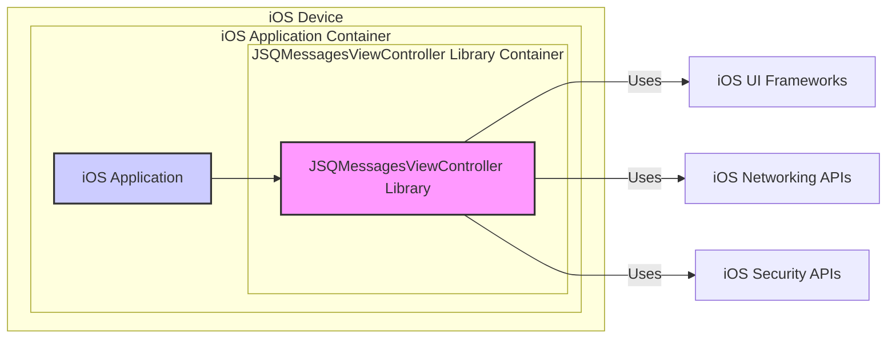

# BUSINESS POSTURE

- Business Priorities and Goals:
  - The primary goal of the JSQMessagesViewController library is to provide iOS developers with a reusable and customizable user interface component for creating chat applications.
  - Key priorities include:
    - Ease of integration and use for developers.
    - Feature richness, offering a wide range of chat functionalities.
    - Customizability to allow developers to tailor the UI to their application's design.
    - Performance and efficiency to ensure a smooth user experience in chat applications.
    - Community support and active maintenance to address issues and incorporate new features.

- Business Risks:
  - Security vulnerabilities within the library could be exploited by malicious actors in applications that integrate it, potentially leading to data breaches or unauthorized access.
  - Lack of ongoing maintenance and updates could result in the library becoming outdated, incompatible with newer iOS versions, or vulnerable to newly discovered security threats.
  - Performance issues or bugs in the library could negatively impact the user experience of applications that depend on it, potentially leading to user dissatisfaction and application abandonment.
  - If the library is difficult to use or lacks necessary features, developers may choose alternative solutions, reducing the library's adoption and value.

# SECURITY POSTURE

- Existing Security Controls:
  - security control: Open Source Code - The library is open source, allowing for community review and scrutiny of the codebase, which can help identify potential security vulnerabilities. Implemented: GITHUB REPOSITORY.
  - security control: Standard iOS Security Mechanisms - The library operates within the iOS ecosystem and benefits from the underlying security features provided by the iOS platform, such as sandboxing and memory protection. Implemented: IOS PLATFORM.

- Accepted Risks:
  - accepted risk: Dependency Vulnerabilities - As a software library, JSQMessagesViewController may depend on other third-party libraries or frameworks, which could introduce vulnerabilities. Managing these dependencies and keeping them updated is an ongoing effort.
  - accepted risk: Misuse by Developers - Developers integrating the library into their applications may not always use it securely, potentially introducing vulnerabilities in their own application logic or data handling.

- Recommended Security Controls:
  - recommended security control: Automated Security Scanning - Implement automated static and dynamic analysis security scanning tools in the development pipeline to identify potential vulnerabilities in the library code.
  - recommended security control: Regular Security Audits - Conduct periodic security audits and penetration testing by security experts to proactively identify and address security weaknesses.
  - recommended security control: Secure Development Practices - Adhere to secure coding practices throughout the development lifecycle, including input validation, output encoding, and secure data handling.
  - recommended security control: Dependency Management - Implement a robust dependency management process to track and update third-party libraries, ensuring timely patching of known vulnerabilities.
  - recommended security control: Security Guidelines for Developers - Provide clear and comprehensive security guidelines and best practices for developers using the library to integrate it securely into their applications.

- Security Requirements:
  - Authentication:
    - Requirement: Authentication is not directly handled by the JSQMessagesViewController library itself. Authentication of users is the responsibility of the application that integrates the library.
  - Authorization:
    - Requirement: Authorization, determining what actions a user is permitted to perform within the chat application (e.g., sending messages, deleting messages, accessing certain channels), is the responsibility of the integrating application, not the library.
  - Input Validation:
    - Requirement: The library must implement robust input validation to prevent injection attacks (e.g., XSS) through user-provided message content. This includes validating and sanitizing message text, media file names, and any other user inputs displayed by the library.
    - Implemented: Within the library's message rendering and display logic.
  - Cryptography:
    - Requirement: Cryptographic functionalities for message encryption (end-to-end or in transit) are not inherently provided by the JSQMessagesViewController library. If encryption is required, it must be implemented by the integrating application, potentially using iOS security frameworks and libraries.
    - Requirement: If the library handles any sensitive data locally (e.g., caching messages), this data should be encrypted at rest using appropriate iOS data protection mechanisms.

# DESIGN

## C4 CONTEXT

```mermaid
flowchart LR
    subgraph "iOS User"
        U["iOS User"]
    end
    subgraph "iOS Application"
        A["iOS Application"]
    end
    subgraph "JSQMessagesViewController Library"
        J["JSQMessagesViewController Library"]
    end
    subgraph "Backend Chat Service"
        B["Backend Chat Service"]
    end

    U --> A
    A --> J
    A <-- B
    J -- Uses --> IOS["iOS Platform APIs"]
    style J fill:#f9f,stroke:#333,stroke-width:2px
```

- Context Diagram Elements:
  - - Name: iOS User
    - Type: Person
    - Description: End-user interacting with an iOS application that incorporates chat functionality.
    - Responsibilities: Sends and receives messages, interacts with the chat interface.
    - Security controls: Device level security controls (passcode, biometrics), application level authentication.
  - - Name: iOS Application
    - Type: Software System
    - Description: The iOS application developed by a third-party developer that integrates the JSQMessagesViewController library to provide chat features.
    - Responsibilities: Handles user authentication and authorization, manages chat sessions, interacts with backend services, integrates and utilizes the JSQMessagesViewController library for UI rendering.
    - Security controls: Application level security controls (authentication, authorization, input validation, secure data storage), secure communication with backend services.
  - - Name: JSQMessagesViewController Library
    - Type: Software System
    - Description: The open-source iOS library providing UI components for building chat interfaces.
    - Responsibilities: Rendering chat UI elements (message bubbles, input field, media display), handling user interactions within the chat interface, providing APIs for customization and integration.
    - Security controls: Input validation for displayed messages, adherence to secure coding practices, open-source code for community review.
  - - Name: Backend Chat Service
    - Type: Software System
    - Description: A backend service (potentially cloud-based) that manages chat data, message persistence, and real-time message delivery.
    - Responsibilities: Storing and managing chat messages, handling message routing and delivery, managing user presence and chat channels, providing APIs for applications to interact with chat functionality.
    - Security controls: Server-side authentication and authorization, secure API endpoints, data encryption in transit and at rest, access control mechanisms, security monitoring and logging.
  - - Name: iOS Platform APIs
    - Type: Software System
    - Description: iOS operating system APIs that the JSQMessagesViewController library utilizes for UI rendering, device features, and security functionalities.
    - Responsibilities: Providing core functionalities for iOS applications, including UI rendering, networking, security features, and device hardware access.
    - Security controls: Operating system level security controls (sandboxing, memory protection, code signing), regular security updates and patches.

## C4 CONTAINER



- Container Diagram Elements:
  - - Name: iOS Application
    - Type: Application
    - Description: The container representing the iOS application that integrates the JSQMessagesViewController library. It's the main executable running on the iOS device.
    - Responsibilities: Application logic, user authentication, authorization, network communication with backend services, managing data, and utilizing the JSQMessagesViewController library for chat UI.
    - Security controls: Application level security controls, secure coding practices, integration of security frameworks, secure data storage within the application sandbox.
  - - Name: JSQMessagesViewController Library
    - Type: Library
    - Description: The container representing the JSQMessagesViewController library, which is a set of compiled code and resources integrated into the iOS Application.
    - Responsibilities: Providing UI components for chat interfaces, handling UI rendering, managing user interactions within the chat UI, offering APIs for customization and integration within the iOS Application.
    - Security controls: Input validation within the library's UI components, adherence to secure coding practices in library development, leveraging iOS Security APIs where applicable.
  - - Name: iOS UI Frameworks
    - Type: Technology
    - Description: iOS frameworks like UIKit or SwiftUI used by the JSQMessagesViewController library for rendering the user interface.
    - Responsibilities: Providing UI rendering capabilities, handling user interface events, managing the visual presentation of the application.
    - Security controls: Framework level security controls provided by iOS, regular updates and security patches from Apple.
  - - Name: iOS Networking APIs
    - Type: Technology
    - Description: iOS APIs used by the JSQMessagesViewController library or the integrating application for network communication, although network communication is more likely handled by the integrating application.
    - Responsibilities: Providing networking functionalities for data transfer, handling network requests and responses, managing network connections.
    - Security controls: Network security features provided by iOS, secure communication protocols (HTTPS), VPN support.
  - - Name: iOS Security APIs
    - Type: Technology
    - Description: iOS security APIs that might be used by the JSQMessagesViewController library or the integrating application for security-related functionalities, such as data encryption or secure storage.
    - Responsibilities: Providing security functionalities like cryptography, secure storage, keychain access, and data protection mechanisms.
    - Security controls: Robust security features provided by the iOS platform, regular security updates and patches from Apple.

## DEPLOYMENT

- Deployment Architecture Options:
  - Option 1: Direct installation on user's iOS devices via App Store or TestFlight.
  - Option 2: Enterprise deployment within an organization to managed iOS devices.

- Detailed Deployment Architecture (Option 1 - App Store Deployment):

```mermaid
flowchart LR
    subgraph "User's iOS Device"
        subgraph "iOS Environment"
            A["iOS Application"]
            J["JSQMessagesViewController Library"]
        end
    end
    subgraph "Apple App Store"
        AS["App Store"]
    end
    subgraph "Developer Infrastructure"
        DI["Developer Infrastructure"]
    end

    DI --> AS: "App Submission"
    AS --> "User's iOS Device": "App Download & Install"
    "User's iOS Device" --> A
    A --> J

    style A fill:#ccf,stroke:#333,stroke-width:2px
    style J fill:#f9f,stroke:#333,stroke-width:2px
```

- Deployment Diagram Elements:
  - - Name: User's iOS Device
    - Type: Infrastructure
    - Description: The physical iOS device (iPhone, iPad) owned by the end-user where the iOS Application is installed and runs.
    - Responsibilities: Running the iOS Application and JSQMessagesViewController library, providing the user interface for chat interaction, storing application data.
    - Security controls: Device level security controls (passcode, biometrics, device encryption), iOS operating system security features, application sandboxing.
  - - Name: iOS Environment
    - Type: Environment
    - Description: The iOS operating system environment on the user's device, providing the runtime environment for the iOS Application and JSQMessagesViewController library.
    - Responsibilities: Managing application execution, providing system resources, enforcing security policies, providing access to device hardware and APIs.
    - Security controls: Operating system level security controls (kernel security, memory protection, code signing, sandboxing), regular security updates and patches from Apple.
  - - Name: iOS Application
    - Type: Software
    - Description: The instance of the iOS application, including the integrated JSQMessagesViewController library, deployed and running on the user's iOS device.
    - Responsibilities: Executing application logic, rendering chat UI using the JSQMessagesViewController library, handling user interactions, communicating with backend services.
    - Security controls: Application level security controls, secure coding practices, secure data storage within the application sandbox.
  - - Name: JSQMessagesViewController Library
    - Type: Software
    - Description: The instance of the JSQMessagesViewController library deployed as part of the iOS Application on the user's device.
    - Responsibilities: Providing chat UI components, rendering chat messages, handling UI interactions within the chat interface.
    - Security controls: Input validation within the library's UI components, adherence to secure coding practices.
  - - Name: Apple App Store
    - Type: Infrastructure
    - Description: Apple's App Store, the platform for distributing iOS applications to end-users.
    - Responsibilities: Hosting and distributing iOS applications, performing app review and security checks before publication, managing app updates.
    - Security controls: App review process, code signing requirements, platform security measures to prevent malware distribution.
  - - Name: Developer Infrastructure
    - Type: Infrastructure
    - Description: The infrastructure used by the developers of the iOS Application to build, test, and submit the application to the App Store.
    - Responsibilities: Development environment, build systems, testing infrastructure, app submission process.
    - Security controls: Secure development environment, access control to development resources, secure build and release pipelines.

## BUILD

```mermaid
flowchart LR
    subgraph "Developer Workstation"
        DEV["Developer"]
        CODE["Source Code (GitHub)"]
    end
    subgraph "CI/CD System (e.g., GitHub Actions)"
        BUILD_SERVER["Build Server"]
        SAST["SAST Scanner"]
        LINTER["Linter"]
        TEST["Automated Tests"]
        ARTIFACTS["Build Artifacts (Library)"]
    end

    DEV --> CODE: "Code Commit"
    CODE --> BUILD_SERVER: "Webhook Trigger"
    BUILD_SERVER --> SAST: "Static Analysis"
    BUILD_SERVER --> LINTER: "Code Linting"
    BUILD_SERVER --> TEST: "Unit & Integration Tests"
    BUILD_SERVER --> ARTIFACTS: "Build & Package"
    ARTIFACTS --> "Distribution (e.g., CocoaPods, SPM)": "Publish"

    style DEV fill:#ccf,stroke:#333,stroke-width:2px
    style BUILD_SERVER fill:#f9f,stroke:#333,stroke-width:2px
    style ARTIFACTS fill:#ccf,stroke:#333,stroke-width:2px
```

- Build Process Description:
  - Developer writes code for the JSQMessagesViewController library on their workstation and commits it to a source code repository (e.g., GitHub).
  - A CI/CD system (e.g., GitHub Actions, Jenkins) is triggered by code commits to initiate the build process.
  - The build process typically involves:
    - Code Checkout: Fetching the latest source code from the repository.
    - Static Analysis Security Testing (SAST): Running SAST tools to automatically scan the code for potential security vulnerabilities.
    - Code Linting: Performing code linting to enforce code style and quality standards.
    - Automated Testing: Executing unit tests and integration tests to ensure code functionality and stability.
    - Build and Packaging: Compiling the code and packaging it into a distributable library artifact (e.g., framework, Swift Package).
    - Artifact Storage: Storing the build artifacts in a secure artifact repository.
    - Publishing (Optional): Publishing the library artifact to package managers (e.g., CocoaPods, Swift Package Manager) for developers to easily integrate.

- Build Process Security Controls:
  - security control: Secure Source Code Repository - Using a secure and access-controlled source code repository (e.g., GitHub) to store and manage the library's source code. Implemented: GITHUB.
  - security control: Automated Build Process - Automating the build process using a CI/CD system to ensure consistency and repeatability, and to integrate security checks. Implemented: CI/CD SYSTEM.
  - security control: Static Analysis Security Testing (SAST) - Integrating SAST tools into the build pipeline to automatically detect potential security vulnerabilities in the code. Implemented: CI/CD PIPELINE.
  - security control: Code Linting - Using linters to enforce code quality and style guidelines, which can indirectly contribute to security by reducing code complexity and potential errors. Implemented: CI/CD PIPELINE.
  - security control: Automated Testing - Implementing comprehensive unit and integration tests to ensure code functionality and reduce the risk of bugs and unexpected behavior. Implemented: CI/CD PIPELINE.
  - security control: Secure Build Environment - Securing the CI/CD build environment to prevent unauthorized access and tampering. Implemented: CI/CD INFRASTRUCTURE SECURITY.
  - security control: Artifact Signing - Signing the build artifacts to ensure their integrity and authenticity. Implemented: BUILD PROCESS.
  - security control: Access Control to Artifact Repository - Implementing access control to the artifact repository to restrict access to authorized users and systems. Implemented: ARTIFACT REPOSITORY SECURITY.

# RISK ASSESSMENT

- Critical Business Processes:
  - Secure and reliable provision of chat UI components to iOS developers.
  - Maintaining the integrity and security of the JSQMessagesViewController library to prevent vulnerabilities in applications that use it.
  - Ensuring the availability and usability of the library for the developer community.

- Data Sensitivity:
  - The JSQMessagesViewController library itself does not directly handle or store sensitive user data. However, applications that integrate this library will likely handle sensitive chat messages, which can include:
    - Personally Identifiable Information (PII): User names, contact information, location data, etc.
    - Confidential Communications: Private conversations, business communications, financial information, health information, etc.
    - Media Content: Images, videos, audio recordings that may contain sensitive information.
  - Sensitivity Level: HIGH - Depending on the application using the library, the data handled can be highly sensitive and require strong security measures to protect confidentiality, integrity, and availability.

# QUESTIONS & ASSUMPTIONS

- BUSINESS POSTURE:
  - Question: What is the target audience for applications using this library? Are they primarily consumer-facing, enterprise, or both?
  - Assumption: The library is intended for a broad range of iOS applications, including both consumer and enterprise applications that require chat functionality.
  - Question: What are the expected performance requirements for applications using this library? Are there specific use cases with very high message volumes or real-time communication needs?
  - Assumption: The library is expected to perform well in typical chat application scenarios, but specific performance optimizations might be needed for very demanding use cases.

- SECURITY POSTURE:
  - Question: Are there any specific regulatory compliance requirements that applications using this library might need to adhere to (e.g., HIPAA, GDPR, PCI DSS)?
  - Assumption: Applications using this library may be subject to various regulatory compliance requirements depending on their industry and the data they handle. Developers are responsible for ensuring compliance in their applications.
  - Question: What is the expected threat model for applications using this library? Are they likely to be targeted by sophisticated attackers or primarily concerned with common vulnerabilities?
  - Assumption: Applications using this library should be designed to protect against a range of threats, including common web and mobile application vulnerabilities, as well as potential targeted attacks depending on the application's sensitivity and user base.

- DESIGN:
  - Question: Are there any specific customization requirements for the UI components provided by the library?
  - Assumption: The library is designed to be customizable to allow developers to adapt the UI to their application's branding and design guidelines.
  - Question: What are the expected integration points with backend chat services? Are there any specific backend technologies or protocols that the library is designed to work with?
  - Assumption: The library is designed to be flexible and integrate with various backend chat services through standard APIs and protocols. The specific backend integration is the responsibility of the application developer.