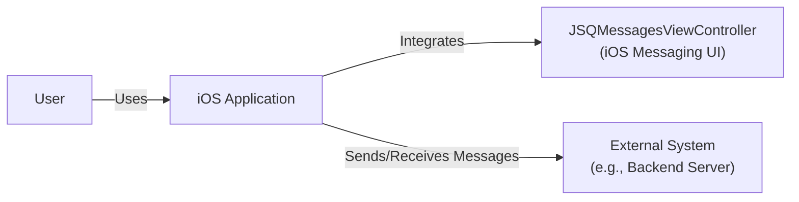
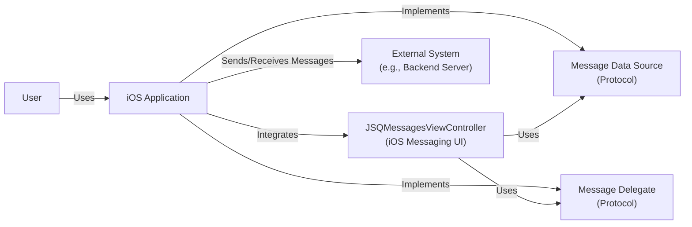
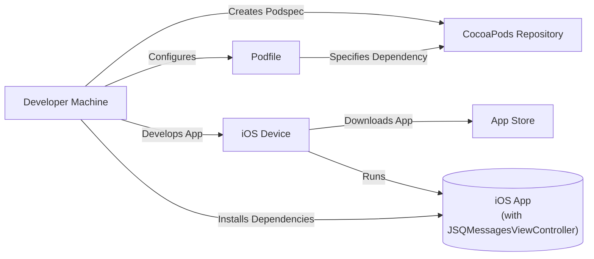
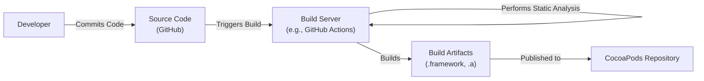

Okay, let's create a design document for the `JSQMessagesViewController` project.

# BUSINESS POSTURE

Business Priorities and Goals:

*   Provide a reusable, well-designed, and customizable UI component for messaging within iOS applications.
*   Reduce development time and effort for developers implementing chat/messaging features.
*   Offer a polished and user-friendly experience that mimics popular messaging apps.
*   Maintain an active open-source project with community contributions.
*   Ensure the library is lightweight and performant.

Most Important Business Risks:

*   Security vulnerabilities within the library could expose user data or compromise applications using it.
*   Poor performance or instability could lead to negative user experiences and app store reviews.
*   Lack of maintenance or updates could render the library obsolete or incompatible with newer iOS versions.
*   Failure to adhere to Apple's App Store guidelines could result in app rejections.
*   Lack of adoption by the developer community.

# SECURITY POSTURE

Existing Security Controls:

*   security control: The project is open-source, allowing for community review and contributions, which can help identify and address security issues. (GitHub repository)
*   security control: The project uses Objective-C, which, when used correctly, can provide some memory safety features. (Source code)
*   security control: Standard iOS UI components are used, which are subject to Apple's security reviews and updates. (Source code)

Accepted Risks:

*   accepted risk: The library itself does not handle message transport or storage; it relies on the integrating application to manage these aspects securely.
*   accepted risk: The library's customizability might introduce security risks if developers misuse certain features or fail to implement proper input validation.

Recommended Security Controls:

*   security control: Implement a comprehensive test suite, including unit and UI tests, to cover security-sensitive areas like input handling, data display, and custom view configurations.
*   security control: Conduct regular security audits and code reviews, focusing on potential vulnerabilities like XSS (if displaying HTML content), injection flaws, and data leakage.
*   security control: Provide clear documentation and guidelines on secure usage, including best practices for data handling, input validation, and authentication.
*   security control: Establish a vulnerability disclosure process to encourage responsible reporting of security issues.
*   security control: Consider integrating static analysis tools into the build process to automatically detect potential vulnerabilities.

Security Requirements:

*   Authentication: The library itself does not handle authentication. The integrating application is responsible for authenticating users and managing sessions.
*   Authorization: The library does not enforce authorization rules. The integrating application must determine which users can access which messages and features.
*   Input Validation: The library should sanitize any user-provided input that is displayed, especially if supporting rich text or HTML content, to prevent XSS vulnerabilities. The integrating application should also perform input validation before passing data to the library.
*   Cryptography: The library does not handle encryption directly. The integrating application is responsible for encrypting messages in transit and at rest, if required.

# DESIGN

## C4 CONTEXT

Element Descriptions:

*   Element:
    *   Name: User
    *   Type: Person
    *   Description: The end-user interacting with the iOS application.
    *   Responsibilities: Interacts with the messaging UI to send and receive messages.
    *   Security controls: Relies on the iOS application and external system for authentication and authorization.

*   Element:
    *   Name: iOS Application
    *   Type: Software System
    *   Description: The iOS application that integrates the `JSQMessagesViewController` library.
    *   Responsibilities: Manages user authentication, message transport, message storage, and overall application logic. Integrates and configures the `JSQMessagesViewController` component.
    *   Security controls: Implements authentication, authorization, secure communication with the external system, and data protection measures.

*   Element:
    *   Name: JSQMessagesViewController (iOS Messaging UI)
    *   Type: Software System
    *   Description: The reusable UI component for displaying and managing messages.
    *   Responsibilities: Provides a user interface for displaying messages, handling user input, and managing the message list. Relies on the integrating application for data and message handling.
    *   Security controls: Performs input sanitization (if applicable) to prevent XSS. Relies on the integrating application for other security aspects.

*   Element:
    *   Name: External System (e.g., Backend Server)
    *   Type: Software System
    *   Description: An external system, such as a backend server, that handles message transport, storage, and potentially user management.
    *   Responsibilities: Handles message routing, persistence, and potentially user authentication and authorization.
    *   Security controls: Implements secure communication protocols, data encryption, access controls, and other security measures.

## C4 CONTAINER

Element Descriptions:

*   Element:
    *   Name: User
    *   Type: Person
    *   Description: The end-user interacting with the iOS application.
    *   Responsibilities: Interacts with the messaging UI to send and receive messages.
    *   Security controls: Relies on the iOS application and external system for authentication and authorization.

*   Element:
    *   Name: iOS Application
    *   Type: Software System
    *   Description: The iOS application that integrates the `JSQMessagesViewController` library.
    *   Responsibilities: Manages user authentication, message transport, message storage, and overall application logic. Integrates and configures the `JSQMessagesViewController` component. Implements the `MessageDataSource` and `MessageDelegate` protocols.
    *   Security controls: Implements authentication, authorization, secure communication with the external system, and data protection measures.

*   Element:
    *   Name: JSQMessagesViewController (iOS Messaging UI)
    *   Type: Container (Library)
    *   Description: The reusable UI component for displaying and managing messages.
    *   Responsibilities: Provides a user interface for displaying messages, handling user input, and managing the message list. Uses the `MessageDataSource` and `MessageDelegate` protocols to interact with the integrating application.
    *   Security controls: Performs input sanitization (if applicable) to prevent XSS. Relies on the integrating application for other security aspects.

*   Element:
    *   Name: Message Data Source (Protocol)
    *   Type: Interface (Protocol)
    *   Description: A protocol that the integrating application implements to provide data to the `JSQMessagesViewController`.
    *   Responsibilities: Provides message data, user information, and other data required to display the message list.
    *   Security controls: The implementing class (within the iOS application) is responsible for secure data handling.

*   Element:
    *   Name: Message Delegate (Protocol)
    *   Type: Interface (Protocol)
    *   Description: A protocol that the integrating application implements to handle events and actions from the `JSQMessagesViewController`.
    *   Responsibilities: Handles user actions like sending messages, tapping on messages, and other UI events.
    *   Security controls: The implementing class (within the iOS application) is responsible for securely handling user actions and data.

*   Element:
    *   Name: External System (e.g., Backend Server)
    *   Type: Software System
    *   Description: An external system, such as a backend server, that handles message transport, storage, and potentially user management.
    *   Responsibilities: Handles message routing, persistence, and potentially user authentication and authorization.
    *   Security controls: Implements secure communication protocols, data encryption, access controls, and other security measures.

## DEPLOYMENT

Possible Deployment Solutions:

1.  CocoaPods: A dependency manager for Swift and Objective-C Cocoa projects.
2.  Carthage: A decentralized dependency manager for Cocoa.
3.  Swift Package Manager: A tool for managing the distribution of Swift code, integrated with the Swift build system.
4.  Manual Integration: Directly adding the source files to the project.

Chosen Solution (CocoaPods):

Element Descriptions:

*   Element:
    *   Name: Developer Machine
    *   Type: Infrastructure Node
    *   Description: The developer's workstation used for development and building the application.
    *   Responsibilities: Hosts the development environment, source code, and build tools.
    *   Security controls: Should have appropriate security measures like disk encryption, firewall, and access controls.

*   Element:
    *   Name: CocoaPods Repository
    *   Type: Infrastructure Node
    *   Description: The central repository for CocoaPods packages.
    *   Responsibilities: Stores and serves CocoaPods packages (Podspecs and source code).
    *   Security controls: Relies on the security of the repository hosting provider (e.g., GitHub).

*   Element:
    *   Name: iOS Device
    *   Type: Infrastructure Node
    *   Description: The physical or simulated iOS device where the application is deployed and run.
    *   Responsibilities: Runs the iOS operating system and the application.
    *   Security controls: Relies on iOS security features and user-configured settings.

*   Element:
    *   Name: App Store
    *   Type: Infrastructure Node
    *   Description: Apple's App Store, used for distributing the application to end-users.
    *   Responsibilities: Hosts and distributes the application to users.
    *   Security controls: Relies on Apple's App Store security review process and infrastructure.

*   Element:
    *   Name: iOS App (with JSQMessagesViewController)
    *   Type: Software
    *   Description: The compiled iOS application, including the integrated `JSQMessagesViewController` library.
    *   Responsibilities: Provides the application's functionality to the user.
    *   Security controls: Inherits security controls from the integrated library and the iOS platform.

*   Element:
    *   Name: Podfile
    *   Type: Configuration File
    *   Description: A file that specifies the dependencies of the iOS project, including `JSQMessagesViewController`.
    *   Responsibilities: Defines which CocoaPods packages to install.
    *   Security controls: Should be managed securely to prevent unauthorized modifications.

## BUILD

Build Process Description:

1.  Developer commits code changes to the GitHub repository.
2.  A build server (e.g., GitHub Actions, Travis CI, CircleCI) is triggered by the commit.
3.  The build server checks out the source code.
4.  The build server runs unit and UI tests.
5.  The build server performs static analysis (e.g., using linters, code analyzers) to identify potential security vulnerabilities and code quality issues.
6.  If all tests and analysis pass, the build server builds the library into the appropriate artifacts (e.g., .framework, .a files).
7.  The build artifacts are published to the CocoaPods repository (or other distribution mechanism).

Security Controls in Build Process:

*   security control: Automated build process ensures consistency and reduces the risk of manual errors.
*   security control: Unit and UI tests help verify the correctness and security of the code.
*   security control: Static analysis tools automatically detect potential vulnerabilities.
*   security control: Code signing (if applicable) ensures the integrity and authenticity of the build artifacts.
*   security control: Dependency management tools (CocoaPods, Carthage, SPM) help manage external dependencies and their security.
*   security control: Build server should be secured with appropriate access controls and security measures.

# RISK ASSESSMENT

Critical Business Processes to Protect:

*   User communication: Ensuring the confidentiality, integrity, and availability of user messages.
*   Application functionality: Maintaining the stability and performance of the application.
*   Reputation: Protecting the reputation of the library and the applications that use it.

Data to Protect and Sensitivity:

*   Message content: Highly sensitive. Contains user communications, which may include personal information, private conversations, and potentially sensitive data.
*   User metadata: Potentially sensitive. May include user identifiers, timestamps, and other information related to message activity.
*   Application data: Varies in sensitivity. Depends on the specific application integrating the library. May include user profiles, settings, and other data.

# QUESTIONS & ASSUMPTIONS

Questions:

*   What specific types of input sanitization are currently implemented in the library?
*   Are there any known security vulnerabilities or limitations in the current version?
*   What is the process for reporting and addressing security vulnerabilities?
*   What are the specific security requirements of the applications that commonly use this library?
*   Does the library support any rich text or HTML rendering, and if so, what measures are in place to prevent XSS?

Assumptions:

*   BUSINESS POSTURE: The primary goal is to provide a functional and user-friendly messaging UI component, with security being a significant but not necessarily the top priority.
*   SECURITY POSTURE: The library relies heavily on the integrating application to handle security-critical aspects like authentication, authorization, message transport, and storage.
*   DESIGN: The library is designed to be flexible and customizable, which may introduce security risks if not used carefully. The integrating application is responsible for implementing appropriate security controls. The deployment will be done via CocoaPods.