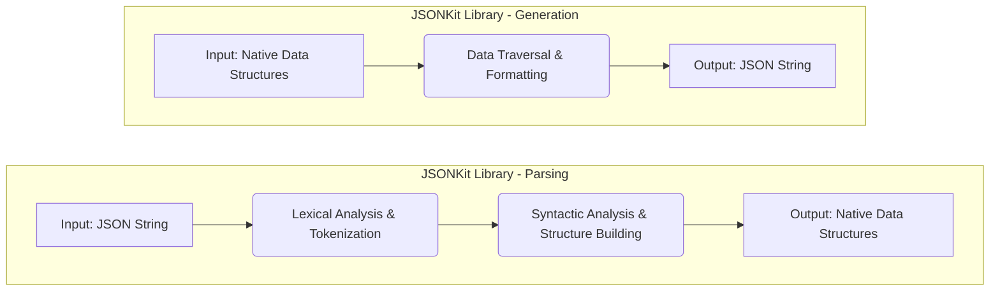

# Project Design Document: JSONKit Library

**Version:** 1.1
**Date:** October 26, 2023
**Author:** AI Software Architect

## 1. Project Overview

JSONKit is envisioned as a performant and developer-friendly library dedicated to the fundamental tasks of parsing JSON strings into native data structures and generating JSON strings from native data structures. Its design prioritizes simplicity, efficiency, and ease of integration into various software projects. This document details the library's architecture and key components to facilitate future threat modeling.

## 2. Goals

* **Efficient Parsing:** To convert JSON strings into in-memory representations with minimal overhead and optimal speed.
* **Efficient Generation:** To serialize native data structures into valid JSON strings with minimal performance impact.
* **Standard Compliance:** To adhere strictly to the JSON specification (RFC 7159 or later).
* **Clear API:** To provide a straightforward and easy-to-use interface for both parsing and generation operations.
* **Minimal Footprint:** To maintain a small code size and limit resource consumption.
* **Broad Language Support (Potential):**  While this document focuses on the core design, the architecture should be adaptable to multiple programming languages.

## 3. Non-Goals

* **JSON Schema Validation:** The library will not include built-in functionality for validating JSON documents against a schema. This responsibility lies with the consuming application or dedicated schema validation libraries.
* **Advanced Data Transformation:** Complex data manipulations or transformations beyond basic parsing and generation are outside the scope.
* **Automatic Type Conversion Beyond Standard JSON:**  The library will not attempt to infer or convert data types beyond the standard JSON types.
* **Direct Network or File System Interaction:**  Loading JSON from URLs or files is the responsibility of the calling application. JSONKit focuses solely on processing in-memory JSON strings or data structures.
* **Support for Non-Standard JSON Extensions:**  The library will strictly adhere to the official JSON specification and will not support non-standard extensions or dialects.

## 4. Architecture and Design

JSONKit employs a distinct separation between the parsing and generation functionalities. This modular approach enhances maintainability and allows for independent optimization of each process. The core architecture revolves around a state machine for parsing and a recursive traversal for generation.

* **Parsing Architecture:** The parser utilizes a state machine-driven approach. It iterates through the input JSON string, transitioning between states based on the encountered characters. This allows for efficient and accurate parsing of the JSON structure.
* **Generation Architecture:** The generator employs a recursive traversal algorithm. It starts from the root of the native data structure and recursively processes its elements, formatting them into the corresponding JSON string representation.

## 5. Data Flow

## 6. Key Components

* **Lexical Analyzer (Tokenizer):**
    * **Responsibility:**  Scans the input JSON string character by character and groups them into meaningful tokens.
    * **Functionality:** Identifies keywords (`true`, `false`, `null`), structural characters (`{`, `}`, `[`, `]`, `:`, `,`), string literals (handling escape sequences), and numeric literals.
    * **Output:** A stream of tokens representing the structure and data within the JSON string.

* **Syntactic Analyzer (Parser):**
    * **Responsibility:** Takes the stream of tokens from the lexical analyzer and verifies if they conform to the JSON grammar rules.
    * **Functionality:** Builds an in-memory representation of the JSON structure, typically using native data structures like dictionaries/maps for JSON objects and lists/arrays for JSON arrays. Handles nested structures and ensures correct syntax.
    * **Error Handling:** Detects syntax errors in the input JSON and provides informative error messages, including the location of the error.

* **JSON Generator:**
    * **Responsibility:** Converts native data structures into a valid JSON string representation.
    * **Functionality:**  Recursively traverses the input data structures. For each element, it formats it according to JSON rules (e.g., quoting strings, representing numbers and booleans, handling null values).
    * **Options:** May offer options for formatting the output JSON (e.g., indentation for readability).

* **Data Structures (Internal Representation):**
    * **Responsibility:**  Holds the parsed JSON data in memory.
    * **Implementation:** Relies on the host language's native data structures (e.g., `dict` and `list` in Python, `HashMap` and `ArrayList` in Java). This avoids the overhead of custom data structures.

* **Error Handling Module:**
    * **Responsibility:** Manages and reports errors that occur during parsing or generation.
    * **Functionality:** Provides mechanisms for identifying the type of error (e.g., syntax error, unexpected token), the location of the error in the input, and potentially a descriptive error message. May use exceptions or specific error codes.

## 7. Dependencies

* **Standard Library of the Host Language:** The library should primarily rely on the standard library of the target programming language to minimize external dependencies. This includes functionalities for string manipulation, memory management, and basic data structures.
* **Minimal External Libraries (Optional):** In specific scenarios or for performance optimization, carefully selected and vetted external libraries might be considered, but the core design prioritizes a minimal dependency footprint. Any such dependencies would be explicitly documented.

## 8. Deployment Considerations

* **Library Integration:**  JSONKit is intended to be deployed as a library that can be easily integrated into other software projects.
* **Compilation/Packaging:** Deployment will involve compiling the source code into a library format (e.g., a `.so` or `.dll` file, a JAR file, or a language-specific package).
* **Runtime Environment:** The library's runtime requirements will be minimal, primarily depending on the availability of the standard library of the host programming language.
* **Platform Independence (Goal):** The design should strive for platform independence, allowing the library to be deployed on various operating systems and architectures with minimal or no modifications.

## 9. Security Considerations

This section outlines potential security considerations that will be further explored during the threat modeling process.

* **Input Validation Vulnerabilities:**
    * **Malformed JSON:** The parser must robustly handle malformed JSON inputs to prevent crashes, unexpected behavior, or resource exhaustion. This includes incomplete structures, incorrect syntax, and invalid characters.
    * **Deeply Nested Structures:**  Parsing excessively nested JSON structures could lead to stack overflow errors or excessive memory consumption. Limits on nesting depth might be necessary.
    * **Large Strings:** Handling extremely large string values within the JSON could lead to buffer overflows or excessive memory allocation if not managed carefully.
    * **Integer Overflow during Number Parsing:** Parsing very large numerical values could result in integer overflows if the underlying data types are not large enough to accommodate them.

* **Denial of Service (DoS) Attacks:**
    * **Resource Exhaustion:** Maliciously crafted JSON payloads with deeply nested structures or extremely large arrays/objects could be designed to consume excessive memory or processing time, leading to a denial of service.
    * **Algorithmic Complexity:** Inefficient parsing algorithms could be exploited by providing specific input patterns that cause the parser to perform poorly, leading to performance degradation or denial of service.

* **Injection Attacks (Indirect):**
    * **Cross-Site Scripting (XSS) via Unsanitized Output:** If the generated JSON output is directly embedded into web pages without proper sanitization, it could potentially introduce XSS vulnerabilities. This is more of a concern for the consuming application but highlights the importance of secure output handling.
    * **SQL Injection via Unsafe Data Handling:** If parsed JSON data is used to construct SQL queries without proper sanitization, it could lead to SQL injection vulnerabilities in the consuming application.

* **Memory Safety:**
    * **Buffer Overflows:**  Careless memory management during parsing or generation could lead to buffer overflows, potentially allowing attackers to overwrite adjacent memory regions.
    * **Memory Leaks:** Failure to properly release allocated memory after parsing or generation could lead to memory leaks, eventually causing the application to crash or become unstable.

* **Error Handling Weaknesses:**
    * **Information Disclosure:** Error messages that reveal too much information about the internal workings of the library could be exploited by attackers.
    * **Unhandled Exceptions:**  Unexpected errors that are not properly handled could lead to crashes or unpredictable behavior.

## 10. Future Considerations

* **Support for Streaming Parsing:** Implementing streaming parsing capabilities could allow for processing very large JSON files without loading the entire content into memory.
* **Performance Optimizations:**  Further optimization of parsing and generation algorithms could be explored to improve performance.
* **Language Bindings:**  Developing bindings for other popular programming languages could broaden the library's reach.
* **Customizable Formatting Options:** Providing more granular control over the formatting of generated JSON strings (e.g., indentation, sorting of keys).

This improved design document provides a more detailed and comprehensive overview of the JSONKit library, enhancing its value for subsequent threat modeling activities.
