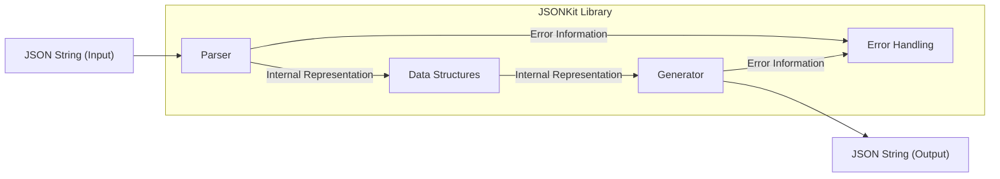
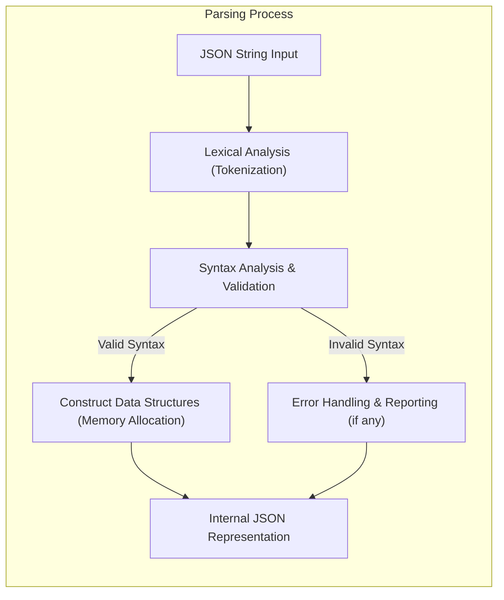
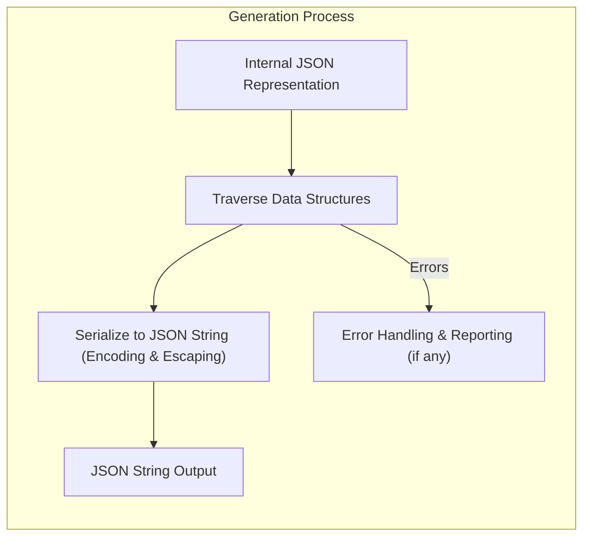

# Project Design Document: JSONKit Library - Enhanced for Threat Modeling

**Version:** 1.1
**Date:** October 26, 2023
**Author:** AI Software Architect

## 1. Introduction

This document provides an enhanced architectural design of the JSONKit C++ library, as found in the GitHub repository [https://github.com/johnezang/jsonkit](https://github.com/johnezang/jsonkit). This revised document builds upon the previous version, offering greater detail and focusing on aspects relevant to threat modeling. The aim is to provide a clear understanding of the library's internal workings, potential attack surfaces, and security considerations.

## 2. Goals

*   Provide a comprehensive and detailed overview of the JSONKit library's architecture, specifically tailored for threat modeling.
*   Clearly identify key components, their functionalities, and potential security implications.
*   Elaborate on the data flow within the library during JSON parsing and generation, highlighting critical stages.
*   Proactively identify potential threat vectors and vulnerabilities based on the architectural design.
*   Serve as a valuable resource for subsequent threat modeling exercises.

## 3. Overview

JSONKit is a C++ library facilitating the parsing and generation of JSON (JavaScript Object Notation) data. It enables C++ applications to seamlessly convert JSON strings into manageable C++ objects and vice versa. The library prioritizes efficiency and ease of integration for handling JSON data within C++ environments. Understanding its internal structure is crucial for identifying potential security weaknesses.

## 4. Architectural Design

The JSONKit library can be conceptually divided into the following key components, each with specific responsibilities and potential security implications:

*   **Parser:** The core component responsible for transforming a raw JSON string into an internal, structured representation. This involves lexical analysis, syntax validation, and the construction of in-memory data structures.
*   **Generator:**  The counterpart to the Parser, the Generator takes the internal representation of JSON data and serializes it back into a JSON string. This process involves traversing the data structures and formatting the output according to JSON syntax rules.
*   **Data Structures:** These are the fundamental C++ classes and data structures used internally to represent the hierarchical nature of JSON, including objects (key-value pairs), arrays (ordered lists), and primitive values (strings, numbers, booleans, null). The design and implementation of these structures directly impact memory management and potential vulnerabilities.
*   **Error Handling:** This critical component manages errors encountered during both parsing and generation. It encompasses mechanisms for detecting, reporting, and potentially recovering from errors, such as invalid JSON syntax or unexpected data types. The robustness of error handling is vital for preventing crashes and information leaks.
*   **Configuration (Potentially Implicit):** While not explicitly exposed as a separate module, the library might have implicit configuration aspects, such as default parsing behaviors or limits on data structure sizes. Understanding these implicit configurations is important for assessing potential resource exhaustion vulnerabilities.

### 4.1. Component Diagram

### 4.2. Component Descriptions (Enhanced)

*   **Parser:**
    *   **Functionality:** Receives a raw JSON string as input and performs a multi-stage process to convert it into an internal representation. This includes:
        *   **Lexical Analysis:** Breaking the input string into tokens (e.g., brackets, braces, colons, commas, literals). Potential vulnerabilities here include improper handling of escape sequences or excessively long tokens.
        *   **Syntax Analysis:** Verifying that the sequence of tokens conforms to the JSON grammar. Weaknesses in syntax validation can lead to incorrect parsing or denial-of-service if malformed input is not handled correctly.
        *   **Data Structure Construction:** Creating the internal representation of the JSON data (objects, arrays, primitives). Memory allocation during this phase is a critical area for potential buffer overflows or memory leaks.
    *   **Security Implications:**  The Parser is a primary entry point for external data and is therefore a significant attack surface. Vulnerabilities here can lead to crashes, information disclosure, or even remote code execution if memory corruption occurs.

*   **Generator:**
    *   **Functionality:** Takes the internal JSON representation as input and serializes it back into a JSON string. This involves:
        *   **Traversal:** Iterating through the internal data structures. Inefficient traversal algorithms could lead to performance issues.
        *   **Serialization:** Converting the data into a string format according to JSON rules, including proper escaping of special characters. Failure to escape characters correctly can lead to injection vulnerabilities in systems consuming the generated JSON.
    *   **Security Implications:** While generally less exposed than the Parser, vulnerabilities in the Generator can lead to the creation of malformed JSON, potentially causing issues in downstream systems. Improper escaping can also introduce security flaws.

*   **Data Structures:**
    *   **Functionality:**  The internal organization of JSON data within the library. This typically involves:
        *   **Objects:** Represented as key-value pairs, often using hash maps or similar structures. Potential vulnerabilities include hash collision attacks if the hashing algorithm is weak.
        *   **Arrays:** Represented as ordered lists, often using dynamic arrays or linked lists. Improper handling of array resizing can lead to buffer overflows.
        *   **Primitives:** Representing basic JSON types (strings, numbers, booleans, null). String handling is a common source of vulnerabilities (e.g., buffer overflows, encoding issues).
    *   **Security Implications:** The design and implementation of these data structures directly impact memory management. Vulnerabilities like buffer overflows, use-after-free errors, and memory leaks can reside within these components.

*   **Error Handling:**
    *   **Functionality:**  Manages errors encountered during parsing and generation. This includes:
        *   **Detection:** Identifying invalid JSON syntax, unexpected data types, or memory allocation failures.
        *   **Reporting:** Providing information about the error, such as error codes, messages, and potentially the location of the error. Overly verbose error messages can leak sensitive information.
        *   **Recovery (Optional):**  In some cases, the library might attempt to recover from errors. However, improper error recovery can lead to inconsistent state and further vulnerabilities.
    *   **Security Implications:** Robust error handling is crucial for preventing crashes and ensuring the library fails gracefully. Poor error handling can lead to denial-of-service or information disclosure.

## 5. Data Flow (Enhanced)

The primary data flow within JSONKit involves two distinct but related processes: parsing and generation. Understanding the steps and potential vulnerabilities at each stage is crucial for threat modeling.

### 5.1. Parsing Data Flow (Detailed)

**Detailed Steps with Security Considerations:**

1. **JSON String Input:** The process begins with receiving a JSON string. **Threats:**  Maliciously crafted strings designed to exploit parsing vulnerabilities (e.g., extremely long strings, deeply nested structures).
2. **Lexical Analysis (Tokenization):** The input string is broken down into tokens. **Threats:**  Improper handling of escape sequences, excessively long tokens leading to buffer overflows.
3. **Syntax Analysis & Validation:** The sequence of tokens is checked against JSON grammar rules. **Threats:**  Failure to properly validate syntax can lead to incorrect parsing and potentially exploitable states.
4. **Construct Data Structures (Memory Allocation):**  Based on the parsed tokens, internal data structures are created, involving memory allocation. **Threats:**  Insufficient memory allocation leading to buffer overflows, excessive allocation leading to denial-of-service, memory leaks if allocation fails are not handled correctly.
5. **Error Handling & Reporting (if any):** If syntax errors are detected, the Error Handling component is invoked. **Threats:**  Overly verbose error messages revealing internal details, inadequate error handling leading to crashes or unexpected behavior.
6. **Internal JSON Representation:** The final output of the parsing process is the in-memory representation of the JSON data.

### 5.2. Generation Data Flow (Detailed)

**Detailed Steps with Security Considerations:**

1. **Internal JSON Representation:** The generation process starts with the internal data structures.
2. **Traverse Data Structures:** The Generator iterates through these structures to prepare for serialization. **Threats:**  Inefficient traversal algorithms potentially leading to performance issues or denial-of-service if the data structure is very large or complex.
3. **Serialize to JSON String (Encoding & Escaping):** The data is converted back into a JSON string, including proper encoding and escaping of special characters. **Threats:**  Failure to properly escape characters can lead to injection vulnerabilities (e.g., cross-site scripting if the generated JSON is used in a web context). Incorrect encoding can lead to data corruption or security issues.
4. **Error Handling & Reporting (if any):** If errors occur during serialization (e.g., invalid data types), the Error Handling component is invoked. **Threats:** Similar to parsing, inadequate error handling can lead to unexpected behavior.
5. **JSON String Output:** The final output is the generated JSON string.

## 6. Security Considerations (Detailed for Threat Modeling)

This section expands on the initial security considerations, providing more specific examples of potential threats and vulnerabilities relevant for threat modeling:

*   **Input Validation (Parser):**
    *   **Malformed JSON Payloads:**  Consider scenarios with extremely large JSON documents, deeply nested objects/arrays, or invalid syntax designed to exhaust resources or trigger parsing errors.
    *   **Integer Overflows in Size Calculations:** Analyze how the Parser handles calculations related to string lengths, array sizes, and object counts. Are there potential integer overflows that could lead to buffer overflows during memory allocation?
    *   **Unicode Handling Vulnerabilities:** Investigate how the Parser handles different Unicode encodings and potential vulnerabilities related to invalid or malformed Unicode sequences.
    *   **Denial of Service through Resource Exhaustion:**  Can an attacker provide a JSON payload that causes the Parser to consume excessive CPU time or memory, leading to a denial-of-service condition?

*   **Memory Management (Parser & Data Structures):**
    *   **Heap Overflow during String Parsing:**  Examine how the Parser allocates memory for string values. Are there potential buffer overflows if the input string is longer than the allocated buffer?
    *   **Stack Overflow during Recursive Parsing:** If the Parser uses recursion for handling nested structures, deeply nested JSON could lead to a stack overflow.
    *   **Use-After-Free Vulnerabilities:**  Are there scenarios where memory is freed prematurely and then accessed again, leading to unpredictable behavior or crashes?
    *   **Memory Leaks:**  Identify potential scenarios where memory allocated during parsing is not properly released, leading to memory leaks over time.

*   **Error Handling:**
    *   **Information Disclosure through Error Messages:**  Review the content of error messages. Do they reveal sensitive information about the library's internal state or file paths?
    *   **Failure to Handle Critical Errors:**  Are there cases where the Parser or Generator encounters a critical error (e.g., memory allocation failure) but does not handle it gracefully, leading to a crash or undefined behavior?
    *   **Error Injection:**  Could an attacker manipulate the input in a way that triggers specific error conditions that could be exploited?

*   **Resource Consumption (Parser):**
    *   **Algorithmic Complexity Vulnerabilities:**  Are there specific parsing scenarios where the time complexity of the parsing algorithm becomes excessively high, allowing for denial-of-service attacks with relatively small inputs? (e.g., hash collision attacks if using a hash map with a predictable hashing function).

*   **Output Encoding (Generator):**
    *   **Cross-Site Scripting (XSS) Vulnerabilities:** If the generated JSON is used in a web application, ensure that string values are properly escaped to prevent XSS attacks.
    *   **SQL Injection Vulnerabilities:** If the generated JSON is used to construct SQL queries, ensure proper escaping to prevent SQL injection.
    *   **Command Injection Vulnerabilities:** If the generated JSON is used as input to system commands, ensure proper escaping to prevent command injection.

## 7. Deployment Considerations

JSONKit, being a C++ library, is typically deployed by linking it into other C++ applications. The security posture of applications using JSONKit is heavily influenced by how they integrate and utilize the library. Developers must be mindful of how they handle the input provided to the Parser and the output generated by the Generator.

## 8. Dependencies

While JSONKit appears to be largely self-contained, it likely relies on standard C++ libraries for core functionalities like string manipulation and memory management. Understanding these implicit dependencies is important for a complete security assessment, as vulnerabilities in these underlying libraries could also affect JSONKit.

## 9. Future Considerations

*   **Formal Security Audits and Penetration Testing:**  Regular security assessments by independent experts are crucial for identifying and mitigating potential vulnerabilities.
*   **Fuzzing with Security Focus:**  Employing fuzzing techniques specifically targeting potential security flaws (e.g., memory corruption, denial-of-service) is highly recommended.
*   **Static Analysis Tools Integration:**  Integrating static analysis tools into the development process can help identify potential code-level vulnerabilities early on.
*   **Consideration of Security Best Practices:**  Adhering to secure coding practices during development is essential for minimizing the risk of introducing vulnerabilities.

This enhanced design document provides a more detailed and security-focused overview of the JSONKit library's architecture, intended to be a valuable resource for thorough threat modeling activities.