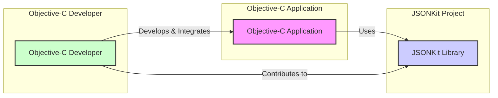
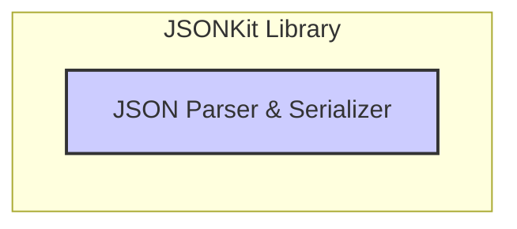
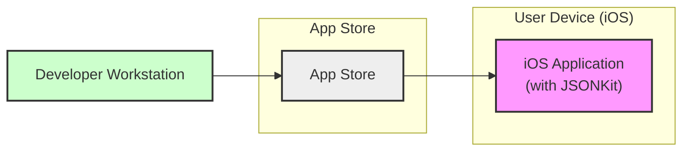
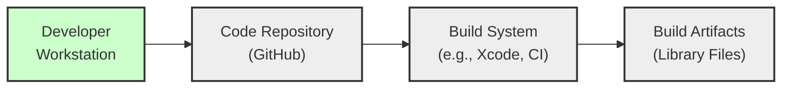

# BUSINESS POSTURE

This project is a GITHUB REPOSITORY for JSONKit, a lightweight JSON parser and serializer for Objective-C.

* Business Priorities and Goals:
 - Provide a fast, efficient, and easy-to-use JSON parsing and serialization library for Objective-C developers.
 - Offer a robust and reliable solution for handling JSON data in Objective-C applications.
 - Maintain a lightweight footprint to minimize resource consumption in applications.
 - Ensure compatibility with a wide range of Objective-C environments and projects.

* Most Important Business Risks:
 - Security vulnerabilities in the JSON parsing logic could lead to application security breaches if exploited by malicious JSON input.
 - Performance bottlenecks in parsing or serialization could negatively impact the performance of applications using JSONKit.
 - Incompatibility issues with certain Objective-C environments or libraries could limit adoption and cause integration problems.
 - Bugs or errors in JSON parsing or serialization could lead to data corruption or application instability.

# SECURITY POSTURE

* Security Controls:
 - security control: Code is hosted on GitHub, providing version control and transparency. (Implemented: GitHub Repository)
 - security control: Open-source nature allows for community review and contributions, potentially identifying security issues. (Implemented: Open Source)

* Accepted Risks:
 - accepted risk: Reliance on community contributions for security vulnerability identification and patching.
 - accepted risk: Potential for undiscovered vulnerabilities in the code base.
 - accepted risk: No explicitly defined Secure Software Development Lifecycle (SSDLC) documented in the repository.

* Recommended Security Controls:
 - security control: Implement automated Static Application Security Testing (SAST) in the build process to identify potential code-level vulnerabilities.
 - security control: Integrate dependency scanning to ensure no known vulnerable dependencies are introduced.
 - security control: Conduct regular code reviews, focusing on security aspects of JSON parsing and serialization logic.
 - security control: Consider implementing fuzz testing to identify robustness issues and potential vulnerabilities in JSON parsing.
 - security control: Define and document a process for handling security vulnerabilities, including reporting, patching, and disclosure.

* Security Requirements:
 - Authentication: Not applicable. JSONKit is a library and does not handle user authentication. Applications using JSONKit are responsible for their own authentication mechanisms.
 - Authorization: Not applicable. JSONKit is a library and does not handle user authorization. Applications using JSONKit are responsible for their own authorization mechanisms.
 - Input Validation:
  - security requirement: Robust input validation is critical to prevent vulnerabilities arising from maliciously crafted JSON inputs.
  - security requirement: The library must handle invalid or malformed JSON gracefully without crashing or exhibiting unexpected behavior.
  - security requirement: Input validation should protect against common injection attacks that might be possible through JSON parsing, although less likely in a pure parsing library.
 - Cryptography:
  - security requirement: Cryptography is not a primary requirement for a JSON parsing library itself.
  - security requirement: If JSONKit is used in applications that handle sensitive data, the applications themselves must implement appropriate encryption and decryption mechanisms outside of the JSON parsing library.
  - security requirement: Ensure that any dependencies used by JSONKit do not introduce cryptographic vulnerabilities.

# DESIGN

## C4 CONTEXT

* Context Diagram Elements:
 - Element:
  - Name: "Objective-C Application"
  - Type: Software System
  - Description: Applications developed in Objective-C that require JSON parsing and serialization capabilities.
  - Responsibilities:
   - Utilizing JSONKit library to parse and serialize JSON data.
   - Implementing application-specific logic and security controls.
  - Security controls:
   - Application-level authentication and authorization.
   - Input validation beyond JSON parsing (application-specific data validation).
   - Data encryption and secure data handling.
 - Element:
  - Name: "JSONKit Library"
  - Type: Software System / Library
  - Description: The JSONKit library itself, providing JSON parsing and serialization functionalities.
  - Responsibilities:
   - Parsing JSON data into Objective-C objects.
   - Serializing Objective-C objects into JSON data.
   - Handling various JSON formats and data types.
   - Providing efficient and reliable JSON processing.
  - Security controls:
   - Input validation of JSON data to prevent parsing vulnerabilities.
   - Memory safety to avoid buffer overflows or other memory-related issues.
 - Element:
  - Name: "Objective-C Developer"
  - Type: Person
  - Description: Developers who use JSONKit in their Objective-C applications and may contribute to the JSONKit project.
  - Responsibilities:
   - Integrating JSONKit into Objective-C applications.
   - Developing and maintaining applications that use JSONKit.
   - Potentially contributing code, bug reports, or feature requests to the JSONKit project.
  - Security controls:
   - Following secure coding practices when using JSONKit.
   - Reporting potential security vulnerabilities in JSONKit.

## C4 CONTAINER

* Container Diagram Elements:
 - Element:
  - Name: "JSON Parser & Serializer"
  - Type: Container / Code Library
  - Description: A single container representing the JSONKit library, encompassing both JSON parsing and serialization functionalities within the Objective-C ecosystem.
  - Responsibilities:
   - Implements algorithms for parsing JSON text into Objective-C data structures (e.g., dictionaries, arrays, strings, numbers).
   - Implements algorithms for serializing Objective-C data structures back into JSON text.
   - Manages memory allocation and deallocation during parsing and serialization.
   - Handles different JSON encoding formats (e.g., UTF-8).
  - Security controls:
   - security control: Input validation logic within the parser to handle malformed or malicious JSON inputs.
   - security control: Memory management routines to prevent buffer overflows and other memory safety issues during parsing and serialization.
   - security control: Code review of parsing and serialization algorithms to identify and mitigate potential vulnerabilities.

## DEPLOYMENT

JSONKit is a library and is not deployed as a standalone service. It is integrated directly into Objective-C applications during their build process and deployed as part of those applications. Therefore, the deployment diagram focuses on the application that uses JSONKit.

Assuming a typical deployment scenario for an Objective-C application (e.g., a mobile iOS application):

* Deployment Diagram Elements:
 - Element:
  - Name: "iOS Application (with JSONKit)"
  - Type: Software Instance / Application
  - Description: An instance of an iOS application that has integrated the JSONKit library. This application runs on a user's iOS device.
  - Responsibilities:
   - Executing application logic, including using JSONKit for JSON processing.
   - Interacting with the user and other system resources on the iOS device.
   - Managing application data and state.
  - Security controls:
   - security control: Operating system level security controls provided by iOS.
   - security control: Application-level security controls implemented by the application developer.
   - security control: Secure storage of application data on the device.
   - security control: Network security for communication if the application interacts with network services.
 - Element:
  - Name: "App Store"
  - Type: Infrastructure / Distribution Platform
  - Description: Apple's App Store, used for distributing and deploying iOS applications to user devices.
  - Responsibilities:
   - Hosting and distributing iOS application packages.
   - Verifying application integrity and security before distribution (Apple's App Review process).
   - Managing application updates and installations on user devices.
  - Security controls:
   - security control: App Store review process to detect malicious applications.
   - security control: Code signing to ensure application integrity and authenticity.
   - security control: Secure distribution channels to prevent tampering during download.
 - Element:
  - Name: "Developer Workstation"
  - Type: Infrastructure / Development Environment
  - Description: The workstation used by the Objective-C developer to build and package the iOS application.
  - Responsibilities:
   - Development of the Objective-C application code, including integration of JSONKit.
   - Building and testing the application.
   - Packaging the application for distribution through the App Store.
  - Security controls:
   - security control: Developer workstation security practices (OS hardening, malware protection).
   - security control: Secure development environment to prevent code tampering or unauthorized access.
   - security control: Code signing certificates managed securely on the workstation.

## BUILD

* Build Process Elements:
 - Element:
  - Name: "Developer Workstation"
  - Type: Environment
  - Description: Developer's local machine where code is written and potentially built initially.
  - Responsibilities:
   - Writing and testing code for JSONKit.
   - Performing local builds and unit tests.
   - Committing code changes to the code repository.
  - Security controls:
   - security control: Secure coding practices by the developer.
   - security control: Local security tools (linters, static analysis) on the workstation.
 - Element:
  - Name: "Code Repository (GitHub)"
  - Type: System
  - Description: GitHub repository hosting the JSONKit source code.
  - Responsibilities:
   - Version control of the source code.
   - Collaboration platform for developers.
   - Triggering automated build processes (e.g., via GitHub Actions).
  - Security controls:
   - security control: Access control to the repository (who can commit, merge, etc.).
   - security control: Branch protection rules to enforce code review and prevent direct commits to main branches.
   - security control: Audit logs of repository activities.
 - Element:
  - Name: "Build System (e.g., Xcode, CI)"
  - Type: System
  - Description: Automated build system used to compile, test, and package JSONKit. This could be Xcode for local builds or a CI system like GitHub Actions for automated builds.
  - Responsibilities:
   - Automating the build process.
   - Compiling source code.
   - Running unit tests.
   - Generating build artifacts (library files).
   - Potentially performing security checks (SAST, dependency scanning).
  - Security controls:
   - security control: Secure configuration of the build environment.
   - security control: Integration of security scanning tools (SAST, dependency check).
   - security control: Access control to the build system and build configurations.
   - security control: Audit logs of build activities.
 - Element:
  - Name: "Build Artifacts (Library Files)"
  - Type: Data
  - Description: Output of the build process, typically library files (e.g., static library, framework) that can be integrated into Objective-C applications.
  - Responsibilities:
   - Providing the distributable form of the JSONKit library.
   - Being consumed by Objective-C applications during their build process.
  - Security controls:
   - security control: Integrity checks (e.g., checksums) of build artifacts.
   - security control: Secure storage and distribution of build artifacts if distributed separately from source code.

# RISK ASSESSMENT

* Critical Business Processes:
 - Applications relying on JSONKit for data exchange and processing. If JSONKit fails or is compromised, these applications may malfunction or become vulnerable.
 - Development and maintenance of Objective-C applications that depend on JSONKit.

* Data Sensitivity:
 - The sensitivity of data processed by JSONKit depends entirely on the applications that use it. JSONKit itself is a data processing library and does not inherently handle sensitive data.
 - If applications use JSONKit to process sensitive data (e.g., user credentials, financial information, personal data), then the security of JSONKit becomes critical for protecting that sensitive data in transit and at rest within the application's context.
 - The sensitivity level can range from public data to highly confidential data, depending on the application's purpose.

# QUESTIONS & ASSUMPTIONS

* Questions:
 - What are the primary use cases for JSONKit? Is it mainly for mobile applications, server-side applications, or a mix?
 - Are there specific performance benchmarks or requirements for JSONKit?
 - What is the intended support and maintenance model for JSONKit?
 - Are there any known integrations with other libraries or frameworks that are important to consider?
 - Is there a community or organization actively using and contributing to JSONKit?

* Assumptions:
 - BUSINESS POSTURE: The primary goal is to provide a general-purpose, high-performance JSON library for Objective-C. The project aims for broad applicability across different types of Objective-C applications.
 - SECURITY POSTURE: Security is important, but the project currently relies on open-source community review rather than dedicated security processes. Input validation is implicitly considered important for a parsing library.
 - DESIGN: JSONKit is designed as a standalone library with a clear separation of parsing and serialization functionalities. Deployment is intended to be through integration into Objective-C applications, not as a standalone service. The build process is assumed to be standard Objective-C library build practices, potentially leveraging CI for automation.