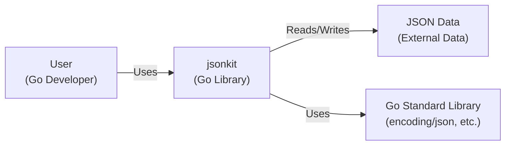
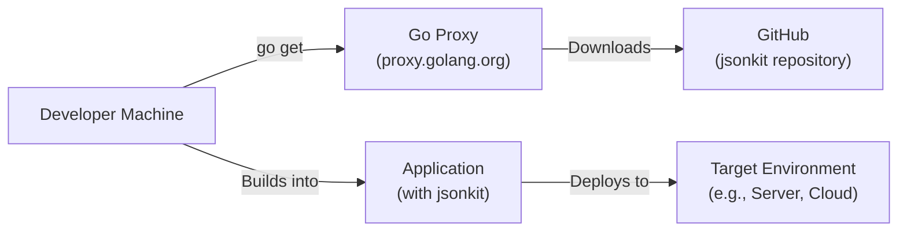
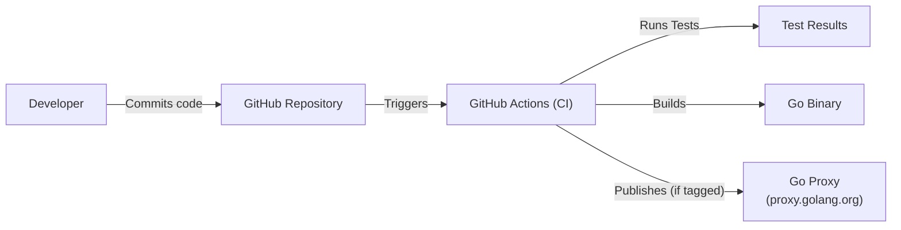

Okay, let's create a design document for the `jsonkit` project.

# BUSINESS POSTURE

Business Priorities and Goals:

*   Provide a simple, fast, and efficient way to handle JSON data in Go applications.
*   Offer a lightweight alternative to the standard library's `encoding/json` package, potentially with performance improvements.
*   Reduce the complexity of working with JSON, especially for common tasks like marshaling and unmarshaling.
*   Provide a user-friendly API that is easy to learn and use.
*   Minimize external dependencies to reduce the project's footprint and potential security vulnerabilities.
*   Open source project, available for public.

Business Risks:

*   Data corruption or unexpected behavior due to bugs in the library, leading to incorrect application behavior.
*   Security vulnerabilities within the library that could be exploited to compromise applications using it. This is especially critical if the library is used to process untrusted JSON input.
*   Performance bottlenecks that negate the intended performance benefits over the standard library.
*   Lack of adoption due to insufficient features, poor documentation, or competition from other libraries.
*   Maintenance burden and difficulty in keeping the library up-to-date with Go language changes and security best practices.
*   Reputational damage if vulnerabilities are found and not promptly addressed.

# SECURITY POSTURE

Existing Security Controls:

*   security control: The project uses Go, which is a memory-safe language, reducing the risk of buffer overflows and other memory-related vulnerabilities. (Source: Go language specification)
*   security control: The project appears to have a suite of unit tests. (Source: `*_test.go` files in the repository)
*   security control: The project has minimal external dependencies. (Source: `go.mod` file)
*   security control: Project is using GitHub, and have ability to use GitHub security features.

Accepted Risks:

*   accepted risk: The project does not appear to have explicit fuzzing tests, which could help identify edge cases and potential vulnerabilities related to malformed JSON input.
*   accepted risk: The project does not explicitly document security considerations or provide guidance on handling untrusted input.
*   accepted risk: The project does not have a documented security policy or vulnerability disclosure process.
*   accepted risk: The project does not appear to use any static analysis tools to identify potential security issues in the code.
*   accepted risk: The project does not implement any supply chain security.

Recommended Security Controls:

*   security control: Implement comprehensive fuzzing tests using a tool like `go-fuzz` to ensure robustness against malformed input.
*   security control: Add a `SECURITY.md` file to the repository to document security considerations, reporting procedures, and a security policy.
*   security control: Integrate static analysis tools (e.g., `go vet`, `staticcheck`, `gosec`) into the build process to identify potential security issues early.
*   security control: Consider adding benchmarks to compare performance against the standard library and other alternatives, and to detect performance regressions.
*   security control: Implement supply chain security, e.g. sign releases, use SLSA framework.
*   security control: Implement dynamic application security testing.

Security Requirements:

*   Authentication: Not applicable, as this is a library, not a service.
*   Authorization: Not applicable, as this is a library, not a service.
*   Input Validation:
    *   The library *must* correctly handle all valid JSON inputs according to the JSON specification (RFC 8259).
    *   The library *should* gracefully handle invalid JSON input, returning informative errors rather than panicking or crashing.
    *   The library *should* provide mechanisms to limit the size and depth of JSON documents to prevent denial-of-service attacks (e.g., resource exhaustion).
*   Cryptography:
    *   If the library handles cryptographic keys or other sensitive data in JSON format, it *must* not introduce any vulnerabilities that could compromise the security of that data. This is primarily a concern if the library modifies or transforms the JSON data. Since this library focuses on basic JSON handling, this is likely not a primary concern, but it's worth noting.
*   Output validation:
    *   The library *must* generate valid JSON.

# DESIGN

## C4 CONTEXT

Context Diagram Element List:

*   Element:
    *   Name: User
    *   Type: Person
    *   Description: A Go developer who integrates the `jsonkit` library into their application.
    *   Responsibilities: Uses the `jsonkit` library to marshal and unmarshal JSON data within their Go application.
    *   Security controls: Not directly applicable to the user, but the user's application should follow secure coding practices.

*   Element:
    *   Name: jsonkit
    *   Type: Software System
    *   Description: The `jsonkit` Go library itself.
    *   Responsibilities: Provides functions for marshaling and unmarshaling JSON data, handling errors, and potentially offering performance optimizations.
    *   Security controls: Memory safety (provided by Go), unit tests, (recommended) fuzzing tests, static analysis, security documentation.

*   Element:
    *   Name: JSON Data
    *   Type: External Data
    *   Description: JSON data that is either read from or written to by the `jsonkit` library. This could come from various sources (files, network connections, etc.).
    *   Responsibilities: Represents the data that needs to be processed.
    *   Security controls: Input validation within `jsonkit` to handle potentially malformed or malicious JSON data.

*   Element:
    *   Name: Go Standard Library
    *   Type: External Library
    *   Description: The Go standard library, particularly the `encoding/json` package, and other core libraries.
    *   Responsibilities: Provides underlying functionality that `jsonkit` might use or build upon.
    *   Security controls: Relies on the security of the Go standard library itself.

## C4 CONTAINER

Since `jsonkit` is a library, the container diagram is essentially the same as the context diagram. A library doesn't have separate deployable containers in the same way a service-oriented application does.

Container Diagram Element List:

*   Element:
    *   Name: User
    *   Type: Person
    *   Description: A Go developer who integrates the `jsonkit` library into their application.
    *   Responsibilities: Uses the `jsonkit` library to marshal and unmarshal JSON data within their Go application.
    *   Security controls: Not directly applicable to the user, but the user's application should follow secure coding practices.

*   Element:
    *   Name: jsonkit
    *   Type: Software System
    *   Description: The `jsonkit` Go library itself.
    *   Responsibilities: Provides functions for marshaling and unmarshaling JSON data, handling errors, and potentially offering performance optimizations.
    *   Security controls: Memory safety (provided by Go), unit tests, (recommended) fuzzing tests, static analysis, security documentation.

*   Element:
    *   Name: JSON Data
    *   Type: External Data
    *   Description: JSON data that is either read from or written to by the `jsonkit` library. This could come from various sources (files, network connections, etc.).
    *   Responsibilities: Represents the data that needs to be processed.
    *   Security controls: Input validation within `jsonkit` to handle potentially malformed or malicious JSON data.

*   Element:
    *   Name: Go Standard Library
    *   Type: External Library
    *   Description: The Go standard library, particularly the `encoding/json` package, and other core libraries.
    *   Responsibilities: Provides underlying functionality that `jsonkit` might use or build upon.
    *   Security controls: Relies on the security of the Go standard library itself.

## DEPLOYMENT

Deployment Options:

1.  **Direct Integration (Most Common):** Developers directly integrate the library into their Go applications using `go get` or by manually including the source code. This is the standard way Go libraries are used.
2.  **Vendoring:** Developers might vendor the library's dependencies using Go modules to ensure consistent builds.
3.  **As part of a larger system:** The library could be a component within a larger application or service, but the deployment of that larger system is outside the scope of the library itself.

Chosen Deployment (Detailed): Direct Integration

Deployment Diagram Element List:

*   Element:
    *   Name: Developer Machine
    *   Type: Person/Machine
    *   Description: The developer's local development environment.
    *   Responsibilities: Writing code, running tests, building the application.
    *   Security controls: Standard development environment security practices.

*   Element:
    *   Name: Go Proxy
    *   Type: External Service
    *   Description: The Go Proxy (proxy.golang.org), which serves Go modules.
    *   Responsibilities: Provides a reliable and secure way to download Go modules.
    *   Security controls: Managed by the Go team, assumed to be secure.

*   Element:
    *   Name: GitHub
    *   Type: External Service
    *   Description: The GitHub repository hosting the `jsonkit` source code.
    *   Responsibilities: Stores the source code and provides version control.
    *   Security controls: GitHub's security features, plus any repository-specific settings (e.g., branch protection).

*   Element:
    *   Name: Application
    *   Type: Software System
    *   Description: The developer's application that integrates the `jsonkit` library.
    *   Responsibilities: Performs the application's specific tasks, including using `jsonkit` for JSON handling.
    *   Security controls: Depends on the application's overall security posture.

*   Element:
    *   Name: Target Environment
    *   Type: Infrastructure
    *   Description: The environment where the application is deployed (e.g., a server, a cloud platform, a container).
    *   Responsibilities: Runs the application.
    *   Security controls: Depends on the specific environment's security configuration.

## BUILD

Build Process Description:

1.  **Code Commit:** A developer commits code changes to the `jsonkit` repository on GitHub.
2.  **CI Trigger:** GitHub Actions (or another CI system) is triggered by the commit.
3.  **Testing:** The CI system runs the project's unit tests (`go test`).
4.  **Building:** If the tests pass, the CI system builds the Go library (`go build`).  This produces no standalone binary, as it's a library.
5.  **Publishing (on Tag):** If the commit is tagged (e.g., for a new release), the CI system might publish the module to the Go Proxy (proxy.golang.org). This makes it available for others to use via `go get`.
6.  **Static Analysis (Recommended):**  A static analysis step (using tools like `gosec`, `staticcheck`, etc.) should be added to the CI pipeline to check for potential security vulnerabilities and code quality issues.
7.  **Fuzzing (Recommended):** Fuzzing tests should be run as part of the CI process, or periodically, to identify potential vulnerabilities related to malformed input.

Security Controls in Build Process:

*   security control: **Automated Testing:** Unit tests and (recommended) fuzzing tests are run automatically as part of the CI process, ensuring that code changes don't introduce regressions or vulnerabilities.
*   security control: **Static Analysis (Recommended):** Static analysis tools can identify potential security issues before they are deployed.
*   security control: **Dependency Management:** Go modules (`go.mod` and `go.sum`) ensure that dependencies are tracked and managed, reducing the risk of using vulnerable versions of external libraries.
*   security control: **CI/CD Pipeline:** Using a CI/CD system like GitHub Actions ensures that the build and testing process is consistent and repeatable.
*   security control: **Code Review:**  Code reviews (though not explicitly part of the automated build process) are crucial for identifying potential security issues and ensuring code quality.

# RISK ASSESSMENT

Critical Business Processes:

*   Correctly parsing and generating JSON data for applications that rely on the `jsonkit` library.
*   Maintaining the availability and reliability of the library for developers who depend on it.

Data Sensitivity:

*   The `jsonkit` library itself does not store or manage data directly. However, it *processes* JSON data, which could contain sensitive information depending on the application using the library. The sensitivity of the data is therefore entirely dependent on the context in which the library is used.
*   Data sensitivity levels could range from non-sensitive (e.g., public data) to highly sensitive (e.g., personal information, financial data, authentication credentials). The library should be designed to handle all potential data sensitivity levels securely.

# QUESTIONS & ASSUMPTIONS

Questions:

*   Are there any specific performance requirements or benchmarks that `jsonkit` aims to meet?
*   Are there any plans to support specific JSON extensions or features beyond the standard JSON specification?
*   What is the intended level of compatibility with the standard library's `encoding/json` package?
*   Are there any plans for long-term support (LTS) releases or a specific release cadence?
*   What is the expected usage pattern (e.g., mostly small JSON documents, or potentially very large ones)?
*   What are plans for community contributions?

Assumptions:

*   BUSINESS POSTURE: The primary goal is to provide a useful and reliable JSON library for the Go community.
*   BUSINESS POSTURE: The project is open-source and community-driven.
*   SECURITY POSTURE: Developers using the library are responsible for the overall security of their applications, including handling any sensitive data appropriately.
*   SECURITY POSTURE: The library is intended to be used in a variety of contexts, including those with potentially sensitive data.
*   DESIGN: The library will be used primarily through direct integration into Go applications.
*   DESIGN: The Go Proxy will be used for distribution.
*   DESIGN: GitHub Actions will be used for CI/CD.