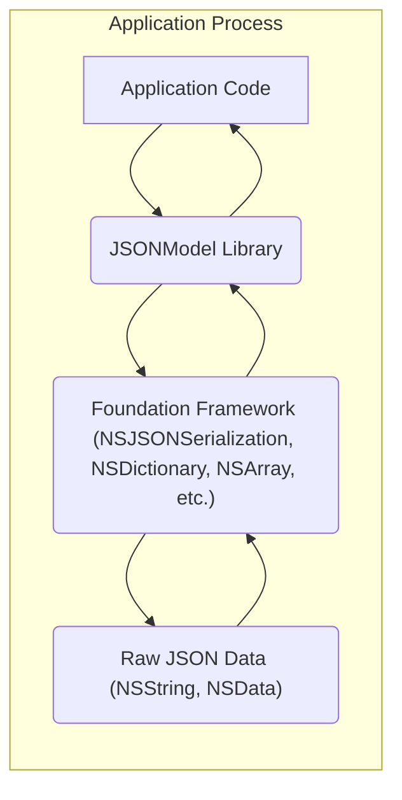
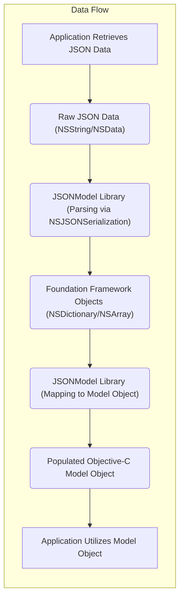

## Project Design Document: JSONModel (Improved)

**Project Name:** JSONModel

**Project Repository:** https://github.com/jsonmodel/jsonmodel

**Document Version:** 1.1

**Date:** October 26, 2023

**Author:** AI Software Architect

**1. Introduction**

This document provides an enhanced design overview of the JSONModel project, an Objective-C library designed to streamline the process of parsing JSON (JavaScript Object Notation) data into strongly-typed Objective-C model objects. This detailed design serves as a crucial foundation for subsequent threat modeling exercises, offering a comprehensive understanding of the library's architecture, data flow mechanisms, and core components.

**2. Goals**

The primary goals of the JSONModel library are:

*   To offer a declarative and efficient method for mapping JSON structures to corresponding Objective-C object properties.
*   To significantly reduce the amount of manual, error-prone code typically required for JSON parsing and object instantiation.
*   To enhance type safety by automatically converting JSON values to the expected property types, minimizing runtime errors.
*   To provide mechanisms for data validation and transformation during the mapping process, ensuring data integrity.
*   To facilitate seamless integration into existing iOS and macOS application development workflows.

**3. Target Audience**

This document is primarily intended for:

*   Security engineers tasked with performing threat modeling and security assessments of systems utilizing the JSONModel library.
*   Software developers who are actively working with or integrating the JSONModel library into their projects.
*   Software architects responsible for reviewing the design, architecture, and security implications of incorporating JSONModel.

**4. System Architecture**

JSONModel is designed as a lightweight library that is directly integrated into the application's process. It does not operate as a standalone service. The architecture centers around the interaction between the application code and the library's internal components to facilitate JSON parsing and object mapping.

**Components:**

*   **Application Code:** This represents the portion of the iOS or macOS application that utilizes the JSONModel library to process JSON data. This code is responsible for fetching JSON data from various sources (e.g., network APIs, local files) and initiating the parsing process.
*   **JSONModel Library:** This is the core of the project, containing the logic for parsing JSON data and mapping it to Objective-C objects. Key classes and functionalities within the library include:
    *   `JSONModel` (Base Class): The fundamental class from which custom model objects inherit. It provides the core mapping logic, introspection capabilities, and mechanisms for automatic property population from JSON.
    *   `JSONKeyMapper`:  Responsible for handling discrepancies between JSON keys and Objective-C property names. It allows developers to define custom mappings using conventions or explicit configurations.
    *   `JSONValueTransformer`: Enables the implementation of custom logic for transforming JSON values during the mapping process. This is useful for handling date formats, unit conversions, or other data transformations.
    *   Internal Parsing Logic:  This component handles the actual parsing of the raw JSON data. It leverages `NSJSONSerialization` from the Foundation framework to convert the JSON string or data into Foundation objects (`NSDictionary`, `NSArray`, etc.).
    *   Error Handling Mechanisms:  Provides mechanisms for handling errors that occur during parsing and mapping, such as invalid JSON format or type mismatches.
*   **Foundation Framework:**  The essential Objective-C framework provided by Apple. JSONModel relies on Foundation for fundamental data structures like `NSDictionary`, `NSArray`, `NSString`, and `NSData`, as well as the `NSJSONSerialization` class for the initial parsing of JSON.
*   **Raw JSON Data:** The input to the JSONModel library, consisting of the raw JSON data represented as either an `NSString` or `NSData` object. This data typically originates from external APIs, local storage, or other data sources.

**5. Data Flow**

The typical data flow when utilizing JSONModel to parse JSON data involves the following sequence of steps:

**Detailed Steps:**

1. **Application Retrieves JSON Data:** The application code initiates a process to obtain JSON data. This could involve making an HTTP request to a remote server, reading data from a local file, or receiving data through other channels.
2. **Raw JSON Data (NSString/NSData):** The retrieved JSON data is represented as either an `NSString` or `NSData` object.
3. **JSONModel Library (Parsing via NSJSONSerialization):** The application code invokes a method provided by the JSONModel library, passing the raw JSON data and the target Objective-C model class. Internally, JSONModel utilizes `NSJSONSerialization` to parse the JSON data into Foundation objects like `NSDictionary` or `NSArray`. This step involves validating the JSON structure.
4. **Foundation Framework Objects (NSDictionary/NSArray):** The parsed JSON data is now represented using standard Objective-C collections.
5. **JSONModel Library (Mapping to Model Object):** The JSONModel library then proceeds to map the data from the Foundation objects to the properties of the specified Objective-C model object. This process involves:
    *   **Property Introspection:** Examining the properties of the target model class using Objective-C runtime features.
    *   **Key Mapping:** Identifying the corresponding JSON key for each property, potentially using the `JSONKeyMapper` for custom mappings.
    *   **Value Transformation:** Converting the JSON value to the appropriate data type for the property. This may involve using `JSONValueTransformer` for custom transformations or relying on default type conversions.
    *   **Validation (Optional):**  Applying any validation rules defined within the model class or through custom logic.
6. **Populated Objective-C Model Object:** A new instance of the custom Objective-C model class is created, with its properties populated with the data extracted and transformed from the JSON.
7. **Application Utilizes Model Object:** The application code can now access and utilize the structured data through the properties of the strongly-typed model object.

**6. Dependencies**

The JSONModel library has the following primary dependencies:

*   **Foundation Framework (Apple):** This is a fundamental framework in Objective-C and provides core data structures, string manipulation capabilities, and the `NSJSONSerialization` class, which is crucial for JSON parsing.
*   **Objective-C Runtime:** The underlying runtime environment for Objective-C, which provides features like introspection and dynamic method dispatch that JSONModel utilizes.

**7. Security Considerations (For Threat Modeling)**

When performing threat modeling for systems utilizing JSONModel, the following potential vulnerabilities and attack vectors should be carefully considered:

*   **Malicious JSON Input:**
    *   **Denial of Service (DoS) via Large Payloads:** Processing extremely large JSON payloads can lead to excessive memory consumption and CPU utilization, potentially causing the application to crash or become unresponsive.
    *   **Stack Overflow via Deeply Nested Objects:**  JSON structures with excessive nesting can exhaust the call stack during parsing, leading to a stack overflow error and application termination.
    *   **Type Confusion and Unexpected Behavior:**  JSON data containing values with unexpected data types (e.g., a string where an integer is expected) can lead to parsing errors or unexpected behavior if not handled with robust error checking and type validation.
    *   **Integer Overflow/Underflow:**  Extremely large integer values in the JSON data, when mapped to integer properties in the model objects, could potentially cause integer overflow or underflow issues, leading to incorrect data representation or unexpected program behavior.
    *   **Schema Poisoning (Implicit):** While JSONModel doesn't enforce a strict schema, unexpected or malicious keys in the JSON could be inadvertently processed or ignored, potentially leading to data integrity issues or unexpected application logic execution if the application relies on specific data being present.
*   **Vulnerabilities in Custom Logic:**
    *   **`JSONValueTransformer` Vulnerabilities:** If custom `JSONValueTransformer` implementations contain vulnerabilities (e.g., insecure string handling, execution of arbitrary code based on input), these could be exploited through crafted JSON data.
    *   **Custom Validation Logic:**  Vulnerabilities in custom validation logic within the model objects could be bypassed or exploited through carefully crafted JSON input.
*   **Dependency Vulnerabilities:**
    *   While JSONModel's direct dependencies are minimal, vulnerabilities in the underlying Foundation framework (especially `NSJSONSerialization`) could indirectly impact JSONModel's security. Keeping the development environment and dependencies updated is crucial.
*   **Error Handling and Information Disclosure:**
    *   Verbose error messages or logging that expose sensitive information about the application's internal structure or data could be exploited by attackers. Ensure error handling is robust and avoids revealing sensitive details.

**8. Deployment Considerations**

JSONModel is typically deployed as a static library or through dependency management tools (such as CocoaPods or Carthage) directly within the application's bundle. There is no separate deployment infrastructure for the library itself. The security posture of the library is therefore intrinsically linked to the security of the application it is integrated into.

**9. Threat Modeling Scope**

When conducting threat modeling for JSONModel, the primary areas of focus should be:

*   The interface between the application and the JSONModel library, specifically how raw JSON data is passed to the library for processing.
*   The internal parsing logic of the JSONModel library, including its interaction with `NSJSONSerialization`.
*   The data mapping process, including the role of `JSONKeyMapper` and `JSONValueTransformer`.
*   The library's mechanisms for handling errors and exceptions during parsing and mapping.
*   The potential for vulnerabilities arising from the interaction with the underlying Foundation framework.

**10. Future Considerations**

*   Further analysis of potential vulnerabilities related to the dynamic nature of Objective-C and how it might be exploited during the mapping process.
*   Investigation of the library's resilience against various forms of malformed or intentionally crafted malicious JSON payloads.
*   Review of the library's performance and resource consumption when handling extremely large or complex JSON structures.
*   Consideration of incorporating more explicit schema validation capabilities to enhance data integrity and security.

This improved design document provides a more detailed and nuanced understanding of the JSONModel project, offering valuable insights for conducting comprehensive threat modeling activities. By carefully considering the architecture, data flow, and potential vulnerabilities outlined here, security engineers can effectively identify and mitigate risks associated with the use of this library.