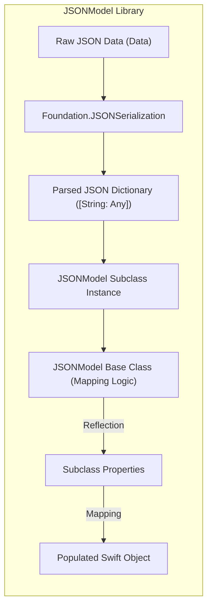
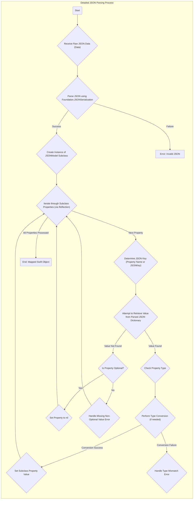

# Project Design Document: JSONModel

**Version:** 1.1
**Date:** October 26, 2023
**Author:** Gemini (AI Language Model)
**Project Link:** https://github.com/jsonmodel/jsonmodel

## 1. Introduction

This document provides an enhanced and more detailed design overview of the `JSONModel` project, a Swift library designed for simplified JSON parsing and mapping to Swift objects. This revised document aims to provide a more comprehensive understanding of the project's internal workings, data flow intricacies, and potential security vulnerabilities. It is specifically tailored to be a valuable resource for subsequent threat modeling activities by providing a deeper insight into the system's architecture and potential attack surfaces. The intended audience includes security engineers, developers, and anyone involved in the security assessment of applications utilizing `JSONModel`.

## 2. Goals and Non-Goals

### 2.1 Goals

*   To offer a simple and intuitive way to transform JSON data into strongly typed Swift objects.
*   To enable developers to define the mapping between JSON structure and Swift object properties in a clear and maintainable manner.
*   To abstract away the complexities of manual JSON parsing and type casting.
*   To gracefully handle optional values present in JSON data.
*   To perform basic type conversions (e.g., string to integer, string to boolean) during the mapping process to facilitate seamless data integration.
*   To maintain a lightweight footprint and minimize dependencies for easy integration into diverse Swift projects.

### 2.2 Non-Goals

*   Providing a full-fledged JSON manipulation or querying language. This library focuses solely on the object mapping aspect of JSON processing.
*   Implementing network communication functionalities. `JSONModel` expects to receive already fetched JSON data.
*   Offering advanced serialization or deserialization customization beyond the basic JSON parsing provided by the Foundation framework. Complex serialization scenarios are outside the scope.
*   Performing comprehensive validation against arbitrary JSON schemas. The library relies on the type system of the target Swift objects for basic validation.
*   Incorporating cryptographic operations such as encryption or decryption. These are considered separate concerns for the consuming application.
*   Supporting data formats other than JSON. The library is specifically designed for JSON data.

## 3. System Architecture

The `JSONModel` library employs a straightforward yet effective architecture centered around the `JSONModel` base class and its interaction with Swift's reflection capabilities and the Foundation framework.

### 3.1 Components

*   **`JSONModel` Base Class:** The abstract base class that developers subclass to define their specific data models. It encapsulates the core logic for parsing JSON and populating the properties of the subclass.
*   **`JSONKey` Protocol:**  A protocol that allows developers to specify custom mappings between JSON keys and Swift property names when the names do not directly match. This provides flexibility in adapting to various JSON structures.
*   **Swift Runtime Reflection:**  `JSONModel` leverages Swift's runtime reflection mechanism to inspect the properties (including their names and types) of the concrete `JSONModel` subclass at runtime. This dynamic introspection is crucial for the mapping process.
*   **`Foundation.JSONSerialization`:** The underlying mechanism used to parse the raw JSON data (typically a `Data` object) into a more manageable Swift dictionary (`[String: Any]`). This is a standard component provided by the Foundation framework.

### 3.2 Architectural Diagram

### 3.3 Key Interactions

1. **Input Reception:** The process begins when the library receives raw JSON data, usually in the form of a `Data` object. The source of this data is external to the `JSONModel` library.
2. **JSON Parsing:** The `Foundation.JSONSerialization` class is invoked to parse the raw JSON data into a Swift dictionary (`[String: Any]`). This step handles the basic syntactic validation of the JSON.
3. **Subclass Instantiation:** An instance of the specific `JSONModel` subclass (defined by the developer) is created.
4. **Property Iteration:** The `JSONModel` base class utilizes Swift's reflection capabilities to dynamically iterate through the properties of the instantiated subclass.
5. **Key Mapping and Value Retrieval:** For each property in the subclass:
    *   The library determines the corresponding JSON key. This is either the property name itself or a custom key specified using the `JSONKey` protocol.
    *   It attempts to retrieve the value associated with that key from the parsed JSON dictionary.
6. **Type Conversion:** If necessary, the library performs basic type conversion to match the Swift property's type (e.g., converting a JSON string to an `Int` if the property is an `Int`).
7. **Property Assignment:** The retrieved and potentially converted value is then assigned to the corresponding property of the `JSONModel` subclass instance.
8. **Output Generation:** Finally, the fully populated instance of the `JSONModel` subclass is returned, representing the parsed JSON data as a structured Swift object.

## 4. Data Flow

The following diagram provides a more granular illustration of the data flow within the `JSONModel` library during the parsing process, including considerations for optional properties and potential errors.

### 4.1 Data Sources and Sinks

*   **Data Source:** The raw JSON data input to `JSONModel` typically originates from external sources such as:
    *   Responses from network API calls.
    *   Data read from local files (e.g., configuration files).
    *   In-memory strings containing JSON.
    The `JSONModel` library itself is agnostic to the specific source of the JSON data.
*   **Data Sink:** The output of the `JSONModel` library is a strongly typed instance of a Swift object. This object serves as the data sink and is subsequently used by other parts of the application logic for various purposes, such as:
    *   Displaying data in the user interface.
    *   Performing business logic operations.
    *   Storing data in a persistent store.

## 5. Security Considerations

While `JSONModel` primarily focuses on the transformation of data, it's essential to acknowledge and address potential security implications associated with its use.

### 5.1 Input Validation and Data Integrity

*   **Implicit Type Validation Limitations:** `JSONModel` relies on Swift's type system for basic validation during the mapping process. However, this implicit validation might not catch all potential issues, especially with complex data structures or business logic constraints. For instance, a string field might be successfully mapped, but its content might not be a valid email address as expected by the application.
*   **Lack of Explicit Schema Enforcement:**  `JSONModel` does not inherently validate the incoming JSON against a predefined schema. This means that unexpected or malformed JSON structures that technically conform to basic JSON syntax might still be parsed, potentially leading to unexpected behavior or vulnerabilities in the consuming application. For example, extra unexpected fields in the JSON might be silently ignored, or missing required fields might lead to `nil` values where they are not expected.

### 5.2 Handling Malicious JSON Payloads

*   **Denial of Service (DoS) via Large Payloads:**  Extremely large JSON payloads, especially those with deeply nested structures or excessively long strings, could consume significant memory and processing time during parsing by `Foundation.JSONSerialization`. This could potentially lead to a denial-of-service condition, making the application unresponsive.
*   **Type Confusion Vulnerabilities:** If the incoming JSON data contains values with types that are unexpected by the `JSONModel` subclass (e.g., a string where an integer is expected), and the application does not handle these type mismatches gracefully, it could lead to runtime errors, crashes, or even potential security vulnerabilities if the unexpected data is used in security-sensitive operations.
*   **Resource Exhaustion through Recursive Structures:** Maliciously crafted JSON with recursive structures could potentially cause `Foundation.JSONSerialization` to enter an infinite loop or consume excessive stack space, leading to a crash or denial of service.

### 5.3 Information Disclosure

*   **Over-fetching and Unintended Data Exposure:** If the `JSONModel` subclass defines properties that do not correspond to expected data fields in the JSON, but the incoming JSON contains extra fields, these extra fields might be inadvertently parsed and stored within the object. While the library itself might not directly expose this data, it could be unintentionally leaked through other parts of the application if the developers are not aware of this behavior.

### 5.4 Dependencies and Third-Party Risks

*   **Reliance on `Foundation.JSONSerialization`:** `JSONModel`'s parsing functionality relies entirely on `Foundation.JSONSerialization`. Any vulnerabilities discovered in `JSONSerialization` could directly impact applications using `JSONModel`. It's crucial to stay updated with security advisories related to the Foundation framework.

## 6. Assumptions and Constraints

*   **Well-Formed JSON Input:** The library assumes that the input `Data` represents valid JSON. It does not provide error handling for syntactically incorrect JSON beyond what `Foundation.JSONSerialization` offers.
*   **Swift Execution Environment:** `JSONModel` is designed exclusively for use within Swift environments and leverages Swift-specific features like reflection.
*   **Basic Type Conversion Capabilities:** The library offers basic type conversion. Complex or highly customized type conversions might require manual implementation within the application logic or through custom property setters.
*   **No Built-in Network Functionality:** `JSONModel` is solely responsible for mapping JSON data to objects. It does not handle network requests, authentication, or any other network-related operations. These are the responsibility of the consuming application.

## 7. Future Considerations

*   **Integration with JSON Schema Validation Libraries:** Exploring the possibility of integrating with external JSON schema validation libraries could significantly enhance the robustness and security of applications using `JSONModel` by providing explicit validation against predefined schemas.
*   **Customizable Error Handling Strategies:** Providing more fine-grained control over error handling during the mapping process, allowing developers to define custom error handling logic for specific properties or data types, could improve the resilience of applications.
*   **Performance Benchmarking and Optimization:** Conducting performance benchmarks with various JSON payload sizes and complexities could help identify potential performance bottlenecks and guide optimization efforts.
*   **Consideration for Secure Coding Practices Guidance:** Providing documentation or guidance on secure coding practices when using `JSONModel`, such as sanitizing data after parsing or being mindful of potential type confusion issues, could be beneficial for developers.

## 8. Conclusion

This enhanced design document provides a more in-depth understanding of the `JSONModel` library's architecture, data flow, and critical security considerations. This detailed information is essential for conducting thorough threat modeling exercises to identify and mitigate potential vulnerabilities. By understanding the library's internal mechanisms and limitations, developers and security professionals can make informed decisions about its integration and implement appropriate security measures to protect applications that rely on `JSONModel` for JSON data processing.