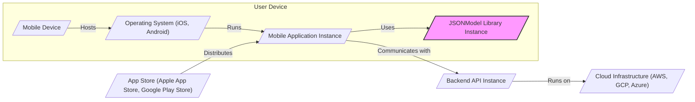

# BUSINESS POSTURE

This project, JSONModel, is a Swift library designed to simplify the process of parsing JSON data into Swift model objects. In essence, it aims to increase developer productivity and reduce boilerplate code associated with handling JSON responses in Swift applications.

- Business Priorities and Goals:
 - Primary goal is to enhance developer efficiency by providing a convenient and robust way to map JSON data to Swift objects.
 - Secondary goal is to improve the maintainability of Swift codebases that deal with JSON data by promoting a structured and type-safe approach.
 - Supporting goal is to reduce the likelihood of errors related to manual JSON parsing, which can be time-consuming and error-prone.

- Business Risks:
 - Risk of developer adoption failure if the library is perceived as too complex or not sufficiently beneficial.
 - Risk of introducing vulnerabilities into applications if the library itself contains security flaws or mishandles malicious JSON input.
 - Risk of dependency issues if the library is not actively maintained or becomes incompatible with newer Swift versions or platforms.
 - Risk of performance bottlenecks if the library's JSON parsing is inefficient, especially when dealing with large JSON datasets.
 - Risk of data integrity issues if the library incorrectly parses or transforms JSON data, leading to data corruption or misrepresentation in the application.

# SECURITY POSTURE

- Security Controls:
 - security control: Source code is publicly available on GitHub, allowing for community review and scrutiny. Implemented: GitHub repository.
 - security control: Unit tests are included in the repository, which can help verify the correctness and robustness of the library's functionality, including JSON parsing logic. Implemented: within the project's test suite.
 - security control: The library is written in Swift, a memory-safe language, which reduces the risk of certain types of memory-related vulnerabilities common in languages like C or C++. Implemented: Language choice.

- Accepted Risks:
 - accepted risk: Reliance on external contributors for security vulnerability identification and patching, as the project is open source and community-driven.
 - accepted risk: Potential for vulnerabilities to be present in dependencies if the library relies on external libraries (though JSONModel has minimal dependencies).
 - accepted risk: Risk of misuse by developers who might not use the library correctly or might integrate it into insecure application architectures.

- Recommended Security Controls:
 - security control: Implement automated security scanning (SAST/DAST) in the CI/CD pipeline to detect potential vulnerabilities in the code.
 - security control: Conduct regular security audits of the codebase, potentially involving external security experts, to identify and address security weaknesses.
 - security control: Establish a clear process for reporting and handling security vulnerabilities, including a security policy and contact information.
 - security control: Implement input validation and sanitization within the library to handle potentially malicious or malformed JSON input gracefully and prevent unexpected behavior or crashes.
 - security control: Consider code signing the library releases to ensure integrity and authenticity of the distributed library.

- Security Requirements:
 - Authentication: Not directly applicable to a JSON parsing library. Authentication is typically handled at the application level when fetching JSON data from APIs.
 - Authorization: Not directly applicable to a JSON parsing library. Authorization is handled at the application level based on the parsed data and user roles.
 - Input Validation: Critical. The library must robustly handle invalid or malicious JSON input to prevent crashes, unexpected behavior, or potential security exploits in applications using the library. Input validation should be performed during the JSON parsing process to ensure data conforms to expected formats and types.
 - Cryptography: Not directly applicable to the core functionality of a JSON parsing library. Cryptographic operations would be handled by the application using the parsed data if needed. However, the library should not introduce vulnerabilities related to cryptographic operations if it handles any sensitive data indirectly.

# DESIGN

## C4 CONTEXT

```mermaid
graph LR
    subgraph "Company A"
        User[/"Mobile App User"/]
        MobileApp[/"Mobile Application"/]
    end
    JSONModelLib[/"JSONModel Library"/]
    BackendAPI[/"Backend API"/]

    User --> MobileApp: Uses
    MobileApp --> JSONModelLib: Parses JSON Data
    MobileApp --> BackendAPI: Fetches JSON Data
    BackendAPI --> JSONModelLib: Provides JSON Data (indirectly)

    style JSONModelLib fill:#f9f,stroke:#333,stroke-width:2px
```

- Context Diagram Elements:
 - - Name: Mobile App User
   - Type: Person
   - Description: End-user of the mobile application that utilizes the JSONModel library.
   - Responsibilities: Interacts with the mobile application to access data.
   - Security controls: User authentication and authorization within the mobile application (handled by the mobile application, not JSONModel).

 - - Name: Mobile Application
   - Type: Software System
   - Description: A mobile application (iOS, macOS, etc.) developed by Company A that uses the JSONModel library to parse JSON data received from a backend API.
   - Responsibilities: Fetches data from the Backend API, uses JSONModel to parse JSON responses, presents data to the user, handles user interactions.
   - Security controls:
    - security control: Input validation of user inputs. Implemented: within the Mobile Application.
    - security control: Secure storage of sensitive data on the mobile device. Implemented: within the Mobile Application.
    - security control: Secure communication with the Backend API (HTTPS). Implemented: within the Mobile Application.
    - security control: User authentication and authorization. Implemented: within the Mobile Application.

 - - Name: JSONModel Library
   - Type: Software System (Library)
   - Description: An open-source Swift library that simplifies JSON parsing into Swift model objects. Developed and maintained by the open-source community.
   - Responsibilities: Parses JSON data into Swift objects, handles different JSON data types, provides a convenient API for mapping JSON to models.
   - Security controls:
    - security control: Input validation of JSON data to prevent parsing errors and potential vulnerabilities. Implemented: within the JSONModel Library.
    - security control: Memory safety due to Swift language. Implemented: Language level.

 - - Name: Backend API
   - Type: Software System
   - Description: A backend API server that provides JSON data to the mobile application. Operated by Company A or a third-party.
   - Responsibilities: Provides data to the mobile application in JSON format, handles data storage and processing, implements business logic.
   - Security controls:
    - security control: API authentication and authorization to control access to data. Implemented: within the Backend API.
    - security control: Input validation of requests from the Mobile Application. Implemented: within the Backend API.
    - security control: Secure data storage and processing. Implemented: within the Backend API.
    - security control: Protection against common web application vulnerabilities (OWASP Top 10). Implemented: within the Backend API.

## C4 CONTAINER

```mermaid
graph LR
    subgraph "Mobile Application"
        MobileAppCode[/"Mobile App Code"/]
        JSONModelContainer[/"JSONModel Library"/]
        NetworkingLibrary[/"Networking Library"/]
        DataStorage[/"Local Data Storage"/]
    end
    BackendAPIContainer[/"Backend API"/]

    MobileAppCode --> JSONModelContainer: Uses for JSON Parsing
    MobileAppCode --> NetworkingLibrary: Uses for API Calls
    MobileAppCode --> DataStorage: Uses for Local Data Storage
    NetworkingLibrary --> BackendAPIContainer: Makes API Requests
    BackendAPIContainer --> NetworkingLibrary: Returns JSON Responses

    style JSONModelContainer fill:#f9f,stroke:#333,stroke-width:2px
```

- Container Diagram Elements:
 - - Name: Mobile App Code
   - Type: Application Code
   - Description: The Swift code of the mobile application, including UI logic, business logic, and integration with other containers.
   - Responsibilities: User interface presentation, application logic, orchestrating data flow, using JSONModel for parsing, using Networking Library for API calls, managing local data storage.
   - Security controls:
    - security control: Secure coding practices. Implemented: Development process.
    - security control: Input validation of user inputs. Implemented: within the Mobile App Code.
    - security control: Proper error handling. Implemented: within the Mobile App Code.

 - - Name: JSONModel Library
   - Type: Library
   - Description: The JSONModel Swift library, integrated into the mobile application.
   - Responsibilities: Parsing JSON data received from the Networking Library into Swift model objects.
   - Security controls:
    - security control: Input validation of JSON data. Implemented: within the JSONModel Library.
    - security control: Memory safety. Implemented: Swift language.

 - - Name: Networking Library
   - Type: Library
   - Description: A library (e.g., URLSession, Alamofire) used by the Mobile App Code to make network requests to the Backend API.
   - Responsibilities: Handling network communication, making HTTP requests, receiving HTTP responses, managing network sessions.
   - Security controls:
    - security control: HTTPS for secure communication. Implemented: Networking Library configuration.
    - security control: Certificate validation. Implemented: Networking Library.

 - - Name: Data Storage
   - Type: Data Store
   - Description: Local storage on the mobile device (e.g., UserDefaults, CoreData, Realm) used to persist data if needed.
   - Responsibilities: Storing application data locally, providing data persistence.
   - Security controls:
    - security control: Secure data storage mechanisms provided by the mobile platform. Implemented: Operating System.
    - security control: Encryption of sensitive data at rest if required. Implemented: Data Storage configuration or Mobile App Code.

 - - Name: Backend API
   - Type: Application
   - Description: The backend API server that the mobile application communicates with.
   - Responsibilities: Serving data in JSON format, handling business logic, managing data persistence, API authentication and authorization.
   - Security controls: (Refer to Context Diagram - Backend API security controls).

## DEPLOYMENT

For a mobile application using JSONModel, the deployment architecture primarily concerns the mobile application itself and the backend API. The JSONModel library is integrated into the mobile application's build process and is not deployed separately.

Deployment Architecture for Mobile Application:



- Deployment Diagram Elements:
 - - Name: Mobile Device
   - Type: Infrastructure
   - Description: User's mobile device (smartphone, tablet).
   - Responsibilities: Running the mobile operating system and applications.
   - Security controls:
    - security control: Device encryption. Implemented: Operating System.
    - security control: Device passcode/biometric authentication. Implemented: Operating System.
    - security control: App sandboxing. Implemented: Operating System.

 - - Name: Operating System (iOS, Android)
   - Type: Software
   - Description: Mobile operating system running on the user's device.
   - Responsibilities: Managing device resources, running applications, providing security features.
   - Security controls: (Refer to Mobile Device security controls).

 - - Name: Mobile Application Instance
   - Type: Software Instance
   - Description: An instance of the mobile application running on the user's device, including the integrated JSONModel library.
   - Responsibilities: Application logic execution, JSON parsing using JSONModel, communication with Backend API, user interface presentation.
   - Security controls: (Refer to Container Diagram - Mobile App Code security controls).

 - - Name: JSONModel Library Instance
   - Type: Software Instance (Library)
   - Description: Instance of the JSONModel library running within the Mobile Application Instance.
   - Responsibilities: JSON parsing.
   - Security controls: (Refer to Container Diagram - JSONModel Library security controls).

 - - Name: App Store (Apple App Store, Google Play Store)
   - Type: Infrastructure
   - Description: Digital distribution platform for mobile applications.
   - Responsibilities: Distributing and hosting mobile applications.
   - Security controls:
    - security control: App review process. Implemented: App Store.
    - security control: Code signing of applications. Implemented: Developer and App Store.
    - security control: Malware scanning. Implemented: App Store.

 - - Name: Backend API Instance
   - Type: Software Instance
   - Description: Instance of the Backend API running in the cloud infrastructure.
   - Responsibilities: Serving API requests, data processing, data storage.
   - Security controls: (Refer to Context Diagram - Backend API security controls).

 - - Name: Cloud Infrastructure (AWS, GCP, Azure)
   - Type: Infrastructure
   - Description: Cloud platform hosting the Backend API.
   - Responsibilities: Providing infrastructure for the Backend API, ensuring availability and scalability.
   - Security controls:
    - security control: Physical security of data centers. Implemented: Cloud Provider.
    - security control: Network security controls. Implemented: Cloud Provider and Backend API configuration.
    - security control: Access control to cloud resources. Implemented: Cloud Provider and Company A.

## BUILD

```mermaid
graph LR
    subgraph "Developer Environment"
        Developer[/"Developer"/]
        SourceCodeRepo[/"Source Code Repository (GitHub)"/]
    end
    subgraph "CI/CD Pipeline (GitHub Actions)"
        CI[/"CI Server (GitHub Actions)"/]
        BuildEnvironment[/"Build Environment"/]
        TestEnvironment[/"Test Environment"/]
        ArtifactRepository[/"Artifact Repository (GitHub Releases)"/]
    end

    Developer --> SourceCodeRepo: Code Commit
    SourceCodeRepo --> CI: Triggers Build
    CI --> BuildEnvironment: Build & Compile
    BuildEnvironment --> TestEnvironment: Run Unit Tests
    TestEnvironment --> ArtifactRepository: Publish Artifacts (e.g., Swift Package)

    style JSONModelLib fill:#f9f,stroke:#333,stroke-width:2px
```

- Build Process Elements:
 - - Name: Developer
   - Type: Person
   - Description: Software developer contributing to the JSONModel library.
   - Responsibilities: Writing code, committing code changes, running local tests.
   - Security controls:
    - security control: Secure development environment. Implemented: Developer's responsibility.
    - security control: Code review process. Implemented: Project's development workflow.
    - security control: Access control to source code repository. Implemented: GitHub.

 - - Name: Source Code Repository (GitHub)
   - Type: Software System
   - Description: GitHub repository hosting the JSONModel source code.
   - Responsibilities: Version control, code storage, collaboration platform.
   - Security controls:
    - security control: Access control (authentication and authorization). Implemented: GitHub.
    - security control: Audit logging. Implemented: GitHub.
    - security control: Branch protection rules. Implemented: GitHub repository settings.

 - - Name: CI Server (GitHub Actions)
   - Type: Software System
   - Description: GitHub Actions used for continuous integration and continuous delivery.
   - Responsibilities: Automating build, test, and release processes.
   - Security controls:
    - security control: Secure configuration of CI workflows. Implemented: Project's CI configuration.
    - security control: Access control to CI/CD pipelines. Implemented: GitHub Actions permissions.
    - security control: Secrets management for sensitive credentials. Implemented: GitHub Secrets.

 - - Name: Build Environment
   - Type: Environment
   - Description: Environment where the JSONModel library is compiled and built.
   - Responsibilities: Compiling source code, creating build artifacts (e.g., Swift Package).
   - Security controls:
    - security control: Secure build environment (e.g., hardened virtual machines). Implemented: GitHub Actions infrastructure.
    - security control: Dependency scanning to detect vulnerable dependencies (if applicable). Recommended: Integrate dependency scanning.

 - - Name: Test Environment
   - Type: Environment
   - Description: Environment where unit tests are executed.
   - Responsibilities: Running automated unit tests to verify code functionality.
   - Security controls:
    - security control: Isolated test environment. Implemented: CI/CD pipeline configuration.

 - - Name: Artifact Repository (GitHub Releases)
   - Type: Software System
   - Description: GitHub Releases used to store and distribute compiled artifacts of the JSONModel library.
   - Responsibilities: Storing and providing access to releases of the library.
   - Security controls:
    - security control: Access control to releases. Implemented: GitHub repository permissions.
    - security control: Integrity checks (e.g., checksums) for released artifacts. Recommended: Implement checksum generation and verification.
    - security control: Code signing of releases. Recommended: Consider code signing for release artifacts.

# RISK ASSESSMENT

- Critical Business Processes:
 - For companies using JSONModel, critical business processes are indirectly affected. If JSONModel has vulnerabilities or parsing issues, applications relying on it might malfunction or become vulnerable, impacting any business process supported by those applications. The most critical process is the reliable and secure operation of applications that depend on JSONModel for data handling.

- Data to Protect and Sensitivity:
 - JSONModel itself processes JSON data. The sensitivity of this data depends entirely on the context of the application using JSONModel. JSON data can contain sensitive information like user credentials, personal data, financial details, or proprietary business information.
 - The data being protected is the JSON data being parsed by the library and the integrity of the application that uses the library.
 - Sensitivity levels vary greatly depending on the application domain. For applications handling personal data or financial transactions, the sensitivity is high. For applications dealing with public data, the sensitivity might be lower. However, even in cases of less sensitive data, data integrity and application availability are important.

# QUESTIONS & ASSUMPTIONS

- Questions:
 - What is the intended use case and deployment environment for applications using JSONModel? (Assumption: Broad range of Swift applications, primarily mobile apps).
 - Are there any specific security requirements or compliance standards that applications using JSONModel must adhere to? (Assumption: General security best practices for mobile applications).
 - What is the process for reporting and handling security vulnerabilities in JSONModel? (Assumption: Standard open-source vulnerability reporting process via GitHub).
 - Are there any known vulnerabilities or security concerns related to JSONModel? (Assumption: No known critical vulnerabilities at the time of writing, based on public information, but continuous monitoring is needed).

- Assumptions:
 - BUSINESS POSTURE: The primary business goal for using JSONModel is to improve developer productivity and code maintainability in Swift projects dealing with JSON data. Security is a secondary but important consideration.
 - SECURITY POSTURE: Existing security controls are primarily based on open-source practices and Swift language safety. Recommended security controls focus on proactive security measures like automated scanning, security audits, and input validation.
 - DESIGN: The design is centered around a library integrated into mobile applications that communicate with backend APIs. Deployment is typical for mobile applications distributed through app stores and backend APIs hosted in cloud infrastructure. Build process uses standard CI/CD practices with GitHub Actions.