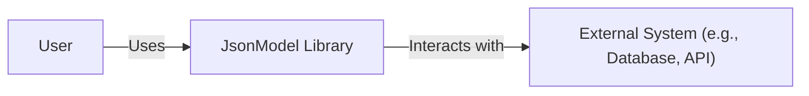
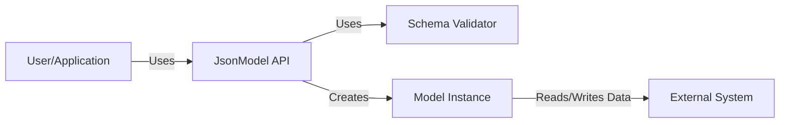
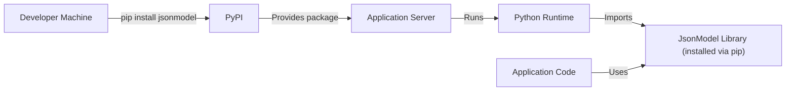
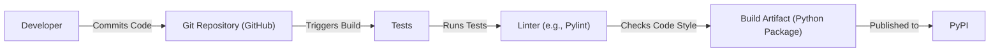

# BUSINESS POSTURE

Business Priorities and Goals:

*   Provide a simple, intuitive, and efficient way to define data models using JSON.
*   Enable developers to easily create, validate, and manage data structures.
*   Offer a lightweight and versatile solution for various applications, including web and mobile development.
*   Reduce development time and effort by providing a clear and concise data modeling approach.
*   Ensure data consistency and integrity across different parts of an application.

Business Risks:

*   Inconsistent data validation could lead to data corruption or application instability.
*   Lack of robust error handling might expose sensitive information or cause unexpected application behavior.
*   Insufficient documentation or community support could hinder adoption and long-term maintainability.
*   Performance bottlenecks in the library could impact the performance of applications using it.
*   Security vulnerabilities in the library could be exploited to compromise applications using it.

# SECURITY POSTURE

Existing Security Controls:

*   security control: Input validation: The library performs input validation based on the provided JSON schema. (Described in the library's documentation and implemented in the code.)
*   security control: Type checking: The library enforces type checking based on the schema definition. (Described in the library's documentation and implemented in the code.)
*   security control: Basic tests: The repository includes a set of basic tests to ensure core functionality. (Located in the `tests` directory.)

Accepted Risks:

*   accepted risk: Limited support for complex schema validation scenarios.
*   accepted risk: The library's security relies on the correctness of the provided JSON schema.
*   accepted risk: No built-in protection against common web vulnerabilities (e.g., XSS, CSRF) as it's a data modeling library, not a web framework.

Recommended Security Controls:

*   security control: Enhanced input validation: Implement more robust input validation, including checks for regular expression patterns, string lengths, and numeric ranges, beyond basic type checking.
*   security control: Fuzz testing: Introduce fuzz testing to identify potential vulnerabilities and edge cases that might not be covered by standard unit tests.
*   security control: Security audits: Conduct regular security audits of the codebase to identify and address potential vulnerabilities.
*   security control: Dependency management: Regularly update dependencies to address known vulnerabilities in third-party libraries.
*   security control: Documentation of security considerations: Provide clear documentation on security best practices for using the library, including how to define secure schemas and handle potential vulnerabilities.

Security Requirements:

*   Authentication: Not directly applicable to this library, as it's a data modeling tool, not an authentication system. Authentication should be handled at the application level.
*   Authorization: Not directly applicable to this library. Authorization should be handled at the application level.
*   Input Validation:
    *   The library MUST validate all input data against the provided JSON schema.
    *   The library MUST support standard JSON schema validation keywords (e.g., `type`, `format`, `minLength`, `maxLength`, `pattern`, `minimum`, `maximum`, `enum`).
    *   The library SHOULD provide mechanisms for extending validation with custom rules.
    *   The library MUST handle validation errors gracefully, providing informative error messages.
*   Cryptography: Not directly applicable, as the library doesn't handle sensitive data storage or transmission. Cryptographic operations should be handled at the application level if needed.
*   Data Sensitivity: The library should treat all data as potentially sensitive and avoid unnecessary exposure or logging of data values.

# DESIGN

## C4 CONTEXT

Element Description:

*   Element:
    *   Name: User
    *   Type: Person
    *   Description: A developer or application that utilizes the JsonModel library.
    *   Responsibilities:
        *   Defines JSON schemas.
        *   Uses the library to create, validate, and manage data models.
        *   Integrates the library into their application.
    *   Security controls:
        *   Not directly applicable to the user in the context of the library itself.

*   Element:
    *   Name: JsonModel Library
    *   Type: Software System
    *   Description: The core library for defining and working with JSON models.
    *   Responsibilities:
        *   Provides an API for defining JSON schemas.
        *   Validates data against defined schemas.
        *   Creates model instances from JSON data.
        *   Provides methods for accessing and manipulating model data.
    *   Security controls:
        *   Input validation based on JSON schema.
        *   Type checking.

*   Element:
    *   Name: External System (e.g., Database, API)
    *   Type: Software System
    *   Description: Any external system that the application using JsonModel interacts with.
    *   Responsibilities:
        *   Varies depending on the specific external system.
        *   Could include storing data, providing data, or performing other operations.
    *   Security controls:
        *   Dependent on the specific external system and its security implementation.

## C4 CONTAINER

Element Description:

*   Element:
    *   Name: User/Application
    *   Type: Person/Software System
    *   Description: The developer or application using the JsonModel library.
    *   Responsibilities:
        *   Defines JSON schemas.
        *   Calls the JsonModel API.
        *   Handles data persistence and interaction with external systems.
    *   Security controls:
        *   Responsible for overall application security.

*   Element:
    *   Name: JsonModel API
    *   Type: API
    *   Description: The public interface of the JsonModel library.
    *   Responsibilities:
        *   Provides methods for defining schemas.
        *   Provides methods for creating model instances.
        *   Provides methods for validating data.
    *   Security controls:
        *   Entry point for all library interactions; initial validation checks.

*   Element:
    *   Name: Schema Validator
    *   Type: Component
    *   Description: The component responsible for validating data against a JSON schema.
    *   Responsibilities:
        *   Parses JSON schemas.
        *   Validates data against the parsed schema.
        *   Reports validation errors.
    *   Security controls:
        *   Performs detailed schema-based validation.

*   Element:
    *   Name: Model Instance
    *   Type: Object
    *   Description: An instance of a data model created from a JSON schema.
    *   Responsibilities:
        *   Holds data conforming to the schema.
        *   Provides methods for accessing and manipulating data.
    *   Security controls:
        *   Data conforms to the defined schema.

*   Element:
    *   Name: External System
    *   Type: Software System
    *   Description: External systems (databases, APIs) interacting with the application.
    *   Responsibilities: Data storage, retrieval, or other external operations.
    *   Security controls: Relies on the security of the external system.

## DEPLOYMENT

Possible Deployment Solutions:

1.  **As a library within a Python application:** The JsonModel library is typically used as a dependency within a larger Python application. It's installed via pip and integrated directly into the application's codebase.
2.  **As part of a serverless function:** The library could be included in the deployment package of a serverless function (e.g., AWS Lambda, Azure Functions, Google Cloud Functions).
3.  **Within a containerized environment:** The library can be part of a Docker container image, along with the application that uses it.

Chosen Deployment Solution (Detailed):  **As a library within a Python application**

Element Description:

*   Element:
    *   Name: Developer Machine
    *   Type: Device
    *   Description: The machine where the developer writes and tests code.
    *   Responsibilities: Code development, testing, and potentially deployment.
    *   Security controls: Development environment security best practices.

*   Element:
    *   Name: PyPI
    *   Type: Software System
    *   Description: The Python Package Index, a repository of Python packages.
    *   Responsibilities: Hosting and distributing Python packages.
    *   Security controls: PyPI's security measures (e.g., package signing, vulnerability scanning).

*   Element:
    *   Name: Application Server
    *   Type: Server
    *   Description: The server where the Python application is deployed.
    *   Responsibilities: Running the Python application.
    *   Security controls: Server security best practices (e.g., firewall, intrusion detection, regular updates).

*   Element:
    *   Name: Python Runtime
    *   Type: Runtime Environment
    *   Description: The Python interpreter that executes the application code.
    *   Responsibilities: Executing Python code.
    *   Security controls: Python runtime security features and updates.

*   Element:
    *   Name: JsonModel Library (installed via pip)
    *   Type: Library
    *   Description: The JsonModel library installed as a dependency.
    *   Responsibilities: Providing data modeling functionality.
    *   Security controls: Internal validation and type checking.

*   Element:
    *   Name: Application Code
    *   Type: Code
    *   Description: The code of the application that uses the JsonModel library.
    *   Responsibilities: Implementing the application's logic.
    *   Security controls: Application-level security measures.

## BUILD

Build Process Description:

1.  **Code Commit:** The developer commits code changes to the Git repository (GitHub).
2.  **Build Trigger:** A commit to the repository triggers the build process (e.g., via GitHub Actions, Travis CI, or another CI/CD system).  This project doesn't currently have automated CI/CD.
3.  **Testing:** The build process runs the test suite to ensure code quality and functionality.
4.  **Linting:** A linter (e.g., Pylint) checks the code for style and potential errors.
5.  **Package Creation:** If tests and linting pass, a Python package is created (e.g., a source distribution and a wheel).
6.  **Publish:** The package is published to PyPI (the Python Package Index).

Security Controls in Build Process:

*   **Code Repository Security:** The Git repository (GitHub) provides access control and version history.
*   **Automated Testing:** The test suite helps ensure code quality and prevent regressions.
*   **Linting:** The linter enforces code style and helps identify potential errors.
*   *Recommended:* **Dependency Scanning:** A dependency scanner (e.g., pip-audit, Snyk) should be integrated into the build process to identify known vulnerabilities in project dependencies.
*   *Recommended:* **Static Analysis Security Testing (SAST):** A SAST tool (e.g., Bandit) should be integrated to scan the codebase for potential security vulnerabilities.

# RISK ASSESSMENT

Critical Business Processes:

*   Data validation and consistency: Ensuring that data conforms to defined schemas is crucial for application stability and data integrity.
*   Data model management: Providing a reliable and efficient way to manage data models is essential for developer productivity.

Data to Protect and Sensitivity:

*   The library itself doesn't directly handle sensitive data. However, the *schemas* defined using the library can describe sensitive data. The *data* processed by applications *using* the library can be highly sensitive, depending on the application's purpose.
*   Data Sensitivity Levels:
    *   **Schema Definitions:** Low sensitivity (unless the schema itself reveals sensitive information about the application's data structure).
    *   **Data Processed by Applications:** Variable sensitivity, ranging from low (e.g., public data) to high (e.g., personally identifiable information, financial data, health data). The application using JsonModel is responsible for appropriately handling the sensitivity of the data.

# QUESTIONS & ASSUMPTIONS

Questions:

*   Are there any specific regulatory compliance requirements (e.g., GDPR, HIPAA, PCI DSS) that the applications using this library need to adhere to?
*   What are the expected performance requirements for applications using this library?
*   Are there any plans to support asynchronous operations or integration with asynchronous frameworks?
*   What is the intended level of community support and contribution for this library?
*   What is the long-term maintenance plan for this library?

Assumptions:

*   BUSINESS POSTURE: The primary goal is to provide a simple and efficient data modeling solution for Python developers.
*   BUSINESS POSTURE: The library is intended for use in a variety of applications, but primarily those where data validation and consistency are important.
*   SECURITY POSTURE: The library is not intended to be a comprehensive security solution, and application developers are responsible for implementing appropriate security measures at the application level.
*   SECURITY POSTURE: The library's users are responsible for defining secure schemas and handling sensitive data appropriately.
*   DESIGN: The library will be installed via pip and used as a dependency within Python applications.
*   DESIGN: The library's primary interface is through its Python API.
*   DESIGN: The library relies on the standard Python library and does not have many external dependencies.