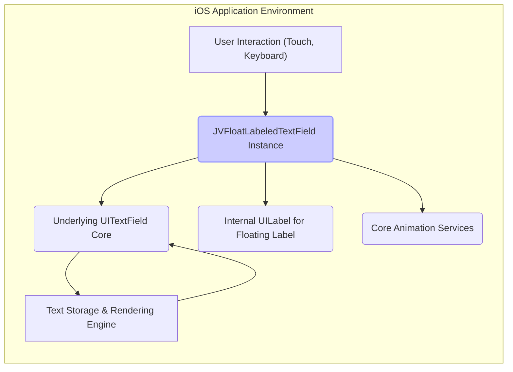
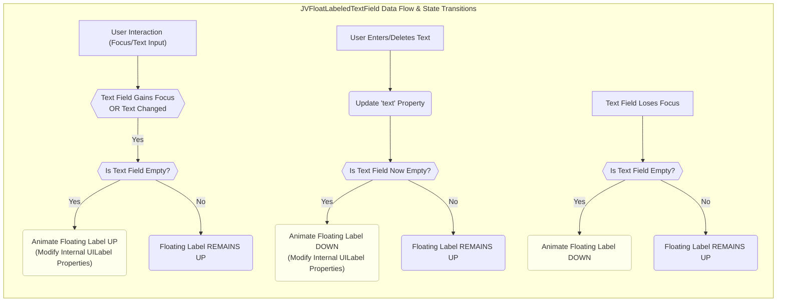

# Project Design Document: JVFloatLabeledTextField

**Version:** 1.1
**Date:** October 26, 2023
**Author:** AI Software Architect

## 1. Introduction

This document provides an enhanced and more detailed design overview of the `JVFloatLabeledTextField` project, a custom `UITextField` subclass for iOS implementing the "float label pattern." This pattern elevates user experience by transitioning the text field's placeholder into a floating label above the input area when the field gains focus or contains text. This refined document is specifically tailored to serve as a robust foundation for subsequent threat modeling activities.

## 2. Goals and Objectives

* **Primary Goal:** To deliver a comprehensive and security-focused architectural understanding of the `JVFloatLabeledTextField` component.
* **Objectives:**
    * Clearly articulate the component's functionality, purpose, and intended behavior.
    * Thoroughly describe the internal structure, key components, and their interactions.
    * Precisely illustrate the data flow within the component, emphasizing user input handling.
    * Identify the component's dependencies on and interactions with the iOS framework, with a security lens.
    * Provide granular detail necessary for effective and targeted threat modeling exercises.

## 3. Scope

This document comprehensively covers the design of the `JVFloatLabeledTextField` component within the context of an iOS application. The focus remains on the internal mechanisms of this custom text field and its interplay with user input and the fundamental `UITextField` functionalities. The following aspects are explicitly excluded:

* The architectural design of the encompassing application that integrates this component.
* The broader security framework and inherent security measures of the iOS platform.
* Fine-grained implementation specifics of the base `UITextField` class, unless directly relevant to the custom behavior.

## 4. High-Level Architecture

The `JVFloatLabeledTextField` acts as an intermediary, extending the capabilities of the standard `UITextField` to incorporate the floating label paradigm. Its primary interactions involve:

* **User Input Handling:** Receiving and processing textual input initiated by the user.
* **Core `UITextField` Functionality:** Leveraging the foundational text input, display, and management features provided by the `UITextField` superclass.
* **Internal `UILabel` Management:** Utilizing a private `UILabel` instance to render and animate the floating label element.
* **Animation Orchestration:** Employing Core Animation to execute smooth visual transitions for the floating label's position, size, and opacity.
* **Drawing and Rendering:** Overriding drawing methods to integrate the floating label seamlessly into the text field's visual presentation.

## 5. Detailed Design

The `JVFloatLabeledTextField` component's design is centered around these key functional and structural elements:

* **Dynamic Floating Label Behavior:**
    * **Activation:** When the text field gains focus (becomes the first responder) or its `text` property is non-empty, the placeholder text is programmatically repositioned and restyled as a smaller label situated above the text input area. This involves changes to the internal `UILabel`'s frame, font, and potentially color.
    * **Deactivation:** Conversely, when the text field loses focus and its `text` property is empty, the floating label animates back down to occupy the original placeholder position. This animation is driven by Core Animation.
* **Encapsulated `UILabel` Instance:**
    * The component internally creates and manages a private `UILabel` object. This label is not directly exposed to external code.
    * The initial text content of this internal label is derived from the `JVFloatLabeledTextField`'s `placeholder` property.
    * The frame, font, textColor, and alpha of this internal label are dynamically adjusted based on the text field's current state (focused, empty, containing text). These adjustments are the core of the floating label effect.
* **Animation Implementation using Core Animation:**
    * Core Animation frameworks are employed to create visually fluid transitions for the floating label. This includes animating changes to:
        * `frame` (position and size).
        * `font` (size).
        * `alpha` (opacity).
    * The animation duration and timing functions are often customizable through the component's properties.
* **Customization Properties:**
    * The component exposes a set of properties to allow developers to tailor the appearance of the floating label. These typically include:
        * `floatingLabelFont`:  The typeface and size of the floating label.
        * `floatingLabelTextColor`: The color of the floating label's text in its normal state.
        * `highlightedFloatingLabelTextColor`: The color of the floating label's text when the text field is active.
        * `floatingLabelYPadding`:  The vertical offset of the floating label from the top of the text field.
        * `animationDuration`: The time taken for the floating label animation.
        * `animationOptions`:  Options to control the animation's easing and behavior.
* **Placeholder Property Handling:**
    * The standard `placeholder` property inherited from `UITextField` serves as the source for the initial text displayed in the floating label.
    * The component also often supports the `attributedPlaceholder` property, allowing for styled placeholder text that can be reflected in the floating label.
* **Text Input Observation:**
    * The component actively monitors changes to its `text` property. These changes trigger the logic that determines whether the floating label should be animated up or down. This observation might involve KVO (Key-Value Observing) or responding to `UITextFieldDelegate` methods.
* **Responder Chain Participation:**
    * `JVFloatLabeledTextField` functions as a standard member of the iOS responder chain. This allows it to become the first responder, receive keyboard input, and handle related events.

## 6. Data Flow

The primary data flow within the `JVFloatLabeledTextField` revolves around user interaction and the subsequent updates to the visual state of the floating label.

## 7. Key Components and Interactions

* **`JVFloatLabeledTextField` (Primary Class):**
    * Inherits from `UITextField`.
    * Encapsulates and manages the internal `UILabel` responsible for rendering the floating label.
    * Implements the core logic for animating the floating label's transitions (position, size, opacity).
    * Provides a public API for customizing the floating label's visual attributes and animation behavior.
    * Overrides relevant methods from `UITextField` (e.g., `drawPlaceholderInRect:`, `textRectForBounds:`, `editingRectForBounds:`) to accommodate the floating label's layout.
* **Internal `UILabel` Instance (Private):**
    * Solely dedicated to displaying the floating label. It's not intended for general-purpose text display.
    * Its properties (`frame`, `font`, `textColor`, `alpha`) are manipulated directly by the `JVFloatLabeledTextField` to achieve the floating effect.
* **`NSString` (Text Data):**
    * Holds the textual content entered by the user. Changes to this string are a key trigger for updating the floating label's state.
* **Core Animation Layers (Implicit):**
    * While not directly exposed as separate components, the underlying Core Animation layers managed by UIKit are responsible for performing the actual visual animations of the floating label. The `JVFloatLabeledTextField` configures these animations.

## 8. Security Considerations

Considering the nature of `JVFloatLabeledTextField` as a UI component, the primary security considerations revolve around how it handles and presents user input and interacts with the application's data flow:

* **Lack of Input Sanitization:** The component itself **does not** perform any input validation or sanitization. It merely displays the text provided to it. Therefore, any vulnerabilities related to malicious input (e.g., script injection, format string bugs) must be addressed at a higher level within the application's logic **before** the text is set on the `JVFloatLabeledTextField`. This is a critical area for threat modeling.
* **Potential for Information Disclosure via Placeholder:** The placeholder text, which becomes the floating label, should not contain sensitive information that should not be visible to users or observers of the screen, even when the field is focused. Careful consideration should be given to the content of the placeholder, especially in contexts dealing with sensitive data.
* **Reliance on Underlying `UITextField` Security:** The security of the text input itself heavily relies on the inherent security features of the underlying `UITextField`. For sensitive input (e.g., passwords), the `secureTextEntry` property of the `UITextField` must be correctly configured. The floating label mechanism should not inadvertently expose masked characters.
* **Accessibility Considerations as Potential Vectors:** While primarily a usability concern, accessibility issues can sometimes be exploited. Ensure that the floating label and the text input field are correctly labeled for screen readers. Incorrect or missing labels could potentially leak information to users with assistive technologies in unexpected ways or be manipulated by malicious accessibility tools.
* **Memory Management and Resource Handling:** While ARC (Automatic Reference Counting) helps, potential memory leaks or excessive resource consumption within the component could lead to denial-of-service scenarios, although this is less likely with a UI component. Thorough code review for memory management practices is advisable.
* **UI Redressing/Spoofing (Limited Risk):** Although less likely with this specific component, consider if the visual manipulation of the label could be used in any way to mislead users about the purpose or security context of the input field. This is a broader UI/UX security concern.
* **Interaction with Delegate Methods:** If the component utilizes delegate methods, ensure that the application's delegate implementation handles events securely and does not introduce vulnerabilities when interacting with the `JVFloatLabeledTextField`.

## 9. Deployment Considerations

Integrating `JVFloatLabeledTextField` into an iOS application typically involves:

* **Source Code Inclusion:** Adding the `JVFloatLabeledTextField` source files (e.g., `.h` and `.m` for Objective-C, or `.swift` for a Swift implementation) to the project.
* **Interface Builder/Storyboard Integration:**  Dragging a `UITextField` onto a storyboard or XIB and changing its class to `JVFloatLabeledTextField` in the Identity Inspector.
* **Programmatic Instantiation:** Creating instances of `JVFloatLabeledTextField` directly in code using alloc and init.
* **Placeholder Configuration:** Setting the `placeholder` property, which serves as the basis for the floating label.
* **Customization (Optional):**  Utilizing the component's properties to customize the appearance and animation of the floating label.
* **Security Best Practices During Deployment:**
    * Ensure the component's source code is from a trusted source to avoid introducing malicious code.
    * Regularly update the component if security vulnerabilities are discovered and patched.
    * Follow secure coding practices when interacting with the component and handling user input.

## 10. Future Considerations

* **Swift Migration:**  Developing a native Swift version of the component to align with modern iOS development practices.
* **Enhanced Accessibility Features:**  Further improvements to ensure full compliance with accessibility guidelines.
* **Expanded Customization Options:** Providing more granular control over the appearance and animation behavior of the floating label.
* **Integration with UI Testing Frameworks:** Ensuring the component is easily testable with UI testing frameworks.

## 11. Glossary

* **`UITextField`:** A fundamental UIKit control for single-line text input in iOS applications.
* **Placeholder:**  Descriptive text displayed within a text field when it is empty, providing a hint to the user about the expected input.
* **Floating Label Pattern:** A user interface design pattern where the placeholder text animates upwards to become a label above the input field when the field is focused or contains text.
* **First Responder:** The specific object within an iOS application that is currently designated to receive keyboard input and other relevant events.
* **Core Animation:** Apple's framework for creating and managing sophisticated animations and visual effects.
* **`UILabel`:** A UIKit control used for displaying static, non-editable text.
* **Responder Chain:**  An ordered hierarchy of objects in an iOS application that can respond to user events.
* **KVO (Key-Value Observing):** A mechanism in Objective-C (and available in Swift) that allows objects to observe changes to properties of other objects.
* **ARC (Automatic Reference Counting):** A memory management feature in Objective-C and Swift that automatically manages the allocation and deallocation of objects.
