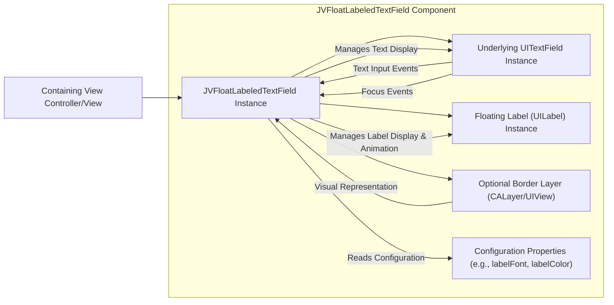
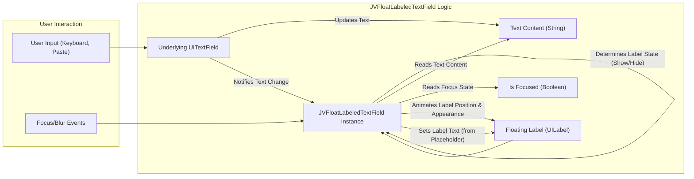

# Project Design Document: JVFloatLabeledTextField

**Version:** 1.1
**Date:** October 26, 2023
**Author:** AI Software Architect

## 1. Introduction

This document provides an enhanced design overview of the `JVFloatLabeledTextField` project. This iOS component is a custom `UITextField` subclass implementing the float label pattern, which elevates the placeholder text to a floating label when the text field is focused or contains input. This refined document aims for clarity and detail, specifically tailored for subsequent threat modeling exercises.

## 2. Goals and Objectives

The core objectives of the `JVFloatLabeledTextField` component are:

* **Elevated User Interface:** To offer a visually appealing and intuitive input experience for users.
* **Improved Accessibility:** To maintain label visibility even with entered text, aiding users with cognitive differences.
* **Modular Code Design:** To provide a reusable and easily integrated component for iOS developers.
* **Customizable Appearance:** To allow developers to tailor the visual style of the floating label and text field.

## 3. Architectural Overview

`JVFloatLabeledTextField` extends the standard `UITextField` by incorporating and managing a separate `UILabel` for the floating label functionality.

Here's a detailed architectural diagram:

**Component Breakdown:**

* **`JVFloatLabeledTextField Instance`:** The primary class, inheriting from `UITextField`. It orchestrates the behavior of the embedded `UITextField` and the floating label. It listens for text changes and focus events.
* **`Underlying UITextField Instance`:** The standard iOS text input control instance managed by `JVFloatLabeledTextField`. It handles core text input and display.
* **`Floating Label (UILabel) Instance`:** A `UILabel` instance used to display the placeholder text as a floating label. Its position, text, and appearance are dynamically updated.
* **`Optional Border Layer (CALayer/UIView)`:** An optional layer or view used for drawing a customizable border around the text field. This can be styled and animated.
* **`Configuration Properties (e.g., labelFont, labelColor)`:** Properties exposed by `JVFloatLabeledTextField` to allow developers to customize the appearance of the floating label and other visual aspects.
* **`Containing View Controller/View`:** The parent view or view controller that instantiates and manages the `JVFloatLabeledTextField`.

## 4. Data Flow

The data flow within `JVFloatLabeledTextField` centers around user input and the dynamic presentation of the floating label.

Here's a refined data flow diagram:

**Detailed Data Flow:**

1. **User Input:** The user interacts with the text field, either by typing or pasting text.
2. **Focus/Blur Events:** The text field gains or loses focus.
3. **Underlying UITextField Updates:** The embedded `UITextField` updates its internal text content (`String`).
4. **Notifications:** The `UITextField` sends notifications about text changes and focus changes.
5. **Event Handling:** The `JVFloatLabeledTextField` instance listens for these notifications and focus events.
6. **State Evaluation:** Upon receiving an event, `JVFloatLabeledTextField` reads the current text content and focus state.
7. **Label State Determination:** Based on the text content (empty or not) and focus state (focused or not), the component determines whether the floating label should be shown or hidden.
8. **Label Animation:**  The `JVFloatLabeledTextField` animates the floating label's position (moving it up or down) and potentially its appearance (e.g., color, font size).
9. **Label Text Source:** The text displayed in the floating label is typically derived from the `placeholder` property of the underlying `UITextField`.

## 5. Security Considerations

While primarily a UI component, `JVFloatLabeledTextField` introduces certain security considerations:

* **Input Handling & Validation (Application Level):** `JVFloatLabeledTextField` itself does not perform input validation. The consuming application is responsible for validating the text entered by the user. *Threat Model Consideration: Ensure robust input validation is implemented in the application logic that processes the text field's content to prevent injection attacks (e.g., SQL injection, cross-site scripting if the data is used in a web context later).*
* **Data Display and Potential Exposure:** The component displays user input. While it doesn't persistently store sensitive data, improper handling of the text field's content within the application could lead to unintended data exposure (e.g., logging sensitive information). *Threat Model Consideration: Analyze how the application handles and transmits data entered in this field, especially if it involves Personally Identifiable Information (PII) or other sensitive data.*
* **UI Redressing/Clickjacking:**  A malicious actor could potentially overlay deceptive UI elements on top of the `JVFloatLabeledTextField` to trick users into entering information into an unintended context. *Threat Model Consideration: Implement security measures at the application level to prevent UI redressing attacks, such as frame busting techniques or ensuring the integrity of the displayed UI.*
* **Dependency Chain Security:** The security of `JVFloatLabeledTextField` relies on the security of the underlying iOS frameworks (`UIKit`, `Foundation`, `CoreGraphics` if used for custom drawing). Vulnerabilities in these frameworks could indirectly affect the component. *Threat Model Consideration: Keep abreast of security updates for iOS and its core frameworks and update dependencies regularly.*
* **Customization Vulnerabilities:** If developers implement custom drawing or animation logic within subclasses or through configuration options, vulnerabilities could be introduced if not implemented securely (e.g., memory leaks, unexpected behavior leading to denial of service). *Threat Model Consideration: Review any custom implementations or extensions of the component for potential security flaws.*
* **Accessibility and Information Disclosure:** While not a direct security vulnerability in the traditional sense, improper implementation could lead to accessibility issues, potentially disclosing information to unauthorized individuals through assistive technologies if not handled correctly. *Threat Model Consideration: Ensure the component adheres to accessibility guidelines to prevent unintended information disclosure or manipulation.*

## 6. Dependencies

* **Foundation:** Part of the standard iOS SDK, providing fundamental data types and functionalities.
* **UIKit:** Part of the standard iOS SDK, providing the base `UITextField` class and other UI elements.
* **CoreGraphics (Conditional):** May be used if custom drawing for borders or animations is implemented beyond basic UIKit functionalities.
* **No external third-party libraries are strictly necessary for the core functionality of `JVFloatLabeledTextField` itself.**

## 7. Deployment

`JVFloatLabeledTextField` can be integrated into an iOS project using standard dependency management tools:

* **Manual Integration:** Copying the source files directly into the project's file structure.
* **CocoaPods:** Adding the `JVFloatLabeledTextField` dependency to the project's `Podfile`.
* **Carthage:** Adding the `JVFloatLabeledTextField` dependency to the project's `Cartfile`.
* **Swift Package Manager (SPM):** Adding the repository URL as a package dependency in Xcode.

## 8. Future Considerations

* **Advanced Customization Options:** Providing more extensive options for customizing the appearance and animation behavior of the floating label and the text field.
* **Enhanced Accessibility Features:** Continuously improving accessibility to cater to a wider range of user needs and assistive technologies.
* **Theming and Styling Support:**  Introducing built-in support for themes or styles to facilitate consistent UI design across applications.
* **Comprehensive Unit and UI Testing:** Expanding the test suite to ensure the component's reliability, robustness, and security under various conditions.

This improved design document provides a more detailed and security-focused overview of the `JVFloatLabeledTextField` project. This information will be valuable for conducting thorough threat modeling and identifying potential security risks associated with its use in iOS applications.