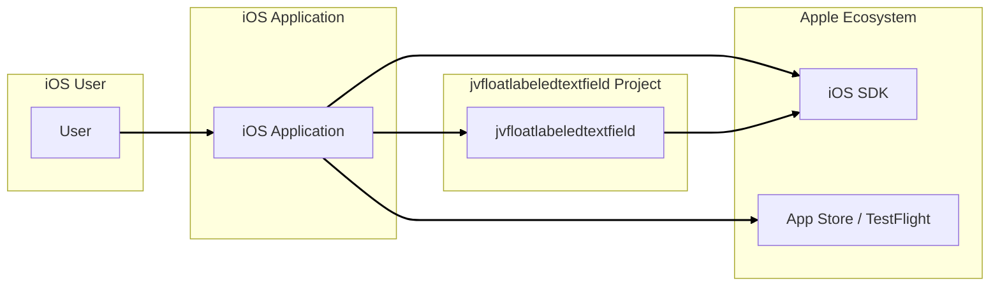
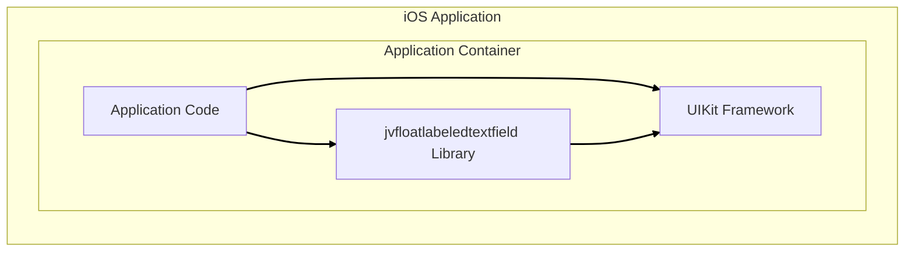
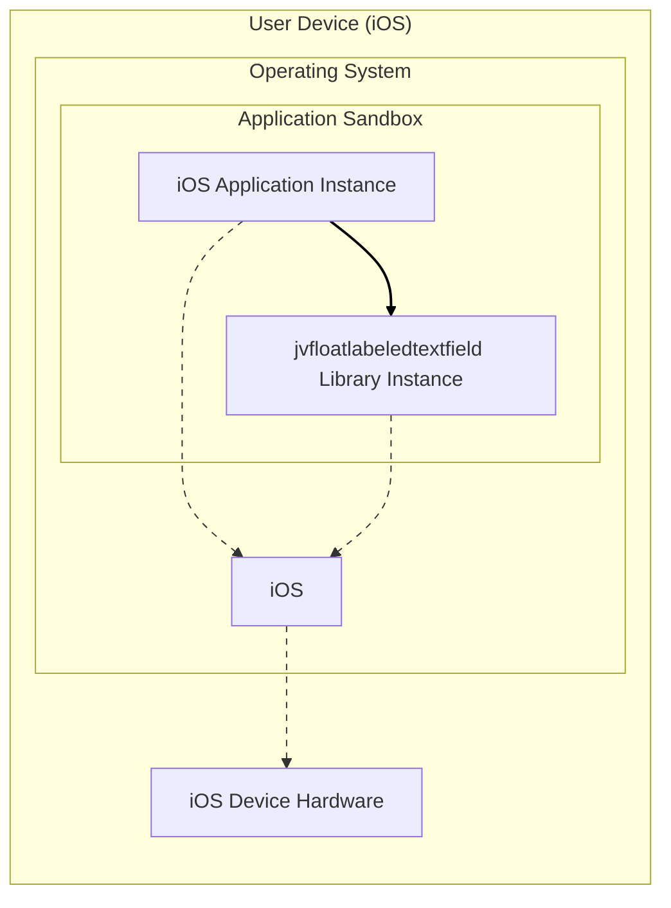
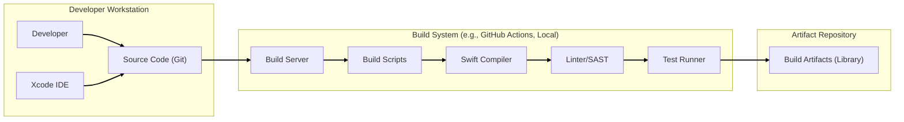

# BUSINESS POSTURE

This project provides a custom UITextField subclass for iOS with floating labels. The primary business goal is to enhance the user interface and user experience of iOS applications by providing a more intuitive and visually appealing way to handle text input fields in forms and other data entry scenarios.

Business priorities are focused on improving the usability and aesthetics of iOS applications. This can lead to increased user satisfaction, potentially higher form completion rates, and a more polished application appearance.

The most important business risks associated with this project are:
- User adoption risk: If the component is not well-received by developers or if it introduces compatibility issues, it may not be widely adopted, limiting its business value.
- Integration risk:  Issues during integration with existing or new iOS projects could lead to delays and increased development costs.
- Accessibility risk: If the component is not implemented with accessibility in mind, it could negatively impact users with disabilities, leading to legal and reputational risks.
- Performance risk: Inefficient implementation could lead to performance degradation in applications using this component, impacting user experience.

# SECURITY POSTURE

Existing security controls:
- security control: Source code hosted on GitHub, providing version control and transparency. (Implemented: GitHub Repository)
- security control: Open-source license (MIT License), allowing for community review and contributions. (Implemented: LICENSE file in repository)

Accepted risks:
- accepted risk: Reliance on application developers to use the component securely and handle sensitive data appropriately within their applications.
- accepted risk: Security vulnerabilities in the component itself, which could be introduced during development or through dependencies.

Recommended security controls:
- security control: Implement automated unit and UI tests to ensure component functionality and prevent regressions.
- security control: Integrate static analysis security testing (SAST) tools into the development process to identify potential security vulnerabilities in the code.
- security control: Regularly update dependencies to patch known vulnerabilities.
- security control: Provide clear documentation and examples on secure usage of the component, emphasizing input validation and secure data handling in the consuming application.

Security requirements:
- Authentication: Not applicable to this UI component itself. Authentication is the responsibility of the application using this component.
- Authorization: Not applicable to this UI component itself. Authorization is the responsibility of the application using this component.
- Input validation: The component itself should not perform input validation. Input validation must be implemented by the application that uses this component to handle user input securely. The component should not introduce vulnerabilities if invalid input is provided.
- Cryptography: Not applicable to this UI component itself. Cryptographic operations are the responsibility of the application using this component if needed. The component should not implement any cryptography.

# DESIGN

## C4 CONTEXT

Context Diagram Elements:

- Element:
    - Name: User
    - Type: Person
    - Description: End-user of iOS applications that incorporate the JVFloatLabeledTextField component.
    - Responsibilities: Interacts with iOS applications, providing input through UI elements including JVFloatLabeledTextField.
    - Security controls: User device security controls (passcode, biometrics), application-level security controls (session management, data protection).

- Element:
    - Name: iOS Application
    - Type: Software System
    - Description: An iOS application developed by application developers that integrates the JVFloatLabeledTextField component to enhance user interface for text input.
    - Responsibilities: Provides user interface, handles user input, processes data, interacts with iOS SDK and other services. Integrates and utilizes JVFloatLabeledTextField for improved text input experience.
    - Security controls: Application-level security controls (authentication, authorization, input validation, data encryption, secure storage), secure communication (HTTPS), adherence to secure coding practices.

- Element:
    - Name: jvfloatlabeledtextfield
    - Type: Software System
    - Description:  A reusable UI component (library) providing custom UITextField with floating labels for iOS applications.
    - Responsibilities: Provides a visually enhanced text input field for iOS applications.  Renders floating labels and manages text input display.
    - Security controls:  Code review, static analysis, unit testing, adherence to secure coding practices for UI components. Relies on consuming application for data security and input validation.

- Element:
    - Name: iOS SDK
    - Type: Software System
    - Description: Apple's Software Development Kit for iOS, providing APIs and libraries necessary for developing iOS applications and UI components.
    - Responsibilities: Provides core functionalities for iOS applications, including UI elements, networking, security features, and access to device hardware.
    - Security controls: Security features provided by the iOS platform (sandboxing, code signing, system integrity protection), regular security updates from Apple.

- Element:
    - Name: App Store / TestFlight
    - Type: Software System
    - Description: Apple's platforms for distributing iOS applications to end-users. App Store for public release, TestFlight for beta testing.
    - Responsibilities: Application distribution, code signing verification, malware scanning (App Store), beta testing management (TestFlight).
    - Security controls: Apple's app review process, code signing requirements, malware scanning, platform security features.

## C4 CONTAINER

Container Diagram Elements:

- Element:
    - Name: Application Code
    - Type: Software Container
    - Description:  The custom application code written by iOS developers, which utilizes the JVFloatLabeledTextField library and UIKit framework to build the application's features and user interface.
    - Responsibilities: Implements application logic, handles user interactions, manages data, integrates UI components including JVFloatLabeledTextField, and interacts with iOS system services.
    - Security controls: Application-level security controls (authentication, authorization, input validation, data encryption, secure storage), secure coding practices, code review, security testing.

- Element:
    - Name: jvfloatlabeledtextfield Library
    - Type: Software Container
    - Description:  A compiled iOS library (likely a static library or framework) containing the JVFloatLabeledTextField component code.
    - Responsibilities: Provides the reusable JVFloatLabeledTextField UI component for integration into iOS applications. Handles rendering of floating labels and text field behavior.
    - Security controls:  Source code security review, static analysis during development, unit testing. Relies on the consuming application for runtime security context.

- Element:
    - Name: UIKit Framework
    - Type: Software Container
    - Description: Apple's UIKit framework, a core framework for building user interfaces in iOS applications. Provides fundamental UI elements and functionalities.
    - Responsibilities: Provides base UI components (like UITextField), event handling, drawing, and other UI-related functionalities used by both the application code and JVFloatLabeledTextField library.
    - Security controls: Security features provided by the iOS platform and UIKit framework itself, regular security updates from Apple.

## DEPLOYMENT

Deployment Architecture: Single Deployment Model

Deployment Diagram Elements:

- Element:
    - Name: iOS Device Hardware
    - Type: Infrastructure
    - Description: Physical iOS device (iPhone, iPad) owned by the end-user.
    - Responsibilities: Executes the iOS operating system and applications. Provides hardware resources (CPU, memory, storage, screen, input devices).
    - Security controls: Device-level security controls (device passcode, biometrics, device encryption), hardware security features (Secure Enclave).

- Element:
    - Name: iOS
    - Type: Operating System
    - Description: Apple's iOS operating system running on the user's device.
    - Responsibilities: Manages hardware resources, provides system services, enforces security policies, runs applications in sandboxed environments.
    - Security controls: Operating system security features (kernel security, sandboxing, code signing, address space layout randomization (ASLR), data protection), regular security updates from Apple.

- Element:
    - Name: Application Sandbox
    - Type: Environment
    - Description: A restricted environment provided by iOS for each application, isolating it from other applications and the core operating system.
    - Responsibilities: Enforces application isolation, limits access to system resources and user data based on permissions, protects system integrity.
    - Security controls: iOS sandbox security policies, permission management, process isolation.

- Element:
    - Name: iOS Application Instance
    - Type: Software Instance
    - Description: A running instance of the iOS application on the user's device, incorporating the JVFloatLabeledTextField library.
    - Responsibilities: Executes application code, renders user interface, handles user input, processes data within the application sandbox.
    - Security controls: Application-level security controls running within the sandbox, limited by sandbox restrictions and permissions.

- Element:
    - Name: jvfloatlabeledtextfield Library Instance
    - Type: Software Instance
    - Description:  An instance of the JVFloatLabeledTextField library loaded and running within the iOS application process.
    - Responsibilities: Provides the floating label text field functionality within the application's user interface.
    - Security controls: Inherits security context from the application process and iOS sandbox.

## BUILD

Build Process Description:

1. Developer writes code for the JVFloatLabeledTextField component and application examples using Xcode IDE on their workstation. Source code is managed using Git version control.
2. Source code is pushed to a repository (e.g., GitHub).
3. A build server (could be local machine or CI/CD system like GitHub Actions) is triggered to build the project.
4. Build scripts automate the build process, including fetching dependencies, compiling the Swift code using the Swift compiler, and running linters and static analysis security testing (SAST) tools to check for code quality and potential security vulnerabilities.
5. Automated tests (unit and UI tests) are executed by a test runner to ensure functionality and prevent regressions.
6. If build and tests are successful, build artifacts (compiled library, documentation) are created and stored in an artifact repository or published (e.g., CocoaPods, Swift Package Manager).

Build Security Controls:
- security control: Version control (Git) for code integrity and change tracking. (Implemented: Git)
- security control: Code review process to identify potential security flaws and ensure code quality. (Recommended)
- security control: Static analysis security testing (SAST) tools to automatically detect potential vulnerabilities in the code. (Recommended: Integrate into build process)
- security control: Automated unit and UI tests to ensure functionality and prevent regressions. (Recommended: Implement comprehensive test suite)
- security control: Dependency management (e.g., Swift Package Manager, CocoaPods) to manage external libraries and their versions. (Implemented: Project likely uses SPM or CocoaPods)
- security control: Secure build environment. (Best practice: Use dedicated build servers, secure access controls)
- security control: Code signing for release builds to ensure code authenticity and integrity. (Implemented: Xcode build process for iOS)

# RISK ASSESSMENT

Critical business process: Providing enhanced user interface for text input in iOS applications. While not directly critical in terms of immediate business disruption, poor user interface can negatively impact user experience, application adoption, and brand reputation over time.

Data we are trying to protect: Primarily the source code of the JVFloatLabeledTextField component itself.  The component does not directly handle sensitive user data. However, vulnerabilities in the component could be exploited in applications that do handle sensitive data.

Data sensitivity:
- Source code: High sensitivity. Loss or unauthorized access could lead to intellectual property theft, malicious modifications, or supply chain attacks.
- Build artifacts (library): Medium sensitivity.  Compromised artifacts could be distributed to developers, potentially leading to vulnerabilities in applications using the library.
- User data handled by applications using the component: Sensitivity depends on the application. The component itself should not handle or store sensitive data, but applications using it might.

# QUESTIONS & ASSUMPTIONS

Questions:
- What is the intended scope of usage for this component? Is it primarily for general-purpose iOS applications or specific types of applications (e.g., enterprise, consumer)?
- Are there any specific performance requirements or constraints for applications using this component?
- Are there any specific accessibility standards or guidelines that applications using this component need to adhere to?
- What is the expected update and maintenance schedule for this component?

Assumptions:
- BUSINESS POSTURE: The primary business goal is to improve user experience in iOS applications. Success is measured by developer adoption and positive user feedback on applications using the component.
- SECURITY POSTURE: Security is primarily the responsibility of the applications that integrate this component. The component itself should be developed with secure coding practices in mind but does not handle sensitive data directly.  Developers using the component are expected to perform input validation and secure data handling in their applications.
- DESIGN: The component is designed as a reusable UI library for iOS applications. It is intended to be integrated into applications using standard iOS development practices and deployed through the App Store or TestFlight. The build process involves standard iOS build tools and potentially CI/CD pipelines.