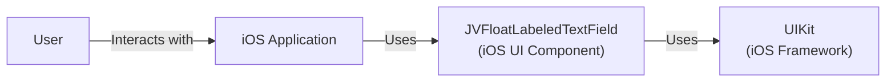
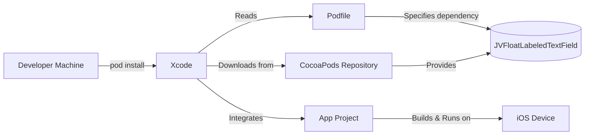
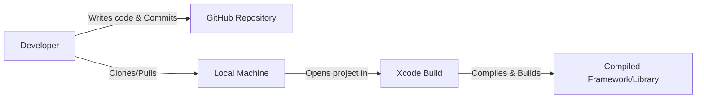

Okay, let's create a design document for the `JVFloatLabeledTextField` project.

# BUSINESS POSTURE

Business Priorities and Goals:

*   Provide a reusable UI component (a text field with a floating label) for iOS developers.
*   Enhance the user experience of text input in iOS applications.
*   Offer a customizable and easy-to-integrate solution.
*   Maintain a lightweight and performant component.
*   Provide an open-source solution, fostering community contributions and adoption.

Most Important Business Risks:

*   Low adoption rate due to lack of awareness or perceived value.
*   Compatibility issues with different iOS versions or device configurations.
*   Security vulnerabilities that could be exploited in applications using the component.
*   Maintenance overhead and difficulty in keeping up with iOS updates.
*   Negative impact on the performance of applications using the component.

# SECURITY POSTURE

Existing Security Controls:

*   security control: The project is open-source, allowing for community review and contributions, which can help identify and address security issues. (GitHub repository)
*   security control: Standard iOS development practices and APIs are used, leveraging the built-in security features of the platform. (Codebase)
*   security control: The component is relatively simple, reducing the potential attack surface. (Codebase)

Accepted Risks:

*   accepted risk: The component relies on the security of the underlying iOS platform and UIKit framework.
*   accepted risk: The component does not handle sensitive data directly, but it could be used to input such data, placing the responsibility for data protection on the application using the component.
*   accepted risk: There is no explicit input validation within the component itself, relying on the application to implement appropriate validation.

Recommended Security Controls:

*   security control: Implement a security.md file in the repository to outline security considerations and reporting procedures.
*   security control: Regularly review and update the component to address any potential security vulnerabilities identified by the community or through internal testing.
*   security control: Consider adding unit tests specifically focused on security aspects, such as input validation and handling of unexpected input.

Security Requirements:

*   Authentication: Not directly applicable, as this is a UI component. Authentication should be handled by the application using the component.
*   Authorization: Not directly applicable, as this is a UI component. Authorization should be handled by the application using the component.
*   Input Validation: The application using the component *must* implement appropriate input validation to prevent security vulnerabilities such as injection attacks. The component itself should, ideally, provide some basic input validation or sanitization to prevent common issues.
*   Cryptography: Not directly applicable, as this is a UI component. If sensitive data is handled, the application using the component *must* use appropriate cryptographic measures.

# DESIGN

## C4 CONTEXT

Element Description:

*   Element:
    *   Name: User
    *   Type: Person
    *   Description: The end-user interacting with an iOS application that utilizes the JVFloatLabeledTextField component.
    *   Responsibilities: Provides input through the text field.
    *   Security controls: None directly applicable to the user in the context of this component.

*   Element:
    *   Name: JVFloatLabeledTextField
    *   Type: iOS UI Component
    *   Description: A custom text field component for iOS that displays a floating label above the text input area.
    *   Responsibilities: Provides a text input field with a floating label. Handles user interaction with the text field. Displays text and placeholder information.
    *   Security controls: Relies on UIKit security, open-source code review.

*   Element:
    *   Name: iOS Application
    *   Type: Software System
    *   Description: An iOS application that integrates and uses the JVFloatLabeledTextField component.
    *   Responsibilities: Integrates and configures the JVFloatLabeledTextField. Handles data input and validation. Implements application logic.
    *   Security controls: Responsible for implementing input validation, data protection, and overall application security.

*   Element:
    *   Name: UIKit
    *   Type: Framework
    *   Description: The iOS framework providing UI components and infrastructure.
    *   Responsibilities: Provides the underlying UI elements and functionality used by JVFloatLabeledTextField.
    *   Security controls: Relies on Apple's security measures for the iOS platform.

## C4 CONTAINER

Since this is a simple UI component, the container diagram is essentially the same as the context diagram. It doesn't have separate deployable units.

Element Description:

*   Element:
    *   Name: User
    *   Type: Person
    *   Description: The end-user interacting with an iOS application that utilizes the JVFloatLabeledTextField component.
    *   Responsibilities: Provides input through the text field.
    *   Security controls: None directly applicable to the user in the context of this component.

*   Element:
    *   Name: JVFloatLabeledTextField
    *   Type: iOS UI Component
    *   Description: A custom text field component for iOS that displays a floating label above the text input area.
    *   Responsibilities: Provides a text input field with a floating label. Handles user interaction with the text field. Displays text and placeholder information.
    *   Security controls: Relies on UIKit security, open-source code review.

*   Element:
    *   Name: iOS Application
    *   Type: Software System
    *   Description: An iOS application that integrates and uses the JVFloatLabeledTextField component.
    *   Responsibilities: Integrates and configures the JVFloatLabeledTextField. Handles data input and validation. Implements application logic.
    *   Security controls: Responsible for implementing input validation, data protection, and overall application security.

*   Element:
    *   Name: UIKit
    *   Type: Framework
    *   Description: The iOS framework providing UI components and infrastructure.
    *   Responsibilities: Provides the underlying UI elements and functionality used by JVFloatLabeledTextField.
    *   Security controls: Relies on Apple's security measures for the iOS platform.

## DEPLOYMENT

Deployment Options:

1.  CocoaPods: The component can be integrated into an iOS project using CocoaPods, a dependency manager for Swift and Objective-C projects.
2.  Carthage: Another dependency manager that can be used to integrate the component.
3.  Swift Package Manager:  Swift's built-in package manager.
4.  Manual Integration: Developers can manually add the source files to their Xcode project.

Chosen Deployment Method (CocoaPods):

Element Description:

*   Element:
    *   Name: Developer Machine
    *   Type: Workstation
    *   Description: The machine used by the developer to write and build the iOS application.
    *   Responsibilities: Hosts the development environment (Xcode), source code, and build tools.
    *   Security controls: Standard workstation security measures (e.g., OS updates, antivirus).

*   Element:
    *   Name: CocoaPods Repository
    *   Type: Package Repository
    *   Description: A centralized repository hosting CocoaPods packages (pods).
    *   Responsibilities: Stores and provides access to the JVFloatLabeledTextField pod.
    *   Security controls: Relies on CocoaPods' security measures and infrastructure.

*   Element:
    *   Name: iOS Device
    *   Type: Mobile Device
    *   Description: The physical or simulated iOS device where the application is deployed and run.
    *   Responsibilities: Runs the compiled iOS application.
    *   Security controls: Relies on iOS device security features.

*   Element:
    *   Name: Xcode
    *   Type: IDE
    *   Description: Apple's integrated development environment for iOS development.
    *   Responsibilities: Manages the project, builds the application, and handles dependency management (via CocoaPods).
    *   Security controls: Relies on Xcode's security features and the security of the developer's machine.

*   Element:
    *   Name: Podfile
    *   Type: Configuration File
    *   Description: A file that specifies the dependencies for an Xcode project using CocoaPods.
    *   Responsibilities: Lists the JVFloatLabeledTextField as a dependency.
    *   Security controls: None directly, but incorrect configuration could lead to vulnerabilities.

*   Element:
    *   Name: App Project
    *   Type: Software Project
    *   Description: The iOS application project that integrates the JVFloatLabeledTextField.
    *   Responsibilities: Contains the application code and resources.
    *   Security controls: The application developer is responsible for implementing appropriate security measures.

*   Element:
    *   Name: JVFloatLabeledTextField
    *   Type: Library
    *   Description: The library that will be integrated into App Project.
    *   Responsibilities: Provide floating label text field.
    *   Security controls: The application developer is responsible for implementing appropriate security measures.

## BUILD

Build Process Description:

1.  Developer: The developer writes code and commits changes to the GitHub repository. They also clone or pull the repository to their local machine.
2.  Local Machine: The developer's local machine hosts the source code and Xcode.
3.  Xcode Build: The developer uses Xcode to build the project. This involves compiling the source code, linking libraries (if any), and creating the final framework or library.
4.  Artifact: The output of the build process is a compiled framework or library that can be integrated into other iOS projects.

Security Controls in Build Process:

*   security control: Code Review: All code changes should be reviewed by at least one other developer before being merged into the main branch. This helps identify potential security vulnerabilities. (GitHub Pull Requests)
*   security control: Static Analysis: While not explicitly present in this simple project, integrating a static analysis tool (e.g., SwiftLint) into the build process can help identify potential code quality and security issues.
*   security control: Dependency Management: Using a dependency manager like CocoaPods, Carthage, or Swift Package Manager helps ensure that dependencies are managed securely and updated regularly.
*   security control: Secure Development Environment: The developer's machine should be secured with appropriate measures (e.g., OS updates, antivirus).

# RISK ASSESSMENT

Critical Business Processes:

*   Providing a functional and user-friendly UI component.
*   Maintaining the component's compatibility with iOS updates.
*   Ensuring the component's performance and stability.

Data Protection:

*   Data Sensitivity: The component itself does not handle sensitive data directly. However, it is used for text input, and the *application* using the component is responsible for handling any sensitive data entered by the user appropriately.
*   Data to Protect: The application using the component must protect any sensitive data entered through the text field, such as passwords, personal information, or financial data. The component itself does not store or transmit data.

# QUESTIONS & ASSUMPTIONS

Questions:

*   Are there any specific compliance requirements (e.g., GDPR, HIPAA) that the applications using this component typically need to adhere to? This would influence recommendations for data handling.
*   What is the expected level of customization required by developers using this component? This will help determine the complexity of the API and potential security implications.
*   Are there plans to expand the functionality of this component in the future? This could introduce new security considerations.

Assumptions:

*   BUSINESS POSTURE: The primary goal is to provide a useful and widely adopted UI component. The project has a moderate risk appetite, typical of open-source projects.
*   SECURITY POSTURE: Developers using the component are responsible for implementing appropriate security measures in their applications, including input validation and data protection. The component itself is assumed to be relatively low-risk due to its limited functionality.
*   DESIGN: The component is designed to be simple and lightweight, minimizing the potential attack surface. It relies on the security of the underlying iOS platform and UIKit framework. The primary integration method is expected to be through CocoaPods.