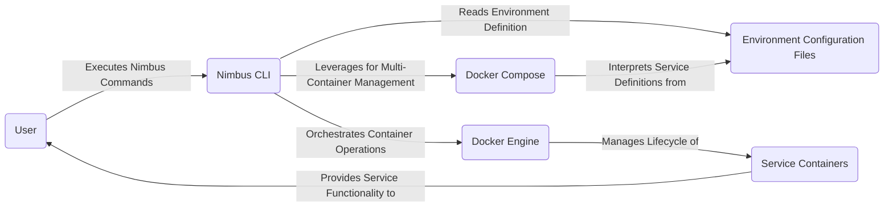

# Project Design Document: Nimbus Local Cloud Environment

**Version:** 1.1
**Date:** October 26, 2023
**Author:** AI Cloud & Security Architect

## 1. Introduction

This document provides a detailed design specification for the Nimbus project, a local cloud environment leveraging Docker. Nimbus is designed to streamline the setup and management of isolated development and testing environments by offering a user-friendly command-line interface (CLI) for orchestrating Docker containers. This document will serve as a foundational artifact for subsequent threat modeling activities and provides a comprehensive understanding of the system's architecture and components.

## 2. Goals and Objectives

The primary goals and objectives of the Nimbus project are:

* **Simplified Local Development:** To offer an intuitive and efficient method for developers to instantiate and manage local instances of common backend services (e.g., databases, message brokers, caching systems).
* **Environment Reproducibility:** To guarantee consistent environment configurations across different developer workstations, minimizing "works on my machine" issues.
* **Abstraction of Docker Complexity:** To shield end-users from the intricacies of direct Docker and Docker Compose management, providing a higher-level abstraction.
* **Extensible Service Catalog:** To enable users to easily incorporate and configure new services into their local development environments through a declarative approach.
* **CLI-Centric Interaction:** To provide a consistent and scriptable command-line interface for all interactions with the Nimbus environment lifecycle and service management.

## 3. High-Level Architecture

The Nimbus system architecture comprises the following core components and their interactions:

* **User:** The developer or operator who interacts with the Nimbus system via the CLI.
* **Nimbus CLI:** A command-line application, developed in Go, responsible for interpreting user commands, validating configurations, and orchestrating the underlying Docker environment.
* **Environment Configuration Files:** YAML-based files that define the desired state of a Nimbus environment, including the services to be deployed and their specific configurations.
* **Docker Engine:** The foundational containerization runtime responsible for the execution and management of Docker containers.
* **Docker Compose:** An orchestration tool utilized by the Nimbus CLI to define and manage multi-container Docker applications based on the provided environment configuration files.
* **Service Containers:** Individual, isolated Docker containers that host the specific services defined within a Nimbus environment (e.g., a PostgreSQL database container, a Redis cache container).



## 4. Component Details

### 4.1. Nimbus CLI

* **Functionality:**
    * **Command Parsing and Validation:**  Interprets user-provided commands and ensures they adhere to the defined syntax and semantics.
    * **Environment Configuration Management:** Reads, validates, and processes YAML-based environment configuration files.
    * **Docker Orchestration:** Interacts with the Docker Engine and Docker Compose to manage the lifecycle of containers (creation, starting, stopping, deletion).
    * **Service Management:** Provides commands for managing individual services within a Nimbus environment (e.g., viewing logs, restarting a service).
    * **User Feedback and Error Handling:**  Provides informative output to the user, including status updates and error messages.
* **Technology:** Go programming language, leveraging libraries for CLI parsing and Docker interaction.
* **Key Responsibilities:**
    * Acting as the primary interface for user interaction with the Nimbus system.
    * Translating user intent into concrete Docker operations.
    * Ensuring the consistency and validity of the Nimbus environment.

### 4.2. Environment Configuration Files

* **Functionality:**
    * **Declarative Service Definition:** Specifies the services to be included in a Nimbus environment, along with their desired configurations.
    * **Docker Image Specification:** Defines the Docker image to be used for each service.
    * **Environment Variable Configuration:** Allows setting environment variables for individual service containers.
    * **Port Mapping Configuration:** Defines how ports within the containers are mapped to the host system.
    * **Volume Mount Configuration:** Specifies how directories on the host system are mounted into the containers for data persistence or configuration.
    * **Service Dependencies:**  Allows defining dependencies between services, ensuring they are started in the correct order.
* **Technology:** YAML (YAML Ain't Markup Language) format for human-readability and ease of parsing.
* **Key Responsibilities:**
    * Defining the desired state and composition of a Nimbus environment.
    * Providing the necessary configuration parameters for Docker Compose to provision the environment.

### 4.3. Docker Engine

* **Functionality:**
    * **Container Image Management:** Pulls, stores, and manages Docker images.
    * **Container Lifecycle Management:** Creates, starts, stops, restarts, and destroys Docker containers.
    * **Resource Isolation:** Provides resource isolation between containers using kernel features like namespaces and cgroups.
    * **Networking:** Manages networking for containers, allowing them to communicate with each other and the outside world.
    * **Storage Management:** Manages storage volumes for containers, enabling data persistence.
* **Technology:** Docker Engine (containerd runtime).
* **Key Responsibilities:**
    * Executing and isolating containerized applications.
    * Managing the underlying resources required by containers.

### 4.4. Docker Compose

* **Functionality:**
    * **Multi-Container Application Definition:** Allows defining and managing multi-container Docker applications using a YAML file.
    * **Service Orchestration:**  Orchestrates the creation and startup of multiple containers based on the configuration.
    * **Dependency Management:** Handles dependencies between services, ensuring they are started in the correct order.
    * **Networking and Volume Management:**  Simplifies the configuration of networking and volume sharing between containers.
* **Technology:** Docker Compose.
* **Key Responsibilities:**
    * Interpreting the environment configuration files and translating them into instructions for the Docker Engine.
    * Simplifying the management of complex, multi-container environments.

### 4.5. Service Containers

* **Functionality:**
    * **Providing Specific Services:** Each container runs a specific service as defined in the environment configuration (e.g., a PostgreSQL database server, a Redis caching server, a message queue like RabbitMQ).
    * **Exposing Network Ports:**  Exposes specific network ports to allow access to the service from the host or other containers.
    * **Data Persistence (Optional):** May utilize volumes to persist data beyond the lifecycle of the container.
* **Technology:** Docker containers based on specific Docker images (e.g., `postgres:latest`, `redis:latest`, `rabbitmq:latest`).
* **Key Responsibilities:**
    * Executing the intended service logic.
    * Providing the core functionality of the Nimbus environment.

## 5. Data Flow

The typical sequence of operations when a user interacts with Nimbus is as follows:

1. **User Invokes Nimbus CLI Command:** The user executes a command through the Nimbus CLI to perform an action, such as creating a new environment or starting specific services within an existing environment.
2. **CLI Command Parsing and Validation:** The Nimbus CLI receives the command, parses it to understand the user's intent, and validates the command syntax and any provided arguments.
3. **Environment Configuration Loading:** Based on the command, the Nimbus CLI loads the relevant environment configuration file (typically `nimbus.yaml` or a similar named file).
4. **Interaction with Docker Compose:** The Nimbus CLI utilizes the Docker Compose API or command-line interface, passing the parsed configuration information to Docker Compose.
5. **Docker Compose Orchestration:** Docker Compose interprets the configuration file and instructs the Docker Engine on the necessary actions to achieve the desired state. This includes pulling Docker images if they are not already present locally.
6. **Docker Engine Container Management:** The Docker Engine receives instructions from Docker Compose and performs the following actions:
    * **Image Pulling (if required):** Downloads the specified Docker images from configured registries (e.g., Docker Hub).
    * **Container Creation:** Creates new container instances based on the pulled images and the provided configuration.
    * **Container Startup:** Starts the created containers, allocating necessary resources and configuring networking.
7. **Service Provisioning:** The service containers, once running, begin providing their intended services, listening on specified ports and potentially interacting with mounted volumes for data storage.
8. **User Interaction with Services:** The user can then interact directly with the running services, for example, connecting to a database using a database client or sending messages to a message queue.

```mermaid
graph LR
    A("User") -->|Executes CLI Command| B("Nimbus CLI");
    B -->|Parses and Validates Command| C("Nimbus CLI Logic");
    C -->|Loads Environment Definition| D("Environment Configuration Files");
    C -->|Interacts with| E("Docker Compose");
    E -->|Instructs| F("Docker Engine");
    F -->|Pulls Docker Images (if necessary)| G("Docker Image Registry");
    F -->|Creates and Starts Containers| H("Service Containers");
    H -->|Provides Services| I("User/Applications");
```

## 6. Security Considerations (Initial Assessment for Threat Modeling)

This section provides an initial overview of security considerations relevant to the Nimbus project, which will be further analyzed during a dedicated threat modeling exercise.

* **Nimbus CLI Security:**
    * **Command Injection Vulnerabilities:**  Risk of arbitrary command execution if user input is not properly sanitized before being used in system calls or Docker commands.
    * **Authentication and Authorization:** While primarily a local tool, future features involving remote management or shared environments would necessitate robust authentication and authorization mechanisms.
* **Environment Configuration File Security:**
    * **Exposure of Sensitive Information:** Configuration files may contain sensitive data such as database credentials or API keys. Secure storage and access control for these files are critical.
    * **Configuration Tampering:** Protecting configuration files from unauthorized modification to prevent malicious changes to the environment setup.
* **Docker Security:**
    * **Docker Image Vulnerabilities:**  The security of the Nimbus environment is dependent on the security of the Docker images used. Regularly scanning images for vulnerabilities and using trusted base images is essential.
    * **Container Isolation Weaknesses:**  While Docker provides isolation, vulnerabilities in the Docker Engine or kernel could potentially allow container escape or cross-container contamination.
    * **Privileged Container Usage:**  Minimizing the use of privileged containers, as they bypass many of Docker's security features and increase the attack surface.
* **Network Security:**
    * **Container Network Segmentation:**  Understanding and potentially configuring Docker's networking features to isolate containers and restrict communication paths.
    * **Unnecessary Port Exposure:**  Limiting the number of ports exposed to the host system to only those strictly necessary for accessing the services.
* **Host System Security:**
    * **Nimbus CLI Dependencies:** Ensuring the security and integrity of the Nimbus CLI's dependencies to prevent supply chain attacks.
    * **Installation Process Security:**  A secure installation process is crucial to prevent malicious actors from compromising the system during setup.

## 7. Deployment

The intended deployment model for Nimbus is local installation on a developer's workstation or a local server. The typical deployment process involves:

* **Nimbus CLI Installation:** Downloading a pre-compiled binary for the user's operating system or building the CLI from the source code.
* **Docker and Docker Compose Installation:**  Ensuring that Docker Engine and Docker Compose are installed and correctly configured on the target system, as these are prerequisites for Nimbus to function.
* **Optional Configuration:**  Users may optionally configure Nimbus with default settings or customize its behavior through configuration files or environment variables.

## 8. Future Considerations

Potential future enhancements and areas for development include:

* **Graphical User Interface (GUI):**  Developing a GUI to provide an alternative, more visual way to interact with Nimbus.
* **Remote Environment Management:**  Extending Nimbus to support the management of environments on remote servers or cloud platforms.
* **Advanced Networking Configuration:**  Providing users with more fine-grained control over container networking settings.
* **Integration with Cloud Providers:**  Exploring integrations with cloud providers to facilitate seamless transitions between local and cloud development environments.
* **Enhanced Security Features:**  Implementing features such as integrated secrets management, role-based access control, and audit logging.

This revised document provides a more detailed and structured design specification for the Nimbus project, offering a solid foundation for understanding its architecture and facilitating future threat modeling efforts.
