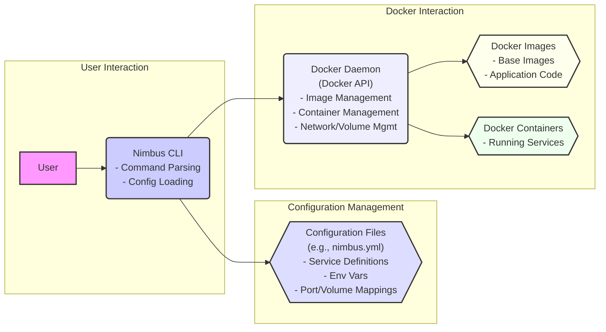

# Project Design Document: Nimbus Local Cloud Development Platform

**Version:** 1.1
**Date:** October 26, 2023
**Author:** AI Software Architect

## 1. Introduction

This document provides an enhanced design overview of the Nimbus project, a local cloud development platform as described in the GitHub repository: [https://github.com/jverkoey/nimbus](https://github.com/jverkoey/nimbus). This revision aims to further clarify the system's architecture, components, and data flow, ensuring a robust foundation for subsequent threat modeling activities.

### 1.1. Purpose

The purpose of this document is to:

*   Provide a clear and comprehensive understanding of the Nimbus system's design and operation.
*   Elaborate on the internal workings and responsibilities of key components.
*   Detail the data flow within the system, including specific data types and transformations.
*   Serve as a precise and informative basis for identifying potential security vulnerabilities during threat modeling exercises.

### 1.2. Scope

This document encompasses the core architecture and functionality of the Nimbus platform as inferred from the provided GitHub repository. It focuses on the interactions between the user, the Nimbus CLI, configuration files, and the underlying Docker infrastructure, with a deeper dive into the internal processes.

### 1.3. Goals

The goals of this design document are to be:

*   Exceedingly clear, using precise language and avoiding ambiguity.
*   Technically accurate and comprehensively detailed based on the available information and common practices for such systems.
*   Sufficiently detailed to enable thorough and effective threat modeling.
*   Easily understandable by a wider range of stakeholders, including those with varying levels of technical expertise.

## 2. System Overview

Nimbus is a local development platform designed to streamline the creation and management of containerized development environments using Docker. It offers a command-line interface (CLI) for users to define, orchestrate, and interact with services within a local Docker environment.

### 2.1. High-Level Architecture

The Nimbus system operates through the interaction of the following core components:

*   **User:** Initiates actions and interacts with the system via the Nimbus CLI.
*   **Nimbus CLI:** The central command-line interface responsible for:
    *   Receiving and interpreting user commands.
    *   Parsing and validating configuration definitions.
    *   Orchestrating interactions with the Docker daemon.
    *   Managing the lifecycle of Docker containers.
*   **Configuration Files:**  Structured files (likely YAML) that define the desired state of the development environment, including:
    *   Service definitions and their dependencies.
    *   Docker image specifications.
    *   Environment variable configurations.
    *   Network and volume mappings.
*   **Docker Daemon:** The underlying Docker engine that executes the instructions provided by the Nimbus CLI, responsible for:
    *   Building and pulling Docker images.
    *   Creating, starting, stopping, and managing containers.
    *   Managing network connections and volumes.

### 2.2. Key Components

*   **Nimbus CLI (`nimbus` executable):**
    *   **Command Processing:** Parses user commands, validates syntax, and extracts relevant parameters.
    *   **Configuration Loading and Validation:** Locates, reads, and validates configuration files against a predefined schema.
    *   **Docker API Client:**  Utilizes a Docker client library to communicate with the Docker daemon via its API.
    *   **Orchestration Logic:** Implements the logic for translating configuration into Docker API calls to manage containers and networks.
    *   **State Management (Implicit):**  While likely stateless in its execution, it influences the state of the Docker environment.
    *   **Output and Logging:** Provides feedback to the user through standard output and potentially logs events for debugging.
*   **Configuration Files (`nimbus.yml` or similar):**
    *   **Service Definitions:** Define individual services, including the Docker image to use, build context (if needed), and dependencies on other services.
    *   **Environment Variables:** Specify environment variables to be set within the containers.
    *   **Port Mappings:** Define how ports on the host machine are mapped to ports within the containers.
    *   **Volume Mounts:** Configure persistent storage by mounting directories from the host into containers.
    *   **Network Configuration:** Define custom networks for containers to communicate on.
    *   **Resource Limits:**  Potentially specify resource constraints (CPU, memory) for containers.
*   **Docker Daemon:**
    *   **Image Management:** Pulls Docker images from registries (e.g., Docker Hub) and builds images from Dockerfiles.
    *   **Container Management:** Creates, starts, stops, restarts, and removes Docker containers based on instructions.
    *   **Networking:** Creates and manages virtual networks for containers to communicate, including port forwarding and DNS resolution.
    *   **Volume Management:** Manages persistent data volumes that can be shared between containers and persist beyond container lifecycles.
    *   **Resource Allocation:** Allocates CPU, memory, and other resources to running containers.

### 2.3. Data Flow

The typical data flow within the Nimbus system involves these key steps and data transformations:

1. **User Command Input:** The user enters a command into the Nimbus CLI (e.g., `nimbus up`, `nimbus logs <service>`). The command itself is the initial data input.
2. **CLI Command Parsing:** The Nimbus CLI parses the command string to identify the intended action and any associated arguments or options.
3. **Configuration File Location and Reading:** The CLI determines the location of the configuration file (typically `nimbus.yml` in the current directory) and reads its contents.
4. **Configuration Data Parsing and Validation:** The CLI parses the configuration file (likely YAML) into an internal data structure and validates it against a predefined schema to ensure correctness and completeness.
5. **Translation to Docker API Calls:** Based on the parsed configuration and the user's command, the Nimbus CLI translates the desired state into a series of calls to the Docker API. This involves constructing API requests with specific parameters.
6. **Docker API Communication:** The Nimbus CLI sends these API requests to the Docker daemon via a local socket or a network connection. The data transmitted includes instructions for managing images, containers, networks, and volumes.
7. **Docker Daemon Execution:** The Docker daemon receives the API requests and performs the requested actions, such as pulling images, creating containers, and configuring networking.
8. **Container Operation and Data Processing:** Docker containers run the specified services, processing data according to their internal logic. This data flow is internal to the containers but is initiated and managed by Nimbus.
9. **Status Retrieval (Optional):** The user can request the status of the managed environment (e.g., `nimbus status`). The Nimbus CLI makes API calls to the Docker daemon to retrieve information about container states, resource usage, and other relevant metrics.
10. **Output and Logging:** The Nimbus CLI presents the results of operations and status information to the user through the command line. It may also log events and errors for debugging and auditing.

## 3. Component Details

This section provides a more in-depth examination of each key component's functionality and potential security considerations.

### 3.1. Nimbus CLI

*   **Functionality:**
    *   **Command Parsing:** Employs libraries or custom logic to break down user commands into actionable components. Robust error handling is crucial here.
    *   **Configuration Management:**  Handles the discovery, reading, and validation of configuration files. This involves file system access and parsing potentially untrusted data.
    *   **Docker Interaction:**  Manages the communication lifecycle with the Docker daemon, including authentication (if necessary), request construction, and response handling.
    *   **Orchestration Logic:**  Implements the core logic for mapping the desired state defined in the configuration to specific Docker operations. This may involve complex dependency resolution and ordering of operations.
    *   **Error Handling and Reporting:**  Provides informative error messages to the user when operations fail, aiding in debugging.
    *   **Potentially handles updates to the Nimbus CLI itself.**
*   **Implementation Details (Inferred):**
    *   Likely implemented using a language with strong support for CLI development and Docker interaction (e.g., Go, Python with Docker SDK).
    *   Utilizes libraries for YAML parsing (e.g., PyYAML, Go's `gopkg.in/yaml.v2`).
    *   Employs a Docker client library (e.g., `docker-py`, Go's `docker/docker/client`).
*   **Potential Areas of Interest for Threat Modeling:**
    *   **Command Injection:** Vulnerabilities in command parsing that could allow execution of arbitrary commands.
    *   **Configuration File Vulnerabilities:**  Insecure handling of configuration files, leading to injection attacks or exposure of secrets.
    *   **Docker API Security:**  Improper authentication or authorization when interacting with the Docker daemon, though typically local, could be a concern in certain setups.
    *   **Information Disclosure:**  Exposure of sensitive information in logs, error messages, or output.
    *   **Update Mechanism Security:**  Compromised update mechanisms could lead to the distribution of malicious versions of the CLI.

### 3.2. Configuration Files

*   **Format:**  Likely YAML due to its human-readability and suitability for configuration.
*   **Content:**
    *   Detailed specifications for each service, including image names, build arguments, and entry points.
    *   Explicit mappings of ports and volumes.
    *   Declarations of environment variables, which might contain sensitive information.
    *   Definitions of network configurations and inter-service dependencies.
    *   Potentially, resource limits and health check configurations.
*   **Storage:** Typically stored as plain text files within the project directory, making them accessible to anyone with file system access.
*   **Potential Areas of Interest for Threat Modeling:**
    *   **Secret Management:**  The risk of storing sensitive credentials or API keys directly within the configuration file.
    *   **Injection Vulnerabilities:**  If configuration values are used in shell commands or other interpreted contexts without proper sanitization, it could lead to injection attacks.
    *   **Tampering and Integrity:**  The risk of unauthorized modification of configuration files to alter the development environment or inject malicious components.
    *   **Schema Validation Bypass:**  Weak or missing schema validation could allow for malformed configurations that could cause unexpected behavior or security issues.

### 3.3. Docker Daemon

*   **Functionality:**
    *   **Image Management:** Pulling, building, pushing, and managing the lifecycle of Docker images. Security scanning of images is a critical aspect.
    *   **Container Management:**  Creating, starting, stopping, restarting, and destroying containers. Proper resource isolation and security context are essential.
    *   **Networking:**  Providing network connectivity between containers and to the outside world, including port mapping and DNS. Network segmentation is important for security.
    *   **Volume Management:**  Managing persistent storage for containers, ensuring data integrity and access control.
    *   **Resource Management:**  Allocating and managing CPU, memory, and other resources for containers to prevent resource exhaustion and ensure fair sharing.
    *   **Security Features:**  Implementing security features like namespaces, cgroups, and seccomp profiles to isolate containers and limit their capabilities.
*   **Interaction with Nimbus:** The Nimbus CLI acts as a client, sending instructions via the Docker API. The security of this communication channel (typically a local socket) is important.
*   **Security Considerations (General Docker):**
    *   **Image Vulnerabilities:** Using vulnerable base images can introduce security flaws into containers.
    *   **Container Escape:**  Vulnerabilities that allow a process within a container to gain access to the host system.
    *   **Insecure Defaults:**  Default Docker configurations might not be secure and require hardening.
    *   **Privilege Escalation:**  Misconfigurations or vulnerabilities that allow processes within a container to gain elevated privileges.
    *   **Network Security:**  Improperly configured networks can expose containers to unauthorized access.
*   **Potential Areas of Interest for Threat Modeling (Nimbus Context):**
    *   **Nimbus's Role in Docker Security Configuration:** How Nimbus influences the security settings of the Docker environment and the containers it manages.
    *   **Privilege Management:** The level of privileges granted to containers launched by Nimbus.
    *   **Network Configuration by Nimbus:**  How Nimbus configures container networking and the potential security implications.
    *   **Volume Mount Security:**  The security implications of volume mounts configured by Nimbus, including access permissions.

## 4. Data Flow Diagram

**Description of Data Flow Diagram:**

*   The diagram illustrates the primary flow of data and control within the Nimbus system.
*   The **User** initiates actions by interacting with the **Nimbus CLI**.
*   The **Nimbus CLI** processes commands and reads **Configuration Files** to understand the desired environment.
*   The **Nimbus CLI** communicates with the **Docker Daemon** via its API, sending instructions to manage images, containers, and related resources.
*   The **Docker Daemon** utilizes **Docker Images** to create and manage **Docker Containers**, which host the running services.

## 5. Security Considerations (Pre-Threat Modeling)

This section expands on the potential security concerns, providing more specific examples and areas for investigation during threat modeling.

*   **Configuration File Security:**
    *   **Hardcoded Secrets:**  The risk of developers directly embedding API keys, database credentials, or other sensitive information within `nimbus.yml`.
    *   **Injection Attacks:**  If configuration values (e.g., environment variables) are used in `RUN` commands within Dockerfiles or entrypoint scripts without proper escaping, it could lead to command injection.
    *   **Unauthorized Modification:**  If the configuration file is not properly protected, an attacker with file system access could modify it to inject malicious containers or alter the environment.
*   **Nimbus CLI Security:**
    *   **Command Injection:**  If the CLI doesn't properly sanitize user input, an attacker could craft malicious commands that execute arbitrary code on the host system.
    *   **Path Traversal:**  Vulnerabilities in how the CLI handles file paths could allow an attacker to access or modify files outside the intended project directory.
    *   **Insecure Docker API Communication:** While typically local, if the Docker daemon is configured to listen on a network interface without proper authentication, it could be vulnerable.
    *   **Logging Sensitive Information:**  The CLI might inadvertently log sensitive information, such as API keys or environment variables, making them accessible to those who can read the logs.
*   **Docker Daemon Security:**
    *   **Vulnerable Base Images:**  Using outdated or vulnerable base images can introduce known security flaws into the containers.
    *   **Insufficient Container Isolation:**  Misconfigured namespaces or cgroups could allow containers to interact in unintended ways or escape their isolation.
    *   **Privileged Containers:**  Running containers with excessive privileges (e.g., `--privileged`) significantly increases the risk of container escape.
    *   **Exposed Docker Socket:**  Accidentally exposing the Docker socket (e.g., mounting it into a container) can grant full control over the Docker daemon to the container.
*   **Access Control:**
    *   **Host Machine Access:**  Security depends on who has access to the machine running Nimbus and the Docker daemon. Compromised host security can undermine the entire system.
    *   **Configuration File Permissions:**  Ensuring appropriate file system permissions on `nimbus.yml` is crucial to prevent unauthorized modification.
*   **Dependency Management:**
    *   **Vulnerabilities in CLI Dependencies:**  The Nimbus CLI likely relies on external libraries. Vulnerabilities in these dependencies could be exploited.
*   **Update Mechanism:**
    *   **Man-in-the-Middle Attacks:**  If the update process for the Nimbus CLI is not secure (e.g., uses unencrypted HTTP), an attacker could intercept and replace the update with a malicious version.

## 6. Future Considerations (Out of Scope for Immediate Threat Modeling)

These are potential future enhancements or aspects that are not central to the current design but might become relevant for security considerations in the future.

*   **Remote Management Capabilities:**  If Nimbus were to support remote management of Docker environments, it would introduce new security challenges related to authentication and authorization over a network.
*   **Integration with Secrets Management Tools:**  Future versions could integrate with dedicated secrets management tools (e.g., HashiCorp Vault) to securely handle sensitive information.
*   **Enhanced Monitoring and Logging:**  More comprehensive monitoring and logging capabilities could aid in detecting and responding to security incidents.
*   **Role-Based Access Control (RBAC):**  If Nimbus were to manage more complex environments with multiple users, RBAC could be implemented to control access to different functionalities.

This enhanced document provides a more detailed and nuanced understanding of the Nimbus local cloud development platform, offering a solid foundation for thorough and effective threat modeling activities. The expanded component details, refined data flow description, and more specific security considerations should enable a deeper analysis of potential vulnerabilities.
