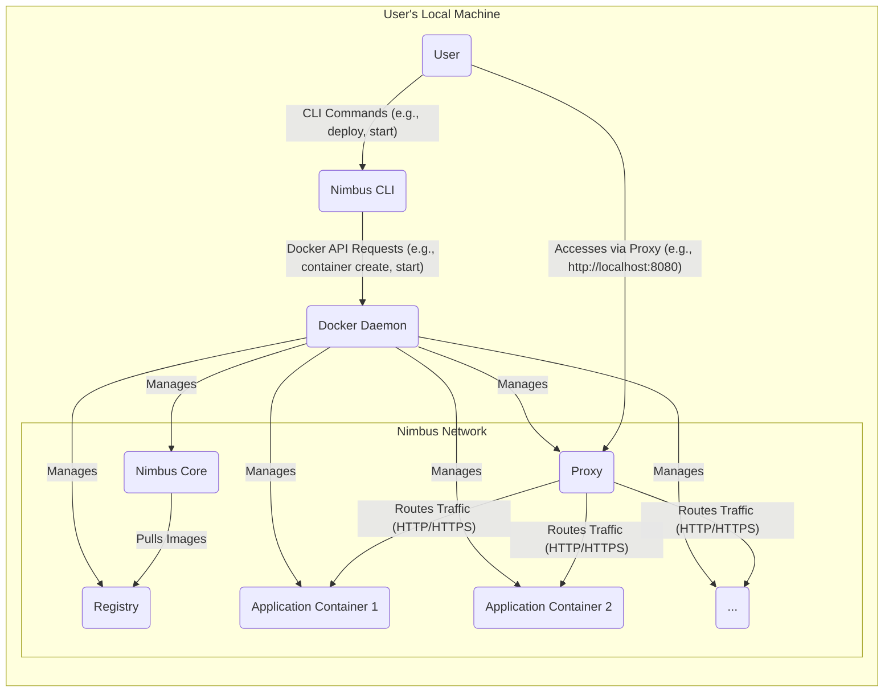

## Project Design Document: Nimbus Local Cloud Environment - Improved

**1. Introduction**

This document provides an enhanced architectural design overview of the Nimbus project, a local cloud environment built using Docker. This document serves as a refined foundation for understanding the system's architecture, components, and interactions, which is crucial for subsequent threat modeling activities.

**1.1. Purpose**

The purpose of this document is to offer a more detailed and comprehensive architectural overview of the Nimbus project. It elaborates on the system's components, their specific responsibilities, and the nuances of their interactions. This enhanced document will serve as a more robust basis for identifying potential security threats and vulnerabilities within the Nimbus environment.

**1.2. Scope**

This document covers the core architectural design of the Nimbus project as represented in the provided GitHub repository, with a greater level of detail than the previous version. It focuses on the key components and their interactions within the local Docker environment, providing more context on data flow and component functionality. It still does not delve into the specific implementation details of the applications deployed within Nimbus, but provides a clearer picture of how they interact with the Nimbus infrastructure.

**1.3. Goals**

*   Clearly define the major components of the Nimbus system with greater specificity.
*   Describe the interactions and data flow between these components in more detail, including examples.
*   Identify key security boundaries and trust zones within the system with more granular considerations.
*   Provide a more robust and detailed foundation for conducting a thorough threat model.

**2. High-Level Architecture**

The Nimbus project provides a local cloud environment by orchestrating several Docker containers. The user interacts with Nimbus through a command-line interface (CLI).

**3. Component Descriptions**

This section details the key components of the Nimbus system and their responsibilities with more specific examples.

*   **User:** The individual interacting with the Nimbus environment. This user executes commands via the Nimbus CLI to manage the local cloud.
*   **Nimbus CLI:** The command-line interface used by the user to manage the Nimbus environment. It acts as the primary entry point for user interaction.
    *   Responsibilities:
        *   Accepting user input for actions like deploying applications, starting/stopping services, and viewing logs.
        *   Validating user commands and parameters to ensure they are correctly formatted and logical.
        *   Translating user commands into specific Docker API calls (e.g., `docker run`, `docker stop`, `docker pull`).
        *   Interacting with the Docker Daemon via the Docker API over a local socket or network connection.
        *   Formatting and displaying output from the Docker Daemon and Nimbus Core back to the user.
*   **Docker Daemon:** The background service on the user's machine that manages Docker containers and images. It is the core runtime engine for Nimbus.
    *   Responsibilities:
        *   Building Docker images based on Dockerfiles.
        *   Pulling Docker images from configured registries (including the local Nimbus Registry).
        *   Creating, starting, stopping, and deleting Docker containers.
        *   Managing network configurations for containers, including creating bridge networks and exposing ports.
        *   Managing volumes for persistent data storage, allowing data to persist beyond container lifecycles.
        *   Enforcing resource limits (CPU, memory) on containers if configured.
*   **Nimbus Core:** The central control plane component responsible for orchestrating the Nimbus environment and managing the lifecycle of applications within it.
    *   Responsibilities:
        *   Receiving instructions from the Nimbus CLI indirectly via Docker (e.g., through environment variables or configuration files passed to its container).
        *   Deploying new application containers based on user requests or configuration.
        *   Monitoring the health and status of deployed application containers.
        *   Potentially managing networking configurations within the Nimbus environment, such as service discovery.
        *   Interacting with the Registry to ensure the correct application images are used for deployments.
        *   Potentially handling scaling of application containers based on demand or configuration.
*   **Registry:** A Docker registry (likely a local one within the Nimbus environment) used to store and distribute Docker images for applications managed by Nimbus.
    *   Responsibilities:
        *   Storing Docker images for Nimbus's internal components and user-deployed applications.
        *   Serving Docker images to the Docker Daemon when requested by Nimbus Core or during application deployments.
        *   Potentially managing access control for pushing and pulling images, although in a local environment this might be less strict.
*   **Proxy:** A reverse proxy that acts as the entry point for accessing applications running within the Nimbus environment.
    *   Responsibilities:
        *   Receiving external HTTP/HTTPS requests directed to the Nimbus environment (typically on `localhost` and a specific port).
        *   Routing these requests to the appropriate application container based on configured rules, such as hostnames, paths, or headers.
        *   Potentially handling TLS termination, decrypting HTTPS traffic before forwarding it to the application containers.
        *   Potentially providing load balancing across multiple instances of the same application container.
        *   Potentially acting as a gateway for other protocols if configured.
*   **Application Containers (Application Container 1, Application Container 2, ...):** These are the individual Docker containers running the user's applications within the Nimbus environment. Each container encapsulates a specific application or service.
    *   Responsibilities:
        *   Running the application code and its dependencies.
        *   Providing the application's intended functionality and services.
        *   Potentially storing application-specific data within the container or in mounted volumes.
        *   Exposing specific ports for communication within the Nimbus network.

**4. Data Flow**

This section describes the flow of data within the Nimbus system in more detail.

*   **User Command Execution:** The user issues commands to the Nimbus CLI, such as `nimbus deploy my-app`.
*   **CLI to Docker Daemon Communication:** The Nimbus CLI translates the user command into a series of requests to the Docker Daemon's API. For example, deploying an application might involve requests to pull an image, create a container, and start the container.
*   **Docker Daemon Actions:** The Docker Daemon acts upon these requests. It might pull the necessary application image from the Registry. It then creates and starts the application container, potentially configuring networking and volumes as specified.
*   **Nimbus Core Orchestration:** Nimbus Core, running as a container itself, observes the changes in the Docker environment (e.g., new containers starting). It might receive configuration data through environment variables set by the Docker Daemon or through shared volumes. Based on this information, it orchestrates further actions, such as configuring the Proxy to route traffic to the newly deployed application.
*   **Application Image Retrieval:** When deploying an application, the Docker Daemon (instructed by the CLI or Nimbus Core) pulls the required Docker image from the Registry.
*   **External Access via Proxy:** When a user wants to access an application running within Nimbus, they send an HTTP/HTTPS request to the Proxy's address (e.g., `http://localhost:8080/my-app`).
*   **Proxy Routing Logic:** The Proxy inspects the incoming request's headers (e.g., hostname, path) and uses its configured routing rules to determine which Application Container should handle the request.
*   **Application Processing and Response:** The designated Application Container receives the request, processes it, and generates a response. This response is then sent back through the Proxy to the user.
*   **Internal Communication:** Application containers within the Nimbus network can communicate with each other directly using their container names or internal IP addresses, bypassing the Proxy for internal service calls.

**5. Security Considerations (Detailed)**

This section outlines more detailed security considerations based on the architecture, providing a more granular view for threat modeling.

*   **User Authentication and Authorization for Nimbus CLI:**
    *   How is the user's identity verified when interacting with the Nimbus CLI?
    *   Are there different roles or permissions for users of the CLI?
    *   How is access to sensitive CLI commands (e.g., those that could compromise the environment) controlled?
*   **Docker Daemon Security:**
    *   The Docker Daemon runs with root privileges. How is access to the Docker Daemon's socket protected?
    *   Are there any security hardening measures applied to the Docker Daemon itself?
    *   What are the implications of a vulnerability in the Docker Daemon?
*   **Container Security:**
    *   **Image Security:** Are the base images used for Nimbus Core, Registry, Proxy, and applications regularly scanned for vulnerabilities? Are images signed and verified?
    *   **Isolation:** How strong is the isolation between Docker containers? Are there any potential container escape vulnerabilities?
    *   **Resource Limits:** Are resource limits (CPU, memory) enforced on containers to prevent denial-of-service attacks?
    *   **Security Context:** Are appropriate security contexts (e.g., user IDs, capabilities) configured for containers?
*   **Registry Security:**
    *   Is access to the local Registry controlled? Who can push and pull images?
    *   Is the communication with the Registry encrypted (e.g., using TLS)?
    *   Are there any mechanisms to prevent malicious images from being stored in the Registry?
*   **Proxy Security:**
    *   **TLS Termination:** If the Proxy handles TLS termination, are the private keys stored securely? Is the TLS configuration secure (e.g., strong ciphers)?
    *   **Routing Rules:** Are the Proxy's routing rules configured securely to prevent unauthorized access to applications?
    *   **Vulnerability to Attacks:** Is the Proxy software itself vulnerable to attacks (e.g., injection attacks, denial-of-service)?
    *   **Rate Limiting:** Is rate limiting implemented on the Proxy to prevent abuse?
*   **Network Security:**
    *   **Docker Network:** How is the Docker network configured? Are there any network policies in place to isolate containers?
    *   **Internal Communication:** Is communication between containers encrypted?
    *   **Exposure of Ports:** Are only necessary ports exposed from containers?
*   **Application Security:**
    *   Nimbus provides the environment, but the security of the applications themselves is crucial. Are secure development practices followed for the applications?
    *   Are there mechanisms for securely managing application secrets and credentials within the Nimbus environment?
*   **Data Security:**
    *   How is sensitive data handled within the applications and the Nimbus environment?
    *   Is data at rest encrypted (e.g., for persistent volumes)?
    *   Is data in transit encrypted (e.g., HTTPS)?
*   **Logging and Auditing:**
    *   Are logs from the Nimbus components and applications collected and stored securely?
    *   Are there audit logs tracking actions performed within the Nimbus environment?

**6. Deployment**

The Nimbus project is typically deployed on a user's local machine using Docker Compose. The deployment process generally involves the following steps:

*   **Cloning the Repository:** The user clones the Nimbus project repository from GitHub.
*   **Configuration:** The user may need to configure environment variables or configuration files (e.g., `.env` file) to customize the Nimbus environment.
*   **Docker Compose Up:** The user executes the `docker-compose up` command (or similar) in the project's root directory. This command reads the `docker-compose.yml` file.
*   **Image Pulling:** Docker Compose instructs the Docker Daemon to pull the necessary Docker images for Nimbus Core, Registry, Proxy, and any other defined services.
*   **Container Creation and Startup:** Docker Compose then creates and starts the containers defined in the `docker-compose.yml` file, linking them together on a Docker network.
*   **Accessing Nimbus:** Once the containers are running, the user can interact with Nimbus via the CLI or access deployed applications through the Proxy (typically on `localhost` and a specified port).

**7. Future Considerations**

*   **Enhanced User Management:** Implementing a more sophisticated user management system with roles and permissions for accessing and managing the Nimbus environment.
*   **Resource Quotas and Limits:** Adding features to define and enforce resource quotas (CPU, memory, storage) for individual applications or users within Nimbus.
*   **Centralized Logging and Monitoring:** Integrating with centralized logging and monitoring tools (e.g., ELK stack, Prometheus/Grafana) to provide better visibility into the health and performance of the Nimbus environment and its applications.
*   **Automated Security Scanning:** Incorporating automated security scanning tools for Docker images and running containers to proactively identify vulnerabilities.
*   **Improved Networking Features:** Exploring more advanced networking options within the Nimbus environment, such as service mesh technologies.
*   **Support for Multiple Environments:** Extending Nimbus to support deployment across different environments (e.g., local, remote servers).
*   **GUI for Management:** Developing a graphical user interface (GUI) to provide an alternative way to manage the Nimbus environment, in addition to the CLI.

This improved document provides a more detailed and nuanced understanding of the Nimbus project's architecture, offering a stronger foundation for subsequent threat modeling activities. The added details regarding data flow, component responsibilities, and security considerations will enable a more comprehensive identification and mitigation of potential security risks.