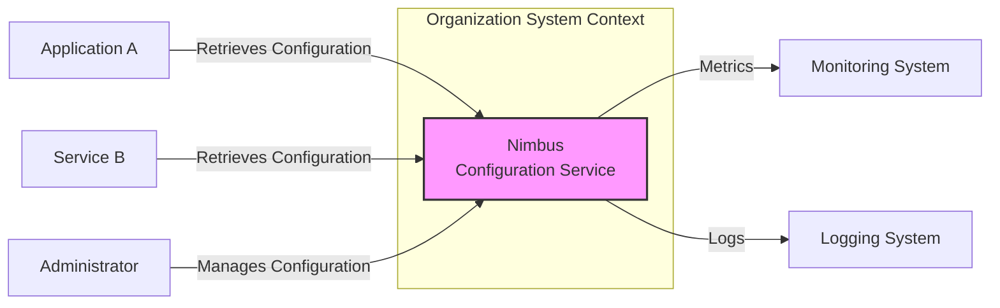
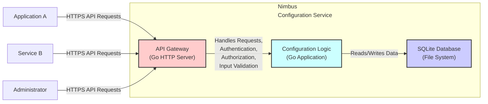
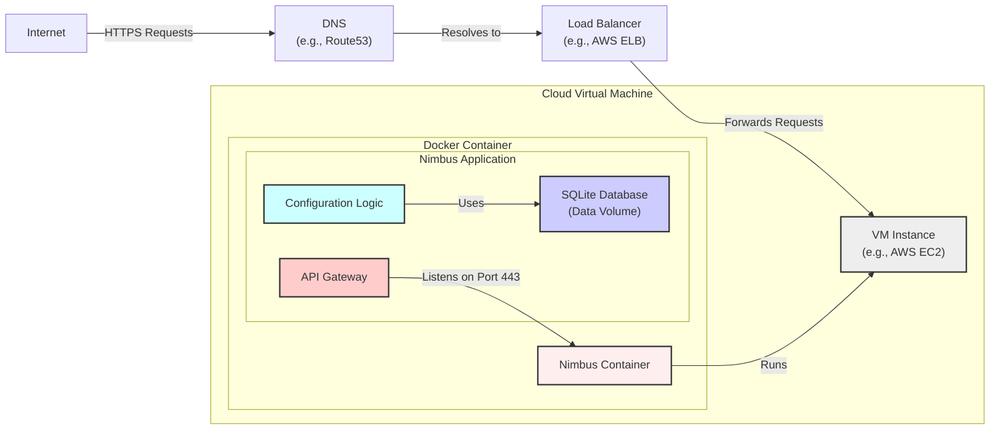

# BUSINESS POSTURE

This project, Nimbus, aims to provide a key-value store specifically designed for configuration management. In a typical business context, configuration management is crucial for:

- Centralized Configuration: Managing application settings, feature flags, and environment-specific configurations in a single, accessible location.
- Dynamic Configuration Updates: Enabling real-time updates to application behavior without requiring redeployment.
- Consistency and Reliability: Ensuring consistent configurations across different environments and application instances.
- Operational Efficiency: Simplifying configuration management tasks and reducing manual errors.

The primary business priorities for adopting Nimbus would be:

- Operational Agility: Quickly adapting application behavior to changing business needs through dynamic configuration updates.
- Reduced Downtime: Minimizing service disruptions caused by configuration errors or inconsistencies.
- Improved Scalability: Efficiently managing configurations for growing applications and infrastructure.

Key business risks associated with Nimbus include:

- Configuration Data Breach: Unauthorized access to configuration data could expose sensitive information, leading to security incidents and data breaches.
- Service Disruption due to Configuration Errors: Incorrect or inconsistent configurations could lead to application malfunctions and service outages.
- Availability and Performance Bottlenecks: If Nimbus is not highly available or performant, it can become a bottleneck for applications relying on it.
- Unauthorized Configuration Changes: Malicious or accidental modifications to configurations could disrupt services or introduce vulnerabilities.

# SECURITY POSTURE

Existing Security Controls:

- security control: HTTPS for API communication (assumed, but should be explicitly configured and enforced). Implemented in: Web server configuration.
- security control: SQLite database for data storage. Implemented in: Nimbus application code.

Accepted Risks:

- accepted risk: Reliance on SQLite for security. SQLite's access control is file-system based, which might be insufficient for multi-tenant or highly sensitive environments.
- accepted risk: Lack of built-in authentication and authorization in the base Nimbus repository (needs to be implemented by the user or extended).

Recommended Security Controls:

- security control: Implement robust authentication and authorization mechanisms for the Nimbus API to control access to configuration data and management functions.
- security control: Encrypt sensitive configuration data at rest within the SQLite database to protect confidentiality.
- security control: Implement input validation and sanitization for all API endpoints to prevent injection attacks.
- security control: Implement audit logging to track configuration changes and access attempts for security monitoring and incident response.
- security control: Integrate with a secrets management system for storing and retrieving sensitive credentials used by Nimbus or stored within Nimbus configurations.
- security control: Implement regular security scanning (SAST/DAST) and vulnerability assessments of the Nimbus codebase and deployment environment.

Security Requirements:

- Authentication:
    - requirement: The system must authenticate API requests to verify the identity of the caller.
    - requirement: Support for API Key based authentication is recommended as a starting point. More robust methods like OAuth 2.0 or mutual TLS should be considered for enhanced security.
- Authorization:
    - requirement: The system must enforce authorization policies to control access to specific configurations and management operations based on user roles or permissions.
    - requirement: Role-Based Access Control (RBAC) should be implemented to manage permissions effectively.
- Input Validation:
    - requirement: All API inputs must be validated to prevent injection attacks (e.g., SQL injection, command injection).
    - requirement: Input validation should be performed on both the client and server-side.
- Cryptography:
    - requirement: Sensitive configuration data at rest must be encrypted.
    - requirement: HTTPS must be enforced for all API communication to protect data in transit.
    - requirement: Consider using encryption for sensitive configuration values before storing them in Nimbus.

# DESIGN

## C4 CONTEXT

Context Diagram Elements:

- Element:
    - Name: Nimbus Configuration Service
    - Type: Software System
    - Description: A key-value store for managing application configurations. It provides an HTTP API to retrieve and manage configurations.
    - Responsibilities:
        - Storing and retrieving configuration data.
        - Providing an API for configuration management.
        - Ensuring data consistency and availability.
    - Security controls:
        - security control: Authentication and Authorization (to be implemented).
        - security control: HTTPS for API communication.
        - security control: Input validation on API endpoints.
        - security control: Audit logging.
        - security control: Data at rest encryption (to be implemented).

- Element:
    - Name: Application A
    - Type: Software System
    - Description: An example application that consumes configurations from Nimbus.
    - Responsibilities:
        - Retrieving application configuration from Nimbus.
        - Using the retrieved configuration to function correctly.
    - Security controls:
        - security control: Securely storing and managing Nimbus API credentials.
        - security control: Handling configuration data securely within the application.

- Element:
    - Name: Service B
    - Type: Software System
    - Description: Another example service that consumes configurations from Nimbus.
    - Responsibilities:
        - Retrieving service configuration from Nimbus.
        - Using the retrieved configuration to function correctly.
    - Security controls:
        - security control: Securely storing and managing Nimbus API credentials.
        - security control: Handling configuration data securely within the service.

- Element:
    - Name: Administrator
    - Type: Person
    - Description: A user who manages configurations within Nimbus.
    - Responsibilities:
        - Creating, updating, and deleting configurations in Nimbus.
        - Managing user access and permissions (if implemented).
    - Security controls:
        - security control: Strong password policy for administrator accounts (if applicable).
        - security control: Multi-Factor Authentication (MFA) for administrator accounts (recommended).
        - security control: Access control to Nimbus management interface.

- Element:
    - Name: Monitoring System
    - Type: Software System
    - Description: A system used to monitor the health and performance of Nimbus.
    - Responsibilities:
        - Collecting metrics from Nimbus.
        - Alerting on anomalies or performance issues.
    - Security controls:
        - security control: Secure access to Nimbus metrics endpoint.

- Element:
    - Name: Logging System
    - Type: Software System
    - Description: A system used to collect and store logs from Nimbus for auditing and troubleshooting.
    - Responsibilities:
        - Collecting logs from Nimbus.
        - Securely storing and managing logs.
    - Security controls:
        - security control: Secure log transport from Nimbus to the logging system.
        - security control: Access control to Nimbus logs.

## C4 CONTAINER

Container Diagram Elements:

- Element:
    - Name: API Gateway (Go HTTP Server)
    - Type: Container
    - Description:  A Go-based HTTP server that exposes the Nimbus API. It handles incoming API requests, routing, and potentially security functions like authentication, authorization, and input validation.
    - Responsibilities:
        - Exposing the Nimbus API over HTTPS.
        - Handling API request routing.
        - Implementing authentication and authorization (recommended).
        - Performing input validation.
        - Rate limiting and request throttling (optional).
    - Security controls:
        - security control: HTTPS enforcement.
        - security control: Authentication and Authorization implementation.
        - security control: Input validation implementation.
        - security control: Protection against common web attacks (e.g., CSRF, XSS - though less relevant for a backend API).

- Element:
    - Name: Configuration Logic (Go Application)
    - Type: Container
    - Description: The core Nimbus application logic written in Go. It handles configuration management operations, interacts with the database, and implements business logic.
    - Responsibilities:
        - Implementing configuration management logic (CRUD operations).
        - Interacting with the SQLite database for data persistence.
        - Enforcing data integrity and consistency.
    - Security controls:
        - security control: Secure coding practices to prevent vulnerabilities.
        - security control: Data sanitization before writing to the database.
        - security control: Access control to database resources (file system permissions).

- Element:
    - Name: SQLite Database (File System)
    - Type: Container
    - Description:  SQLite database used for persistent storage of configuration data. Data is stored in a file on the file system.
    - Responsibilities:
        - Persistently storing configuration data.
        - Providing data retrieval and storage capabilities to the Configuration Logic.
    - Security controls:
        - security control: File system permissions to restrict access to the database file.
        - security control: Data at rest encryption (recommended, potentially using SQLite extensions or OS-level encryption).
        - security control: Regular backups of the database file.

## DEPLOYMENT

Deployment Solution: Docker Container on Cloud VM

Deployment Diagram Elements:

- Element:
    - Name: Cloud Virtual Machine (VM Instance)
    - Type: Infrastructure
    - Description: A virtual machine instance in a cloud environment (e.g., AWS EC2, Azure VM, GCP Compute Engine). Provides the underlying compute resources for running the Nimbus Docker container.
    - Responsibilities:
        - Providing compute resources (CPU, memory, storage, network).
        - Running the Docker container runtime.
        - Operating system and infrastructure security.
    - Security controls:
        - security control: Operating system hardening and patching.
        - security control: Network security groups/firewall rules to restrict access to the VM.
        - security control: Access control to the VM instance (SSH keys, IAM roles).
        - security control: Regular security monitoring and vulnerability scanning of the VM.

- Element:
    - Name: Docker Container
    - Type: Container
    - Description: A Docker container encapsulating the Nimbus application components (API Gateway, Configuration Logic, and SQLite Database). Provides a consistent and isolated runtime environment.
    - Responsibilities:
        - Packaging and running the Nimbus application.
        - Providing resource isolation and management.
    - Security controls:
        - security control: Base image security scanning and vulnerability management.
        - security control: Container image signing and verification (optional).
        - security control: Resource limits and quotas for the container.
        - security control: Principle of least privilege for container processes.

- Element:
    - Name: API Gateway (Deployment)
    - Type: Software Component
    - Description: Instance of the API Gateway component running within the Docker container, listening on port 443 for HTTPS requests.
    - Responsibilities:
        - Handling incoming HTTPS requests.
        - Enforcing security policies (authentication, authorization, input validation).
        - Routing requests to the Configuration Logic.
    - Security controls:
        - security control: HTTPS configuration and certificate management.
        - security control: Security controls inherited from the API Gateway container.

- Element:
    - Name: Configuration Logic (Deployment)
    - Type: Software Component
    - Description: Instance of the Configuration Logic component running within the Docker container.
    - Responsibilities:
        - Implementing configuration management logic.
        - Interacting with the SQLite database.
    - Security controls:
        - security control: Security controls inherited from the Configuration Logic container.

- Element:
    - Name: SQLite Database (Data Volume)
    - Type: Data Store
    - Description: SQLite database instance, with its data files stored in a persistent Docker volume. This ensures data persistence even if the container is restarted or replaced.
    - Responsibilities:
        - Persistent storage of configuration data.
    - Security controls:
        - security control: File system permissions on the data volume.
        - security control: Data at rest encryption for the data volume (recommended).
        - security control: Regular backups of the data volume.

- Element:
    - Name: Load Balancer (e.g., AWS ELB)
    - Type: Infrastructure
    - Description: A load balancer in front of the VM instance, distributing incoming traffic and providing high availability and scalability.
    - Responsibilities:
        - Distributing traffic across multiple Nimbus instances (if scaled horizontally).
        - Providing a single entry point for Nimbus API requests.
        - SSL termination (optional, can be done at the API Gateway).
    - Security controls:
        - security control: SSL/TLS configuration for HTTPS.
        - security control: Security policies and access controls on the load balancer.
        - security control: DDoS protection (provided by cloud provider).

- Element:
    - Name: DNS (e.g., Route53)
    - Type: Infrastructure
    - Description: Domain Name System service used to map a domain name to the load balancer's IP address, making Nimbus accessible via a user-friendly URL.
    - Responsibilities:
        - Domain name resolution.
    - Security controls:
        - security control: DNSSEC (Domain Name System Security Extensions) for DNS integrity (optional).

## BUILD

```mermaid
flowchart LR
    developer["Developer"] -- "Code Changes\nPush to Git" --> github["GitHub\nRepository"]
    github -- "Webhook Trigger" --> github_actions["GitHub Actions\nCI/CD"]
    subgraph "GitHub Actions Workflow"
    code_checkout["Code Checkout"]
    build_step["Build Application\n(Go Build)"]
    test_step["Run Tests\n(Go Test)"]
    security_scan["Security Scan\n(SAST, Linters)"]
    containerize["Containerize\n(Docker Build)"]
    push_image["Push Docker Image\nto Registry"]
    end
    github_actions -- "Checkout Code" --> code_checkout
    code_checkout -- "Build" --> build_step
    build_step -- "Test" --> test_step
    test_step -- "Scan" --> security_scan
    security_scan -- "Containerize" --> containerize
    containerize -- "Push" --> push_image
    push_image -- "Artifact" --> docker_registry["Docker Registry\n(e.g., GitHub Container Registry)"]
    docker_registry -- "Deployment\nPull Image" --> deployment_env["Deployment\nEnvironment"]

    style github_actions fill:#eee,stroke:#333,stroke-width:2px
    style code_checkout fill:#fcc,stroke:#333,stroke-width:2px
    style build_step fill:#cff,stroke:#333,stroke-width:2px
    style test_step fill:#ccf,stroke:#333,stroke-width:2px
    style security_scan fill:#fcf,stroke:#333,stroke-width:2px
    style containerize fill:#efe,stroke:#333,stroke-width:2px
    style push_image fill:#eef,stroke:#333,stroke-width:2px
```

Build Process Description:

1. Developer commits code changes and pushes them to the GitHub repository.
2. A webhook in GitHub triggers a GitHub Actions workflow defined in the repository.
3. The GitHub Actions workflow starts, and the 'Code Checkout' step retrieves the latest code.
4. The 'Build Application' step compiles the Go code using `go build`.
5. The 'Run Tests' step executes unit and integration tests using `go test`.
6. The 'Security Scan' step performs static application security testing (SAST) and code linting to identify potential vulnerabilities and code quality issues. Tools like `govulncheck`, `staticcheck`, `golangci-lint` can be used.
7. The 'Containerize' step builds a Docker image of the Nimbus application using `docker build`.
8. The 'Push Docker Image to Registry' step pushes the newly built Docker image to a Docker registry, such as GitHub Container Registry or Docker Hub.
9. The deployment environment pulls the Docker image from the registry to deploy Nimbus.

Build Security Controls:

- security control: Automated build process using CI/CD (GitHub Actions).
- security control: Source code version control (Git/GitHub).
- security control: Static Application Security Testing (SAST) integrated into the build pipeline.
- security control: Code linting and style checks to improve code quality and security.
- security control: Dependency scanning to identify vulnerable dependencies (using `govulncheck` or similar).
- security control: Container image scanning for vulnerabilities (using tools integrated with Docker Registry or dedicated scanners).
- security control: Secure storage of build artifacts (Docker Registry with access control).
- security control: Code signing and image signing (optional, for enhanced supply chain security).
- security control: Access control to CI/CD pipeline and build infrastructure.

# RISK ASSESSMENT

Critical Business Processes:

- Application Configuration Management: The core business process is managing application configurations reliably and securely. Disruptions or breaches in this process can directly impact application availability and security.
- Dynamic Configuration Updates: The ability to dynamically update configurations is a key feature. Failure to deliver updates or incorrect updates can lead to service disruptions.

Data Sensitivity:

- Configuration Data: The data stored in Nimbus is configuration data, which can vary in sensitivity. It may include:
    - Non-sensitive data: Feature flags, UI settings.
    - Sensitive data: API keys, database credentials, encryption keys, connection strings, and other secrets.

The sensitivity of the configuration data is HIGH if it includes secrets or credentials that could be used to compromise other systems or data. Even non-sensitive configuration data can impact application functionality if compromised or manipulated. Therefore, all configuration data should be treated with a degree of sensitivity, and appropriate security controls should be applied.

# QUESTIONS & ASSUMPTIONS

Questions:

- What type of authentication and authorization mechanisms are required for Nimbus API access? (e.g., API Keys, OAuth 2.0, RBAC).
- What is the sensitivity level of the configuration data that will be stored in Nimbus? Are there any specific compliance requirements (e.g., GDPR, HIPAA, PCI DSS)?
- What are the availability and performance requirements for Nimbus? (e.g., uptime SLAs, request latency).
- What is the expected scale of Nimbus usage? (Number of applications, configurations, requests per second).
- What is the preferred deployment environment? (Cloud provider, on-premises, Kubernetes, VMs).
- Are there any existing monitoring and logging systems that Nimbus needs to integrate with?
- Is data at rest encryption required for compliance or security reasons?

Assumptions:

- BUSINESS POSTURE:
    - The primary business goal is to improve operational agility and reduce downtime through centralized and dynamic configuration management.
    - Security and reliability of the configuration service are critical business requirements.
- SECURITY POSTURE:
    - Currently, there are minimal security controls implemented in the base Nimbus repository.
    - Security is a high priority and needs to be addressed proactively.
    - API Key based authentication is a reasonable starting point, but more robust methods might be needed in the future.
    - Data at rest encryption is recommended for sensitive configuration data.
- DESIGN:
    - A Docker containerized deployment on a cloud VM is a suitable and common deployment architecture.
    - GitHub Actions is used for CI/CD and build automation.
    - SQLite is used as the database, but its limitations regarding scalability and advanced security features are acknowledged.
    - HTTPS is used for all API communication.