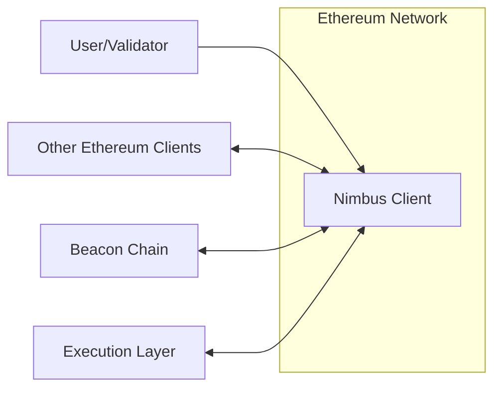
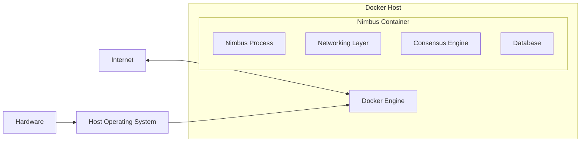

Okay, let's create a design document for the Nimbus project, focusing on aspects relevant for threat modeling.

# BUSINESS POSTURE

Nimbus is a research project focused on implementing a new, minimal Ethereum consensus client.  The primary business goals appear to be:

*   Research and Development:  Advance the understanding and implementation of Ethereum consensus mechanisms.
*   Performance and Efficiency: Create a client that is lightweight and resource-efficient, suitable for resource-constrained environments (e.g., embedded systems, mobile devices).
*   Security and Stability:  Ensure the client is robust, secure, and reliable, as it forms a critical part of the Ethereum network.
*   Community Contribution: Provide a valuable open-source contribution to the Ethereum ecosystem.
*   Innovation: Explore and implement cutting-edge consensus algorithms and optimizations.

Given these goals, the most important business risks are:

*   Critical Software Vulnerabilities:  Bugs or security flaws in the client could lead to consensus failures, chain splits, or even exploitation of the network, potentially causing significant financial losses and reputational damage to the Ethereum ecosystem.
*   Performance Bottlenecks:  If the client fails to meet its performance goals, it may not be viable for its intended use cases, limiting its adoption and impact.
*   Incorrect Implementation of Specifications: Deviations from the official Ethereum consensus specifications could lead to incompatibility with the network and potential chain splits.
*   Lack of Maintainability:  If the codebase is poorly designed or documented, it will be difficult to maintain, update, and secure in the long run.
*   Supply Chain Attacks: Compromise of dependencies or build tools could introduce vulnerabilities into the client.

# SECURITY POSTURE

Based on the provided GitHub repository, here's an assessment of the security posture:

*   security control: Secure Coding Practices: The project is written in Nim, a language that emphasizes memory safety and performance.  This choice inherently mitigates some common vulnerability classes (e.g., buffer overflows).  The codebase also appears to follow good coding practices, with modular design and extensive use of assertions. (Evident throughout the codebase).
*   security control: Testing: The project includes a comprehensive test suite, including unit tests, integration tests, and fuzzing.  This helps ensure the correctness and robustness of the code. (Located in the `/tests` directory).
*   security control: Specification Compliance: The project aims to adhere strictly to the Ethereum consensus specifications.  This is crucial for interoperability and security. (Referenced throughout the documentation and code).
*   security control: Dependency Management: The project uses Nimble, Nim's package manager, to manage dependencies.  This helps ensure that dependencies are tracked and updated. (Defined in `.nimble` files).
*   security control: Continuous Integration: The project uses GitHub Actions for continuous integration. This automates builds, tests, and other checks on every code change. (Defined in `.github/workflows`).
*   accepted risk: Limited External Audits: While the project has undergone some internal reviews, it's unclear if it has received extensive external security audits. This is a common risk for research projects, but it should be addressed as the project matures.
*   accepted risk: Reliance on Third-Party Libraries: Like all software, Nimbus relies on external libraries.  While Nimble helps manage these, vulnerabilities in dependencies could still impact the client.
*   accepted risk: Evolving Threat Landscape: The Ethereum ecosystem and the broader cybersecurity landscape are constantly evolving.  New attacks and vulnerabilities are discovered regularly.  The project must continuously adapt to these changes.

Recommended Security Controls (High Priority):

*   Formal Security Audits: Conduct regular, independent security audits by reputable firms specializing in blockchain security.
*   Bug Bounty Program: Implement a bug bounty program to incentivize external security researchers to find and report vulnerabilities.
*   Threat Modeling: Perform regular threat modeling exercises to identify and mitigate potential security risks.
*   Supply Chain Security Measures: Implement robust supply chain security measures, such as software bill of materials (SBOM) generation and dependency vulnerability scanning.
*   Fuzzing Enhancements: Expand the fuzzing efforts to cover more code paths and edge cases.

Security Requirements:

*   Authentication: Not directly applicable to the consensus client itself, as it interacts with the network via defined protocols. However, any management interfaces or APIs should implement strong authentication.
*   Authorization: The client should enforce the rules of the Ethereum consensus protocol, ensuring that only valid blocks and transactions are processed. Any administrative functions should have appropriate role-based access control.
*   Input Validation: The client must rigorously validate all inputs, including network messages, block data, and transaction data, to prevent malformed data from causing errors or vulnerabilities. This is critical for preventing denial-of-service attacks and other exploits.
*   Cryptography: The client must correctly implement all required cryptographic algorithms, including hashing, digital signatures, and potentially zero-knowledge proofs (depending on future Ethereum upgrades).  It should use well-vetted cryptographic libraries and follow best practices for key management.

# DESIGN

## C4 CONTEXT



Element Descriptions:

*   1.  Name: User/Validator
    *   Type: Person
    *   Description: An individual or entity running the Nimbus client to participate in Ethereum consensus.
    *   Responsibilities: Running the client, monitoring its status, and potentially managing validator keys.
    *   Security controls: Secure key management practices, strong passwords (if applicable), monitoring of client logs.

*   2.  Name: Nimbus Client
    *   Type: Software System
    *   Description: The Nimbus Ethereum consensus client.
    *   Responsibilities: Implementing the Ethereum consensus protocol, validating blocks and transactions, communicating with other clients, and interacting with the Beacon Chain and Execution Layer.
    *   Security controls: Secure coding practices, testing, specification compliance, dependency management, continuous integration.

*   3.  Name: Other Ethereum Clients
    *   Type: Software System
    *   Description: Other implementations of the Ethereum consensus client (e.g., Lighthouse, Prysm, Teku).
    *   Responsibilities: Implementing the Ethereum consensus protocol and communicating with other clients.
    *   Security controls: Dependent on the specific client implementation.

*   4.  Name: Beacon Chain
    *   Type: Software System
    *   Description: The core of the Ethereum proof-of-stake system.
    *   Responsibilities: Managing validators, proposing and finalizing blocks, and coordinating the consensus process.
    *   Security controls: Distributed consensus mechanisms, cryptographic protocols, extensive testing, and auditing.

*   5.  Name: Execution Layer
    *   Type: Software System
    *   Description: The layer of Ethereum that handles transaction execution and smart contract interactions.
    *   Responsibilities: Processing transactions, executing smart contracts, and maintaining the Ethereum state.
    *   Security controls: Secure coding practices, gas limits, formal verification (where applicable), and extensive testing.

## C4 CONTAINER

```mermaid
graph LR
    subgraph Nimbus Client
        Networking[Networking Layer]
        ConsensusEngine[Consensus Engine]
        Database[Database]
        API[API (Optional)]
        Networking <--> ConsensusEngine
        ConsensusEngine <--> Database
        ConsensusEngine <--> API
    end
    OtherClients[Other Ethereum Clients] <--> Networking
    BeaconChain[Beacon Chain] <--> Networking
    ExecutionLayer[Execution Layer] <--> Networking

```

Element Descriptions:

*   1.  Name: Networking Layer
    *   Type: Container
    *   Description: Handles communication with other Ethereum clients and the Beacon Chain/Execution Layer.
    *   Responsibilities: Establishing and maintaining peer-to-peer connections, sending and receiving messages, and handling network protocols.
    *   Security controls: Input validation, rate limiting, protection against denial-of-service attacks, secure communication protocols (e.g., TLS).

*   2.  Name: Consensus Engine
    *   Type: Container
    *   Description: Implements the core Ethereum consensus logic.
    *   Responsibilities: Validating blocks and attestations, participating in the fork choice rule, and managing the validator set.
    *   Security controls: Strict adherence to the Ethereum consensus specification, extensive testing (including fuzzing), robust error handling.

*   3.  Name: Database
    *   Type: Container
    *   Description: Stores blockchain data, including blocks, attestations, and validator information.
    *   Responsibilities: Providing efficient access to blockchain data, ensuring data integrity and persistence.
    *   Security controls: Data validation, access controls, protection against data corruption, potentially encryption at rest.

*   4.  Name: API (Optional)
    *   Type: Container
    *   Description: Provides an interface for external applications to interact with the client.
    *   Responsibilities: Exposing client functionality, handling requests, and returning responses.
    *   Security controls: Authentication, authorization, input validation, rate limiting, protection against common web vulnerabilities.

## DEPLOYMENT

Nimbus can be deployed in various ways, including:

1.  Standalone Node: Running Nimbus as a standalone process on a dedicated server or virtual machine.
2.  Docker Container: Running Nimbus within a Docker container, providing isolation and portability.
3.  Cloud-Based Deployment: Deploying Nimbus on cloud platforms like AWS, Google Cloud, or Azure, leveraging their infrastructure and services.
4.  Embedded Systems: Deploying Nimbus on resource-constrained devices, such as Raspberry Pi or other embedded systems.

We'll describe the Docker Container deployment in detail:



Element Descriptions:

*   1.  Name: Nimbus Process
    *   Type: Process
    *   Description: The main Nimbus client process running inside the Docker container.
    *   Responsibilities: Executing the Nimbus code and managing all client operations.
    *   Security controls: Inherits security controls from the Nimbus client and Docker container.

*   2.  Name: Networking Layer, Consensus Engine, Database
    *   Type: Components
    *   Description: Internal components of the Nimbus client, as described in the Container diagram.
    *   Responsibilities: As described in the Container diagram.
    *   Security controls: As described in the Container diagram.

*   3.  Name: Docker Engine
    *   Type: Software
    *   Description: The Docker runtime environment that manages containers.
    *   Responsibilities: Creating, running, and managing Docker containers.
    *   Security controls: Container isolation, image signing, resource limits, security profiles (e.g., AppArmor, SELinux).

*   4.  Name: Host Operating System
    *   Type: Operating System
    *   Description: The operating system of the host machine running Docker.
    *   Responsibilities: Providing the underlying infrastructure for Docker.
    *   Security controls: Regular security updates, firewall, intrusion detection/prevention systems.

*   5.  Name: Hardware
    *   Type: Hardware
    *   Description: The physical server or virtual machine hosting the Docker environment.
    *   Security controls: Physical security measures, hardware security modules (if applicable).

*   6.  Name: Internet
    *   Type: Network
    *   Description: The public internet.
    *   Responsibilities: Providing connectivity to the Ethereum network.
    *   Security controls: Network firewalls, intrusion detection/prevention systems.

## BUILD

The Nimbus build process leverages Nim's built-in tooling and GitHub Actions for continuous integration.

```mermaid
graph LR
    Developer[Developer] --> GitRepository[Git Repository (GitHub)]
    GitRepository --> GitHubActions[GitHub Actions]
    GitHubActions --> NimCompiler[Nim Compiler]
    NimCompiler --> Tests[Tests (Unit, Integration, Fuzzing)]
    Tests --> BuildArtifacts[Build Artifacts (Nimbus Executable)]
    BuildArtifacts --> DockerImage[Docker Image (Optional)]
    subgraph SupplyChain[Supply Chain]
        Nimble[Nimble (Package Manager)] --> Dependencies[Dependencies]
    end
    NimCompiler --> Dependencies

```

Build Process Description:

1.  Developer commits code to the GitHub repository.
2.  GitHub Actions triggers a workflow on code push or pull request.
3.  The workflow sets up the build environment (Nim compiler, dependencies).
4.  Nimble (Nim's package manager) resolves and downloads project dependencies.
5.  The Nim compiler compiles the Nimbus source code.
6.  The workflow runs various tests (unit tests, integration tests, fuzzing).
7.  If all tests pass, the workflow creates build artifacts (e.g., the Nimbus executable).
8.  Optionally, a Docker image can be built and pushed to a container registry.

Security Controls in Build Process:

*   security control: Dependency Management: Nimble tracks and manages dependencies, helping to ensure that known-vulnerable versions are not used.
*   security control: Automated Testing: GitHub Actions automates the execution of tests on every code change, catching bugs and regressions early.
*   security control: Continuous Integration: GitHub Actions provides a consistent and reproducible build environment.
*   security control: Code Review: Pull requests on GitHub facilitate code review, allowing other developers to scrutinize changes before they are merged.
*   security control: Static Analysis: While not explicitly mentioned, the Nim compiler performs some static analysis, detecting potential errors and code quality issues.

# RISK ASSESSMENT

*   Critical Business Processes:
    *   Maintaining consensus with the Ethereum network.
    *   Accurately processing and validating blocks and transactions.
    *   Providing a reliable and performant client for users and validators.

*   Data to Protect:
    *   Blockchain Data: The entire history of the Ethereum blockchain, including blocks, transactions, and state data. (Sensitivity: Public, but integrity is critical)
    *   Validator Keys (if managed by the client): Private keys used for signing attestations and blocks. (Sensitivity: Extremely High - Loss or compromise could lead to slashing and financial loss)
    *   Client Configuration Data: Configuration files containing settings and parameters for the client. (Sensitivity: Medium - Incorrect configuration could impact performance or security)
    *   Logs: Client logs containing information about its operation. (Sensitivity: Low to Medium - Could reveal sensitive information if not properly handled)

# QUESTIONS & ASSUMPTIONS

*   Questions:
    *   What are the specific performance targets for Nimbus (e.g., block processing time, memory usage)?
    *   What are the plans for long-term maintenance and support of Nimbus?
    *   What are the specific deployment scenarios envisioned for Nimbus (e.g., cloud providers, embedded systems)?
    *   Are there any plans to integrate with specific hardware security modules (HSMs)?
    *   What is the process for handling security vulnerabilities discovered in Nimbus or its dependencies?
    *   Are there plans for formal verification of critical components of the client?

*   Assumptions:
    *   BUSINESS POSTURE: The primary goal is to create a research-oriented, high-performance, and secure Ethereum consensus client.
    *   SECURITY POSTURE: The project follows secure coding practices and has a strong emphasis on testing.
    *   DESIGN: The client will be deployed primarily as a standalone process or within a Docker container. The architecture will be modular and follow the general structure outlined in the C4 diagrams. The build process will rely on Nim's tooling and GitHub Actions.