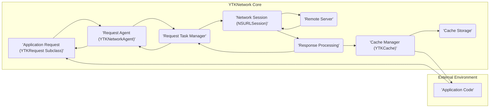
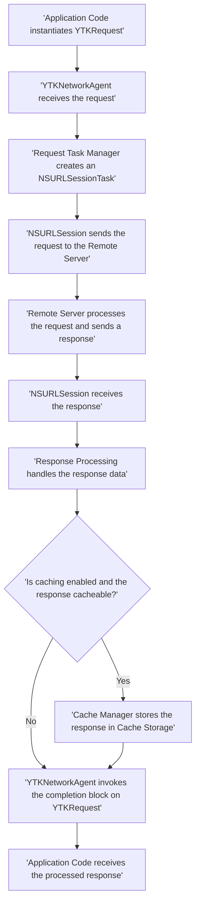

# Project Design Document: YTKNetwork

**Version:** 1.1
**Date:** October 26, 2023
**Author:** AI Software Architect

## 1. Introduction

This document provides an enhanced design overview of the `YTKNetwork` library, an asynchronous network request library for iOS, macOS, watchOS, and tvOS. This revised document aims to provide even greater clarity regarding the architecture, components, and data flow within the library, specifically to facilitate more effective and detailed threat modeling activities.

## 2. Project Goals

The primary goals of `YTKNetwork` are to:

- Offer a straightforward and intuitive API for initiating network requests.
- Support a comprehensive range of HTTP methods (GET, POST, PUT, DELETE, PATCH, etc.).
- Manage the serialization of request data and deserialization of response data.
- Implement flexible and efficient caching mechanisms to improve performance and reduce network load.
- Facilitate the execution of batch requests and the creation of request chains for complex workflows.
- Provide robust support for file uploads and downloads, including progress monitoring.
- Offer reliable network reachability monitoring to adapt application behavior based on network status.
- Maintain a design that is easily extensible, testable, and maintainable by developers.

## 3. System Architecture

The `YTKNetwork` library employs a modular, layered architecture to promote separation of concerns and enhance maintainability.

**Components:**

- **Application Request (`YTKRequest` Subclass):** Represents a specific network request defined by the application developer. It encapsulates request details and response handling logic.
- **Request Agent (`YTKNetworkAgent`):**  The central orchestrator for managing the lifecycle of network requests. It receives requests, delegates task creation, and handles completion.
- **Request Task Manager:** Responsible for managing the underlying `NSURLSessionTask` instances, abstracting the direct interaction with `NSURLSession`.
- **Network Session (`NSURLSession`):** Apple's foundational framework for performing network operations, providing the core networking capabilities.
- **Remote Server:** The external server that the application communicates with to retrieve or send data.
- **Response Processing:** Handles the processing of raw data received from the server, including error analysis, status code validation, and data deserialization.
- **Cache Manager (`YTKCache`):**  Manages the caching of network responses, implementing policies for storage, retrieval, and invalidation.
- **Cache Storage:** The persistent or in-memory storage mechanism used by the `Cache Manager` to store cached responses.
- **Application Code:** The portion of the application that utilizes the `YTKNetwork` library to initiate and handle network interactions.

## 4. Component Details

### 4.1. Application Request (`YTKRequest` Subclass)

- **Functionality:** Defines the specifics of a network request, including the target API endpoint, HTTP method, request parameters (both in the URL and body), custom headers, and how the response should be interpreted.
- **Responsibilities:**
    - Encapsulating all request-specific information in a reusable and organized manner.
    - Providing methods to construct the complete request URL and request body.
    - Defining the expected response type and providing mechanisms for response parsing.
    - Implementing optional lifecycle hooks that allow for custom logic at different stages of the request (e.g., before starting, after completion).
- **Security Considerations:**
    - **Risk of Hardcoded Secrets:** Potential for developers to inadvertently hardcode sensitive information like API keys or authentication tokens within the request definition.
    - **URL Encoding Vulnerabilities:** Improper URL encoding of parameters could lead to injection vulnerabilities on the server-side.
    - **Insufficient Input Validation:** Lack of validation for request parameters could allow malicious data to be sent to the server. For example, validating data types, lengths, and allowed characters.

### 4.2. Request Agent (`YTKNetworkAgent`)

- **Functionality:** Manages the execution flow of `YTKRequest` objects. It acts as a central point for starting, cancelling, and receiving completion notifications for requests.
- **Responsibilities:**
    - Maintaining a queue of active network requests, potentially with mechanisms for prioritization or concurrency control.
    - Interacting with the `Request Task Manager` to create and manage the underlying `NSURLSessionTask` instances.
    - Invoking the appropriate success or failure completion blocks defined in the `YTKRequest` upon the request's completion or failure.
- **Security Considerations:**
    - **Denial of Service (DoS) Potential:** If the request queue is not properly managed or if there are no limits on concurrent requests, it could be susceptible to DoS attacks.
    - **Race Conditions:** Improper handling of concurrent requests could lead to race conditions, especially when dealing with shared resources or state.

### 4.3. Request Task Manager

- **Functionality:**  Provides an abstraction layer over `NSURLSession`, simplifying the management of network tasks.
- **Responsibilities:**
    - Creating `NSURLSessionTask` instances (data tasks, upload tasks, download tasks) based on the configuration provided by the `YTKRequest`.
    - Managing the lifecycle of these tasks, including starting, pausing, resuming, and cancelling.
    - Handling the delegation callbacks from `NSURLSession` related to task progress, data reception, and completion.
- **Security Considerations:**
    - **Reliance on `NSURLSession` Security:**  `YTKNetwork`'s security is inherently tied to the security of the underlying `NSURLSession` framework. Any vulnerabilities in `NSURLSession` could impact `YTKNetwork`.
    - **Insecure `NSURLSession` Configuration:**  Incorrect configuration of `NSURLSession`, such as disabling security features or using insecure TLS settings, can introduce vulnerabilities.

### 4.4. Network Session (`NSURLSession`)

- **Functionality:** Apple's comprehensive framework for handling network-related tasks.
- **Responsibilities:**
    - Establishing and managing network connections.
    - Sending HTTP requests and receiving responses according to specified protocols (HTTP, HTTPS).
    - Handling lower-level networking details, including protocol negotiation, connection pooling, and cookie management.
    - Providing support for authentication and authorization.
- **Security Considerations:**
    - **Importance of HTTPS:**  Crucial for ensuring data confidentiality and integrity during transmission. Failure to use HTTPS exposes data to eavesdropping and tampering.
    - **TLS/SSL Configuration Weaknesses:** Misconfigured TLS/SSL settings can make connections vulnerable to attacks. Proper certificate validation is essential.
    - **Man-in-the-Middle (MITM) Attacks:** Without proper HTTPS implementation and certificate validation, the application is susceptible to MITM attacks where attackers can intercept and modify communication.

### 4.5. Response Processing

- **Functionality:**  Takes the raw data received from the server and prepares it for use by the application.
- **Responsibilities:**
    - Inspecting the HTTP status code to determine the success or failure of the request.
    - Handling various types of network errors and providing informative error messages.
    - Deserializing the response data from formats like JSON, XML, or other defined formats into usable data structures.
    - Invoking the appropriate success or failure blocks on the originating `YTKRequest` with the processed data or error information.
- **Security Considerations:**
    - **Insecure Deserialization:** Vulnerabilities can arise if response data is deserialized without proper validation, potentially allowing for the execution of arbitrary code.
    - **Exposure of Sensitive Information in Errors:**  Care must be taken to avoid exposing sensitive details in error messages that could be intercepted by attackers.
    - **Lack of Response Data Validation:**  Failing to validate the structure and content of the response data could lead to unexpected behavior or vulnerabilities if the server is compromised or returns malicious data.

### 4.6. Cache Manager (`YTKCache`)

- **Functionality:**  Manages the caching of network responses to improve performance and reduce redundant network requests.
- **Responsibilities:**
    - Determining whether a response should be cached based on factors like HTTP headers (Cache-Control, Expires), custom caching policies, and the request type.
    - Storing cacheable responses in the designated `Cache Storage`.
    - Retrieving cached responses when a subsequent request is made for the same resource, avoiding a network call.
    - Implementing strategies for cache invalidation to ensure data freshness.
- **Security Considerations:**
    - **Storage of Sensitive Data in Cache:**  If sensitive information is cached, it becomes a target for attackers. Proper encryption of cached data is crucial.
    - **Insecure Cache Storage:**  If the `Cache Storage` is not properly secured (e.g., file permissions on disk), unauthorized access to cached data is possible.
    - **Cache Poisoning Attacks:**  Attackers might attempt to inject malicious data into the cache, which would then be served to users as legitimate content. Proper validation of cached data can mitigate this.

### 4.7. Cache Storage

- **Functionality:** The underlying mechanism used to store cached network responses.
- **Responsibilities:**
    - Persistently storing cached data (e.g., on disk using `FileManager`, in memory using `NSCache`, or using a custom storage solution).
    - Efficiently retrieving cached data when requested by the `Cache Manager`.
    - Managing the size and lifecycle of the cache, potentially implementing eviction policies to prevent excessive storage usage.
- **Security Considerations:**
    - **Data Encryption at Rest:**  Sensitive data stored in the cache should be encrypted to protect its confidentiality.
    - **File System Permissions:** For disk-based caches, appropriate file system permissions must be set to prevent unauthorized access.
    - **Secure Deletion:** When cached data is no longer needed, it should be securely deleted to prevent recovery by malicious actors.

## 5. Data Flow

The typical sequence of operations for a network request initiated using `YTKNetwork` is as follows:

**Detailed Flow:**

1. The application code creates an instance of a specific `YTKRequest` subclass, defining all the necessary details for the network operation.
2. The application calls a method on the `YTKNetworkAgent` (e.g., `startWithCompletionBlockWithSuccess:failure:`) to initiate the request execution.
3. The `Request Agent` receives the request and delegates the creation of the underlying network task to the `Request Task Manager`.
4. The `Request Task Manager` creates an appropriate `NSURLSessionTask` (e.g., `URLSessionDataTask`, `URLSessionUploadTask`, `URLSessionDownloadTask`) based on the request configuration.
5. The `Network Session` (via `NSURLSession`) sends the formulated request to the designated remote server.
6. The remote server processes the incoming request and generates a response, which is then sent back to the client.
7. The `Network Session` receives the response from the server.
8. The `Response Processing` component takes the raw response data and performs necessary operations like status code checking, error handling, and data deserialization.
9. The `Cache Manager` evaluates whether caching is enabled for this particular request and if the response meets the criteria for being cached.
10. If caching is enabled and the response is cacheable, the `Cache Manager` stores the response data in the configured `Cache Storage`.
11. The `Request Agent` then invokes the success or failure completion block defined in the original `YTKRequest` object, passing the processed response data or an error object.
12. Finally, the application code receives the processed response data or an error indication, allowing it to proceed with its logic.

## 6. Security Considerations

Building upon the component details and data flow, here's a more comprehensive list of security considerations for `YTKNetwork`:

- **Enforce Transport Layer Security (TLS):** Mandate the use of HTTPS for all network communication to protect data in transit from eavesdropping and manipulation. Implement proper certificate pinning for enhanced security against MITM attacks.
- **Implement Data Encryption at Rest:** If sensitive data is stored in the cache, ensure it is encrypted using strong encryption algorithms.
- **Perform Robust Input Validation:** Validate both request parameters being sent to the server and response data received from the server to prevent injection attacks (e.g., SQL injection, cross-site scripting) and other vulnerabilities. Sanitize user-provided input before including it in requests.
- **Utilize Secure Deserialization Practices:** Employ secure deserialization techniques to prevent vulnerabilities arising from processing untrusted data. Avoid using insecure deserialization methods that could allow for remote code execution.
- **Securely Manage API Keys and Tokens:** Implement secure methods for storing and handling API keys, authentication tokens, and other secrets. Avoid hardcoding them in the application code. Consider using the Keychain for secure storage.
- **Implement Rate Limiting and Throttling:** Implement mechanisms to prevent abuse and denial-of-service attacks by limiting the number of requests from a single source within a specific timeframe.
- **Handle Errors Securely:** Avoid exposing sensitive information in error messages or logs. Provide generic error messages to the user while logging detailed error information securely for debugging purposes.
- **Protect Against Cache Poisoning:** Implement mechanisms to verify the integrity and authenticity of cached data to prevent attackers from injecting malicious content into the cache.
- **Mitigate Man-in-the-Middle (MITM) Attacks:** Enforce strict certificate validation and consider implementing certificate pinning to prevent MITM attacks.
- **Ensure Data Integrity for Downloads:** When downloading files, especially from untrusted sources, verify the integrity of the downloaded data using checksums or digital signatures.
- **Regularly Update Dependencies:** Keep `YTKNetwork` and its dependencies (including system libraries) up-to-date to patch known security vulnerabilities.
- **Follow Secure Coding Practices:** Adhere to secure coding principles throughout the development process to minimize the introduction of vulnerabilities.

## 7. Deployment Considerations

The security of `YTKNetwork` in a deployed application is influenced by several factors:

- **Overall Application Security:** The security posture of the application using `YTKNetwork` is paramount. Vulnerabilities in other parts of the application can be exploited to compromise network communication.
- **Third-Party Library Security:** The security of any third-party libraries or frameworks used by `YTKNetwork` should be carefully considered.
- **Configuration Management:** Proper configuration of `YTKNetwork`, including enabling HTTPS, setting appropriate caching policies, and configuring timeouts, is crucial for security.
- **Platform Security:** The underlying security features of the operating system (iOS, macOS, etc.) play a role in the overall security of network operations.
- **Network Environment:** The security of the network the application is running on can also impact the security of network communication.

## 8. Future Considerations

- **Enhanced Security Documentation and Best Practices:** Provide more detailed documentation and guidelines on security best practices for developers using `YTKNetwork`.
- **Built-in Security Features:** Explore the feasibility of adding built-in security features, such as automatic HTTPS enforcement, response validation helpers, and secure storage options for cached data.
- **Regular Security Audits and Penetration Testing:** Conduct periodic security audits and penetration testing to proactively identify and address potential vulnerabilities in the library.
- **Support for Certificate Pinning:**  Provide a more streamlined and configurable way to implement certificate pinning within the library.
- **Integration with Security Scanning Tools:** Ensure compatibility and integration with common security scanning tools to facilitate automated vulnerability detection.

This improved design document provides a more in-depth understanding of the `YTKNetwork` library's architecture, components, and data flow, with a stronger emphasis on security considerations. This detailed information will be invaluable for conducting thorough threat modeling exercises.