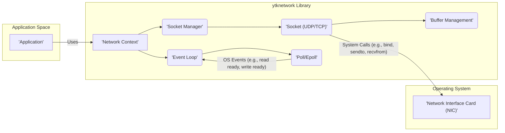
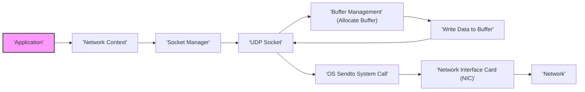
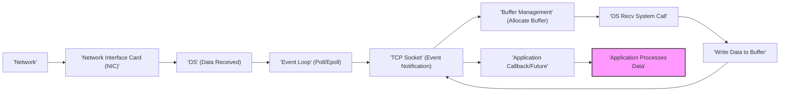

# Project Design Document: ytknetwork

**Version:** 1.1
**Date:** October 26, 2023
**Author:** AI Software Architect

## 1. Introduction

This document provides a detailed design of the `ytknetwork` project, a high-performance networking library written in Rust. This design will serve as the foundation for subsequent threat modeling activities. The document outlines the system's architecture, components, data flow, and key security considerations. This revision includes more detailed explanations and clarifies certain aspects for better understanding during threat modeling.

## 2. Goals and Objectives

*   Provide a low-level, high-performance networking library that offers fine-grained control over network operations.
*   Offer flexibility and customization for various networking use cases, including but not limited to game servers, high-frequency trading platforms, and custom network protocols.
*   Support both UDP (connectionless) and TCP (connection-oriented) protocols with equal emphasis on performance and efficiency.
*   Enable asynchronous I/O operations using an event-driven model to maximize throughput and minimize latency.
*   Minimize memory allocations and copying through techniques like zero-copy (where feasible) and efficient buffer management for optimal performance under heavy load.
*   Provide a foundational building block for constructing more complex, application-specific network abstractions and protocols.

## 3. High-Level Architecture

The `ytknetwork` library is designed as a modular and extensible system, allowing developers to interact with network resources at a low level. The core components are designed to work together to facilitate efficient and robust network communication.

*   **Application:** The user application that integrates and utilizes the `ytknetwork` library to perform network operations. This application has direct control over how the library is used and configured.
*   **Network Context:** The central orchestrator and entry point for interacting with the `ytknetwork` library. It manages the lifecycle of the event loop and socket manager, providing a consistent interface for the application.
*   **Socket Manager:** Responsible for the creation, management, and eventual closing of network sockets. It abstracts the underlying OS socket creation process and provides a unified interface for managing both UDP and TCP sockets.
*   **Socket (UDP/TCP):** Represents a network endpoint for communication. This component encapsulates the underlying OS socket file descriptor and provides methods for sending and receiving data, as well as managing socket-specific options. The behavior and implementation differ significantly between UDP and TCP sockets within this component.
*   **Event Loop:** The core of the asynchronous I/O model. It continuously monitors registered socket file descriptors for readiness events (read, write, error) using the operating system's polling mechanism. Upon detecting an event, it dispatches notifications to the associated sockets or callbacks.
*   **Poll/Epoll:** The operating system-specific mechanism used by the event loop to efficiently monitor multiple file descriptors. `epoll` is typically used on Linux systems, while `poll` or similar mechanisms are used on other platforms. This component is crucial for the library's performance.
*   **Buffer Management:**  Manages the allocation, deallocation, and potential reuse of memory buffers used for sending and receiving network data. This component is critical for achieving zero-copy semantics and minimizing memory overhead. It might employ techniques like buffer pools or slab allocation.
*   **Network Interface Card (NIC):** The physical hardware component responsible for the physical transmission and reception of network packets. The `ytknetwork` library interacts with the NIC indirectly through operating system calls.

## 4. Detailed Design

### 4.1. Core Components

*   **`network_context` Module:**
    *   Provides the primary API entry point for applications to initialize and interact with the library.
    *   Manages the global state, including the single instance of the `EventLoop` and the `SocketManager`.
    *   Offers methods for creating and configuring network contexts, allowing customization of event loop behavior or resource limits.
    *   Responsible for the initialization and graceful shutdown of the library, ensuring proper cleanup of resources.
*   **`socket` Module:**
    *   Contains distinct implementations for UDP and TCP sockets, encapsulating protocol-specific logic.
    *   Abstracts the underlying OS socket API (e.g., `socket()`, `bind()`, `connect()`, `sendto()`, `recvfrom()`, `listen()`, `accept()`).
    *   Handles socket creation, binding to local addresses, listening for incoming connections (TCP), connecting to remote addresses (TCP), sending and receiving data.
    *   Manages socket options (e.g., `SO_REUSEADDR`, `TCP_NODELAY`) and configurations, allowing applications to fine-tune socket behavior.
*   **`event_loop` Module:**
    *   Implements the asynchronous event processing mechanism, typically using a reactor pattern.
    *   Uses `poll` or `epoll` (dynamically selected based on the operating system) to monitor registered socket file descriptors for I/O events.
    *   Dispatches events to registered callbacks or wakes up associated futures/promises, enabling non-blocking I/O.
    *   Provides methods for registering and unregistering sockets for specific event notifications (read readiness, write readiness, errors).
    *   Manages the event loop's lifecycle, including starting and stopping the event processing loop.
*   **`buffer` Module:**
    *   Manages memory buffers used for network I/O, aiming for efficiency and potential zero-copy operations.
    *   Implements strategies for efficient buffer allocation (e.g., using a buffer pool to reduce allocation overhead) and deallocation.
    *   May provide mechanisms for obtaining direct access to underlying buffer memory for zero-copy sending and receiving, where supported by the OS and hardware.
    *   Might include features for managing buffer metadata, such as current read/write positions and buffer capacity.
*   **`io` Module:**
    *   Provides asynchronous read and write operations on sockets, integrating tightly with the `EventLoop`.
    *   Handles the underlying system calls for sending and receiving data (e.g., `send`, `recv`, `sendto`, `recvfrom`) in a non-blocking manner.
    *   Manages the state of ongoing I/O operations and ensures that callbacks or futures are notified upon completion or error.
    *   May include utilities for handling partial reads and writes, ensuring that data is transmitted reliably.
*   **`config` Module:**
    *   Defines configuration options for the library and individual sockets, allowing customization of behavior.
    *   Allows users to configure parameters such as default buffer sizes, connection timeouts, and socket-specific options.
    *   Provides a structured way to manage library settings, potentially through configuration files or programmatic interfaces.

### 4.2. Data Structures

*   **`NetworkContext`:** A struct holding the global state of the networking library, including references to the `EventLoop` and `SocketManager`.
*   **`Socket`:** An enum or trait representing a network socket, with concrete implementations for `UdpSocket` and `TcpSocket`. Each variant or implementation holds the underlying OS file descriptor and protocol-specific data.
*   **`EventLoop`:** A struct managing the event polling mechanism (e.g., `pollfd` or `epoll_event` structures) and the collection of registered socket events and their associated handlers.
*   **`Buffer`:** A struct or enum representing a memory buffer, potentially containing a raw byte slice and metadata like capacity, current position, and ownership information.
*   **`SocketAddr`:** A struct representing a network address (IP address and port), potentially supporting both IPv4 and IPv6 addresses.

### 4.3. Key Interactions

*   The application begins by creating a `NetworkContext`, which initializes the `EventLoop` and `SocketManager`.
*   The application uses the `SocketManager` (accessed through the `NetworkContext`) to create new `UdpSocket` or `TcpSocket` instances.
*   When creating a socket, the `SocketManager` interacts with the underlying operating system via system calls to create the socket file descriptor.
*   The application registers these sockets with the `EventLoop`, specifying the events it's interested in (e.g., read readiness, write readiness).
*   When network data arrives for a registered socket, the OS signals the `Poll/Epoll` mechanism.
*   The `EventLoop` receives this signal and identifies the corresponding socket. It then invokes the registered callback or wakes up the future associated with that socket.
*   The application then uses the `io` module's asynchronous read functions to read data from the socket into a `Buffer`. This involves a non-blocking `recvfrom` or `recv` system call.
*   To send data, the application writes data into a `Buffer` and uses the `io` module's asynchronous write functions to send it through the socket. This involves a non-blocking `sendto` or `send` system call.
*   The `Buffer Management` module provides and manages the memory used for these read and write operations, potentially employing techniques to minimize memory copies.

## 5. Data Flow

The following diagrams illustrate the typical data flow for sending and receiving data using `ytknetwork`, providing more detail than the previous version.

### 5.1. Sending Data (UDP Example)

1. The application initiates a send operation, providing the data to be sent and the destination network address.
2. The `Network Context` routes the request to the appropriate `UDP Socket`.
3. The `UDP Socket` interacts with `Buffer Management` to allocate a suitable buffer for the data.
4. The application's data is copied into the allocated buffer.
5. The `UDP Socket` then makes a non-blocking `OS Sendto` system call, passing the buffer and destination address to the operating system.
6. The operating system handles the transmission of the data through the `Network Interface Card`.

### 5.2. Receiving Data (TCP Example)

1. Data arrives from the network at the `Network Interface Card`.
2. The operating system receives the data and identifies the destination TCP socket.
3. The `Poll/Epoll` mechanism signals the `Event Loop` about the incoming data available for reading on the TCP socket's file descriptor.
4. The `Event Loop` notifies the `TCP Socket` about the read-ready event.
5. The `TCP Socket` may interact with `Buffer Management` to allocate a buffer to receive the incoming data.
6. The `TCP Socket` then makes a non-blocking `OS Recv` system call to read the data from the operating system's socket buffer into the allocated buffer.
7. The received data is written into the allocated buffer.
8. The `TCP Socket` triggers the registered application callback or resolves a future, making the received data available to the application.
9. The application then processes the received data.

## 6. Security Considerations

This section outlines potential security considerations for the `ytknetwork` library, providing more specific examples relevant for threat modeling.

*   **Buffer Overflow:**
    *   **Receive Operations:** If the library doesn't properly validate the size of incoming data before writing it into a buffer, an attacker could send more data than the buffer can hold, leading to a buffer overflow and potential arbitrary code execution.
    *   **Send Operations:** While less common, if buffer management is flawed, writing data to be sent could overflow internal buffers.
*   **Denial of Service (DoS):**
    *   **Socket Exhaustion:** An attacker could rapidly open and close connections (TCP SYN floods) or send a large number of UDP packets, exhausting the server's resources (file descriptors, memory, CPU).
    *   **Resource Consumption:** Maliciously crafted packets or connection patterns could exploit inefficiencies in the library's processing logic, leading to excessive CPU or memory usage, effectively denying service to legitimate users. For example, sending extremely fragmented UDP packets could overwhelm reassembly buffers.
*   **Data Integrity:**
    *   The library itself doesn't inherently provide data integrity checks. Applications using `ytknetwork` need to implement their own mechanisms (e.g., checksums, message authentication codes) to detect data corruption during transmission. The absence of these at the library level is a vulnerability if higher layers don't implement them correctly.
*   **Confidentiality:**
    *   `ytknetwork` transmits data in plaintext. Sensitive information sent over the network without encryption (e.g., using TLS at a higher layer) is vulnerable to eavesdropping.
*   **Input Validation:**
    *   The library needs to rigorously validate all data received from the network to prevent unexpected behavior or crashes. Malformed packets could exploit parsing logic vulnerabilities. For example, incorrect header fields in a custom protocol could lead to errors.
*   **Memory Safety:**
    *   While Rust's memory safety features mitigate many common vulnerabilities, unsafe code blocks (if used for performance reasons or low-level interactions) require careful scrutiny to prevent issues like use-after-free, double frees, or dangling pointers.
*   **Dependency Security:**
    *   The security of any external crates or libraries used by `ytknetwork` is crucial. Vulnerabilities in dependencies could be indirectly exploitable. Regular dependency audits and updates are necessary.
*   **Error Handling:**
    *   Insufficient or improper error handling could expose sensitive information through error messages or lead to exploitable states. For instance, revealing internal IP addresses or stack traces in error responses.
*   **Configuration Security:**
    *   Insecure default configuration options (e.g., overly permissive connection limits, insecure default ports) could weaken the security posture of applications using the library.

## 7. Deployment Model

The `ytknetwork` library is designed to be deployed as a dependency within other Rust applications. Developers will include the library as a crate dependency in their application's `Cargo.toml` file. The library itself is not a standalone executable or service. Applications will then utilize the library's API to implement their specific networking requirements. The security of the deployed application will depend on how the application integrates and uses `ytknetwork`, including implementing necessary security measures at higher layers.

## 8. Assumptions and Constraints

*   The library assumes the availability of a functioning networking stack provided by the underlying operating system.
*   It is assumed that applications using the library are responsible for implementing higher-level network protocols and security measures such as TLS/SSL for secure communication.
*   Performance is a primary design goal, influencing decisions around memory management and I/O operations.
*   The library targets systems with support for efficient event notification mechanisms like `poll` or `epoll`.

## 9. Future Considerations

*   Explore and potentially implement zero-copy techniques for both sending and receiving data to further enhance performance, reducing CPU overhead.
*   Provide optional integration with TLS/SSL libraries (e.g., `rustls`, `OpenSSL` bindings) to offer built-in support for secure communication, though this might add complexity.
*   Develop more sophisticated buffer management strategies, such as adaptive buffer sizing or buffer pooling with different allocation strategies.
*   Implement more comprehensive and informative error handling and logging mechanisms to aid in debugging and security auditing.
*   Expand the documentation with more detailed examples and best practices for secure usage of the library.
*   Consider adding support for more advanced networking features, such as multicast or network namespaces.

This revised design document provides a more detailed and comprehensive overview of the `ytknetwork` project's architecture, components, and security considerations. It aims to provide a solid foundation for effective threat modeling and understanding the potential security implications of using this library.
