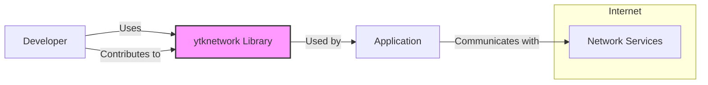
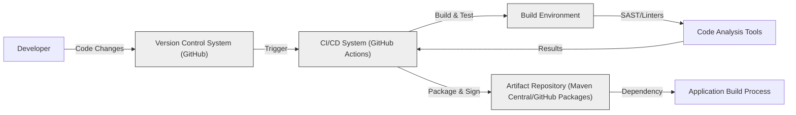

# BUSINESS POSTURE

This project, `ytknetwork`, is a Kotlin Multiplatform library designed to simplify and standardize network operations across different platforms. The primary business priority is to provide developers with a reusable, efficient, and reliable networking solution that reduces development time and effort when building applications that require network communication on multiple platforms (e.g., Android, iOS, JVM, JavaScript).

Business goals include:
- Enhancing developer productivity by providing a consistent and easy-to-use networking API.
- Promoting code reusability across different platforms, reducing development costs and time.
- Ensuring the reliability and performance of network communication in applications built using the library.
- Potentially establishing `kanyun-inc` as a provider of high-quality, cross-platform libraries.

Most important business risks to address:
- Risk of defects or vulnerabilities in the library that could negatively impact applications using it, leading to application instability, data breaches, or service disruptions.
- Risk of poor performance or inefficiency in the library, which could degrade the performance of applications using it.
- Risk of low adoption if the library is not user-friendly, lacks necessary features, or is not well-documented.
- Risk of compatibility issues with different platforms or changes in platform APIs that could break the library's functionality.

# SECURITY POSTURE

Existing security controls:
- security control: Standard software development practices are assumed, including version control (Git), code reviews (potentially), and testing. Location: GitHub repository history and project structure.
- security control: Dependency management using Gradle and Kotlin Multiplatform mechanisms. Location: `build.gradle.kts` files.
- accepted risk: Initial versions of the library might not have undergone extensive security audits or penetration testing.
- accepted risk: Security features might be implemented incrementally, focusing on core functionality first.

Recommended security controls:
- security control: Implement automated security scanning tools (SAST/DAST) in the CI/CD pipeline to detect potential vulnerabilities in the code.
- security control: Conduct regular security code reviews by experienced security engineers.
- security control: Implement dependency vulnerability scanning to identify and manage vulnerable dependencies.
- security control: Establish a process for reporting and handling security vulnerabilities, including a security advisory policy.

Security requirements:
- Authentication: Not directly applicable to a networking library itself, as authentication is typically handled by the applications using the library or the backend services they communicate with. However, the library should support secure communication protocols (like HTTPS) that often involve authentication.
- Authorization: Similar to authentication, authorization is primarily the responsibility of the applications and backend services. The library should not enforce authorization but should provide mechanisms to transmit and handle authorization tokens or credentials securely if needed by the application.
- Input validation: security requirement: Implement robust input validation within the library to prevent common vulnerabilities like injection attacks. This is crucial when handling network requests and responses, especially when parsing data from external sources. Validation should be applied to all data received from the network before processing it.
- Cryptography: security requirement: Utilize secure cryptographic practices when implementing features that require encryption or decryption. Prefer established and well-vetted cryptographic libraries and algorithms. Ensure proper key management if the library handles any cryptographic keys (though unlikely for a general networking library). For secure communication, the library should support and encourage the use of TLS/SSL.

# DESIGN

## C4 CONTEXT



Context Diagram Elements:

- Name: Developer
  - Type: Person
  - Description: Software developers who will use the `ytknetwork` library to build applications.
  - Responsibilities: Integrate the `ytknetwork` library into their applications, configure and use the library's API, and potentially contribute to the library's development.
  - Security controls: Responsible for using the library securely, following best practices for network security in their applications, and reporting any potential security issues they find in the library.

- Name: ytknetwork Library
  - Type: Software System
  - Description: A Kotlin Multiplatform library providing networking functionalities for applications across different platforms.
  - Responsibilities: Abstracting network communication complexities, providing a consistent API for network requests and responses, handling platform-specific networking details, and ensuring efficient and reliable network operations.
  - Security controls: Input validation on network data, support for secure communication protocols (like HTTPS), and adherence to secure coding practices during development.

- Name: Application
  - Type: Software System
  - Description: Applications built by developers that utilize the `ytknetwork` library for their networking needs. These can be mobile apps, desktop applications, or web applications.
  - Responsibilities: Utilizing the `ytknetwork` library to perform network communication, handling application-specific logic, managing user authentication and authorization, and processing data received from network services.
  - Security controls: Application-level security controls, including user authentication, authorization, secure data storage, and secure handling of network communication using the `ytknetwork` library.

- Name: Network Services
  - Type: External System
  - Description: External backend services or APIs that the applications communicate with over the network. These could be REST APIs, GraphQL endpoints, or other types of network services.
  - Responsibilities: Providing data and functionalities to the applications, handling requests from applications, and managing their own security, including authentication, authorization, and data protection.
  - Security controls: Server-side security controls, including authentication, authorization, input validation, secure data storage, and secure communication protocols (HTTPS).

## C4 CONTAINER

```mermaid
flowchart LR
    subgraph "ytknetwork Library"
        direction TB
        KMP["Kotlin Multiplatform Module"]
        subgraph "Platform Modules"
            Android["Android Module"]
            IOS["iOS Module"]
            JVM["JVM Module"]
            JS["JS Module"]
        end
        Core["Core Networking Logic"]
        KMP --> Core
        Core --> PlatformModules
    end
    style "ytknetwork Library" fill:#f9f,stroke:#333,stroke-width:2px
```

Container Diagram Elements:

- Name: ytknetwork Library
  - Type: Container
  - Description: The overall Kotlin Multiplatform library that encapsulates all networking functionalities.
  - Responsibilities: Providing a unified entry point for developers to access networking features, managing different platform implementations, and coordinating core networking logic with platform-specific modules.
  - Security controls: Centralized input validation and security checks within the core networking logic, ensuring consistent security practices across all platforms.

- Name: Kotlin Multiplatform Module
  - Type: Container
  - Description: The main module of the library, defining the common API and structure for cross-platform networking.
  - Responsibilities: Defining the public API of the library, managing dependencies, and orchestrating the build process for different platforms.
  - Security controls: Ensuring secure dependency management and build process, and defining secure API contracts for platform modules to implement.

- Name: Core Networking Logic
  - Type: Container
  - Description: Contains the platform-agnostic networking logic, including request/response handling, data processing, and common network functionalities.
  - Responsibilities: Implementing core networking functionalities that are shared across platforms, handling common network operations, and providing a base for platform-specific implementations.
  - Security controls: Input validation, secure data handling, and implementation of secure networking protocols within the core logic.

- Name: Platform Modules (Android, iOS, JVM, JS)
  - Type: Container
  - Description: Platform-specific modules that implement the networking functionalities for each target platform (Android, iOS, JVM, JavaScript).
  - Responsibilities: Providing platform-specific implementations of networking features, interacting with platform-specific APIs, and adapting core networking logic to each platform's environment.
  - Security controls: Platform-specific security considerations, such as secure storage of credentials on mobile platforms, and leveraging platform-provided security features.

## DEPLOYMENT

Deployment of the `ytknetwork` library is as a dependency within applications. There isn't a standalone deployment for the library itself. Applications using the library will be deployed in various environments depending on their nature (mobile app stores, cloud platforms, desktop environments, web browsers).

Assuming an example deployment scenario where an Android application uses the `ytknetwork` library and is deployed to an Android device:

```mermaid
flowchart LR
    subgraph "Android Device"
        subgraph "Operating System"
            AndroidOS["Android OS"]
            subgraph "Application Environment"
                AndroidApp["Android Application"]
                YTKLib["ytknetwork Library"]
                AndroidApp --> YTKLib
            end
        end
    end
    style "Android Device" fill:#ccf,stroke:#333,stroke-width:2px
    style "Operating System" fill:#eee,stroke:#333,stroke-width:1px
    style "Application Environment" fill:#fff,stroke:#333,stroke-width:1px
    Internet -- Network Communication --> AndroidApp
```

Deployment Diagram Elements:

- Name: Android Device
  - Type: Infrastructure Node
  - Description: A physical or virtual Android device where the Android application is deployed and executed.
  - Responsibilities: Providing the runtime environment for the Android application and the `ytknetwork` library.
  - Security controls: Device-level security controls, such as device encryption, screen lock, and application sandboxing provided by the Android OS.

- Name: Android OS
  - Type: Software
  - Description: The Android operating system running on the device.
  - Responsibilities: Managing system resources, providing APIs for applications, and enforcing security policies.
  - Security controls: Operating system level security controls, including permission management, process isolation, and security updates.

- Name: Application Environment
  - Type: Environment
  - Description: The environment within the Android OS where the application and its dependencies (including `ytknetwork`) are executed.
  - Responsibilities: Providing a sandboxed environment for the application, managing application lifecycle, and providing access to device resources.
  - Security controls: Application sandbox, permission system, and runtime security checks.

- Name: Android Application
  - Type: Software
  - Description: The Android application that utilizes the `ytknetwork` library for networking functionalities.
  - Responsibilities: Implementing application logic, using the `ytknetwork` library for network communication, and handling user interactions.
  - Security controls: Application-level security controls, including secure coding practices, input validation, secure data storage, and secure handling of network communication.

- Name: ytknetwork Library
  - Type: Software
  - Description: The `ytknetwork` library deployed as a dependency within the Android application.
  - Responsibilities: Providing networking functionalities to the Android application.
  - Security controls: Security controls implemented within the library itself, as described in previous sections.

## BUILD



Build Process Description:

1. Developer: Developers write code for the `ytknetwork` library and commit changes to a Version Control System (VCS), assumed to be GitHub in this case, given the repository URL.
2. Version Control System (GitHub): GitHub hosts the source code and triggers the CI/CD pipeline upon code changes (e.g., push, pull request).
3. CI/CD System (GitHub Actions): GitHub Actions is used as the CI/CD system to automate the build, test, and deployment processes. It is triggered by events in the VCS.
4. Build Environment: A controlled and isolated environment is set up by the CI/CD system to build the library. This environment includes necessary dependencies (JDK, Android SDK, etc.) and build tools (Gradle).
5. Code Analysis Tools: Static Application Security Testing (SAST) tools and linters are integrated into the build process to automatically analyze the code for potential security vulnerabilities and code quality issues.
6. Artifact Repository (Maven Central/GitHub Packages): After successful build and tests, and passing code analysis checks, the library artifacts (JAR files, AAR files, etc.) are packaged, signed, and published to an artifact repository. This could be Maven Central for public releases or GitHub Packages for internal or pre-releases.
7. Application Build Process: Applications that depend on the `ytknetwork` library will fetch the artifacts from the artifact repository as a dependency during their own build process.

Build Process Security Controls:

- security control: Secure Version Control: Using Git and GitHub to track code changes, manage branches, and control access to the codebase. Location: GitHub repository access controls and branch protection rules.
- security control: Automated Build Process: Using GitHub Actions to automate the build, test, and release process, reducing manual steps and potential human errors. Location: GitHub Actions workflows defined in the repository.
- security control: Static Application Security Testing (SAST): Integrating SAST tools to automatically scan the codebase for potential security vulnerabilities during the build process. Location: GitHub Actions workflows incorporating SAST tools.
- security control: Code Linting: Using linters to enforce code quality and coding standards, which can indirectly improve security by reducing code complexity and potential bugs. Location: GitHub Actions workflows incorporating linters.
- security control: Dependency Vulnerability Scanning: Integrating dependency scanning tools to identify and alert on known vulnerabilities in third-party dependencies used by the library. Location: GitHub Actions workflows incorporating dependency scanning tools.
- security control: Secure Artifact Signing: Signing the build artifacts (JARs, AARs) to ensure integrity and authenticity, preventing tampering and ensuring that applications are using genuine artifacts. Location: Build scripts within GitHub Actions workflows that handle artifact signing.
- security control: Access Control to Artifact Repository: Implementing access controls on the artifact repository to restrict who can publish and access the library artifacts, protecting the supply chain. Location: Configuration of Maven Central or GitHub Packages repository access permissions.

# RISK ASSESSMENT

Critical business process: Providing reliable and secure network communication for applications built using the `ytknetwork` library. If the library fails or has security vulnerabilities, it directly impacts all applications relying on it, potentially disrupting their functionality and compromising their security.

Data we are trying to protect:
- Source code of the `ytknetwork` library: Confidentiality and integrity of the source code are important to prevent unauthorized modifications and intellectual property theft. Sensitivity: High.
- Build artifacts (JARs, AARs): Integrity and authenticity of the build artifacts are crucial to ensure that applications are using a genuine and untampered version of the library. Sensitivity: High.
- Network traffic handled by applications using the library: The sensitivity of this data depends entirely on the applications themselves. The library should be designed to facilitate secure communication (e.g., HTTPS) to protect sensitive data in transit. Sensitivity: Variable, depends on application.

# QUESTIONS & ASSUMPTIONS

Questions:
- What are the primary target applications or use cases for the `ytknetwork` library? Understanding the use cases will help in tailoring security requirements and design considerations.
- Are there specific security compliance requirements or industry standards that the library needs to adhere to?
- What is the expected risk appetite for this project? Is it for a startup with a higher risk tolerance or a large enterprise with stricter security requirements?
- What is the process for reporting and handling security vulnerabilities in the library?
- Are there any specific performance requirements or constraints that might impact security design choices?

Assumptions:
- The primary goal of the `ytknetwork` library is to simplify network programming for developers across multiple platforms.
- Security is a consideration, but not necessarily the absolute top priority in the initial phases of the project. However, building a secure foundation is important for long-term success and adoption.
- Developers using the library are expected to have a basic understanding of network security principles and are responsible for implementing application-level security controls.
- The library will be distributed through public or private artifact repositories, making supply chain security a relevant concern.
- The development team is following standard software development practices, including version control and testing.