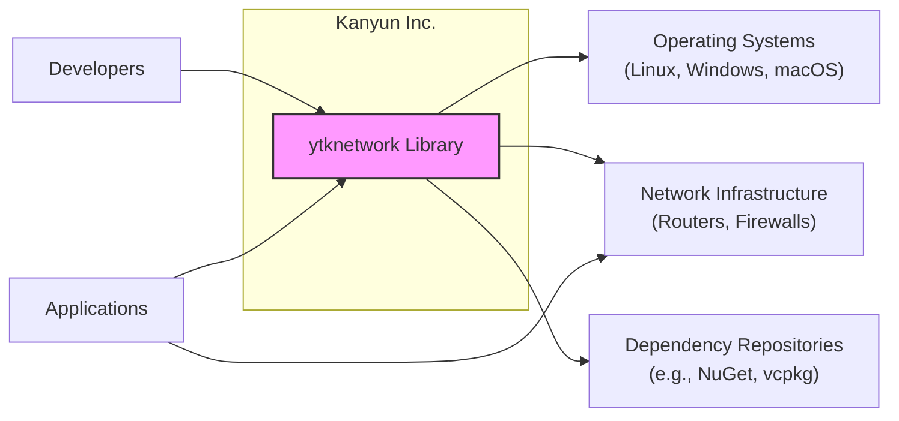
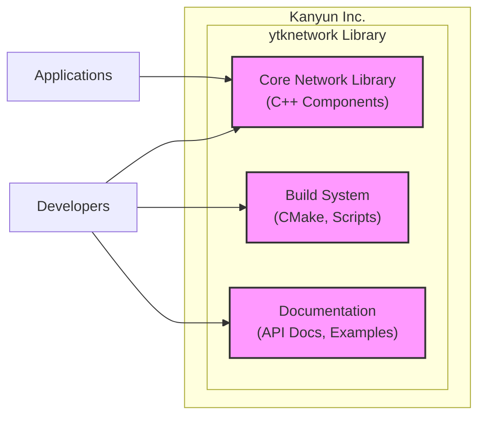
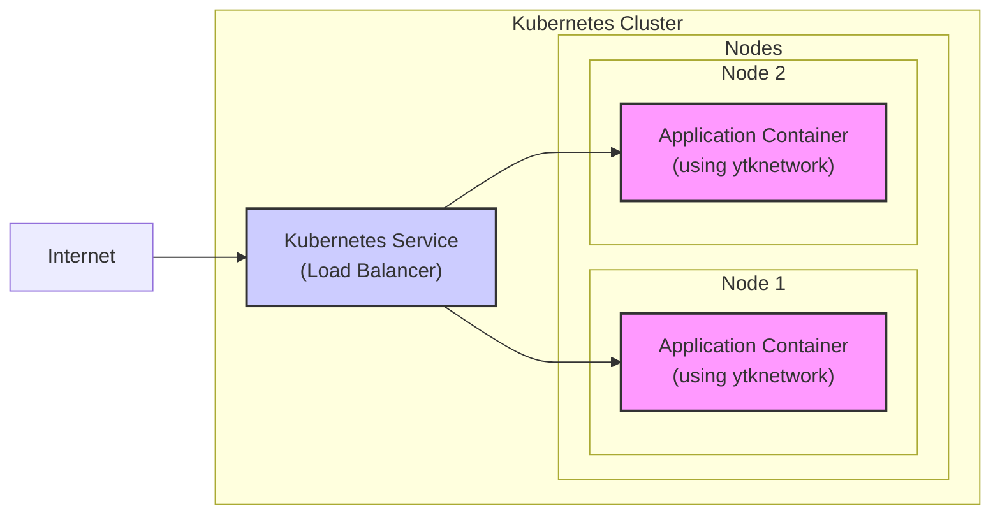
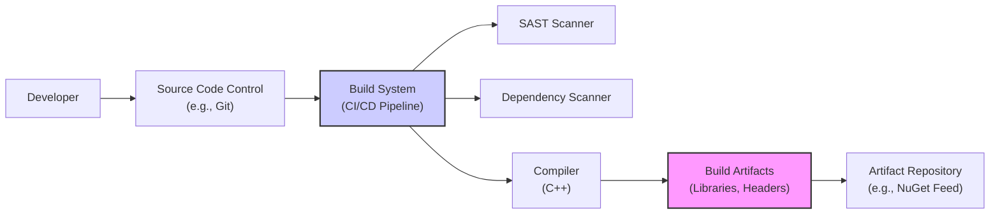

# BUSINESS POSTURE

*   Business Priorities and Goals:
    *   Provide a reusable, cross-platform C++ network library (`ytknetwork`) to simplify network programming for internal projects.
    *   Enhance development efficiency by offering a robust and feature-rich networking component, reducing the need to develop network functionalities from scratch for each project.
    *   Potentially offer `ytknetwork` as a product or service to external users in the future, expanding the company's offerings.
    *   Ensure the library is performant, reliable, and secure to meet the demands of various applications.
*   Most Important Business Risks:
    *   Security vulnerabilities in `ytknetwork` could be exploited in applications that depend on it, leading to data breaches, service disruptions, and reputational damage.
    *   Poor performance or instability of the library could negatively impact the performance and reliability of applications using it, affecting user experience and business operations.
    *   Lack of maintainability or inadequate documentation could increase development costs and risks associated with long-term usage and updates.
    *   If intended for external use, failing to meet security and quality expectations could harm the company's reputation and hinder market adoption.

# SECURITY POSTURE

*   Existing Security Controls:
    *   security control: TLS/SSL support for encrypted communication. Implemented within the library's networking functionalities, enabling secure data transmission over networks. Described in the library's documentation and examples related to secure sockets and protocols.
*   Accepted Risks:
    *   accepted risk: Potential vulnerabilities in third-party dependencies (e.g., OpenSSL) used by `ytknetwork`. Mitigation relies on timely updates of dependencies and monitoring security advisories.
    *   accepted risk: Undiscovered vulnerabilities in the `ytknetwork` codebase itself. Mitigation relies on ongoing code reviews, testing, and community feedback if open-sourced or used externally.
*   Recommended Security Controls:
    *   security control: Implement static application security testing (SAST) tools in the build pipeline to automatically detect potential security vulnerabilities in the codebase.
    *   security control: Integrate dependency scanning tools to identify known vulnerabilities in third-party libraries used by `ytknetwork` and ensure timely updates.
    *   security control: Conduct regular dynamic application security testing (DAST) or penetration testing on applications that utilize `ytknetwork` to identify runtime security issues.
    *   security control: Implement fuzz testing to discover input validation vulnerabilities and unexpected behavior when handling malformed network data.
    *   security control: Establish a security incident response plan to effectively handle any security vulnerabilities discovered in `ytknetwork` or applications using it.
    *   security control: Implement security logging and monitoring within applications using `ytknetwork` to detect and respond to potential security incidents in runtime.
    *   security control: Provide security training for developers contributing to `ytknetwork` to promote secure coding practices and awareness of common network security vulnerabilities.
*   Security Requirements:
    *   Authentication:
        *   `ytknetwork` itself does not handle application-level authentication.
        *   Requirement: Ensure applications using `ytknetwork` implement appropriate authentication mechanisms when required.
        *   Requirement: `ytknetwork` should support secure transport protocols like TLS, which can provide mutual authentication at the transport layer if configured.
    *   Authorization:
        *   `ytknetwork` itself does not enforce application-level authorization.
        *   Requirement: Applications using `ytknetwork` must implement their own authorization logic to control access to resources and functionalities.
        *   Requirement: `ytknetwork` should not bypass or interfere with any authorization mechanisms implemented by applications.
    *   Input Validation:
        *   Requirement: `ytknetwork` must rigorously validate all network inputs to prevent vulnerabilities such as injection attacks (e.g., command injection, format string bugs), buffer overflows, and denial-of-service attacks.
        *   Requirement: Input validation should be performed at multiple layers, including protocol parsing, data deserialization, and handling of user-provided data within network messages.
    *   Cryptography:
        *   Requirement: When using cryptography (e.g., for TLS/SSL), `ytknetwork` must use strong and up-to-date cryptographic algorithms and libraries (like OpenSSL).
        *   Requirement: Proper key management practices should be followed if `ytknetwork` is involved in key handling (though less likely for a general network library).
        *   Requirement: Ensure that cryptographic operations are implemented correctly to avoid common pitfalls like side-channel attacks or misuse of APIs.

# DESIGN

## C4 CONTEXT

*   Context Diagram Elements:
    *   Element:
        *   Name: Developers
        *   Type: Person
        *   Description: Software developers within Kanyun Inc. who will use the `ytknetwork` library to build network-enabled applications.
        *   Responsibilities:
            *   Utilize `ytknetwork` to implement network functionalities in their applications.
            *   Provide feedback and contribute to the development of `ytknetwork`.
        *   Security controls:
            *   security control: Secure development training to ensure developers use `ytknetwork` securely.
            *   security control: Code reviews to ensure proper and secure usage of `ytknetwork` in applications.
    *   Element:
        *   Name: Applications
        *   Type: Software System
        *   Description: Various software applications developed by Kanyun Inc. that will integrate and utilize the `ytknetwork` library for networking capabilities. These applications can range from internal tools to customer-facing products.
        *   Responsibilities:
            *   Utilize `ytknetwork` to handle network communication.
            *   Implement application-level security controls, such as authentication and authorization, on top of the networking layer provided by `ytknetwork`.
        *   Security controls:
            *   security control: Application-level security testing (DAST, penetration testing).
            *   security control: Security logging and monitoring of application activities, including network interactions.
    *   Element:
        *   Name: ytknetwork Library
        *   Type: Software System
        *   Description: The `ytknetwork` cross-platform C++ network library being designed. It provides functionalities for TCP, UDP, HTTP, WebSocket, SSL/TLS, and DNS, aiming to simplify network programming.
        *   Responsibilities:
            *   Provide robust and efficient network communication functionalities.
            *   Handle low-level network operations and protocol implementations.
            *   Offer a secure foundation for network communication, including support for encryption and secure protocols.
        *   Security controls:
            *   security control: Secure Software Development Lifecycle (SSDLC) practices during development.
            *   security control: Static Application Security Testing (SAST) during build process.
            *   security control: Dependency scanning to manage vulnerabilities in third-party libraries.
            *   security control: Fuzz testing to identify input validation issues.
    *   Element:
        *   Name: Operating Systems
        *   Type: Infrastructure
        *   Description: Target operating systems where applications using `ytknetwork` will be deployed, including Linux, Windows, and macOS.
        *   Responsibilities:
            *   Provide the underlying operating system functionalities required by `ytknetwork` and applications.
            *   Manage system-level security controls, such as firewalls and access controls.
        *   Security controls:
            *   security control: Operating system hardening and security patching.
            *   security control: Host-based intrusion detection systems (HIDS) if applicable.
    *   Element:
        *   Name: Network Infrastructure
        *   Type: Infrastructure
        *   Description: The underlying network infrastructure, including routers, switches, firewalls, and load balancers, that facilitates network communication for applications using `ytknetwork`.
        *   Responsibilities:
            *   Provide network connectivity and routing for applications.
            *   Enforce network security policies, such as firewall rules and network segmentation.
        *   Security controls:
            *   security control: Network firewalls to control network traffic.
            *   security control: Intrusion detection and prevention systems (IDPS).
            *   security control: Network segmentation to limit the impact of breaches.
    *   Element:
        *   Name: Dependency Repositories
        *   Type: External System
        *   Description: External repositories like NuGet, vcpkg, or system package managers from where `ytknetwork` and its dependencies (e.g., OpenSSL) are obtained during the build process.
        *   Responsibilities:
            *   Provide necessary libraries and dependencies for building `ytknetwork`.
            *   Ensure the availability and integrity of packages.
        *   Security controls:
            *   security control: Dependency scanning to identify vulnerable dependencies.
            *   security control: Using trusted and reputable dependency repositories.
            *   security control: Software Composition Analysis (SCA) to manage open source components.

## C4 CONTAINER

*   Container Diagram Elements:
    *   Element:
        *   Name: Core Network Library
        *   Type: Container - Library (C++)
        *   Description: This container represents the core C++ source code of the `ytknetwork` library. It includes all the modules and components that implement the network functionalities, such as TCP/UDP socket handling, HTTP/WebSocket protocols, SSL/TLS encryption, and DNS resolution.
        *   Responsibilities:
            *   Implement all network functionalities as specified in the design.
            *   Provide a well-defined and documented API for applications to use.
            *   Ensure efficient and secure network operations.
        *   Security controls:
            *   security control: Secure coding practices during development.
            *   security control: Input validation implemented within the library's code.
            *   security control: Proper handling of cryptographic operations and key management (if applicable within the library itself).
            *   security control: Memory safety checks to prevent buffer overflows and other memory-related vulnerabilities.
    *   Element:
        *   Name: Build System
        *   Type: Container - Build Scripts (CMake, etc.)
        *   Description: This container includes the build system configuration files (e.g., CMakeLists.txt), scripts, and tools required to compile, link, and package the `ytknetwork` library. It manages the build process across different platforms and configurations.
        *   Responsibilities:
            *   Automate the build process for different target platforms (Linux, Windows, macOS).
            *   Manage dependencies and integrate them into the build.
            *   Generate build artifacts (static/dynamic libraries, headers).
        *   Security controls:
            *   security control: Secure build environment to prevent tampering with build artifacts.
            *   security control: Integration of SAST and dependency scanning tools into the build pipeline.
            *   security control: Verification of downloaded dependencies using checksums or signatures.
    *   Element:
        *   Name: Documentation
        *   Type: Container - Documentation Files
        *   Description: This container represents all the documentation related to the `ytknetwork` library, including API documentation, usage guides, examples, and developer documentation. It is crucial for developers to understand and use the library effectively and securely.
        *   Responsibilities:
            *   Provide comprehensive and accurate documentation of the library's API and functionalities.
            *   Include security considerations and best practices in the documentation.
            *   Offer examples demonstrating secure usage patterns of the library.
        *   Security controls:
            *   security control: Review documentation for clarity and accuracy, especially regarding security-sensitive aspects.
            *   security control: Host documentation on a secure platform to prevent tampering.

## DEPLOYMENT

*   Deployment Architecture Options:
    *   Option 1: Library integrated into standalone applications deployed on virtual machines or bare metal servers.
    *   Option 2: Library integrated into containerized applications deployed in container orchestration platforms (e.g., Kubernetes).
    *   Option 3: Library used in serverless functions deployed in cloud environments.

*   Detailed Deployment Architecture (Option 2 - Containerized Application in Kubernetes):

*   Deployment Diagram Elements (Option 2):
    *   Element:
        *   Name: Kubernetes Cluster
        *   Type: Environment - Container Orchestration Platform
        *   Description: A Kubernetes cluster provides the infrastructure for deploying, managing, and scaling containerized applications that utilize the `ytknetwork` library.
        *   Responsibilities:
            *   Orchestrate and manage application containers.
            *   Provide load balancing and service discovery.
            *   Ensure high availability and scalability of applications.
        *   Security controls:
            *   security control: Kubernetes network policies to control network traffic between pods.
            *   security control: Role-Based Access Control (RBAC) to manage access to Kubernetes resources.
            *   security control: Regular security audits and updates of the Kubernetes cluster.
    *   Element:
        *   Name: Nodes (Node 1, Node 2)
        *   Type: Infrastructure - Virtual Machines/Physical Servers
        *   Description: Worker nodes within the Kubernetes cluster where application containers are deployed and executed.
        *   Responsibilities:
            *   Run application containers.
            *   Provide compute resources (CPU, memory, network) for containers.
        *   Security controls:
            *   security control: Operating system hardening on nodes.
            *   security control: Container runtime security (e.g., using secure container runtimes like containerd or CRI-O).
            *   security control: Node-level security monitoring and intrusion detection.
    *   Element:
        *   Name: Application Container (ApplicationContainer1, ApplicationContainer2)
        *   Type: Container - Docker Container
        *   Description: Docker containers packaging applications that use the `ytknetwork` library. These containers are deployed and managed within the Kubernetes cluster.
        *   Responsibilities:
            *   Run the application logic that utilizes `ytknetwork` for network communication.
            *   Implement application-level security controls.
        *   Security controls:
            *   security control: Container image scanning for vulnerabilities.
            *   security control: Principle of least privilege for container processes.
            *   security control: Application-level firewalls within containers if needed.
    *   Element:
        *   Name: Kubernetes Service
        *   Type: Component - Load Balancer
        *   Description: A Kubernetes Service of type LoadBalancer that exposes the application to the internet. It distributes incoming traffic across multiple application container instances.
        *   Responsibilities:
            *   Provide a single entry point for external traffic to access the application.
            *   Load balance traffic across application containers for scalability and resilience.
        *   Security controls:
            *   security control: Network firewalls associated with the load balancer to filter traffic.
            *   security control: TLS termination at the load balancer for secure HTTPS access.
    *   Element:
        *   Name: Internet
        *   Type: External Environment
        *   Description: The public internet from where users access the applications deployed using `ytknetwork`.
        *   Responsibilities:
            *   Source of user traffic and requests to the applications.
        *   Security controls:
            *   security control: N/A - external environment, security is managed on the Kanyun Inc. side.

## BUILD

*   Build Process Description:
    *   Developers commit code changes to a Source Code Control system (e.g., Git/GitHub).
    *   A Build System (CI/CD pipeline, e.g., GitHub Actions, Jenkins) is triggered upon code changes.
    *   The Build System performs the following security checks:
        *   Static Application Security Testing (SAST) is executed to scan the codebase for potential vulnerabilities.
        *   Dependency scanning is performed to identify known vulnerabilities in third-party libraries.
    *   The Build System compiles the C++ code using a compiler.
    *   Build Artifacts (libraries, headers) are generated.
    *   Build Artifacts are published to an Artifact Repository (e.g., NuGet feed, internal repository) for consumption by other projects and applications.

*   Build Process Security Controls:
    *   security control: Secure Build Environment: Ensure the build environment (CI/CD agents) is hardened and regularly updated to prevent compromise.
    *   security control: Automated Build Process: Automate the build process to ensure consistency and repeatability, reducing manual errors and potential security oversights.
    *   security control: Static Application Security Testing (SAST): Integrate SAST tools into the build pipeline to automatically detect code-level vulnerabilities early in the development cycle.
    *   security control: Dependency Scanning: Utilize dependency scanning tools to identify and manage vulnerabilities in third-party libraries used by `ytknetwork`.
    *   security control: Code Signing (optional): Sign build artifacts to ensure integrity and authenticity, especially if the library is distributed externally.
    *   security control: Access Control to Build System: Restrict access to the build system and artifact repository to authorized personnel only.
    *   security control: Audit Logging of Build Activities: Log all build activities for auditing and security monitoring purposes.

# RISK ASSESSMENT

*   Critical Business Processes:
    *   The critical business processes that `ytknetwork` supports are dependent on the applications that utilize it. If applications built with `ytknetwork` are involved in core business operations such as:
        *   Customer communication and data exchange.
        *   Internal system communication and data flow.
        *   Potentially, if offered externally, applications of external customers.
    *   Disruption or compromise of these processes due to vulnerabilities in `ytknetwork` could significantly impact business continuity, data security, and customer trust.
*   Data Sensitivity:
    *   The sensitivity of data handled by `ytknetwork` also depends on the applications using it. Given that it's a network library, it could potentially handle:
        *   Sensitive user data (PII - Personally Identifiable Information) if applications transmit user data over the network.
        *   Authentication credentials if applications implement authentication mechanisms over network connections.
        *   Confidential business data if used for internal communications.
        *   Financial data if applications are involved in financial transactions.
    *   The sensitivity level can range from low to high depending on the specific application context. For threat modeling purposes, it's prudent to assume that `ytknetwork` might handle sensitive data and design security controls accordingly.

# QUESTIONS & ASSUMPTIONS

*   Questions:
    *   What are the primary applications or use cases within Kanyun Inc. that will utilize `ytknetwork` initially? Understanding the specific applications will help tailor security requirements and risk assessments.
    *   Are there any specific performance benchmarks or latency requirements for network communication in the intended use cases? Performance requirements can influence design choices and security implementation.
    *   Are there any existing security policies or compliance standards within Kanyun Inc. that `ytknetwork` and applications using it must adhere to?
    *   What is the intended distribution model for `ytknetwork`? Will it be solely for internal use, or is there a plan to release it as open source or a commercial product? Distribution model impacts security considerations and update mechanisms.
    *   What is the expected lifespan and maintenance plan for `ytknetwork`? Long-term maintenance and security updates are crucial for a foundational library.
*   Assumptions:
    *   Assumption: `ytknetwork` is initially intended for internal use within Kanyun Inc., with potential for external use in the future.
    *   Assumption: Security is a significant concern for `ytknetwork`, and the goal is to build a secure and reliable network library.
    *   Assumption: Applications using `ytknetwork` may handle sensitive data, requiring robust security measures in the library and the applications themselves.
    *   Assumption: Standard secure software development practices will be followed during the development of `ytknetwork`.
    *   Assumption: There is an existing or planned CI/CD pipeline within Kanyun Inc. that can be leveraged to implement automated build and security checks for `ytknetwork`.