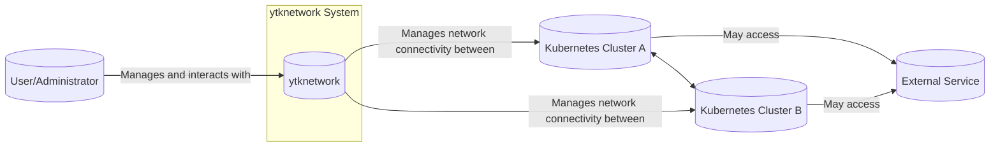
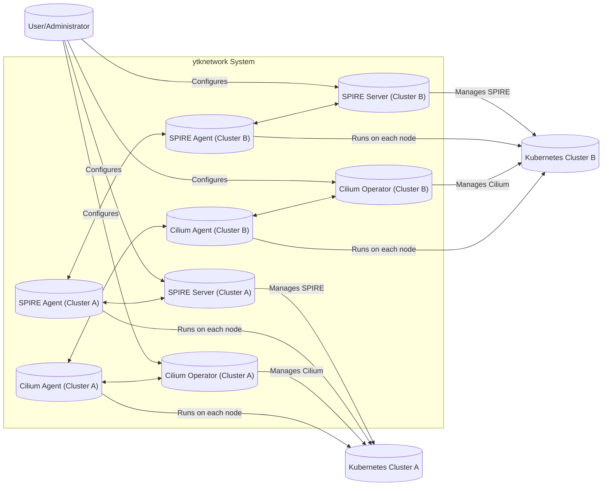
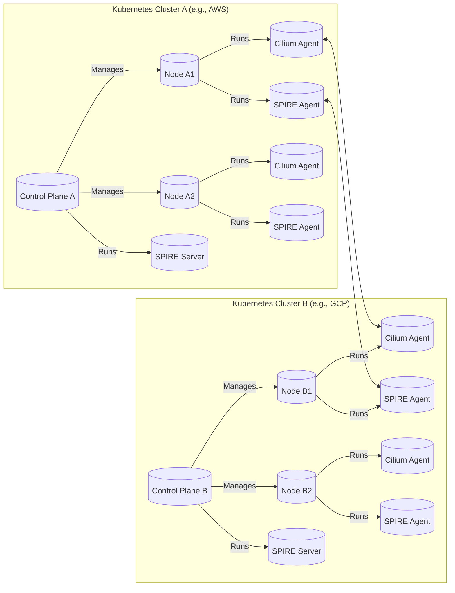
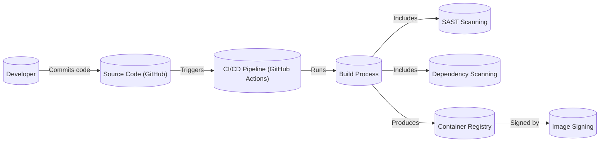

Okay, let's create a detailed design document for the `ytknetwork` project, focusing on aspects relevant for threat modeling.

# BUSINESS POSTURE

Business Priorities and Goals:

*   Provide a secure and reliable overlay network for Kubernetes clusters.
*   Simplify network management for applications deployed across multiple Kubernetes clusters.
*   Enable secure communication between services in different clusters, potentially spanning different cloud providers or on-premise environments.
*   Offer a solution that integrates well with existing Kubernetes tooling and workflows.
*   Minimize operational overhead and complexity.
*   Provide network observability.

Most Important Business Risks:

*   Unauthorized access to services and data within the overlay network.
*   Compromise of the network control plane, leading to network disruption or data breaches.
*   Data leakage or interception during inter-cluster communication.
*   Denial-of-service attacks targeting the network infrastructure.
*   Misconfiguration leading to network vulnerabilities or connectivity issues.
*   Supply chain attacks targeting the project's dependencies or build process.
*   Lack of visibility into network traffic, hindering incident response and troubleshooting.

# SECURITY POSTURE

Existing Security Controls:

*   security control: Network policies enforced by Cilium CNI. (Described in the GitHub repository's documentation and implementation).
*   security control: Mutual TLS (mTLS) for inter-cluster communication using SPIRE. (Described in the GitHub repository and SPIRE integration).
*   security control: Use of Kubernetes Secrets for storing sensitive information (e.g., SPIRE trust bundles). (Implicit in Kubernetes best practices and likely used in the project's deployment configurations).
*   security control: Role-Based Access Control (RBAC) within Kubernetes to manage access to network resources. (Standard Kubernetes practice, assumed to be in place).
*   security control: Network segmentation provided by Kubernetes namespaces and Cilium network policies. (Described in the GitHub repository and Cilium documentation).
*   security control: Use of signed container images. (Described in the GitHub repository).

Accepted Risks:

*   accepted risk: Reliance on the security of the underlying Kubernetes clusters and their infrastructure. The project assumes that the underlying Kubernetes clusters are properly secured.
*   accepted risk: Potential for misconfiguration of Cilium network policies or SPIRE settings, leading to security vulnerabilities.
*   accepted risk: The complexity of managing SPIRE and its integration with Cilium may introduce operational challenges and potential security risks if not handled correctly.

Recommended Security Controls:

*   security control: Implement regular vulnerability scanning of container images and dependencies.
*   security control: Integrate a Security Information and Event Management (SIEM) system for centralized logging and threat detection.
*   security control: Conduct regular penetration testing and security audits of the deployed network infrastructure.
*   security control: Implement intrusion detection and prevention systems (IDPS) to monitor network traffic for malicious activity.
*   security control: Enforce strict least privilege access control for all components of the system.
*   security control: Implement a robust incident response plan to handle security incidents effectively.
*   security control: Provide comprehensive documentation and training on secure configuration and operation of the system.

Security Requirements:

*   Authentication:
    *   All inter-cluster communication must be authenticated using mTLS.
    *   Access to the network control plane must be authenticated using strong authentication mechanisms.
    *   All components must authenticate with each other using SPIFFE IDs provided by SPIRE.

*   Authorization:
    *   RBAC must be used to control access to network resources and management functions.
    *   Network policies must be implemented to restrict network traffic to the minimum necessary for application functionality (least privilege).
    *   Access to sensitive data (e.g., SPIRE trust bundles) must be restricted to authorized components and users.

*   Input Validation:
    *   All input to the system's APIs and control plane must be validated to prevent injection attacks and other vulnerabilities.
    *   Configuration parameters must be validated to ensure they are within acceptable ranges and formats.

*   Cryptography:
    *   mTLS must use strong cryptographic algorithms and key lengths.
    *   All sensitive data stored at rest must be encrypted.
    *   Cryptographic keys must be managed securely, following best practices for key generation, storage, and rotation.

# DESIGN

## C4 CONTEXT

Element Descriptions:

*   Element:
    *   Name: User/Administrator
    *   Type: Person
    *   Description: A user or administrator who interacts with the ytknetwork system to configure and manage the overlay network.
    *   Responsibilities: Configures network policies, manages SPIRE settings, monitors network health, and troubleshoots issues.
    *   Security controls: RBAC, strong authentication.

*   Element:
    *   Name: ytknetwork
    *   Type: Software System
    *   Description: The ytknetwork system, providing the overlay network functionality.
    *   Responsibilities: Manages network connectivity between Kubernetes clusters, enforces network policies, provides mTLS for inter-cluster communication.
    *   Security controls: Network policies, mTLS, RBAC, input validation.

*   Element:
    *   Name: Kubernetes Cluster A
    *   Type: Kubernetes Cluster
    *   Description: A Kubernetes cluster participating in the overlay network.
    *   Responsibilities: Hosts applications and services that communicate with other clusters via ytknetwork.
    *   Security controls: Underlying Kubernetes security mechanisms, network policies.

*   Element:
    *   Name: Kubernetes Cluster B
    *   Type: Kubernetes Cluster
    *   Description: Another Kubernetes cluster participating in the overlay network.
    *   Responsibilities: Hosts applications and services that communicate with other clusters via ytknetwork.
    *   Security controls: Underlying Kubernetes security mechanisms, network policies.

*   Element:
    *   Name: External Service
    *   Type: External System
    *   Description: An external service that applications within the Kubernetes clusters may need to access.
    *   Responsibilities: Provides external services (e.g., databases, APIs).
    *   Security controls: Dependent on the external service's security mechanisms.

## C4 CONTAINER

Element Descriptions:

*   Element:
    *   Name: Cilium Agent (Cluster A)
    *   Type: Container
    *   Description: The Cilium agent running on each node in Kubernetes Cluster A.
    *   Responsibilities: Enforces network policies, provides network connectivity.
    *   Security controls: Network policies, integration with SPIRE for mTLS.

*   Element:
    *   Name: Cilium Operator (Cluster A)
    *   Type: Container
    *   Description: The Cilium operator in Kubernetes Cluster A.
    *   Responsibilities: Manages the Cilium agents and configuration.
    *   Security controls: RBAC, input validation.

*   Element:
    *   Name: SPIRE Agent (Cluster A)
    *   Type: Container
    *   Description: The SPIRE agent running on each node in Kubernetes Cluster A.
    *   Responsibilities: Obtains and manages SPIFFE IDs for workloads.
    *   Security controls: mTLS, secure communication with SPIRE Server.

*   Element:
    *   Name: SPIRE Server (Cluster A)
    *   Type: Container
    *   Description: The SPIRE server in Kubernetes Cluster A.
    *   Responsibilities: Issues and manages SPIFFE IDs, maintains trust bundles.
    *   Security controls: mTLS, RBAC, secure key management.

*   Elements for Cluster B are analogous to Cluster A.

## DEPLOYMENT

Possible Deployment Solutions:

1.  **Multi-Cluster Kubernetes with Shared Control Plane (Less Likely):**  All Kubernetes clusters share a single control plane. This is less common and has significant security implications.
2.  **Multi-Cluster Kubernetes with Separate Control Planes (Most Likely):** Each Kubernetes cluster has its own independent control plane. This is the standard and more secure approach.
3.  **Hybrid Cloud Deployment:** Clusters span across different cloud providers (e.g., AWS, GCP, Azure) and/or on-premise environments.

Chosen Solution (for detailed description): **Multi-Cluster Kubernetes with Separate Control Planes (Option 2)**

Element Descriptions:

*   Element:
    *   Name: Node A1, Node A2, Node B1, Node B2
    *   Type: Kubernetes Node
    *   Description: Physical or virtual machines that host the Kubernetes worker nodes.
    *   Responsibilities: Run containerized workloads.
    *   Security controls: Underlying infrastructure security, Kubernetes node security.

*   Element:
    *   Name: Control Plane A, Control Plane B
    *   Type: Kubernetes Control Plane
    *   Description: The control plane for each Kubernetes cluster.
    *   Responsibilities: Manages the cluster, schedules workloads, maintains desired state.
    *   Security controls: Kubernetes RBAC, API server security, etcd encryption.

*   Element:
    *   Name: Cilium Agent (on each node)
    *   Type: Container
    *   Description: Cilium agent running on each node.
    *   Responsibilities: Enforces network policies.
    *   Security controls: Network policies.

*   Element:
    *   Name: SPIRE Agent (on each node)
    *   Type: Container
    *   Description: SPIRE agent running on each node.
    *   Responsibilities: Obtains SPIFFE IDs.
    *   Security controls: mTLS.

*   Element:
    *   Name: SPIRE Server (in each cluster)
    *   Type: Container
    *   Description: SPIRE server running within each cluster's control plane.
    *   Responsibilities: Issues SPIFFE IDs.
    *   Security controls: mTLS, RBAC.

## BUILD

Build Process Description:

1.  **Code Commit:** Developers commit code changes to the GitHub repository.
2.  **CI/CD Trigger:** The commit triggers the CI/CD pipeline (likely GitHub Actions, based on the repository).
3.  **Build Process:** The build process compiles the code, runs tests, and builds container images.
4.  **SAST Scanning:** Static Application Security Testing (SAST) tools analyze the source code for vulnerabilities.
5.  **Dependency Scanning:** The build process scans dependencies for known vulnerabilities.
6.  **Image Signing:** Container images are signed to ensure their integrity and authenticity.
7.  **Container Registry:** The signed container images are pushed to a container registry.

Security Controls:

*   security control: SAST scanning during the build process.
*   security control: Dependency scanning during the build process.
*   security control: Container image signing.
*   security control: Use of a secure container registry.
*   security control: Automated build and deployment pipeline (GitHub Actions).

# RISK ASSESSMENT

Critical Business Processes:

*   Secure inter-cluster communication.
*   Network connectivity for applications.
*   Management and configuration of the overlay network.

Data to Protect:

*   **Application Data (High Sensitivity):** Data transmitted between services in different clusters. This data's sensitivity depends on the specific applications using the network.
*   **SPIFFE IDs and Trust Bundles (High Sensitivity):** Used for mTLS authentication. Compromise could lead to impersonation and unauthorized access.
*   **Network Configuration (Medium Sensitivity):** Configuration settings for Cilium and SPIRE. Misconfiguration could lead to network vulnerabilities.
*   **Logs (Medium Sensitivity):** Audit logs and network traffic logs. Can contain sensitive information about network activity.

# QUESTIONS & ASSUMPTIONS

Questions:

*   What specific cloud providers or on-premise environments are targeted for deployment?
*   What are the specific compliance requirements (e.g., PCI DSS, HIPAA) that the system must adhere to?
*   What is the expected scale of the deployment (number of clusters, nodes, services)?
*   What are the existing monitoring and logging solutions in place?
*   What is the process for managing and rotating cryptographic keys?
*   Are there any specific performance requirements or constraints?
*   What level of network observability is required?  Are there existing tools that need to be integrated?
*   What is the expected frequency of updates and deployments?
*   Is there a dedicated security team responsible for reviewing and approving changes?

Assumptions:

*   BUSINESS POSTURE: The organization has a moderate risk appetite, balancing security with operational efficiency.
*   SECURITY POSTURE: The underlying Kubernetes clusters are properly secured and maintained.  Existing Kubernetes RBAC is correctly configured.
*   DESIGN: The deployment will use separate Kubernetes control planes for each cluster.  GitHub Actions is used for CI/CD.  Container images are stored in a secure registry.