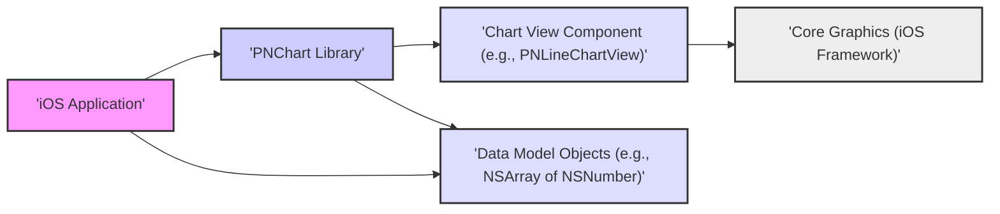

# Project Design Document: PNChart iOS Charting Library

**Version:** 1.1
**Date:** October 26, 2023
**Author:** Gemini (AI Language Model)

## 1. Introduction

This document provides a detailed design overview of the PNChart iOS charting library, an open-source project available on GitHub at [https://github.com/kevinzhow/PNChart](https://github.com/kevinzhow/PNChart). This document is intended for developers and security analysts to understand the library's architecture, components, data flow, and key considerations relevant for threat modeling. It serves as a foundation for understanding the system's structure and identifying potential security vulnerabilities.

## 2. Goals and Objectives

The primary goal of PNChart is to provide a straightforward and visually appealing charting library for iOS application developers. Key objectives include:

*   Offering a range of commonly used chart types, such as line, bar, and pie charts.
*   Providing a customizable interface to adjust the visual appearance of charts.
*   Ensuring ease of integration into existing and new iOS projects.
*   Maintaining acceptable performance for chart rendering on iOS devices.

## 3. Scope

This design document focuses on the architecture and functionality inherent to the PNChart library itself. It specifically covers:

*   The major architectural components within the PNChart library and their responsibilities.
*   The typical flow of data as it is processed and visualized by the library.
*   Key interaction points between the PNChart library and the host iOS application.

This document explicitly does *not* cover:

*   The detailed implementation of specific chart drawing algorithms within the library.
*   The internal workings of the iOS SDK or other Apple frameworks that PNChart utilizes.
*   The security posture of individual applications that integrate and utilize the PNChart library (this is the responsibility of the application developers).

## 4. High-Level Architecture

PNChart is structured as a collection of reusable user interface components, specifically subclasses of `UIView`, designed for integration into an iOS application's view hierarchy. The host application supplies data to these components, and PNChart manages the rendering and visual presentation of the charts.

**Components:**

*   **iOS Application:** The containing application that embeds and utilizes the PNChart library. It is responsible for fetching, processing, and providing the data to be visualized by the charts.
*   **PNChart Library:** The modular collection of classes, protocols, and resources that provide the charting capabilities.
*   **Chart View Component:** Concrete `UIView` subclasses, such as `PNLineChartView`, `PNBarChartView`, and `PNPieChartView`, each dedicated to rendering a specific type of chart.
*   **Core Graphics (iOS Framework):** The fundamental iOS framework leveraged by PNChart for the low-level drawing of chart elements, including lines, shapes, text, and colors.
*   **Data Model Objects:**  Standard Objective-C data structures, often `NSArray` instances containing `NSNumber` objects, used to represent the numerical data and labels to be charted.

## 5. Component Details

The PNChart library can be further decomposed into the following functional components:

*   **Chart Type Implementations:**
    *   `PNLineChartView`:  Responsible for rendering line charts, connecting data points with lines.
    *   `PNBarChartView`: Responsible for rendering bar charts, displaying data as rectangular bars.
    *   `PNPieChartView`: Responsible for rendering pie charts, showing data as slices of a circle.
    *   Other specialized chart view classes may exist for different chart types (e.g., scatter plots). Each implementation takes data and configuration settings to draw its specific chart type.
*   **Data Handling and Management:**
    *   Protocols and classes that define how data is input and managed within the chart views. This typically involves setting properties with `NSArray` instances containing numerical data and corresponding label strings.
    *   May include internal helper classes for data normalization, scaling, or transformation before rendering.
*   **Rendering Logic:**
    *   The core drawing algorithms within each chart view component, utilizing Core Graphics primitives to draw the visual elements of the chart.
    *   Includes calculations for positioning data points, drawing axes and gridlines, and rendering labels.
*   **User Interaction Handling (Optional):**
    *   Functionality to respond to user interactions with the chart, such as touch events for highlighting data points, displaying tooltips, or enabling zooming/panning.
    *   May utilize `UIGestureRecognizer` subclasses to handle touch inputs.
*   **Customization and Theming:**
    *   Properties and methods exposed by the chart view components to allow developers to customize the visual appearance of the charts. This includes settings for colors, fonts, line styles, axis labels, and other visual attributes.

## 6. Data Flow

The typical sequence of data flow within PNChart involves these steps:

```mermaid
graph LR
    A["'iOS Application Data (e.g., NSArray of NSNumber)'"] --> B["'Set Data on Chart View (e.g., chartView.xValues, chartView.yValues)'"];
    B --> C["'Chart View Receives Data and Configuration Parameters'"];
    C --> D["'Data Processing and Scaling within Chart View'"];
    D --> E["'Rendering with Core Graphics API'"];
    E --> F["'Chart Displayed on the iOS Device Screen'"];
    style A fill:#aaf,stroke:#333,stroke-width:2px
    style B fill:#ccf,stroke:#333,stroke-width:2px
    style C fill:#ddf,stroke:#333,stroke-width:2px
    style D fill:#ddf,stroke:#333,stroke-width:2px
    style E fill:#ddf,stroke:#333,stroke-width:2px
    style F fill:#bbf,stroke:#333,stroke-width:2px
```

**Detailed Steps:**

1. **iOS Application Data:** The host application retrieves or generates the data to be visualized. This data is typically structured as arrays of numerical values and corresponding labels.
2. **Set Data on Chart View:** The application instantiates the appropriate `PNChartView` subclass and sets the data using provided properties (e.g., `xValues`, `yValues`, `items`). Configuration parameters like colors and labels are also set at this stage.
3. **Chart View Receives Data and Configuration Parameters:** The specific chart view component receives the data and any associated configuration settings.
4. **Data Processing and Scaling within Chart View:** The chart view component processes the input data. This may involve scaling the data to fit within the chart's bounds, calculating positions for data points, and preparing the data for rendering.
5. **Rendering with Core Graphics API:** The chart view utilizes the Core Graphics framework to draw the visual elements of the chart based on the processed data and configuration. This includes drawing lines, bars, shapes, axes, and text labels.
6. **Chart Displayed on the iOS Device Screen:** The rendered chart is then displayed within the application's user interface.

## 7. Security Considerations (for Threat Modeling)

When performing threat modeling for applications utilizing PNChart, consider the following potential security implications:

*   **Data Injection Vulnerabilities:**
    *   **Risk:** Maliciously crafted or unexpected data provided by the application to PNChart could lead to rendering errors, unexpected behavior, or even crashes. For example, extremely large numerical values or excessively long labels could cause issues.
    *   **Considerations:** How robustly does PNChart handle invalid or out-of-range data? Are there any input validation or sanitization mechanisms within the library?
*   **Denial of Service (DoS) through Resource Exhaustion:**
    *   **Risk:** Providing PNChart with extremely large datasets or highly complex configurations could potentially consume excessive device resources (CPU, memory), leading to performance degradation or application crashes.
    *   **Considerations:** Are there any inherent limits within PNChart on the amount of data or complexity it can handle gracefully?
*   **Information Disclosure (Limited Scope):**
    *   **Risk:** While PNChart primarily visualizes data provided by the application, if the application provides sensitive information for charting, there's a potential risk of unintentional disclosure through visual representation (e.g., overly detailed charts) or if debugging information is inadvertently exposed.
    *   **Considerations:** How are labels and data values handled and rendered? Are there any logging or debugging features within PNChart that could expose data?
*   **Dependency Chain Vulnerabilities:**
    *   **Risk:** Although PNChart primarily relies on the standard iOS SDK, any indirect dependencies or vulnerabilities within the underlying Core Graphics framework could potentially impact PNChart.
    *   **Considerations:** While direct control over Core Graphics vulnerabilities is limited, understanding the reliance on this framework is important.
*   **Client-Side Security Context:**
    *   **Risk:** As a client-side library, PNChart operates within the security context of the host iOS application. General client-side security vulnerabilities within the application (e.g., data breaches, compromised device) could indirectly affect the data being visualized by PNChart.
    *   **Considerations:** The security of the application integrating PNChart is paramount.
*   **Cross-Site Scripting (XSS) via User-Controlled Labels (Potential):**
    *   **Risk:** If the application allows user-controlled input to be used as chart labels or other text elements within PNChart, and if PNChart does not properly sanitize these inputs before rendering, there is a potential risk of XSS if the rendered output is displayed in a web view or similar context.
    *   **Considerations:** How does PNChart handle the rendering of text labels? Is there any encoding or sanitization applied to prevent the interpretation of user-provided strings as executable code?
*   **Integer Overflow/Underflow in Data Processing:**
    *   **Risk:** If PNChart performs calculations on the input data without proper bounds checking, there is a theoretical risk of integer overflow or underflow, which could lead to incorrect rendering or unexpected behavior.
    *   **Considerations:** How are numerical calculations performed within PNChart, and are there safeguards against integer overflow/underflow?

## 8. Deployment

PNChart is deployed as a source code library that is directly integrated into the iOS application's project. Developers typically add the PNChart source files to their Xcode project or utilize a dependency manager such as CocoaPods or Carthage to manage the library's integration. The PNChart code is then compiled along with the application's source code.

## 9. Future Considerations

Potential future enhancements to PNChart that could influence its design and security include:

*   **Expansion of Supported Chart Types:** Adding support for more advanced or specialized chart types might necessitate the introduction of new components and data handling mechanisms.
*   **Enhanced Customization Options:** Providing more granular control over the visual appearance of charts could increase the complexity of the library's API and internal logic.
*   **Performance Optimizations:** Any modifications to the rendering algorithms aimed at improving performance should be carefully reviewed for potential security implications.
*   **Accessibility Enhancements:** Implementing features to make charts more accessible to users with disabilities might require changes to how chart elements are rendered and labeled.
*   **Support for Interactive Features:** Adding more sophisticated interactive features could introduce new attack vectors if not implemented securely.

This document provides a detailed architectural overview of the PNChart library, offering valuable insights for understanding its structure and identifying potential security considerations for thorough threat modeling.
