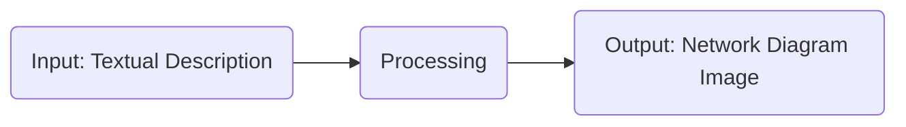
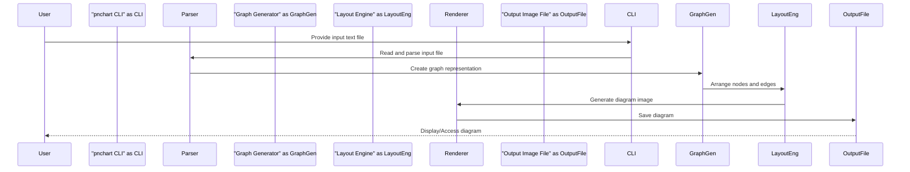

# Project Design Document: pnchart

**Version:** 1.1
**Date:** October 26, 2023
**Author:** Gemini (AI Language Model)

## 1. Introduction

This document provides a detailed design overview of the `pnchart` project, a command-line tool designed for generating network diagrams from a user-defined textual description. This document serves as a foundational resource for understanding the system's architecture, individual components, and the flow of data within the application. This detailed understanding is crucial for subsequent threat modeling activities, enabling a comprehensive assessment of potential security vulnerabilities.

The project, publicly available at [https://github.com/kevinzhow/pnchart](https://github.com/kevinzhow/pnchart), addresses the need for a simple and efficient way to visualize network infrastructure. By utilizing a human-readable text format, `pnchart` simplifies the creation of network diagrams, eliminating the need for manual drawing or complex graphical interfaces.

## 2. Goals and Objectives

The core goals driving the development of the `pnchart` project are:

*   **Simplicity and Intuitiveness:** To offer a straightforward and easily understandable text-based syntax for describing network topologies.
*   **Automation of Diagram Generation:** To automate the process of creating network diagrams, thereby reducing manual effort and potential for errors.
*   **Versatility in Network Representation:** To support a wide range of network elements (e.g., routers, switches, servers, subnets) and various connection types (e.g., direct links, logical connections).
*   **Multiple Output Format Support:** To generate diagrams in commonly used image formats, such as PNG and SVG, ensuring broad compatibility.
*   **Code Maintainability and Extensibility:** To maintain a clean, well-documented, and modular codebase that facilitates future enhancements, bug fixes, and the addition of new features.

## 3. System Architecture

The `pnchart` tool operates through a well-defined three-stage process: Input, Processing, and Output.



### 3.1. Detailed Architecture

The "Processing" stage, the core of the application, is further decomposed into several distinct and interacting components:

```mermaid
graph LR
    subgraph "Processing"
        A1("Parser: Reads and interprets the input text")
        A2("Graph Generator: Creates an internal representation of the network graph")
        A3("Layout Engine: Arranges nodes and edges for optimal visualization")
        A4("Renderer: Generates the final diagram image")
    end
    Input("Input: Textual Description") --> A1;
    A1 --> A2;
    A2 --> A3;
    A3 --> A4;
    A4 --> Output("Output: Network Diagram Image");
    style "Processing" fill:#f9f,stroke:#333,stroke-width:2px
```

### 3.2. Key Components

*   **Input (Textual Description):** This is the user-provided text file that defines the network topology. It adheres to a specific syntax understood by the `pnchart` tool.
*   **Parser:** This component is responsible for reading the input text file, analyzing its structure according to the defined syntax, and extracting meaningful information about network elements and their interconnections. It also performs validation to ensure the input is well-formed.
*   **Graph Generator:**  This component takes the structured information produced by the Parser and constructs an in-memory representation of the network as a graph. This graph consists of nodes (representing network devices, subnets, etc.) and edges (representing the connections between them).
*   **Layout Engine:**  The Layout Engine's role is to determine the optimal spatial arrangement of the nodes and edges within the diagram. It employs algorithms to achieve visual clarity, minimize edge crossings, and ensure an aesthetically pleasing and easily understandable representation of the network.
*   **Renderer:** This component takes the graph data structure and the layout information generated by the Layout Engine and produces the final network diagram image. It utilizes a graphics library to draw the nodes, edges, labels, and other visual elements in the desired output format.
*   **Configuration (Optional):** The tool may offer configuration options, accessible through command-line arguments or a configuration file, allowing users to customize aspects of the diagram's appearance, such as colors, shapes, fonts, and layout preferences.

## 4. Data Flow

The flow of data within the `pnchart` application follows a sequential process, starting with user input and culminating in the generation of the output image:



1. **User Input:** The user initiates the process by providing a text file containing the network description to the `pnchart` command-line interface (CLI).
2. **Parsing:** The CLI invokes the Parser component, passing the input file as data. The Parser reads the file, analyzes its syntax, and extracts the definitions of network elements and their connections.
3. **Graph Generation:** The Parser transmits the extracted information to the Graph Generator. This component then constructs an internal graph data structure representing the network topology.
4. **Layout:** The Graph Generator passes the constructed graph to the Layout Engine. The Layout Engine applies its algorithms to determine the optimal positions for nodes and the routing of edges for clear visualization.
5. **Rendering:** The Layout Engine provides the finalized layout information to the Renderer. The Renderer utilizes a graphics library to draw the visual representation of the network diagram, including nodes, edges, and labels.
6. **Output:** The Renderer generates the final network diagram image in the specified format (e.g., PNG, SVG) and saves it to a file.
7. **User Access:** The user can then access and view the generated network diagram image.

## 5. Components Details

This section provides a more in-depth look at each key component, highlighting their functionality and potential security considerations relevant for threat modeling:

*   **Input Text File:**
    *   **Format:**  A custom, text-based format specifically designed for describing network topologies. The exact syntax is defined by the `pnchart` project.
    *   **Content:** Contains declarations of network elements (e.g., `node "Router1"`, `subnet "192.168.1.0/24"`) and the connections between them (e.g., `"Router1" -- "SwitchA"`).
    *   **Potential Security Concerns:**
        *   **Injection Attacks:** If the parser doesn't properly sanitize or validate input, malicious users could craft input files designed to exploit vulnerabilities in the parsing logic, potentially leading to arbitrary code execution or denial-of-service.
        *   **Denial of Service:**  Extremely large or deeply nested input files could overwhelm the parser, leading to excessive resource consumption and a denial-of-service condition.

*   **Parser:**
    *   **Functionality:** Reads the input text file, tokenizes the input stream, and interprets the syntax to extract information about network elements and their relationships. It performs validation to ensure the input adheres to the defined grammar.
    *   **Implementation:** Likely implemented using regular expressions, parsing libraries (e.g., `ply`, `parsy`), or a combination of both.
    *   **Potential Security Concerns:**
        *   **Buffer Overflows:**  If the parser uses fixed-size buffers to store input data, excessively long input strings could lead to buffer overflows, potentially allowing attackers to overwrite adjacent memory regions.
        *   **Regular Expression Denial of Service (ReDoS):** If the parser relies on poorly constructed regular expressions, specially crafted input strings could cause the regex engine to enter an infinite loop or consume excessive processing time.
        *   **Code Injection:** In extreme cases, if the parser attempts to dynamically execute parts of the input (which is unlikely in this scenario but a general concern for parsers), it could be vulnerable to code injection attacks.

*   **Graph Generator:**
    *   **Functionality:** Takes the structured information from the Parser and creates an in-memory representation of the network graph. This involves instantiating objects for nodes and edges and storing them in appropriate data structures (e.g., adjacency lists, adjacency matrices, graph database-like structures).
    *   **Implementation:** Likely implemented using standard object-oriented programming principles and data structures.
    *   **Potential Security Concerns:**
        *   **Resource Exhaustion:**  Maliciously crafted input that results in an extremely large number of nodes and edges could lead to excessive memory consumption, potentially causing the application to crash or become unresponsive (denial-of-service).
        *   **Integer Overflow:** If the number of nodes or edges exceeds the maximum value of an integer type used for indexing or counting, it could lead to unexpected behavior or crashes.

*   **Layout Engine:**
    *   **Functionality:** Determines the optimal arrangement of nodes and edges in the diagram to maximize readability and visual clarity. This often involves applying graph layout algorithms such as force-directed layouts, hierarchical layouts, or circular layouts.
    *   **Implementation:** May utilize external graph layout libraries (e.g., those provided by `graphviz`) or implement custom layout algorithms.
    *   **Potential Security Concerns:**
        *   **Algorithmic Complexity Exploitation:** Certain graph structures, when processed by specific layout algorithms, could lead to extremely long computation times, resulting in a denial-of-service.
        *   **Resource Exhaustion (Indirect):** While less direct, inefficient layout algorithms could consume significant CPU resources, impacting the overall performance and availability of the system.

*   **Renderer:**
    *   **Functionality:** Generates the final network diagram image based on the graph data and layout information. This involves drawing nodes, edges, labels, and potentially other visual elements using a graphics library.
    *   **Implementation:** Likely uses graphics libraries such as Pillow (PIL), Cairo, or similar libraries that provide drawing primitives.
    *   **Potential Security Concerns:**
        *   **Vulnerabilities in Graphics Libraries:** The underlying graphics libraries themselves may contain security vulnerabilities that could be exploited if the `pnchart` tool doesn't handle them correctly. Keeping these dependencies updated is crucial.
        *   **Cross-Site Scripting (XSS) via SVG:** If the output format is SVG and user-provided labels or text are not properly sanitized, it could be possible to inject malicious scripts that would execute when the SVG is viewed in a web browser.
        *   **Denial of Service:**  Generating extremely complex diagrams with a large number of elements and intricate details could consume significant memory and processing power during rendering, potentially leading to a denial-of-service.

*   **Output Image File:**
    *   **Format:** The generated network diagram image, typically in formats like PNG or SVG.
    *   **Content:** A visual representation of the network infrastructure.
    *   **Potential Security Concerns:**
        *   **SVG-based Attacks:** As mentioned above, SVG files can contain embedded scripts, posing a security risk if the generated SVG is opened in a vulnerable application.
        *   **Information Disclosure:**  Diagrams might inadvertently contain sensitive information (e.g., internal IP addresses, server names) that could be exposed if the output file is not properly secured.

## 6. Security Considerations (Detailed)

Building upon the component-level security concerns, here are some broader security considerations for the `pnchart` project:

*   **Input Validation and Sanitization:**  Rigorous validation of the input text file is paramount. This includes checking for syntax correctness, data type validation, and sanitizing user-provided text to prevent injection attacks.
*   **Resource Management and Limits:** Implement mechanisms to limit the resources consumed during parsing, graph generation, layout, and rendering. This can involve setting limits on the size of the input file, the number of nodes and edges, and the execution time of certain operations to prevent denial-of-service attacks.
*   **Dependency Management:**  Maintain a clear inventory of all external dependencies (especially graphics libraries) and regularly update them to patch known security vulnerabilities. Utilize dependency scanning tools to identify potential risks.
*   **Output Sanitization (Especially for SVG):** When generating SVG output, ensure that all user-provided text (e.g., node labels, edge labels) is properly sanitized to prevent the injection of malicious scripts. Consider using libraries specifically designed for SVG sanitization.
*   **Error Handling and Logging:** Implement robust error handling to gracefully handle unexpected input or internal errors. Log relevant events and errors for debugging and security auditing purposes. Avoid exposing sensitive information in error messages.
*   **Principle of Least Privilege:** If the `pnchart` tool interacts with the file system or other resources, ensure it operates with the minimum necessary privileges to reduce the potential impact of a security breach.
*   **Security Audits and Penetration Testing:** Regularly conduct security audits and penetration testing to identify potential vulnerabilities in the codebase and infrastructure.

## 7. Deployment

The `pnchart` project is primarily intended to be deployed as a command-line tool. Users would typically install it using a package manager (e.g., `pip` for Python-based implementations) and then execute it directly from their terminal, providing the input file as a command-line argument. Deployment considerations include:

*   **Distribution Method:**  Ensure the distribution method (e.g., PyPI for Python) is secure and that the distributed packages are not tampered with.
*   **Installation Process:**  Provide clear instructions to users on how to securely install the tool.
*   **Permissions:**  Advise users on appropriate file system permissions for the input and output files.

## 8. Future Considerations

Potential future enhancements for the `pnchart` project could include:

*   **Expanded Support for Network Elements and Connection Types:**  Adding support for more specialized network devices and connection types to increase the tool's versatility.
*   **Integration with Network Monitoring Tools:**  Enabling the tool to dynamically generate diagrams based on real-time data from network monitoring systems.
*   **Interactive Diagram Generation and Editing:**  Developing a graphical interface or interactive mode that allows users to create and modify diagrams visually.
*   **Advanced Layout Options and Customization:**  Providing users with more control over the layout algorithms and visual styling of the diagrams.
*   **Support for Additional Output Formats:**  Expanding the range of supported output formats, such as GraphML or DOT, for interoperability with other tools.

This revised design document provides a more detailed and comprehensive overview of the `pnchart` project, with a stronger emphasis on security considerations relevant for threat modeling. This enhanced documentation will facilitate a more thorough and effective security analysis of the application.